# Plan Mode Fix V2 — MVP-Style Attachment Injection + Stop-Drift Recovery

**Status**: Approved for implementation  
**Date**: 2026-04-19  
**Scope**: `packages/core` — plan-mode-state, plan-reminder, plan tools, query loop, orchestrator  
**Reference**: MVP implementation at `liteai_cli_mvp/src/utils/attachments.ts`, `messages.ts`  

---

## 1. Problem Statement

When the `plan_enter` tool is executed, the agent transitions into plan mode — a read-only phase where the agent explores the codebase and designs a plan. Two critical bugs prevent this from working:

**Bug 1 — No per-turn reinforcement**: The workflow instructions are delivered **only once** as a tool result from `plan_enter`. On all subsequent turns, **zero references** to plan mode exist in the system prompt or user messages. The model loses context and drifts from the read-only constraint.

**Bug 2 — Premature stop (stop-drift)**: The model emits `finish=stop` (plain text) instead of calling `question` or `plan_exit`. The engine sees `finish=stop` and exits the query loop, ending the session. No recovery mechanism exists.

### Evidence (from `trace_plan_mode.json`)

| Step | Action | Finish Reason | Result |
|------|--------|---------------|--------|
| 2 | `plan_enter` tool executed | `tool-calls` | ✅ Workflow instructions returned as tool result |
| 3 | Model called `write` to create plan skeleton | `tool-calls` | ✅ Plan file created |
| 4 | Model emitted plain text | **`stop`** | ❌ Session ended — should have called `question` |

### How the MVP Solves This

The MVP (`liteai_cli_mvp`) uses an **attachment system** that injects plan mode instructions as `<system-reminder>`-wrapped user message parts on **every API call** during active plan mode. It uses a **full/sparse cycle**:

- **Full** (1st turn, then every 5th): Complete plan mode constraints (~500 chars)
- **Sparse** (between full reminders): One-liner reminder (~150 chars)

This ensures the model **never forgets** it's in plan mode, regardless of conversation length.

---

## 2. Root Cause Analysis

### 2.1 Missing Per-Turn Enforcement

The existing `injectPlanAttachment()` in `plan-reminder.ts` handles the **build phase** (post-plan implementation reminders). When `planModeState.active === true`, it **returns early** (line 51):

```typescript
if (planModeState.active || !planModeState.planText) {
  return { messages, updatedState: planModeState }
}
```

There is no code path that injects anything during the planning phase itself.

### 2.2 No Stop-Drift Recovery

The query loop exit check at line 509-517 of `query.ts` does not check `planModeState.active`:

```typescript
const modelFinished = assistantMessage.finish && !["tool-calls", "unknown"].includes(assistantMessage.finish)
if (modelFinished && !assistantMessage.error) {
  break  // ← exits even during plan mode
}
```

---

## 3. Affected Files

| File | Path | Change |
|------|------|--------|
| `plan-mode-state.ts` | `src/session/plan-mode-state.ts` | Add `workflowType` field |
| `plan.ts` | `src/tool/plan.ts` | Store/clear `workflowType` |
| `plan-reminder.ts` | `src/session/engine/plan-reminder.ts` | Remove early return, add active injection |
| `query.ts` | `src/session/engine/query.ts` | Add stop-drift recovery yield |
| `loop.ts` | `src/session/engine/loop.ts` | Add `plan-stop-correction` handler |
| `events.ts` | `src/session/events.ts` | Add action type to union |
| **NEW** `plan-active-reminder.md` | `src/bundled/prompts/misc/plan-active-reminder.md` | Full constraint text |

---

## 4. Implementation Plan

### 4.1 Extend `PlanModeState` with `workflowType`

**File**: `src/session/plan-mode-state.ts`

```typescript
export interface PlanModeState {
  active: boolean
  planText: string | undefined
  planFilePath: string
  turnsSincePlanReminder: number
  /** Which workflow was selected at plan_enter time. Used to select
   * the correct constraint reinforcement text during active plan mode.
   * Set by plan_enter, cleared by plan_exit. */
  workflowType: "interview" | "5phase" | undefined
}
```

Update `createDefaultPlanModeState()`:

```typescript
export function createDefaultPlanModeState(session: Session.Info): PlanModeState {
  return {
    active: false,
    planText: undefined,
    planFilePath: Session.plan(session),
    turnsSincePlanReminder: 0,
    workflowType: undefined,
  }
}
```

### 4.2 Store `workflowType` in `plan_enter` / Clear in `plan_exit`

**File**: `src/tool/plan.ts`

**plan_enter** (at `PlanModeStateRef.update()`, line 188):

```diff
 PlanModeStateRef.for(ctx.sessionID).update((s) => ({
   ...s,
   active: true,
   turnsSincePlanReminder: 0,
+  workflowType: params.interviewMode ? "interview" : "5phase",
 }))
```

**plan_exit** (at `PlanModeStateRef.update()`, line 84):

```diff
 PlanModeStateRef.for(ctx.sessionID).update((s) => ({
   ...s,
   active: false,
   turnsSincePlanReminder: 0,
   planText: params.plan,
+  workflowType: undefined,
 }))
```

### 4.3 Create Plan-Active Reminder Prompt

**File (NEW)**: `src/bundled/prompts/misc/plan-active-reminder.md`

```markdown
Plan mode is active. The user indicated that they do not want you to execute yet -- you MUST NOT make any edits (with the exception of the plan file mentioned below), run any non-readonly tools (including changing configs or making commits), or otherwise make any changes to the system. This supersedes any other instructions you have received.

Plan file: {{PLAN_FILE_PATH}}

## Enforced Constraints

1. **Read-only**: Do NOT edit, write, or delete any files EXCEPT the plan file above.
2. **No code execution**: Do NOT run build, test, deploy, or any mutating commands.
3. **Turn termination**: Your turn MUST end by calling one of these tools:
   - `question` — to ask the user for clarification
   - `plan_exit` — when the plan is complete and ready for approval
4. Do NOT end your turn with plain text. Always call one of the two tools above.
```

### 4.4 Inject Per-Turn Reminder in `plan-reminder.ts` (MVP Pattern)

**File**: `src/session/engine/plan-reminder.ts`

**Step 1**: Replace the early return for `active=true` with a branch to the new function:

```diff
-  // ── No-op when plan mode is active OR no approved plan exists (ADR-003) ──
-  // Reminders fire during BUILD phase: active=false + planText set (approved).
-  // During PLAN phase (active=true) or before any plan is approved (!planText),
-  // return early to avoid injecting reminders at the wrong time.
-  if (planModeState.active || !planModeState.planText) {
-    return { messages, updatedState: planModeState }
-  }
+  // ── Active plan mode: inject per-turn constraint reminder (MVP pattern) ──
+  // During PLAN phase (active=true), inject <system-reminder> constraints into
+  // the last user message on every turn using a full/sparse cycle.
+  if (planModeState.active) {
+    return injectActivePlanReminder({ messages, planModeState, session })
+  }
+
+  // ── No approved plan: no-op ──
+  if (!planModeState.planText) {
+    return { messages, updatedState: planModeState }
+  }
```

**Step 2**: Add the `injectActivePlanReminder()` function in the same file:

```typescript
/**
 * Injects a condensed plan mode constraint reminder into the last user message
 * on EVERY turn during active plan mode. Mirrors the MVP's attachment system
 * (liteai_cli_mvp/src/utils/attachments.ts → getPlanModeAttachments).
 *
 * Uses a full/sparse cycle identical to the build-phase reminder:
 * - **Full** (every PLAN_REMINDER_FULL_INTERVAL turns): Complete constraint text
 *   from plan-active-reminder.md + plan file path + turn termination rules
 * - **Sparse** (between full injections): One-liner reminder with key constraints
 *
 * Wrapped in <system-reminder> tags for authority (MVP pattern).
 *
 * @internal Exported for unit testing only.
 */
export async function injectActivePlanReminder(input: {
  messages: Message.WithParts[]
  planModeState: PlanModeState
  session: Session.Info
}): Promise<{
  messages: Message.WithParts[]
  updatedState: PlanModeState
}> {
  const { messages, planModeState } = input

  return tracer.startActiveSpan("planReminder.injectActive", async (span) => {
    try {
      const userMessage = messages.findLast((msg) => msg.info.role === "user")
      if (!userMessage) {
        span.setAttribute("plan_active_reminder.skipped", "no_user_message")
        return { messages, updatedState: planModeState }
      }

      const relativePath = path.relative(Instance.worktree, planModeState.planFilePath)
      const isFullReminderTurn =
        planModeState.turnsSincePlanReminder >= PLAN_REMINDER_FULL_INTERVAL

      let reminderText: string
      let updatedCounter: number

      if (isFullReminderTurn) {
        // ── Full constraint reminder (every Nth turn) ──
        const fullReminder = await Bundled.miscPrompt("plan-active-reminder")
        reminderText = fullReminder.replace("{{PLAN_FILE_PATH}}", relativePath)
        updatedCounter = 0
        span.setAttribute("plan_active_reminder.type", "full")
      } else {
        // ── Sparse one-liner reminder (between full injections) ──
        reminderText = [
          `Plan mode still active (see full instructions earlier in conversation).`,
          `Read-only except plan file (${relativePath}).`,
          `End turns with \`question\` or \`plan_exit\`.`,
        ].join(" ")
        updatedCounter = planModeState.turnsSincePlanReminder + 1
        span.setAttribute("plan_active_reminder.type", "sparse")
      }

      // Wrap in <system-reminder> for authority (MVP pattern: wrapInSystemReminder)
      const wrappedText = `<system-reminder>\n${reminderText}\n</system-reminder>`

      // ── In-memory part append — no DB writes ──
      const attachmentPart: Message.TextPart = {
        type: "text",
        id: PartID.ascending(),
        messageID: userMessage.info.id,
        sessionID: userMessage.info.sessionID,
        text: wrappedText,
        synthetic: true,
      }

      const updatedMessages = [...messages]
      const userIdx = updatedMessages.findLastIndex((m) => m.info.role === "user")
      if (userIdx !== -1) {
        updatedMessages[userIdx] = {
          ...updatedMessages[userIdx],
          parts: [...updatedMessages[userIdx].parts, attachmentPart],
        }
      }

      const updatedState: PlanModeState = {
        ...planModeState,
        turnsSincePlanReminder: updatedCounter,
      }

      span.setAttribute("plan_active_reminder.counter_after", updatedCounter)
      log.info("injecting plan mode active reminder", {
        sessionID: userMessage.info.sessionID,
        type: isFullReminderTurn ? "full" : "sparse",
        counter: updatedCounter,
      })

      return { messages: updatedMessages, updatedState }
    } catch (e) {
      span.recordException(e as Error)
      throw e
    } finally {
      span.end()
    }
  })
}
```

### 4.5 Stop-Drift Recovery in Query Loop

**File**: `src/session/engine/query.ts`

**Step 1**: Add counter declaration alongside `step` (line 75):

```diff
   let step = 0
+  const MAX_PLAN_STOP_CORRECTIONS = 2
+  let planStopCorrectionCount = 0
```

**Step 2**: Modify the `modelFinished` exit check (lines 509-517):

```diff
   const modelFinished = assistantMessage.finish && !["tool-calls", "unknown"].includes(assistantMessage.finish)
   if (modelFinished && !assistantMessage.error) {
+    // ── Plan mode stop-drift recovery ──
+    // When plan mode is active, the model MUST call question or plan_exit.
+    // A bare "stop" means it drifted. Re-read PlanModeState in case a tool
+    // call in this turn mutated it (e.g., plan_exit approved).
+    const currentPlanState = planModeStateRef.get()
+    if (currentPlanState.active && planStopCorrectionCount < MAX_PLAN_STOP_CORRECTIONS) {
+      planStopCorrectionCount++
+      log.warn("plan mode stop-drift: model stopped without calling question/plan_exit", {
+        sessionID,
+        correctionCount: planStopCorrectionCount,
+        max: MAX_PLAN_STOP_CORRECTIONS,
+      })
+      yield {
+        type: "control",
+        action: "plan-stop-correction",
+        payload: { correctionCount: planStopCorrectionCount },
+      } satisfies EngineEvent.GeneratorResultEvent
+      continue
+    }
     if (format.type === "json_schema") {
       log.info("queryLoop: structured output missing, ending", { sessionID })
     }
     break
   }
```

**Key insight**: After yielding `plan-stop-correction`, the `continue` takes us back to the top of the `while(true)` loop. The orchestrator in `loop.ts` will have injected a synthetic user message via `injectCorrectionMessage`, so the early exit check at lines 111-118 won't trigger because `lastUser.id > lastAssistant.id`.

### 4.6 Handle `plan-stop-correction` in the Orchestrator

**File**: `src/session/engine/loop.ts`

Add a new case in the `control` event switch (after `loop-detected`, around line 664):

```typescript
case "plan-stop-correction": {
  const { correctionCount } = event.payload as { correctionCount: number }
  log.warn("plan mode stop-drift: injecting correction message", {
    sessionID,
    correctionCount,
  })

  // Strip incomplete thinking parts (same cleanup as loop recovery)
  if (currentAssistantMessage) {
    await stripIncompleteThinking({
      sessionID,
      message: currentAssistantMessage,
    })
  }

  const lastUser = findLastUserFromBuffer(msgsBuffer.current)
  if (lastUser) {
    await injectCorrectionMessage({
      sessionID,
      lastUser,
      text: [
        "<system-correction>",
        "You are in plan mode. Your turn MUST end by calling one of these tools:",
        "- `question` — to ask the user for clarification",
        "- `plan_exit` — when your plan is complete",
        "",
        "You stopped without calling either tool. Please continue your planning work",
        "and end your turn with the appropriate tool call.",
        "</system-correction>",
      ].join("\n"),
      msgsBuffer,
    })
  }

  // Clean up instruction prompt before next turn
  if (currentAssistantMessage) {
    await InstructionPrompt.clear(currentAssistantMessage.id)
  }
  break
}
```

This reuses the existing `injectCorrectionMessage` helper (line 904) that creates a persisted synthetic user message and appends it to `msgsBuffer.current`.

### 4.7 Type Extension

**File**: `src/session/events.ts`

Add `"plan-stop-correction"` to the `GeneratorResultEvent.action` union:

```diff
-  action: "continue" | "compact" | "stop" | "subtask" | "compaction-task" | "overflow" | "loop-detected"
+  action: "continue" | "compact" | "stop" | "subtask" | "compaction-task" | "overflow" | "loop-detected" | "plan-stop-correction"
```

---

## 5. Architecture Diagram

```mermaid
sequenceDiagram
    participant User
    participant Engine as queryLoop (query.ts)
    participant Reminder as injectPlanAttachment (plan-reminder.ts)
    participant Orchestrator as runSessionInner (loop.ts)
    participant LLM as LLM Provider

    User->>Engine: "Build me a web app"
    Engine->>LLM: system prompt (no plan mode section)
    LLM-->>Engine: calls plan_enter(interviewMode: true)
    Note over Engine: planModeState.active = true<br/>workflowType = "interview"

    rect rgb(40, 80, 40)
        Note over Engine: Subsequent turns (plan mode active)
        Engine->>Reminder: injectPlanAttachment(active=true)
        Reminder-->>Engine: returns msgs with <system-reminder> part ✅
        Engine->>LLM: messages include constraint reminder
        LLM-->>Engine: calls write (plan skeleton) → finish: tool-calls

        Engine->>Reminder: injectPlanAttachment(active=true)
        Reminder-->>Engine: returns msgs with sparse reminder ✅
        Engine->>LLM: messages include sparse reminder

        alt Model returns finish=stop (drift)
            LLM-->>Engine: plain text → finish: stop
            Engine->>Orchestrator: yield control: plan-stop-correction
            Orchestrator->>Orchestrator: injectCorrectionMessage
            Engine->>Reminder: injectPlanAttachment(active=true) ✅
            Engine->>LLM: correction + constraint reminder
            LLM-->>Engine: calls question → finish: tool-calls ✅
        end
    end

    LLM-->>Engine: calls plan_exit(plan)
    Note over Engine: planModeState.active = false
    Engine->>Reminder: injectPlanAttachment(active=false, planText=set)
    Note over Reminder: Build-phase reminders begin
```



---

## 6. Data Flow Summary

```
plan_enter called
  └─► PlanModeState.active = true, workflowType = "interview"|"5phase"
  └─► Workflow instructions returned as tool result (one-shot)

Every subsequent turn (while active=true):
  └─► query.ts calls injectPlanAttachment()
  └─► plan-reminder.ts sees active=true → injectActivePlanReminder()
  └─► Full/sparse cycle:
        ├─ counter >= 5 → full reminder from plan-active-reminder.md, reset to 0
        └─ counter < 5  → sparse one-liner, increment counter
  └─► <system-reminder> text part appended to last user message
  └─► If LLM returns finish=stop:
        └─► queryLoop yields control: "plan-stop-correction"
        └─► loop.ts calls injectCorrectionMessage (persisted synthetic user msg)
        └─► Loop continues → LLM gets another turn with correction
        └─► After MAX_PLAN_STOP_CORRECTIONS (2), accept stop

plan_exit called
  └─► PlanModeState.active = false, workflowType = undefined
  └─► injectActivePlanReminder no longer fires
  └─► Build-phase injectPlanAttachment takes over (existing logic)
```

---

## 7. Design Decisions

### Why user message attachment instead of system prompt section?

The MVP uses `<system-reminder>` tags in user messages, not system prompt modification. This approach:
1. **Avoids system prompt cache invalidation** — adding/removing sections from the system prompt array forces providers to re-compute the system prompt cache every turn
2. **Self-regulating context cost** — full/sparse cycle keeps token overhead bounded
3. **Field-proven** — this exact pattern runs in production in the MVP

### Why not tool filtering (removing write tools during plan mode)?

1. The model needs `write` to create/edit the plan file itself
2. Path-based filtering ("allow writes to plan file only") adds complexity
3. The MVP doesn't filter tools either — it relies on instruction text + permission layer

### Why `MAX_PLAN_STOP_CORRECTIONS = 2`?

The model gets 3 total attempts (original + 2 corrections). This is consistent with the loop detection escalation limit (`loopDetectionCount >= 3` in loop.ts line 461). Two corrections is enough to recover from transient drift without burning excessive tokens.

### Why `synthetic: true` for the reminder parts?

The build-phase reminders use `synthetic: false` (visible as user context). But the active plan mode reminders should use `synthetic: true` because:
1. They are injected by the system, not the user
2. They should not appear in the conversation transcript
3. They follow the same pattern as the subagent critical system reminder (query.ts line 251)

---

## 8. Files to Read Before Starting Implementation

Read these files in order to understand the codebase context:

1. **`src/session/plan-mode-state.ts`** (157 lines) — State definition, `PlanModeStateRef` class
2. **`src/tool/plan.ts`** (224 lines) — `PlanEnterTool` and `PlanExitTool` implementations
3. **`src/session/engine/plan-reminder.ts`** (170 lines) — Build-phase reminder injection (modified)
4. **`src/session/engine/query.ts`** (541 lines) — Core query loop, system prompt assembly, exit logic
5. **`src/session/engine/loop.ts`** (1168 lines) — Event-sourced orchestrator, control event handlers
6. **`src/session/events.ts`** (89 lines) — Engine event type definitions
7. **`src/bundled/prompts/misc/plan-interview.md`** (49 lines) — Interview workflow prompt (context only)
8. **`docs/trace_plan_mode.json`** — The original trace that exposed these bugs

---

## 9. Verification Plan

### Scoped Tests

```bash
bun test test/session/engine
```

Test cases:
1. **Active plan mode injection**: Mock `planModeState.active = true`, verify `<system-reminder>` text part appended to last user message with constraint text
2. **Full/sparse cycle**: Verify full text at counter=0 and counter>=5, sparse at counter 1-4
3. **Build phase unaffected**: Verify `active=false + planText` still triggers existing build-phase reminder (no regression)
4. **State lifecycle**: Verify `workflowType` set to `"interview"` by `plan_enter(interviewMode: true)`, cleared to `undefined` by `plan_exit`
5. **Stop-drift recovery**: Mock LLM returning `finish=stop` during `active=true`. Assert `plan-stop-correction` control event is yielded. Assert loop continues after correction injection. Assert loop breaks after `MAX_PLAN_STOP_CORRECTIONS`.
6. **No regression**: Verify `finish=stop` still exits normally when `planModeState.active === false`

### Manual Verification

1. Start a session, ask for a complex task that triggers `plan_enter`
2. Check Langfuse trace — verify `<system-reminder>` text with plan constraints appears in user messages on turns 2+
3. If model stops with `finish=stop`, verify correction message appears in logs and the model retries
4. After `plan_exit`, verify active plan reminders stop and build-phase reminders begin

### Typecheck & Lint

```bash
bun typecheck 2>&1 | Out-String
bun lint:fix
```
