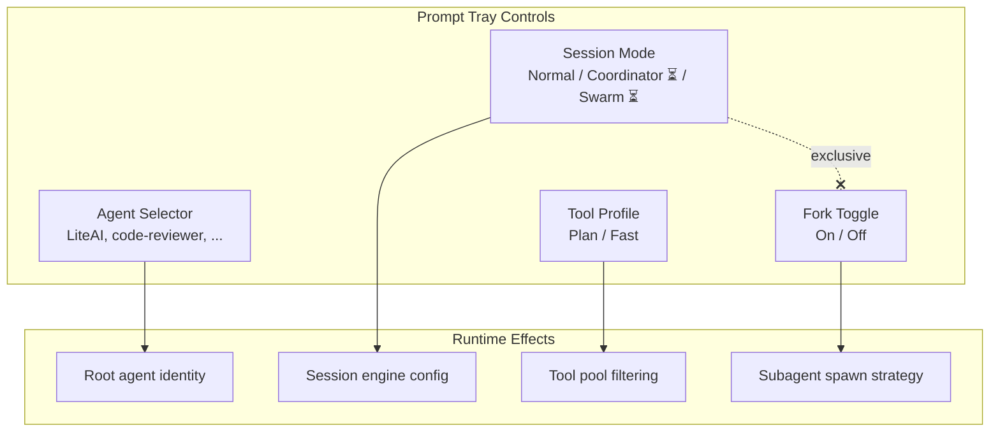

# RFC: Prompt Tray Redesign — Session Mode, Tool Profile, and Agent Selector

> **Status**: Proposed
> **Author**: @aghassan
> **Date**: 2026-04-16
> **Type**: Feature Request (FR) — UI/UX + backend API enrichment
> **Scope**: `packages/ui/src/panes/chat/chat-prompt-input.tsx`, `packages/core/src/session/`, `packages/core/src/tool/`, `packages/web/`
> **Related**: [plan-mode-mvp-parity-rfc.md](./plan-mode-mvp-parity-rfc.md), [agent-execution-modes.md](../packages/core/docs/agent-execution-modes.md)
> **Spec**: To be generated via `speckit.specify` at `specs/007-prompt-tray-redesign/`

---

## 1. Context & Problem Statement

The current prompt tray exposes a single **Agent selector dropdown** that lists primary agents (`build`, `plan`). This conflates three independent axes of configuration:

1. **Who runs** (agent identity) — the `build` and `plan` primary agents
2. **How the session operates** (session mode) — Normal vs Coordinator vs Swarm
3. **What tools are available** (tool profile) — whether the agent can propose plan mode

The [plan-mode-mvp-parity-rfc](./plan-mode-mvp-parity-rfc.md) eliminates `plan` as a primary agent (it becomes a subagent). After that RFC is implemented, the agent dropdown would contain only `build` — rendering it effectively useless for its current purpose while a valid use case (custom user agents like `code-reviewer`) is unsupported.

### 1.1 MVP Analysis: User-Facing Plan Mode Controls

The MVP has **two** user-facing mechanisms for plan mode:

| Mechanism | MVP Implementation | User Action |
|---|---|---|
| **`/plan` command** | [`src/commands/plan/plan.tsx`](file:///C:/Users/aghassan/Documents/workspace/liteai_cli_mvp/src/commands/plan/plan.tsx) | User types `/plan` in the CLI to manually enter plan mode, bypassing `shouldDefer` |
| **Agent auto-proposal** | [`EnterPlanModeTool.ts`](file:///C:/Users/aghassan/Documents/workspace/liteai_cli_mvp/src/tools/EnterPlanModeTool/EnterPlanModeTool.ts) | Agent proposes plan mode with `shouldDefer: true` → user approves/rejects |

The MVP also has a **`/fast` command** ([`src/commands/fast/fast.tsx`](file:///C:/Users/aghassan/Documents/workspace/liteai_cli_mvp/src/commands/fast/fast.tsx)) that toggles a high-speed inference mode — a model-level optimization.

**Key finding**: The MVP does NOT have a "plan mode" dropdown or selector widget. Plan mode is either:
- Agent-initiated (with user approval) — the primary path
- User-initiated via `/plan` slash command — a CLI shortcut

There is NO persistent "plan mode enable/disable" toggle. The `EnterPlanModeTool` is always available in the tool pool; the user just approves or rejects each proposal.

### 1.2 What This RFC Proposes

Decompose the current single agent dropdown into **4 independent controls** in the prompt tray, each operating on a different axis:

```
┌──────────────────────────────────────────────────────────────────┐
│  [LiteAI ▾]  [Normal ▾]   [Model ▾]   [Variant ▾]  [⚡] [🛡️]  │
│   Agent       Session      Model        Variant     Fork YOLO   │
│               Mode                                              │
│  [Fast / Plan]                                                   │
│   Tool Profile                                                   │
└──────────────────────────────────────────────────────────────────┘
```

---

## 2. Decision Drivers

1. **MVP Parity**: Align user-facing plan mode controls with the MVP's `/plan` command and agent auto-proposal patterns
2. **Axis Separation**: Each axis (agent, session mode, tool profile, spawning model) should have its own independent control
3. **Future-Proofing**: Session mode selector must accommodate Coordinator and Swarm modes (Phase 5) even though they are not yet implemented
4. **Custom Agent Support**: The agent selector should support user-added custom agents (e.g., `code-reviewer`)
5. **Minimal Disruption**: Reuse existing UI patterns (dropdowns, toggles) from the current prompt tray

---

## 3. Proposed Controls

### 3.1 Agent Selector (refactored)

**Replaces**: Current `build` / `plan` dropdown

**New behavior**: Dropdown lists all available agents that can serve as the **root conversational agent** for the session. After the [plan-mode-mvp-parity-rfc](./plan-mode-mvp-parity-rfc.md) is implemented:

- `plan` is removed from the list (it becomes a subagent — `mode: subagent`)
- `build` is renamed to `LiteAI` in the UI (it remains `build` internally for backward compatibility)
- Custom user-added agents with `mode: primary` appear here (e.g., `code-reviewer`)

| Value | Source | Description |
|---|---|---|
| **LiteAI** (default) | Built-in `build.md` | Default root agent — full tool access, can propose plan mode |
| *User agents* | Custom `mode: primary` agents | User-defined agents like `code-reviewer`, `security-auditor` |

**API change**: `build.md` frontmatter gets a new `displayName: "LiteAI"` field (or handled purely in UI mapping).

### 3.2 Session Mode Selector (NEW)

**Purpose**: Controls how the session operates — who does the work.

| Value | Status | Description |
|---|---|---|
| **Normal** (default) | ✅ Implemented | Single root agent, can spawn subagents on demand |
| **Coordinator** | ⏳ Phase 5 | Root becomes orchestrator, delegates ALL work to workers |
| **Swarm** | ⏳ Phase 5 | Coordinator + inter-agent messaging via mailbox system |

**UI**: Dropdown, same style as the agent selector. Coordinator and Swarm options are shown but **grayed out** with a "Coming soon" tooltip.

**Backend**: Session-level config. Mutually exclusive with Fork (Coordinator/Swarm disable Fork automatically).

### 3.3 Tool Profile Selector (NEW)

**Purpose**: Controls which tool profile is active — what the agent is allowed to propose.

| Value | MVP Equivalent | Description |
|---|---|---|
| **Plan** (default) | `EnterPlanModeTool` available | Agent can propose plan mode for complex tasks. User approves/rejects each proposal. Explore and Plan subagents are available. |
| **Fast** | `EnterPlanModeTool` removed | Agent skips planning phase. `EnterPlanModeTool` is removed from the tool pool. Agent executes directly. |

**MVP parity note**: In the MVP, the `EnterPlanModeTool` is always available (there is no "fast" toggle that removes it). The MVP's `/fast` command controls **model speed** (billing tier), not tool availability. However, the MVP does have `areExplorePlanAgentsEnabled()` which can disable the Explore and Plan subagents entirely.

Our "Fast" profile is a user-friendly way to achieve the same effect as `areExplorePlanAgentsEnabled() === false` — the agent cannot enter plan mode because the tool and subagents are unavailable.

**UI**: Two-segment toggle (like a segmented control) or a small dropdown, positioned in the prompt tray.

**Backend**: Session-level tool pool filter. When `Fast` is selected:
- `EnterPlanModeTool` is removed from the tool pool
- `ExitPlanModeTool` is removed from the tool pool
- `Explore` and `Plan` subagent definitions are filtered from `getBuiltInAgents()`

### 3.4 Fork Toggle (NEW)

**Purpose**: Controls how subagents are spawned — optimization layer.

| Value | Description |
|---|---|
| **Off** (default) | Standard subagent spawning. Each subagent gets a fresh context. |
| **On** | Fork subagent spawning. Cache-optimized, ≥80% cost reduction. |

**UI**: Small toggle button next to the YOLO button in the prompt tray. Same visual style (icon toggle with active/inactive state).

**Compatibility constraints**:
- Fork is **mutually exclusive** with Coordinator/Swarm session modes
- When Coordinator or Swarm is selected, Fork toggle is auto-disabled and grayed out
- Fork is compatible with both Fast and Plan tool profiles

---

## 4. Architecture: Axes and Compatibility



### Compatibility Matrix

| | Normal | Coordinator ⏳ | Swarm ⏳ |
|---|---|---|---|
| **Plan profile** | ✅ | ✅ | ✅ |
| **Fast profile** | ✅ | ✅ | ✅ |
| **Fork On** | ✅ | ❌ disabled | ❌ disabled |
| **Fork Off** | ✅ | ✅ | ✅ |

---

## 5. Relationship to MVP-Parity RFC

This RFC is **complementary** to the [plan-mode-mvp-parity-rfc](./plan-mode-mvp-parity-rfc.md) and should be implemented **after** it.

| Aspect | plan-mode-mvp-parity-rfc | This RFC |
|---|---|---|
| **Scope** | Backend: eliminate persona-swap, align plan mode tools with MVP | UI: prompt tray control decomposition |
| **plan.md** | Rewritten to `mode: subagent` | Removed from agent dropdown |
| **build.md** | Unchanged (stays as default root) | Renamed to "LiteAI" in UI |
| **EnterPlanModeTool** | Rewritten with `shouldDefer: true`, 5-phase workflow | Controlled by Tool Profile (Plan/Fast) |
| **Session mode** | Not addressed | New Session Mode selector |
| **Fork toggle** | Not addressed | New Fork toggle |

### Sequencing

```
1. Implement plan-mode-mvp-parity-rfc (backend)
2. Implement this RFC (UI + minimal backend API)
3. The two together form the complete plan-mode correction
```

---

## 6. Files Affected

### Backend (`packages/core`)

| File | Action |
|---|---|
| `src/session/engine/query.ts` | **Modify** — accept session-level tool profile (plan/fast) for tool filtering |
| `src/tool/registry.ts` | **Modify** — support profile-based tool pool filtering |
| `src/bundled/agents/build.md` | **Modify** — add `displayName: "LiteAI"` |
| `src/session/types.ts` | **Modify** — add `sessionMode` and `toolProfile` to session config |

### UI (`packages/ui`)

| File | Action |
|---|---|
| `src/panes/chat/chat-prompt-input.tsx` | **Major modify** — replace agent selector with 4 controls |
| *(new)* `src/panes/chat/session-mode-selector.tsx` | **New** — Session mode dropdown component |
| *(new)* `src/panes/chat/tool-profile-selector.tsx` | **New** — Plan/Fast segmented control |
| *(new)* `src/panes/chat/fork-toggle.tsx` | **New** — Fork toggle button |

### Web (`packages/web`)

| File | Action |
|---|---|
| `src/components/settings-agents.tsx` | **Modify** — hide "build" agent (shown as "LiteAI"), remove "plan" after MVP-parity RFC |

---

## 7. Open Questions

| # | Question | Options | Recommendation |
|---|---|---|---|
| 1 | Should Tool Profile be **session-level** or **global** (user settings)? | Session / Global / Both | **Session-level** with global default in settings |
| 2 | Should Fork toggle be **session-level** or **global**? | Session / Global | **Session-level** (matches current env var approach) |
| 3 | Should we also support `/plan` and `/fast` slash commands (like MVP)? | Yes / No / Later | **Yes** — these are the LiteAI equivalents of the MVP's CLI commands |
| 4 | Should the Tool Profile naming be "Plan/Fast" or something else? | Plan/Fast, Full/Quick, Thorough/Direct | **Plan/Fast** — matches MVP naming convention |

---

## 8. Verification Plan

### Automated Tests

| Test | Scope |
|---|---|
| `bun test test/tool/registry` | Tool profile filtering |
| `bun test test/session` | Session config with new fields |

### Manual E2E Verification

| Scenario | Expected |
|---|---|
| Select "Fast" tool profile → send complex task | Agent executes directly, no plan mode proposal |
| Select "Plan" tool profile → send complex task | Agent proposes plan mode, user sees approval prompt |
| Select Coordinator session mode | Dropdown shows it grayed out with "Coming soon" |
| Toggle Fork On → send task with subagent | Subagent spawns with fork (cache-optimized) |
| Fork On + select Coordinator | Fork auto-disables |
| Agent dropdown shows "LiteAI" and any custom agents | No "build" or "plan" in the list |
