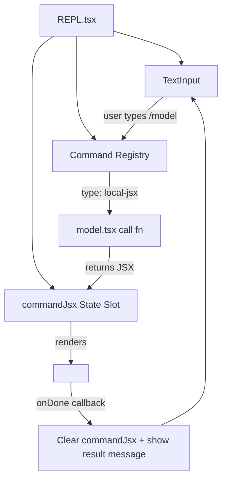
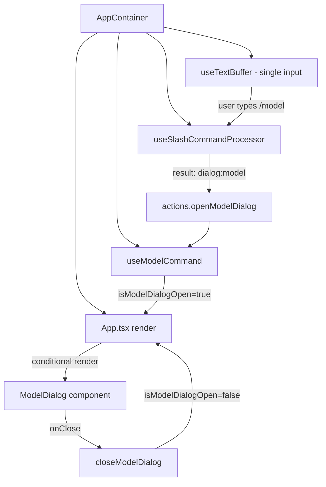
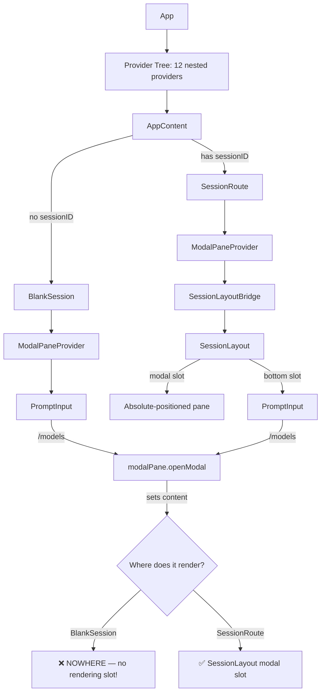

# Architecture Audit: Claude Code vs Gemini CLI vs LiteAI

> How do the three major agentic CLIs handle slash commands, settings dialogs, and focus management?

---

## 1. Claude Code — The "REPL Owns Everything" Model

**Source**: `D:\claude-code\src\`

### Structure
```
screens/REPL.tsx          (258KB compiled — THE monolith)
commands.ts               (command registry — 755 lines)
commands/model/model.tsx  (command implementation returns JSX)
commands/model/index.ts   (command descriptor)
```

### How It Works



### Key Design Decisions

1. **Single Owner**: The REPL component owns a `commandJsx: ReactNode | null` state. When set, it renders the command's JSX **instead of** the prompt.
2. **Command Types**:
   - `local`: Returns a string result (sync)
   - `local-jsx`: Returns a React element with an `onDone` callback
   - `prompt`: Expands to text sent to the model
3. **Focus is implicit**: Only one thing renders at a time. No `isActive` flags needed.
4. **The `onDone` pattern**: Every `local-jsx` command receives `onDone(result, options)`. Calling it clears the command JSX and restores the prompt.

### `/model` Flow (Concrete)
```
1. User types "/model" → Enter
2. REPL matches command, calls model.tsx `call(onDone, context, args)`
3. `call()` returns <ModelPickerWrapper onDone={onDone} />
4. REPL sets commandJsx = the returned JSX
5. ModelPickerWrapper renders a list with useAppState selectors
6. User selects → handleSelect() calls onDone("Set model to X")
7. REPL clears commandJsx, shows "Set model to X" as system message
8. Prompt re-renders, user can type again
```

### Strengths
- Zero focus conflicts (only one input exists at any time)
- Commands are self-contained (own file, own JSX, own lifecycle)
- Lazy-loaded (`load: () => import('./model.js')`)

### Weaknesses
- The REPL is a 258KB monolith (compiled) — hard to modify
- No modal overlay — command JSX replaces the entire view
- No sub-navigation within commands (each command is flat)

---

## 2. Gemini CLI — The "Hook-Extracted Monolith" Model

**Source**: `D:\gemini-cli\packages\cli\src\`

### Structure
```
ui/AppContainer.tsx        (88KB, 2905 lines — the orchestrator)
ui/App.tsx                 (1.3KB — thin render wrapper)
ui/hooks/slashCommandProcessor.ts  (764 lines — command dispatch)
ui/hooks/useModelCommand.ts        (32 lines — dialog state hook)
ui/commands/                        (command implementations)
```

### How It Works



### Key Design Decisions

1. **One Text Buffer**: `useTextBuffer()` in AppContainer — single source of input truth
2. **Hook-per-dialog**: Each dialog gets a `useState` hook in AppContainer:
   ```ts
   const { isModelDialogOpen, openModelDialog, closeModelDialog } = useModelCommand();
   const { isSettingsDialogOpen, openSettingsDialog, closeSettingsDialog } = useSettingsCommand();
   const { isThemeDialogOpen, openThemeDialog, closeThemeDialog } = useThemeCommand();
   ```
3. **Command processor returns action descriptors**, not JSX:
   ```ts
   // From slashCommandProcessor.ts
   case 'dialog':
     switch (result.dialog) {
       case 'model':
         actions.openModelDialog();
         return { type: 'handled' };
   ```
4. **Custom dialog slot** for dynamic content:
   ```ts
   const [customDialog, setCustomDialog] = useState<React.ReactNode | null>(null);
   ```
5. **Focus is boolean-flag-driven**: Dialog booleans disable the main input implicitly via conditional rendering

### `/model` Flow (Concrete)
```
1. User types "/model" → Enter
2. slashCommandProcessor.handleSlashCommand("/model")
3. CommandService finds the model command → executes action
4. Action returns { type: 'dialog', dialog: 'model' }
5. Processor calls actions.openModelDialog()
6. isModelDialogOpen = true → App.tsx renders ModelDialog
7. ModelDialog takes focus (main text buffer loses it)
8. User selects → closeModelDialog() → isModelDialogOpen = false
9. Main text buffer regains focus
```

### Strengths
- Clean action/result protocol for commands
- Hook extraction keeps AppContainer manageable despite 2905 lines
- Dialog state is co-located with the orchestrator

### Weaknesses
- AppContainer is still a massive god-component (2905 lines, 88KB)
- New dialogs require adding state hooks + wiring in AppContainer
- No formal focus management — relies on conditional rendering

---

## 3. LiteAI — The "Context Provider Tree" Model

**Source**: `d:\liteai\packages\cli\src\tui/`

### Structure
```
app.tsx                            (211 lines — provider tree + AppContent)
context/modal-pane.tsx             (82 lines — single-slot modal context)
routes/session/index.tsx           (345 lines — session route)
components/session-layout.tsx      (160 lines — 4-slot layout)
components/prompt/prompt-input.tsx (914 lines — input + command dispatch)
components/dialog-model.tsx        (192 lines — model picker dialog)
ui/dialog-select.tsx               (305 lines — reusable select)
hooks/use-navigation.ts            (36 lines — modal wrapper)
```

### How It Works



### Key Design Decisions

1. **Context-based modal system**: `ModalPaneProvider` stores a single `ReactNode | null`
2. **Command dispatch via string map**: `tuiInterceptors` in PromptInput (not a formal command registry)
3. **`useNavigation` hook**: Wraps `modalPane.openModal/closeModal` for sub-navigation
4. **Focus gating via `isDialogOpen`**: Derived from `modalPane.isOpen`, disables prompt's `useInput`
5. **Keybinding system**: Separate from `useInput` — uses `useKeybindings` with context strings

### `/models` Flow (Concrete — BROKEN)

#### In BlankSession (pre-session):
```
1. User types "/models" → Enter
2. PromptInput.onSubmit → cmdMatch → tuiInterceptors["models"]
3. Interceptor calls modalPane.openModal(<DialogModel onClose={closeModal} />)
4. ModalPaneProvider state: content = <DialogModel />, isOpen = true
5. PromptInput: isDialogOpen = true → focus = false → useInput disabled
6. BUT: BlankSession has NO SessionLayout, NO modal rendering slot
7. <DialogModel /> is stored in context but NEVER rendered to the DOM
8. Result: Input disabled, nothing visible. USER IS STUCK.
```

#### In SessionRoute (active session):
```
1. Same as above through step 4
2. SessionLayoutBridge reads modalPane.content → injects as SessionLayout.modal
3. SessionLayout renders the modal in an absolute-positioned pane
4. DialogModel renders DialogSelect which has its own TextInput with focus={true}
5. CONFLICT: DialogSelect's TextInput.useInput is active
6. CONFLICT: DialogSelect.useKeybindings("Select") is also processing keys
7. Both the TextInput and the keybinding system try to handle the same keystrokes
8. Result: Unpredictable behavior — some keys work, some don't
```

### The Fatal Difference

| Aspect | Claude Code | Gemini CLI | LiteAI |
|--------|------------|------------|--------|
| **Input instances** | 1 (REPL owns it) | 1 (useTextBuffer) | **2+ simultaneous** (prompt + dialog) |
| **Focus model** | Implicit (only one renders) | Boolean flags + conditional render | **isActive flags on competing useInput hooks** |
| **Modal rendering** | Replaces prompt area | Conditional render in App.tsx | **Context-based with separate rendering slot** |
| **Command system** | Formal registry with types | CommandService + action protocol | **Inline string map** |
| **Pre-session state** | N/A (always in REPL) | N/A (single session) | **BlankSession has NO modal slot** |

---

## Conclusion

LiteAI adopted the **modal context pattern** (inspired by Claude Code's approach) but missed two critical invariants:

1. **Every rendering path must have a modal slot** — BlankSession has none
2. **At most one `useInput` hook should be active at any time** — LiteAI has multiple

Both Claude Code and Gemini CLI achieve focus safety through different mechanisms:
- Claude Code: **structural exclusion** (only one thing renders)
- Gemini CLI: **conditional rendering** (dialog replaces input)
- LiteAI: **flag-based gating** (fragile and incomplete)

The fix requires either adopting structural exclusion (Option A) or fixing the flag-based system comprehensively (Option B). See [03-design-proposal.md](./03-design-proposal.md).
