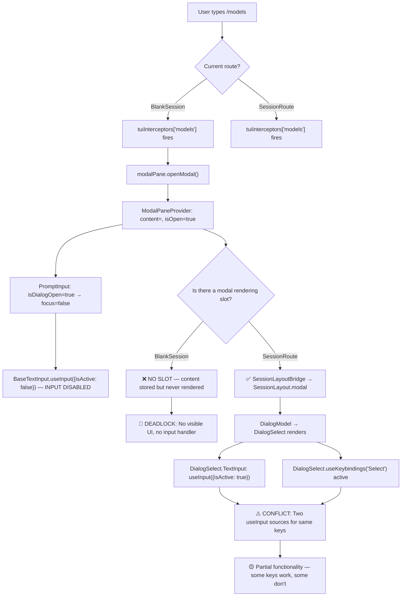

# Root Cause Analysis — Settings UI Failures

> Detailed fault tree for why `/models` and other slash commands are broken after the HomeRoute removal.

---

## Failure Chain



---

## Bug #1: BlankSession Modal Void

### Location
[app.tsx:45-108](file:///d:/liteai/packages/cli/src/tui/app.tsx#L45-L108)

### The Problem
`BlankSession` wraps content in `<ModalPaneProvider>` but the component tree only contains:
```tsx
<ModalPaneProvider>
  <Box>
    <Logo />
    <PromptInput />    {/* ← can call modalPane.openModal() */}
    <Tips />
  </Box>
</ModalPaneProvider>
```

There is **no consumer** of `modalPane.content`. Compare with `SessionRoute` which has:
```tsx
<ModalPaneProvider>
  <SessionLayoutBridge>    {/* ← reads modalPane.content */}
    <SessionLayout modal={modalPane.content}>  {/* ← renders it */}
```

### Impact
Any slash command that opens a modal (18 commands total) is **completely broken** in the pre-session state:

| Command | Dialog Component | Broken in BlankSession? |
|---------|-----------------|----------------------|
| `/models` | `DialogModel` | ✅ Yes |
| `/config` | `DialogConfig` | ✅ Yes |
| `/provider` | `DialogProvider` | ✅ Yes |
| `/theme` | `DialogTheme` | ✅ Yes |
| `/help` | `DialogHelpV2` | ✅ Yes |
| `/agents` | `DialogAgentList` | ✅ Yes |
| `/mcp` | `DialogMcp` | ✅ Yes |
| `/sessions` | `DialogSessionList` | ✅ Yes |
| `/status` | `DialogStatus` | ✅ Yes |
| `/stats` | `DialogStats` | ✅ Yes |
| `/plugins` | `DialogPlugin` | ✅ Yes |
| `/feedback` | `DialogFeedback` | ✅ Yes |
| `/find` | `DialogSearch` | ✅ Yes |
| `/memory` | `DialogMemory` | ✅ Yes |
| `/effort` | `DialogEffort` | ✅ Yes |
| `/diff` | `DialogDiff` | ✅ Yes |
| `/rewind` | `DialogRewind` | ✅ Yes |
| `/export` | `DialogExportOptions` | ✅ Yes |

### Recovery
Currently **impossible** without restarting. Once `isDialogOpen=true` and no modal renders, the user cannot type, cannot escape, cannot do anything. The only exit is `Ctrl+C` (process kill).

---

## Bug #2: Dual useInput Conflict (Session Route)

### Location
- [base-text-input.tsx:44-49](file:///d:/liteai/packages/cli/src/tui/components/base-text-input.tsx#L44-L49) — PromptInput's `useInput`
- [dialog-select.tsx:261-269](file:///d:/liteai/packages/cli/src/tui/ui/dialog-select.tsx#L261-L269) — DialogSelect's embedded `TextInput` with its own `useInput`
- [dialog-select.tsx:150-171](file:///d:/liteai/packages/cli/src/tui/ui/dialog-select.tsx#L150-L171) — DialogSelect's `useKeybindings`

### The Problem

When a modal dialog opens in SessionRoute, the input processing chain becomes:

```
Keystroke arrives
├── PromptInput → BaseTextInput → useInput(isActive: false) → ✅ correctly disabled
├── DialogSelect → TextInput → BaseTextInput → useInput(isActive: true) → processes key
├── DialogSelect → useKeybindings("Select") → processes SAME key
│   ├── up → select:previous  
│   ├── down → select:next
│   ├── enter → select:accept
│   └── escape → select:cancel
└── SessionRoute → useKeybindings("Chat") → useInput(isActive: !cursor.active)
    └── ⚠️ May also process keys if cursor not active
```

### Specific Conflicts

| Key | DialogSelect TextInput | DialogSelect keybindings | Behavior |
|-----|----------------------|-------------------------|----------|
| `a-z` | Inserts into filter | Not bound | ✅ Works |
| `↑` | Calls `onHistoryUp` (no-op) | `select:previous` | ⚠️ Double-fire possible |
| `↓` | Calls `onHistoryDown` (no-op) | `select:next` | ⚠️ Double-fire possible |
| `Enter` | Calls `onSubmit` (no-op in DialogSelect) | `select:accept` | ⚠️ May fire select twice |
| `Escape` | Double-press handler in useTextInput | `select:cancel` | 🔴 Escape may not close dialog on first press |
| `j/k` | Inserts letter into filter | `select:previous/next` (vim bindings) | 🔴 Types "j" AND moves selection |

The `j/k` conflict is particularly bad: the default keybinding map binds `j` → `select:next` and `k` → `select:previous` in the Select context. But the TextInput also processes `j` and `k` as regular character input. Result: typing "j" both inserts "j" into the search filter AND moves the selection down.

### Evidence from Default Bindings
[default-bindings.ts:73-79](file:///d:/liteai/packages/cli/src/tui/keybindings/default-bindings.ts#L73-L79):
```ts
Select: {
  up: "select:previous",
  down: "select:next",
  k: "select:previous",       // ← conflicts with TextInput
  j: "select:next",           // ← conflicts with TextInput
  "ctrl+p": "select:previous",
  "ctrl+n": "select:next",
  space: "select:accept",     // ← conflicts with typing space in filter
```

---

## Bug #3: useNavigation Replace Semantics

### Location
[use-navigation.ts:27-31](file:///d:/liteai/packages/cli/src/tui/hooks/use-navigation.ts#L27-L31)

### The Problem
```ts
replace: (content: ReactNode) => {
  modalPane.closeModal()   // sets content = null
  modalPane.openModal(content)  // sets content = newContent
}
```

This relies on React batching `setState(null)` + `setState(newContent)` into a single render. While React 18+ batches state updates inside event handlers and effects, this is not guaranteed in all async paths. If React doesn't batch:
1. First render: `content = null` → `isOpen = false` → prompt regains focus
2. Second render: `content = newContent` → `isOpen = true` → prompt loses focus

This creates a focus flicker where the prompt briefly accepts input during navigation.

---

## Bug #4: Escape Key Deadlock in Nested Dialogs

### Location
- [dialog-config.tsx:39-44](file:///d:/liteai/packages/cli/src/tui/components/dialog-config.tsx#L39-L44) — Escape bound to `select:cancel` in "Tabs" context
- [dialog-select.tsx:164-168](file:///d:/liteai/packages/cli/src/tui/ui/dialog-select.tsx#L164-L168) — Escape bound to `select:cancel` in "Select" context

### The Problem
When `DialogConfig` → opens `DialogModel` via `navigation.open()`:
1. `DialogConfig` binds Escape in "Tabs" context
2. `DialogModel` → `DialogSelect` binds Escape in "Select" context
3. Both contexts are registered simultaneously (no exclusivity)
4. Which handler fires first is undefined — depends on registration order

If `DialogConfig`'s Escape fires first, it closes the entire config pane instead of just the model sub-dialog. If `DialogSelect`'s fires first, it calls `onEscape` which was set to `navigation.close()` — but `navigation.close()` is `modalPane.closeModal()` which closes EVERYTHING.

### Expected Behavior
Escape should pop the navigation stack: Model → Config → closed.

### Actual Behavior
Escape closes everything at once, or fires unpredictably.

---

## Summary of Structural Defects

| # | Defect | Severity | Fix Complexity |
|---|--------|----------|---------------|
| 1 | BlankSession has no modal rendering slot | **Critical** | Medium — needs layout refactor |
| 2 | Dual `useInput` in DialogSelect + keybindings | **Critical** | Medium — needs input architecture change |
| 3 | `j/k/space` keybindings conflict with text filter | **High** | Low — remove vim bindings from Select when filter is focused |
| 4 | `useNavigation.replace` doesn't guarantee atomic state update | **Medium** | Low — use single setState |
| 5 | Escape handling in nested dialogs is non-deterministic | **High** | Medium — needs navigation stack or explicit parent/child relationship |
| 6 | No recovery path from modal void (BlankSession) | **Critical** | Fixed by #1 |
