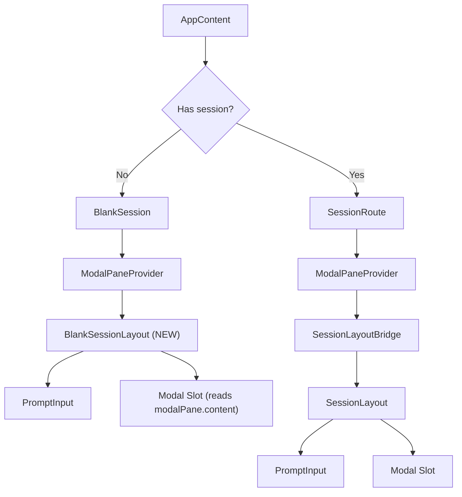

# Design Proposal — Settings UI Fix

> Two design alternatives evaluated against LiteAI's architecture constraints.

---

## Design Constraints

1. **Must work in BlankSession** — modals must render before any session exists
2. **Must support sub-navigation** — Config → Models, Config → Provider, etc.
3. **Must avoid useInput conflicts** — at most one active input handler at a time
4. **Must preserve the bottom-anchored modal aesthetic** — the Claude Code-style pane
5. **Must not regress SessionRoute** — existing in-session modals must keep working

---

## Option A: "Gemini Model" — Hoist Dialog State to AppContent

### Concept
Move dialog state management **out of PromptInput** and into `AppContent` (the component that renders both BlankSession and SessionRoute). Each dialog becomes a boolean flag + conditional render at the AppContent level, exactly like Gemini CLI's `AppContainer`.

### Architecture

```mermaid
graph TD
    A[AppContent] --> B["Dialog State Hooks (useModelDialog, useConfigDialog, etc.)"]
    A --> C{Has session?}
    C -->|No| D[BlankSession]
    C -->|Yes| E[SessionRoute]
    
    D --> F["PromptInput (command dispatch only)"]
    E --> G["SessionLayoutBridge → PromptInput"]
    
    B --> H{"isModelDialogOpen?"}
    H -->|Yes| I["Render <DialogModel /> in AppContent"]
    H -->|No| J[Normal prompt view]
    
    F -->|"/models" → openModelDialog()| B
    G -->|"/models" → openModelDialog()| B
```

### Changes Required

| File | Change |
|------|--------|
| `app.tsx` | Add dialog state hooks to `AppContent`. Pass `openXxxDialog` callbacks to PromptInput. Render active dialog in a shared layout slot. |
| `prompt-input.tsx` | Remove `tuiInterceptors` map. Accept `onSlashCommand: (cmd: string) => boolean` callback prop. Delegate command handling to parent. |
| `session-layout.tsx` | No change — modal slot continues to work for session route. |
| `modal-pane.tsx` | **Remove entirely** — replaced by explicit dialog state. |
| `use-navigation.ts` | **Remove entirely** — sub-navigation handled by dialog component state. |
| All dialog components | Remove `onClose` → `modalPane.closeModal()`. Accept `onClose` prop wired to parent's `closeXxxDialog`. |

### Sub-Navigation Strategy
Dialog components that need sub-views (e.g., Config → Models) manage their own internal `ViewState`:
```tsx
function DialogConfig({ onClose }: { onClose: () => void }) {
  const [view, setView] = useState<'tabs' | 'models' | 'provider'>('tabs')
  
  switch (view) {
    case 'tabs': return <ConfigTabs onNavigate={setView} onClose={onClose} />
    case 'models': return <DialogModel onClose={() => setView('tabs')} />
    case 'provider': return <DialogProvider onClose={() => setView('tabs')} />
  }
}
```

### Focus Management
- When `isXxxDialogOpen = true`, pass `focus={false}` to PromptInput's TextInput
- The dialog's own TextInput gets `focus={true}`
- Only one `useInput` is active at any time

### Pros
- ✅ **Structural safety** — dialog renders are controlled by the component that owns both BlankSession and SessionRoute
- ✅ **No context wiring** — no ModalPaneProvider, no context consumers
- ✅ **Matches Gemini CLI's proven pattern**
- ✅ **Easy to add new dialogs** — add a hook + conditional render

### Cons
- ❌ **AppContent grows** — accumulates dialog state (mitigated by hook extraction)
- ❌ **Prop drilling** — `openXxxDialog` callbacks must flow through PromptInput
- ❌ **Breaks ModalPaneProvider investment** — discards the recent migration work
- ❌ **No dynamic dialog support** — every dialog needs a pre-defined state slot

---

## Option B: "Fixed Modal Pane" — Repair the Existing Architecture

### Concept
Keep the `ModalPaneProvider` + `SessionLayout` architecture but fix the three structural bugs:
1. Add a modal rendering slot to `BlankSession`
2. Fix the `useInput` conflict in `DialogSelect`
3. Fix keybinding conflicts with text filter

### Architecture



### Changes Required

| File | Change |
|------|--------|
| `app.tsx` | Create `BlankSessionLayout` that mirrors `SessionLayout`'s modal rendering. OR: reuse `SessionLayout` directly in `BlankSession`. |
| `dialog-select.tsx` | Remove the embedded `TextInput` from `DialogSelect`. Replace with a filter input that uses the keybinding system exclusively, OR gate `useInput` based on keybinding context. |
| `default-bindings.ts` | Remove `j`/`k`/`space` from Select context (conflict with text filter). Keep only `up`/`down`/`ctrl+n`/`ctrl+p`/`enter`/`escape`. |
| `use-navigation.ts` | Fix `replace()` to use a single atomic state update instead of close+open. |
| `modal-pane.tsx` | Add a navigation stack (array of ReactNode) instead of single slot, enabling proper Escape pop behavior. |

### Focus Management
Fix the `DialogSelect` dual-input problem:
```tsx
// BEFORE (broken): Two competing useInput hooks
<TextInput focus={true} />     // ← useInput in BaseTextInput
useKeybindings({ ... })        // ← useInput in keybinding system

// AFTER (fixed): Single input handler with explicit delegation
<TextInput 
  focus={true}
  inputFilter={(input, key) => {
    // Let keybinding system handle navigation keys
    if (key.upArrow || key.downArrow || key.return || key.escape) {
      return ""  // filter out — keybindings will handle
    }
    return input  // let text input handle
  }}
/>
```

### Sub-Navigation Strategy
Change `ModalPaneProvider` from single-slot to stack:
```tsx
type ModalPaneState = {
  stack: ReactNode[]
  isOpen: boolean
  openModal: (content: ReactNode) => void
  pushModal: (content: ReactNode) => void  // NEW: sub-navigation
  popModal: () => void   // NEW: pop to parent
  closeModal: () => void // clears entire stack
}
```

### Pros
- ✅ **Minimal code churn** — fixes bugs without discarding architecture
- ✅ **Preserves ModalPaneProvider investment** — recent migration work is kept
- ✅ **Navigation stack enables proper Escape behavior** — pop instead of close-all
- ✅ **Dynamic dialog support** — any component can push to the stack

### Cons
- ❌ **Adds complexity to ModalPaneProvider** — stack management, atomic updates
- ❌ **`inputFilter` approach is fragile** — hardcodes which keys are "navigation" vs "text"
- ❌ **Dual useInput remains conceptually** — even with filtering, two hooks still register
- ❌ **BlankSessionLayout is a partial duplicate** of SessionLayout

---

## Comparison Matrix

| Criterion | Option A (Hoist) | Option B (Fix) |
|-----------|-----------------|----------------|
| **Fixes BlankSession** | ✅ Structurally | ✅ By adding layout |
| **Fixes useInput conflict** | ✅ Structurally (one input) | ⚠️ By filtering (fragile) |
| **Fixes j/k/space conflict** | ✅ No dual input = no conflict | ✅ By removing bindings |
| **Fixes Escape behavior** | ✅ Via ViewState in dialogs | ✅ Via navigation stack |
| **Code churn** | 🟡 High (remove modal system) | 🟢 Low (fix existing) |
| **Architectural clarity** | ✅ Explicit state ownership | 🟡 Context-based (implicit) |
| **Future extensibility** | 🟡 Need state slot per dialog | ✅ Dynamic stack |
| **Risk of regression** | 🟡 Medium (replaces working parts) | 🟢 Low (additive fixes) |
| **Matches reference CLIs** | ✅ Gemini CLI pattern | ⚠️ Unique to LiteAI |

---

## Recommendation: Hybrid Approach

> [!IMPORTANT]
> Neither option is unequivocally superior. Per Mandate §7, this is a **Decision Gate**.

However, a **hybrid** approach can combine the best of both:

### Hybrid: "Fixed Pane + Explicit Focus"

1. **From Option B**: Keep `ModalPaneProvider` with stack semantics (dynamic, proven)
2. **From Option A**: Hoist focus management to `AppContent` level (structural safety)
3. **From Option B**: Add modal slot to `BlankSession` (minimal change)
4. **Fix**: Remove vim bindings from Select context when filter is focused
5. **Fix**: Make DialogSelect's TextInput use `inputFilter` to avoid processing navigation keys

### The Key Insight
The problem isn't the modal system itself — it's the **focus fragmentation**. We can keep the modal system but add a **focus arbiter** at the AppContent level:

```tsx
// AppContent manages who has focus
const [focusTarget, setFocusTarget] = useState<'prompt' | 'modal'>('prompt')

// ModalPaneProvider notifies on open/close
useEffect(() => {
  setFocusTarget(modalPane.isOpen ? 'modal' : 'prompt')
}, [modalPane.isOpen])

// PromptInput receives explicit focus prop
<PromptInput focus={focusTarget === 'prompt'} />
```

This keeps the modal system but makes focus management **explicit and centralized** instead of scattered across components.

---

## Decision Required

> [!CAUTION]
> Please select one of:
> - **Option A**: Hoist dialog state to AppContent (Gemini model)
> - **Option B**: Fix existing modal pane system
> - **Hybrid**: Keep modal pane + centralize focus management
>
> Decision: Hybrid
