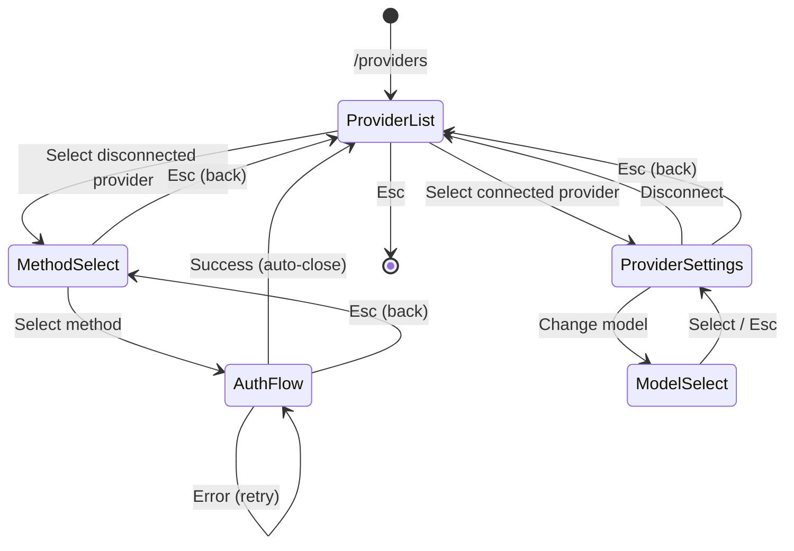

# 07 — Provider Flow: The Hardest Case

## Why Providers Are Special

The provider authentication flow is the most complex dialog in LiteAI. Neither Gemini CLI nor Claude Code has an equivalent — they authenticate once via CLI flags or environment variables.

LiteAI's provider flow is **multi-step with conditional branching**:

```
/providers
  → Provider List (select)
    → Method Selection (select: browser OAuth / API key / headless)
      → [OAuth path]
        → Browser opens → waiting for callback → success/failure
      → [API Key path]  
        → Text input → validation → success/failure
    → Provider Settings (if already connected)
      → Model selection
      → Disconnect
```

This is 4+ screens deep with conditional navigation. It's where the current architecture breaks hardest.

---

## Current Implementation: ViewState Machine

`dialog-provider.tsx` uses a discriminated union `ViewState`:

```typescript
type ViewState =
  | { type: "list" }
  | { type: "select-method"; providerID: string; methods: AuthMethod[] }
  | { type: "method"; providerID: string; methodIndex: number; method: AuthMethod }
  | { type: "connecting"; providerID: string }
  | { type: "error"; providerID: string; error: string }
```

A `handleNavigate` function transitions between states:

```typescript
function handleNavigate(next: ViewState) {
  setViewState(next)
}
```

**This pattern is correct.** It's a local state machine — clean, debuggable, testable. The problems are NOT in the state machine. They're in:

1. Missing Esc handlers in sub-views (Category 1 bug)
2. Browser not opening (Category 1 bug)
3. URL wrapping (Category 3 bug)
4. Input conflicts with the prompt (Category 2 bug)

---

## How This Should Work With Standard Primitives

### Step 1: Provider List

```tsx
function ProviderDialog({ onClose }) {
  const [viewState, setViewState] = useState<ViewState>({ type: "list" })
  
  // Each view gets its own lifecycle management
  switch (viewState.type) {
    case "list":
      return <ProviderListView
        onClose={onClose}
        onNavigate={setViewState}
      />
    case "select-method":
      return <MethodSelectView
        {...viewState}
        onBack={() => setViewState({ type: "list" })}
        onNavigate={setViewState}
      />
    case "method":
      return <AuthFlowView
        {...viewState}
        onBack={() => setViewState({ type: "select-method", ... })}
        onClose={onClose}
      />
  }
}
```

### Step 2: Each Sub-View Uses Standard Primitives

```tsx
function ProviderListView({ onClose, onNavigate }) {
  // Standard lifecycle: Esc → close dialog
  useDialogLifecycle({ contextName: "ProviderList", onClose })
  
  // Standard selection: up/down/enter
  const selection = useSelectList({
    items: providers,
    onSelect: (provider) => {
      if (provider.isConnected) {
        onNavigate({ type: "settings", providerID: provider.id })
      } else {
        onNavigate({ type: "select-method", providerID: provider.id, methods: provider.methods })
      }
    },
  })
  
  return (
    <DialogPane title="Providers" footerHints={[
      { key: "enter", label: "select" },
      { key: "esc", label: "close" },
    ]}>
      <SelectList items={providers} activeIndex={selection.activeIndex} />
    </DialogPane>
  )
}

function MethodSelectView({ providerID, methods, onBack, onNavigate }) {
  // Standard lifecycle: Esc → go back (not close)
  useDialogLifecycle({ contextName: "MethodSelect", onClose: onBack })
  
  const selection = useSelectList({
    items: methods.map(m => ({ key: m.type, value: m, label: m.label })),
    onSelect: (method) => onNavigate({ type: "method", providerID, method }),
  })
  
  return (
    <DialogPane title="Authentication Method" footerHints={[
      { key: "enter", label: "select" },
      { key: "esc", label: "back" },
    ]}>
      <SelectList items={...} activeIndex={selection.activeIndex} />
    </DialogPane>
  )
}
```

### Step 3: Auth Flow View

```tsx
function AuthFlowView({ providerID, method, onBack, onClose }) {
  // Standard lifecycle: Esc → back to method selection
  useDialogLifecycle({ contextName: "AuthFlow", onClose: onBack })
  
  // Auth-specific state
  const [authState, setAuthState] = useState<"pending" | "waiting" | "success" | "error">("pending")
  
  useEffect(() => {
    // Auto-open browser
    open(authorization.url).catch(() => {})
  }, [authorization.url])
  
  return (
    <DialogPane title="Authenticating..." footerHints={[
      { key: "esc", label: "cancel" },
    ]}>
      <Text>Opening browser...</Text>
      <Text wrap="truncate" dimColor>{authorization.url}</Text>
      {authState === "waiting" && <Spinner label="Waiting for callback..." />}
      {authState === "error" && <Text color="red">{errorMessage}</Text>}
    </DialogPane>
  )
}
```

---

## What the Primitives Give Us Here

| Problem | Before | After |
|---------|--------|-------|
| Esc doesn't work in auth view | No handler registered | `useDialogLifecycle` handles it |
| Browser doesn't open | Missing `open()` call | Fixed in `AuthFlowView` |
| URL wraps with spaces | `<Text>` default wrapping | `wrap="truncate"` |
| Up/down broken in provider list | Custom `useInput` handler | `useSelectList` handles it |
| Input conflicts with prompt | No focus gate | Alternative A unmounts prompt OR `isFocused` gate |
| Back navigation inconsistent | Each view handles Esc differently | `useDialogLifecycle({ onClose: onBack })` — consistent |

---

## Key Design Decision: ViewState vs. ModalPane Stack

Two ways to handle multi-step navigation:

### Option 1: ViewState Machine (Current — Recommended to Keep)

```typescript
const [viewState, setViewState] = useState<ViewState>({ type: "list" })
// switch(viewState.type) { ... }
```

**Pros**: Simple, debuggable, testable. State is a single discriminated union.
**Cons**: All views must be defined in one component file (or imported).

### Option 2: ModalPane Stack (Push/Pop)

```typescript
modalPane.pushModal(<MethodSelectView />)
// Esc → modalPane.popModal()
```

**Pros**: Views can be anywhere. Stack gives "free" back navigation.
**Cons**: Stack state is harder to inspect/debug. Can't easily "jump to step 1" from step 4.

### Recommendation

**Keep ViewState for multi-step flows within a single dialog.** Use the ModalPane stack only for top-level dialog switching (e.g., `/model` opens model dialog, `/providers` opens provider dialog).

This matches how both Gemini CLI and Claude Code handle it:
- Gemini CLI: Each dialog is a single component with internal state machine
- Claude Code: Same — `focusedInputDialog` picks the top-level dialog, internal navigation is local state

The ModalPane stack is the right tool for the **top-level question**: "which dialog is showing?" The ViewState machine is the right tool for the **inner question**: "which step of this dialog am I on?"

---

## Provider Flow: Full Lifecycle



Every transition arrow maps to either:
- `setViewState(nextState)` — forward navigation
- `onBack()` via `useDialogLifecycle` — backward navigation (Esc)
