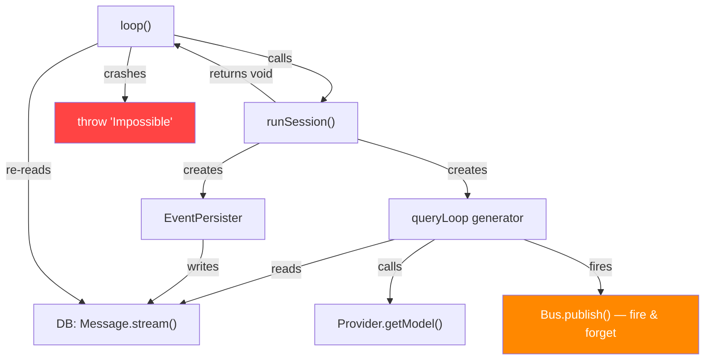
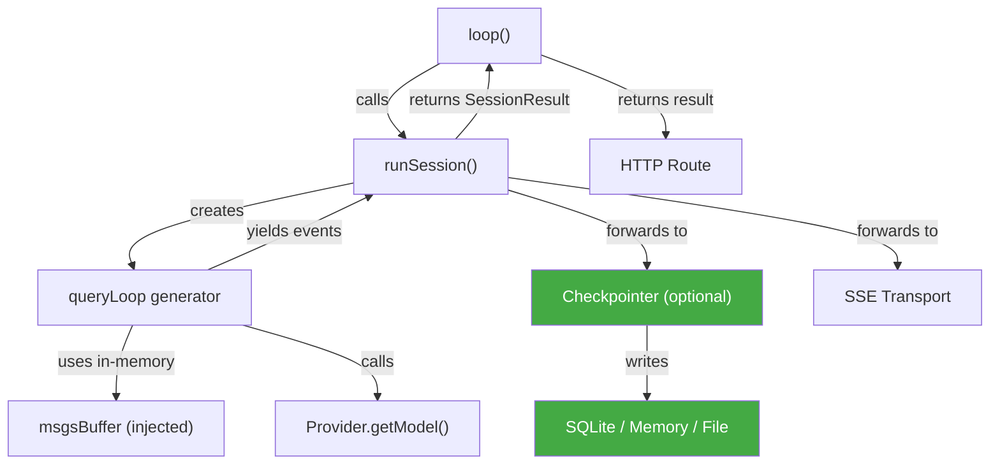

# Engine Loop Decoupling — Architectural Analysis

> **Status**: Analysis & Decision  
> **Branch**: `engine-loop-decoupling` (TBD)  
> **Scope**: `packages/core/src/session/engine/`  
> **Prerequisite reading**: [langgraph-step-exec-rfc.md](../langgraph-step-exec-rfc.md)

---

## 1. Why the Prior RFC Was Wrong

The existing [langgraph-step-exec-rfc.md](../done/langgraph-step-exec-rfc.md) concluded:

> *"Checkpoints = your per-message SQLite writes (already crash-recoverable)"*  
> *"State = your message DB (single source of truth, append-only, already persistent)"*

This was directionally correct but **architecturally incorrect**. The recent model-resolution crash [`incident-report-model-resolution-crash.md`](../done/model_resolution_crash/incident-report-model-resolution-crash.md) proved that the tight coupling between the loop and the DB is not an asset — it's a liability:

1. **`loop()` re-queries the DB to get its own result** — after `runSession()` finishes, it calls `Message.stream(sessionID)` to find what the orchestrator just computed and discarded. When no assistant message was created (model error), this crashes with `Error: Impossible`.

2. **`queryLoop` depends on `msgsBuffer` loaded from DB** — the generator receives its initial state from a DB read, not from its caller. The loop cannot function without the DB.

3. **`EventPersister` calls `Session.updateMessage()` / `Session.updatePart()` directly** — no abstraction, no interface. The persister IS the DB.

4. **Error notification is done via side-effects** — `Bus.publish(Session.Event.Error)` is called fire-and-forget inside `.catch()` handlers, creating untraceable detached promises through `Database.effect`.

**The root cause**: the prior RFC confused "the loop *reads from* the DB" with "the loop *is already checkpointed*." These are opposite properties. A checkpointed system writes state for external consumption but doesn't need to read it back during forward execution. Our loop does the opposite — it must read from the DB to function, but it doesn't maintain a coherent forward-only state.

---

## 2. LangGraph Architecture — What to Borrow

### Key Insight: The Pregel Loop

After reading `D:\langgraphjs\libs\langgraph-core\src\pregel\loop.ts` and `index.ts`, the critical pattern is:

```
PregelLoop.initialize(params)     ← Load checkpoint (or empty), create channels
  └─ while (loop.tick())          ← Pure forward execution, no DB reads
       └─ runner.tick()           ← Execute tasks (nodes)
  └─ loop.finishAndHandleError()  ← Persist final state, compute output
```

**The loop never reads from the checkpointer during forward execution.** It only reads during `initialize()` (to load a previous state when resuming) and writes during `putWrites()` / `_putCheckpoint()`. Forward execution is purely state-in → state-out via in-memory channels.

### What LangGraph Gets Right

| Concept | LangGraph Implementation | Relevant to LiteAI? |
|---|---|---|
| **Checkpointer as optional interface** | `BaseCheckpointSaver` abstract class with `getTuple`, `put`, `putWrites`, `list`, `deleteThread`. Implementations: `MemorySaver`, `SqliteSaver`, `PostgresSaver` | **Yes** — our `EventPersister` is hardwired to SQLite |
| **Loop returns `output` directly** | `PregelLoop.output` is set in `finishAndHandleError` from channel state | **Yes** — our `loop()` re-queries DB instead |
| **Typed loop status** | `"pending" \| "done" \| "interrupt_before" \| "interrupt_after" \| "out_of_steps"` | **Yes** — our loop has no status concept, just throws |
| **`tick()` returns boolean** | `tick()` → `true` (continue) / `false` (done). Error → throw (caught by `_runLoop`) | **Yes** — clean iteration vs our while(true) with break |
| **Checkpointer promises tracked** | `checkpointerPromises` set + `_trackCheckpointerPromise()` — ensures all async writes complete before stream closes | **Yes** — our `Database.effect` fire-and-forget is the root of unhandled rejections |

### What LangGraph Gets Wrong (For Our Use Case)

| Concept | Why It's Wrong for LiteAI |
|---|---|
| **Channel-based state** | LangGraph models state as named channels with typed reducers. LLM coding agents are message-list-based — the conversation IS the state. Channels add unnecessary indirection. |
| **Graph topology** | LangGraph's `StateGraph` with `addNode` / `addEdge` is designed for complex DAGs. Our loop is fundamentally `Read → Think → Act → Observe` — a sequential loop, not a graph. |
| **Node-as-Runnable** | Every node in LangGraph is a `Runnable` with invoke/stream/batch. Our nodes are just functions. The Runnable abstraction adds overhead without benefit. |
| **LangChain dependency** | `@langchain/core` is a mandatory dependency. It brings `RunnableConfig`, `CallbackManager`, serialization infrastructure. This is unnecessary weight for our runtime. |

---

## 3. Should We Use LangGraphJS?

### Decision: **No.**

| Factor | Assessment |
|---|---|
| **Dependency weight** | `@langchain/langgraph` pulls in `@langchain/core` (callbacks, runnables, serialization). ~200KB+ of abstractions we don't need. |
| **Runtime model** | LangGraph's Pregel model runs "supersteps" where all tasks in a step execute in parallel, then synchronize. Our model is a sequential tool-calling loop. The execution models are fundamentally different. |
| **Streaming** | LangGraph streams via `StreamMode` enum (`values`, `updates`, `messages`, `tools`, `debug`). We stream raw AI SDK events via SSE. The streaming protocols are incompatible. |
| **AI SDK integration** | We use Vercel AI SDK (`ai` package) for model interaction. LangGraph uses LangChain's model interface. Bridging these would require an adapter layer that negates the benefit. |
| **Checkpointer** | The checkpointer interface IS worth borrowing — but as a design pattern, not as a library dependency. A 5-method interface is trivial to implement ourselves. |
| **Testing story** | With our own implementation, we can use `MemoryCheckpointer` in tests without any external dependency. With LangGraphJS, tests would need to mock LangChain internals. |

### What We WILL Borrow (Concepts, Not Code)

1. **`BaseCheckpointSaver` pattern** — abstract class with `getTuple`, `put`, `putWrites`, `list`
2. **Loop status enum** — `"pending" | "done" | "error" | "aborted"`  
3. **Loop returns output directly** — no DB re-query
4. **Checkpointer is optional** — loop functions without one (no persistence = no history, but still works)
5. **Tracked async writes** — checkpointer promises are tracked and awaited before cleanup

---

## 4. Design Principles for the Decoupling

### P1: The loop is a forward-only state machine
The loop receives initial state (messages, config) as input and produces final state (assistant message, parts) as output. During forward execution, it never reads from external storage.

### P2: The checkpointer is an observer, not a participant
The checkpointer receives events and persists them. The loop does not depend on the checkpointer's writes. If the checkpointer is `null`, the loop still completes — but there's no history.

### P3: Results flow through function returns, not side channels
`runSession` returns a typed `SessionResult`. Subagent results flow through the call stack. Error notification is the caller's responsibility, not the generator's.

### P4: The checkpointer interface is storage-agnostic
Implementations: `SqliteCheckpointer` (current behavior), `MemoryCheckpointer` (testing), `FileCheckpointer` (JSONL transcripts). The loop doesn't know or care which one is active.

### P5: Async side-effects are tracked and awaitable
No `Database.effect` fire-and-forget for `Bus.publish`. All async work spawned during the loop is tracked via a promise set and awaited during cleanup.

---

## 5. Current vs Target Architecture

### Current (Coupled)



### Target (Decoupled)



---

## 6. Phase Breakdown

See individual documents:

- [01-checkpointer-interface.md](./01-checkpointer-interface.md) — Define the abstract checkpointer, extract `SqliteCheckpointer`
- [02-self-contained-loop.md](./02-self-contained-loop.md) — Make loop forward-only, typed results, zero DB reads
- [03-event-fan-out.md](./03-event-fan-out.md) — Decouple SSE transport from checkpointer, track async work
- [04-subagent-result-flow.md](./04-subagent-result-flow.md) — Child loops return results directly to parent
- [05-backward-execution.md](./05-backward-execution.md) — Checkpoint-based resume, step-back, replay (future)

---

## 7. Open Questions for Future Analysis

> [!IMPORTANT]
> These are scoped OUT of this refactor but should be analyzed in dedicated sessions.

1. **Compaction**: Currently reads/writes the DB mid-loop. How does compaction work in a forward-only loop? (Likely: compaction is a state transformation applied to `msgsBuffer` in-memory, then checkpointed.)

2. **Crash recovery**: Currently, partial writes to DB allow resuming after crash. In the new model, the checkpointer still writes incrementally (like LangGraph's `putWrites`), so crash recovery is preserved — but needs explicit design.

3. **JSONL transcripts**: The existing transcript sidechain writes are a proto-checkpointer. Can `FileCheckpointer` unify with the transcript system?

4. **Plan mode state**: `PlanModeStateRef` is session-scoped in-memory state. Should it be part of the checkpointer's state or remain separate?
