# `@liteagent/loop` — Package Extraction Analysis

> **Status**: Decisions finalized  
> **Target package**: `@liteagent/loop` (npm) / `liteaiagent` (GitHub org)  
> **Scope**: Forward-only agent execution loop with pluggable persistence  
> **Strategy**: Build inside `packages/core` first, extract after Phases 1-3 are proven

---

## Decisions

| Question | Decision | Rationale |
|---|---|---|
| **npm scope** | `@liteagent` | Shorter, more memorable than `@liteaiagent`. No redundancy in `@liteagent/loop`. |
| **Package name** | `@liteagent/loop` | Scope says "AI agents", name says "loop". Clean, easy to say, easy to type. |
| **GitHub org** | `liteaiagent` | Available. Doesn't need to match npm scope (precedent: `@vercel/ai` → `vercel`, `@effect` → `Effect-TS`). |
| **AI SDK coupling** | Own event types + AI SDK adapter sub-export | Loop core imports zero from `ai`. `@liteagent/loop/ai-sdk` provides the `streamText` → `LoopEvent` adapter. Protects against AI SDK version churn. |
| **Generics** | No — package defines its own concrete types | TypeScript-only, Vercel AI SDK is the target. No `<TMessage, TPart>` ceremony. Package owns `LoopEvent`, `LoopMessage`, `LoopResult` types. |
| **Timing** | Internal module boundary first | Build inside `packages/core/src/session/engine/loop/` during Phases 1-3. Extract to `packages/agent-loop` after API is proven. Mechanical extraction, not a redesign. |

---

## What's Extractable

| Primitive | Lines (est.) | Extractable? |
|---|---|---|
| `Checkpointer` interface (`save`, `putWrites`, `loadHistory`, `dispose`) | ~40 | **Yes** |
| `MemoryCheckpointer` / `NoopCheckpointer` | ~60 | **Yes** |
| `PromiseTracker` (tracked async writes) | ~30 | **Yes** |
| `LoopResult` type + loop status enum | ~20 | **Yes** |
| `EventConsumer` fan-out interface | ~25 | **Yes** |
| `LoopEvent` type (own event taxonomy) | ~40 | **Yes** |
| AI SDK adapter (`fromStreamText`) | ~40 | **Yes** — sub-export |
| Forward-only loop runner | ~80 | **Yes** |
| `SqliteCheckpointer` | ~150 | **No** — tied to Drizzle schema |
| `CompactionOrchestrator` | ~300 | **No** — deeply LiteAI-specific |
| `EventPersister` / event classification | ~400 | **No** — tied to LiteAI event taxonomy |
| Step-back / time-travel (Phase 5) | TBD | **No** — depends on LiteAI message schema |

**Clean extraction boundary**: ~335 lines of universal primitives + AI SDK adapter.

---

## What the Package Is

```
@liteagent/loop
```

**What it IS:**
- A forward-only execution loop for tool-calling LLM agents
- Storage-agnostic via `Checkpointer` interface (bring your own SQLite/Postgres/memory)
- Promise-tracked async side-effects (no fire-and-forget)
- Typed loop results (`ok | error | aborted`)
- Fan-out event routing to multiple consumers
- First-class Vercel AI SDK support via `@liteagent/loop/ai-sdk` adapter

**What it is NOT:**
- Not a graph (no DAG, no edges, no topology)
- Not a framework (no opinions on tools, prompts, or models)
- Not a LangChain dependency
- Not a state management library (your app owns the state shape)

### The Positioning Statement

> *"LangGraph is a graph execution engine. This is a loop execution engine. Most coding agents don't need graphs — they need `Read → Think → Act → Observe` with crash recovery."*

This is a real gap. Today, if you're building a tool-calling agent with Vercel AI SDK, your options are:

1. **LangGraphJS** — pulls in `@langchain/core`, forces graph topology, incompatible streaming model
2. **Roll your own `while(true)` loop** — no crash recovery, no checkpointing, fire-and-forget side-effects
3. **Mastra** — full framework, heavy opinions on everything

There's nothing in the "structured loop with pluggable persistence" middle ground.

---

## Type Ownership Strategy

The package defines its own event types — no `import` from `ai`:

```typescript
// @liteagent/loop — core types (package-owned)
export type LoopEvent =
  | { type: "turn-start"; message: LoopMessage }
  | { type: "text-delta"; delta: string }
  | { type: "tool-call"; id: string; name: string; args: unknown }
  | { type: "tool-result"; id: string; name: string; result: unknown }
  | { type: "turn-end"; finishReason: LoopFinishReason }
  | { type: "error"; error: unknown }

export type LoopFinishReason = "stop" | "tool-calls" | "length" | "error" | "abort" | "unknown"

export type LoopResult =
  | { status: "ok"; message: LoopMessage }
  | { status: "error"; error: unknown; message?: LoopMessage }
  | { status: "aborted" }
```

```typescript
// @liteagent/loop/ai-sdk — adapter sub-export (~40 lines)
import type { StreamTextResult } from "ai"
import type { LoopEvent } from "@liteagent/loop"

export async function* fromStreamText(stream: StreamTextResult<any>): AsyncGenerator<LoopEvent> {
  // Maps AI SDK stream events → LoopEvent
}
```

**Why this matters:**
- AI SDK v3 → v4 was a breaking change. Own types insulate users from upstream churn.
- Tests create `LoopEvent[]` arrays directly — no need to mock `streamText`.
- Someone using `@anthropic-ai/sdk` directly writes a 20-line adapter. Zero changes to core.

LiteAI's `packages/core` maps `LoopEvent` ↔ `EngineEvent` at the boundary.

---

## Strategic Value of Open-Sourcing

### Pros

| Pro | Why It Matters |
|---|---|
| **Ecosystem positioning** | LiteAI becomes the project that *defined* the loop pattern for AI SDK agents. Others build on your primitives. |
| **Forced architectural discipline** | A clean module boundary prevents coupling from creeping back. |
| **Testing story** | `MemoryCheckpointer` means engine tests run without SQLite. |
| **Adoption funnel** | `npm i @liteagent/loop` → user likes it → discovers LiteAI. Classic OSS flywheel. |
| **Community contributions** | Others build `PostgresCheckpointer`, `RedisCheckpointer`, `DynamoCheckpointer`. You don't maintain them. |

### Risks

| Risk | Mitigation |
|---|---|
| **Premature extraction** | Build inside `packages/core` first. Extract after Phases 1-3 proven. |
| **API churn** | Start at `0.x` semver. Explicit "unstable" designation. |
| **Maintenance burden** | Keep scope tiny (~335 lines). Less surface = less maintenance. |
| **IP exposure** | Architecture isn't the moat. Compaction, plan mode, subagent orchestration — that's the moat. Those stay in `packages/core`. |

---

## Extraction Roadmap

### Step 1: Internal Module Boundary (During Phases 1-3)

```
packages/core/src/session/engine/
  loop/                     ← clean directory, barrel export
    checkpointer.ts         ← Checkpointer interface + Memory + Noop
    promise-tracker.ts      ← PromiseTracker
    event-consumer.ts       ← EventConsumer interface
    event.ts                ← LoopEvent, LoopFinishReason types
    result.ts               ← LoopResult type
    runner.ts               ← Forward-only loop runner
    ai-sdk.ts               ← streamText → LoopEvent adapter
    index.ts                ← Public API barrel
```

**Boundary rule**: nothing outside `loop/` imports from inside it except through `loop/index.ts`.

### Step 2: Extract to Package (After Phases 1-3 proven)

```
packages/agent-loop/        ← new workspace package
  src/
    checkpointer.ts
    promise-tracker.ts
    event-consumer.ts
    event.ts
    result.ts
    runner.ts
    ai-sdk.ts
    index.ts
  package.json              ← @liteagent/loop
```

`packages/core` becomes a consumer of `@liteagent/loop`.

### Step 3: Open Source (After LiteAI v1.0)

Publish to npm. README positions against LangGraph. Examples for Vercel AI SDK.

---

## What Goes in the Package vs What Stays

```mermaid
graph TD
    subgraph "@liteagent/loop — open source"
        A["Checkpointer interface"]
        B["MemoryCheckpointer"]
        C["NoopCheckpointer"]
        D["PromiseTracker"]
        E["EventConsumer interface"]
        F["LoopResult type"]
        G["LoopEvent types"]
        H["Forward-only loop runner"]
        I["AI SDK adapter"]
    end

    subgraph "packages/core — proprietary"
        J["SqliteCheckpointer"]
        K["EventPersister"]
        L["CompactionOrchestrator"]
        M["queryLoop generator"]
        N["PlanModeStateRef"]
        O["SubagentOrchestrator"]
        P["Backward execution / step-back"]
    end

    H --> M
    A --> J
    E --> K
    H --> D
    I -.->|"maps AI SDK streams"| G

    style A fill:#44aa44,color:white
    style B fill:#44aa44,color:white
    style C fill:#44aa44,color:white
    style D fill:#44aa44,color:white
    style E fill:#44aa44,color:white
    style F fill:#44aa44,color:white
    style G fill:#44aa44,color:white
    style H fill:#44aa44,color:white
    style I fill:#44aa44,color:white
```



> [!IMPORTANT]
> The open-source package contains **zero** LiteAI-specific types (`SessionID`, `Message.WithParts`, etc.). It defines its own `LoopEvent`, `LoopMessage`, `LoopResult` types. LiteAI maps to/from these at the boundary.

---

## Action Items

- [X] Claim `@liteagent` org on npm
- [X] Reserve `liteaiagent` org on GitHub
- [x] During Phase 1-3 implementation, organize extractable code under `engine/loop/` with barrel export
- [ ] After Phases 1-3 proven: mechanical extraction to `packages/agent-loop`
- [ ] After LiteAI v1.0: publish `@liteagent/loop` to npm at `0.1.0`
