# @liteagent — Architecture & Interface Design

> Detailed technical architecture for the `@liteagent` framework.  
> Companion to [00-vision.md](./00-vision.md).  
> Last updated: 2026-05-09

---

## 1. Package Structure

### Tier 1: `@liteagent/loop`

Pure execution primitives. Zero dependencies. ~335 lines of code.

```
@liteagent/loop/
├── src/
│   ├── checkpointer.ts       ← Checkpointer interface + Memory + Noop implementations
│   ├── event.ts              ← LoopEvent, LoopMessage, LoopContent, LoopResult, LoopFinishReason
│   ├── event-consumer.ts     ← EventConsumer fan-out interface
│   ├── promise-tracker.ts    ← Tracked async writes (no fire-and-forget)
│   ├── step-latch.ts         ← StepPauseLatch + ResumePayload (HITL primitive)
│   └── index.ts              ← Public API barrel
├── package.json              ← @liteagent/loop — zero deps
└── tsconfig.json
```

> See [engine_loop_package_analysis.md](../engine-loop-decoupling/engine_loop_package_analysis.md) for full extraction details.

---

### Tier 2: `@liteagent/core`

Agent framework with DI interfaces. Dependencies: `@liteagent/loop`, `@modelcontextprotocol/sdk`, `ai` (Vercel AI SDK), `zod`.

```
@liteagent/core/
├── src/
│   ├── agent.ts               ← createAgent() — top-level composition API
│   │
│   ├── tool/
│   │   ├── registry.ts        ← ToolRegistry — register, resolve, execute
│   │   ├── provider.ts        ← ToolProvider interface + NativeToolProvider
│   │   ├── types.ts           ← ToolDefinition, ToolCallRequest, ToolResult
│   │   └── index.ts
│   │
│   ├── mcp/
│   │   ├── client.ts          ← MCP client lifecycle (connect, disconnect, reconnect)
│   │   ├── provider.ts        ← McpToolProvider (implements ToolProvider)
│   │   ├── loader.ts          ← Config loader (.mcp.json, mcpServers)
│   │   ├── transport.ts       ← Stdio, StreamableHTTP, SSE transport selection
│   │   └── index.ts
│   │
│   ├── session/
│   │   ├── manager.ts         ← SessionManager — CRUD, lifecycle
│   │   ├── message.ts         ← AgentMessage, MessagePart, message model
│   │   ├── runner.ts          ← The session execution loop (consumes @liteagent/loop)
│   │   └── index.ts
│   │
│   ├── storage/
│   │   ├── adapter.ts         ← StorageAdapter interface
│   │   ├── memory.ts          ← MemoryStorageAdapter (reference impl)
│   │   ├── sqlite.ts          ← SqliteStorageAdapter (reference impl)
│   │   └── index.ts
│   │
│   ├── prompt/
│   │   ├── builder.ts         ← PromptBuilder — composable section assembly
│   │   ├── section.ts         ← PromptSection interface
│   │   ├── instruction.ts     ← InstructionFileSection (AGENTS.md loading, findUp)
│   │   ├── environment.ts     ← EnvironmentSection (OS, shell, cwd)
│   │   ├── memory.ts          ← MemorySection (inject memory index)
│   │   └── index.ts
│   │
│   ├── memory/
│   │   ├── store.ts           ← MemoryStore interface
│   │   ├── file.ts            ← FileMemoryStore (MEMORY.md + topic files)
│   │   ├── types.ts           ← MemoryType enum, MemoryEntry
│   │   └── index.ts
│   │
│   ├── permission/
│   │   ├── gate.ts            ← PermissionGate interface
│   │   ├── always-allow.ts    ← AlwaysAllowGate
│   │   ├── rule-based.ts      ← RuleBasedGate (pattern matching)
│   │   ├── types.ts           ← AuthzResult, PermissionRule
│   │   └── index.ts
│   │
│   ├── plan/
│   │   ├── state.ts           ← PlanModeState machine
│   │   ├── stop-drift.ts      ← Stop-drift detection + correction
│   │   ├── reminder.ts        ← Plan reminder injection
│   │   └── index.ts
│   │
│   ├── compaction/
│   │   ├── strategy.ts        ← CompactionStrategy interface
│   │   ├── summary.ts         ← SummaryCompaction (default impl)
│   │   ├── detector.ts        ← Token overflow detection
│   │   └── index.ts
│   │
│   ├── safety/
│   │   ├── loop-detection.ts  ← LoopDetector — repeating pattern detection
│   │   ├── thinking-loop.ts   ← ThinkingLoopDetector — analysis paralysis
│   │   ├── correction.ts      ← CorrectionInjector — recovery messages
│   │   └── index.ts
│   │
│   └── index.ts               ← Public API barrel (re-exports everything)
│
├── package.json               ← @liteagent/core
└── tsconfig.json
```

---

## 2. Interface Contracts

These are the extension points. Users implement these to customize behavior. The framework ships reference implementations for each.

### 2.1 — StorageAdapter

The **only** way framework code touches persistence. All session data flows through this interface.

```typescript
/**
 * Pluggable persistence for session messages and parts.
 * Implement this to store conversations in your database of choice.
 */
export interface StorageAdapter {
  /** Persist a new message (user or assistant). */
  saveMessage(msg: AgentMessage): Promise<void>

  /** Persist a new message part (text, tool-call, tool-result, file). */
  savePart(part: MessagePart): Promise<void>

  /** Update an existing message (e.g., set finish reason, error). */
  updateMessage(msg: AgentMessage): Promise<void>

  /** Load full message history for a session, ordered chronologically. */
  loadHistory(sessionId: string): Promise<AgentMessage[]>

  /** Batch write accumulated operations (parts, updates). */
  write(ops: WriteOp[]): Promise<void>

  /** Delete a specific part (e.g., strip incomplete thinking blocks). */
  deletePart(partId: string): Promise<void>

  /** Cleanup resources when session ends. */
  dispose(): Promise<void>
}
```

**Ships with:**
- `MemoryStorageAdapter` — in-memory, for testing and ephemeral sessions
- `SqliteStorageAdapter` — reference production implementation

---

### 2.2 — ToolProvider

Register tools from any source. The framework's `ToolRegistry` aggregates multiple providers.

```typescript
/**
 * A source of tools. Implement this to register tools from
 * native code, MCP servers, plugins, or any other source.
 */
export interface ToolProvider {
  /** Unique identifier for this provider (e.g., "native", "mcp:github"). */
  readonly id: string

  /** Return all available tools from this provider. */
  tools(): Promise<ToolDefinition[]>

  /** Optional: cleanup when provider is no longer needed. */
  dispose?(): Promise<void>
}

export interface ToolDefinition {
  id: string
  description: string
  parameters: ZodSchema | JSONSchema
  execute(args: unknown, ctx: ToolContext): Promise<ToolResult>
}
```

**Ships with:**
- `NativeToolProvider` — register functions as tools
- `McpToolProvider` — connect to MCP servers, convert tools automatically

---

### 2.3 — PermissionGate

Authorize tool calls before execution. Enables human-in-the-loop approval.

```typescript
/**
 * Controls whether a tool call is allowed to execute.
 * Implement this for custom approval workflows.
 */
export interface PermissionGate {
  /**
   * Evaluate whether the given tool call should proceed.
   * Can block, allow, or prompt the user for approval.
   */
  authorize(request: AuthzRequest): Promise<AuthzResult>
}

export interface AuthzRequest {
  tool: string
  args: unknown
  sessionId: string
  /** Risk classification hint from the framework. */
  risk: "read" | "write" | "execute" | "unknown"
}

export type AuthzResult =
  | { decision: "allow" }
  | { decision: "deny"; reason: string }
  | { decision: "ask"; question: string; onApprove: () => void; onDeny: () => void }
```

**Ships with:**
- `AlwaysAllowGate` — no permission checks (development/CI)
- `RuleBasedGate` — pattern-matching rules (glob patterns, tool categories)

---

### 2.4 — PromptSection

Composable system prompt assembly. Each section resolves independently.

```typescript
/**
 * A composable section of the system prompt.
 * The PromptBuilder assembles sections in registration order.
 */
export interface PromptSection {
  /** Unique name (e.g., "instructions", "environment", "memory"). */
  readonly name: string

  /** "static" = cached across turns. "dynamic" = re-resolved each turn. */
  readonly scope: "static" | "dynamic"

  /** Resolve this section's content for injection into the system prompt. */
  resolve(ctx: PromptContext): Promise<string>
}

export interface PromptContext {
  model: ModelInfo
  sessionId: string
  workingDirectory: string
  platform: string
}
```

**Ships with:**
- `InstructionFileSection` — AGENTS.md loading with `findUp` traversal
- `EnvironmentSection` — OS, shell, cwd, date, model info
- `MemorySection` — inject memory index into system prompt

---

### 2.5 — MemoryStore

Agent memory persistence across sessions. Typed categories following Claude Code's pattern.

```typescript
/**
 * Persistent memory for the agent.
 * Memory survives across sessions — facts, preferences, corrections.
 */
export interface MemoryStore {
  /** Load the memory index (summary of all topics). */
  loadIndex(projectId: string): Promise<string>

  /** Save a fact to the appropriate topic file. */
  save(projectId: string, type: MemoryType, content: string): Promise<void>

  /** Read a specific topic file (JIT access, not pre-loaded). */
  readTopic(projectId: string, topic: string): Promise<string>

  /** List available topic files. */
  topics(projectId: string): Promise<string[]>
}

export type MemoryType = "user" | "feedback" | "project" | "reference"
```

**Ships with:**
- `FileMemoryStore` — MEMORY.md + topic files pattern (Claude Code compatible)

---

### 2.6 — CompactionStrategy

Context window management. Detects when history is too large and compresses it.

```typescript
/**
 * Strategy for compacting conversation history when the context
 * window is approaching its limit.
 */
export interface CompactionStrategy {
  /** Determine if compaction should trigger. */
  shouldCompact(tokenCount: number, tokenLimit: number, history: AgentMessage[]): boolean

  /** Compress the history into a shorter representation. */
  compact(history: AgentMessage[], ctx: CompactionContext): Promise<AgentMessage[]>
}

export interface CompactionContext {
  model: ModelInfo
  sessionId: string
  /** Generate a summary using the configured model. */
  summarize(messages: AgentMessage[]): Promise<string>
}
```

**Ships with:**
- `SummaryCompaction` — summarize older messages, keep recent ones verbatim

---

## 3. Scope Analysis: Reusable vs Product-Specific

### In `@liteagent/core` (12 reusable systems)

| # | System | LiteAI Source | Framework Interface |
|---|---|---|---|
| 1 | Execution Loop | `engine/loop.ts`, `engine/query.ts` | `SessionRunner` + `@liteagent/loop` |
| 2 | Tool Registry | `tool/registry.ts`, `tool/tool.ts` | `ToolProvider`, `ToolRegistry` |
| 3 | MCP Client | `mcp/index.ts`, `mcp/loader.ts` | `McpToolProvider` |
| 4 | System Prompt Builder | `engine/system.ts`, `engine/section-*.ts` | `PromptSection`, `PromptBuilder` |
| 5 | Context Compaction | `engine/compaction-orchestrator.ts` | `CompactionStrategy` |
| 6 | Session Management | `session/index.ts`, `session/message.ts` | `SessionManager`, `StorageAdapter` |
| 7 | Agent Memory | `agent/memory.ts`, `tool/memory.ts` | `MemoryStore` |
| 8 | Permission Framework | `permission/service.ts`, `permission/classifier.ts` | `PermissionGate` |
| 9 | Plan Mode | `session/plan-mode-state.ts`, `engine/stop-drift.ts` | `PlanModeState` |
| 10 | Loop Detection | `engine/loop-detection.ts`, `engine/thinking-loop-detector.ts` | `LoopDetector` |
| 11 | Step Mode (HITL) | `engine/loop/step-latch.ts` | `StepPauseLatch` (from `@liteagent/loop`) |
| 12 | Instruction Loading | `engine/instruction.ts`, `platform/` | `InstructionFileSection` |

### Stays in `@liteai/core` (12 product-specific systems)

| # | System | Why Product-Specific |
|---|---|---|
| 1 | 31 tool implementations | `read_file`, `write_file`, `run_command` — LiteAI's specific tool set |
| 2 | 20+ provider loaders | Anthropic/OpenAI/Google auth flows — product integration |
| 3 | HTTP server + 21 routes | LiteAI's API surface |
| 4 | 40 LSP adapters | Language-server-specific |
| 5 | Control plane | Multi-workspace orchestration |
| 6 | Bundled agents/skills/prompts | LiteAI's personality |
| 7 | ACP protocol | Agent Communication Protocol mapping |
| 8 | Snapshot/share/account | Product features |
| 9 | Telemetry (Langfuse OTel) | LiteAI's observability choices |
| 10 | TUI/CLI/Web/VSCode | UI layer |
| 11 | Container orchestration | Deployment infrastructure |
| 12 | Brand configuration | `~/.liteai` paths — product branding |

---

## 4. Dependency Graph

```mermaid
graph TD
    subgraph "@liteagent/loop"
        L_CK["Checkpointer"]
        L_PT["PromiseTracker"]
        L_EV["LoopEvent / LoopResult"]
        L_EC["EventConsumer"]
        L_SL["StepPauseLatch"]
    end

    subgraph "@liteagent/core"
        C_TR["ToolRegistry"]
        C_TP["ToolProvider (interface)"]
        C_NP["NativeToolProvider"]
        C_MP["McpToolProvider"]
        C_SM["SessionManager"]
        C_SA["StorageAdapter (interface)"]
        C_MS["MemoryStorageAdapter"]
        C_SS["SqliteStorageAdapter"]
        C_PB["PromptBuilder"]
        C_PS["PromptSection (interface)"]
        C_IF["InstructionFileSection"]
        C_ES["EnvironmentSection"]
        C_MemS["MemorySection"]
        C_MEM["MemoryStore (interface)"]
        C_FM["FileMemoryStore"]
        C_PG["PermissionGate (interface)"]
        C_AA["AlwaysAllowGate"]
        C_RB["RuleBasedGate"]
        C_PM["PlanModeState"]
        C_CS["CompactionStrategy (interface)"]
        C_SC["SummaryCompaction"]
        C_LD["LoopDetector"]
        C_SR["SessionRunner"]
        C_AG["createAgent()"]
    end

    subgraph "@liteai/core (product)"
        P_TOOLS["31 built-in tools"]
        P_PROV["20+ provider loaders"]
        P_SRV["HTTP server + routes"]
        P_LSP["40 LSP adapters"]
        P_CP["Control plane"]
        P_BRAND["Brand config"]
    end

    C_AG --> C_SR
    C_SR --> L_CK
    C_SR --> L_PT
    C_SR --> L_EV
    C_SR --> C_TR
    C_SR --> C_SM
    C_SR --> C_PB
    C_SR --> C_PG
    C_SR --> C_CS
    C_SR --> C_LD
    C_SR --> C_PM
    C_TR --> C_TP
    C_NP -.->|implements| C_TP
    C_MP -.->|implements| C_TP
    C_SM --> C_SA
    C_MS -.->|implements| C_SA
    C_SS -.->|implements| C_SA
    C_PB --> C_PS
    C_IF -.->|implements| C_PS
    C_ES -.->|implements| C_PS
    C_MemS -.->|implements| C_PS
    C_FM -.->|implements| C_MEM
    C_AA -.->|implements| C_PG
    C_RB -.->|implements| C_PG
    C_SC -.->|implements| C_CS

    P_TOOLS --> C_NP
    P_PROV --> C_AG
    P_SRV --> C_SM

    style L_CK fill:#44aa44,color:white
    style L_PT fill:#44aa44,color:white
    style L_EV fill:#44aa44,color:white
    style L_EC fill:#44aa44,color:white
    style L_SL fill:#44aa44,color:white
    style C_AG fill:#1a73e8,color:white
    style C_SR fill:#1a73e8,color:white
    style C_TR fill:#1a73e8,color:white
    style P_TOOLS fill:#ea4335,color:white
    style P_PROV fill:#ea4335,color:white
    style P_SRV fill:#ea4335,color:white
    style P_LSP fill:#ea4335,color:white
    style P_CP fill:#ea4335,color:white
    style P_BRAND fill:#ea4335,color:white
```



---

## 5. Type Ownership

`@liteagent/core` defines its own types — no leaking of `@liteai/core` types into the framework.

| Type | Owned By | Not Imported From |
|---|---|---|
| `AgentMessage` | `@liteagent/core` | `Message.WithParts` (LiteAI) |
| `MessagePart` | `@liteagent/core` | `Message.Part` (LiteAI) |
| `ToolDefinition` | `@liteagent/core` | `Tool` (LiteAI) |
| `LoopEvent` | `@liteagent/loop` | `EngineEvent` (LiteAI) |
| `LoopResult` | `@liteagent/loop` | `SessionResult` (LiteAI) |

LiteAI maps between its own types and `@liteagent` types at the boundary. This insulates framework users from LiteAI-specific concerns (SessionID branded types, Part subtypes, etc.).

---

## 6. Branding & Config Directories

The framework does **not** impose `~/.liteai`. Each consumer controls their own paths:

```typescript
const agent = createAgent({
  // Consumer controls all paths
  brand: {
    name: "myagent",           // → ~/.myagent/
    configDir: ".myagent",     // → <worktree>/.myagent/
    instructionFile: "AGENTS.md",
  },
  // ...
})
```

LiteAI sets `brand: { name: "liteai", ... }`. A white-label deployment sets `brand: { name: "newai", ... }`.

This is a framework concern (configurable), not a build-time constant.
