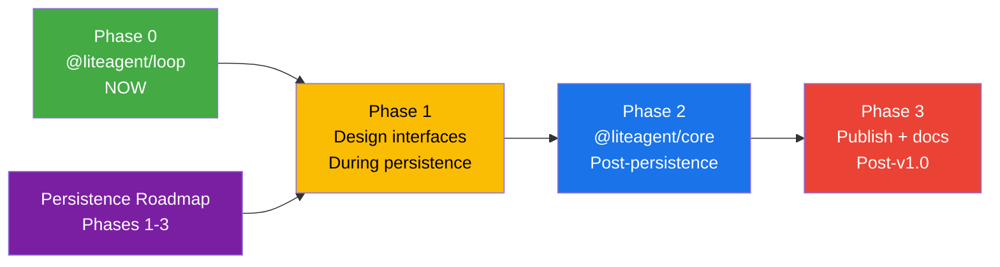

# @liteagent — Execution Roadmap

> Phased execution plan for extracting the `@liteagent` framework from LiteAI.  
> Companion to [00-vision.md](./00-vision.md) and [01-architecture.md](./01-architecture.md).  
> Last updated: 2026-05-09

---

## Timeline Overview

```
Phase 0 ──────── Phase 1 ──────────────────────── Phase 2 ──────── Phase 3
 NOW              During persistence roadmap       Post-persistence  Post-v1.0
 ↓                ↓                                ↓                 ↓
 Extract          Design new code against          Extract           Publish
 @liteagent/loop  framework interfaces             @liteagent/core   to npm
 (~1 day)         (incremental, no extra work)     (~2 weeks)        (docs + examples)
```

---

## Phase 0: Extract `@liteagent/loop` — NOW

> **Effort:** ~1 day  
> **Prerequisite:** None (already scoped, Step 2 in engine-loop-decoupling)  
> **Impact:** Zero — mechanical extraction, `packages/core` becomes a consumer

### Tasks

- [ ] Create `packages/agent-loop/` workspace package
- [ ] Copy extractable primitives from `packages/core/src/session/engine/loop/`:
  - `checkpointer.ts` → Checkpointer interface + Memory + Noop + SessionResult type
  - `event.ts` → LoopEvent, LoopMessage, LoopContent, LoopResult, LoopFinishReason, LoopUsage
  - `event-consumer.ts` → EventConsumer interface
  - `promise-tracker.ts` → PromiseTracker
  - `step-latch.ts` → StepPauseLatch + ResumePayload
- [ ] Create `package.json` with name `@liteagent/loop`, zero dependencies
- [ ] Create barrel `index.ts` with public API
- [ ] Wire as workspace dependency in `packages/core/package.json`
- [ ] Update `packages/core` imports from `./loop/*` to `@liteagent/loop`
- [ ] Verify: `bun typecheck` passes
- [ ] Verify: scoped tests still pass

### Deliverable

```
packages/agent-loop/
├── src/
│   ├── checkpointer.ts
│   ├── event.ts
│   ├── event-consumer.ts
│   ├── promise-tracker.ts
│   ├── step-latch.ts
│   └── index.ts
├── package.json          ← @liteagent/loop@0.1.0
└── tsconfig.json
```

---

## Phase 1: Design Interfaces — During Persistence Roadmap

> **Effort:** Zero additional — this is HOW we implement the persistence roadmap  
> **Prerequisite:** Phase 0 complete  
> **Strategy:** Write new persistence code against framework interfaces from day 1

The [project-scoped persistence roadmap](../project-scoped-persistence/02-roadmap.md) is about to create:
- Unified memory system (MEMORY.md + topic files)
- Conversation history persistence (index.jsonl)
- Session summarization pipeline
- Background extraction agents

Instead of building these directly into `packages/core` with direct imports, we design them as implementations of framework interfaces:

### 1a — MemoryStore Interface (During Persistence Phase 1.2)

The persistence roadmap's memory system IS the `MemoryStore` interface:

```typescript
// Define the interface in packages/core (will be extracted later)
export interface MemoryStore {
  loadIndex(projectId: string): Promise<string>
  save(projectId: string, type: MemoryType, content: string): Promise<void>
  readTopic(projectId: string, topic: string): Promise<string>
  topics(projectId: string): Promise<string[]>
}

// Implement against the interface
export class FileMemoryStore implements MemoryStore {
  // ~/.liteai/projects/<id>/memory/MEMORY.md + topic files
  // This IS the persistence roadmap's Phase 1.2 deliverable
}
```

### 1b — StorageAdapter Evolution (During Persistence Phase 2)

The persistence roadmap's conversation history system extends the `StorageAdapter`:

```typescript
// Extend Checkpointer → StorageAdapter with session lifecycle
export interface StorageAdapter extends Checkpointer {
  // Existing from Checkpointer:
  saveMessage(msg: AgentMessage): Promise<void>
  loadHistory(sessionId: string): Promise<AgentMessage[]>
  // New for persistence:
  sessions(): Promise<SessionInfo[]>
  deleteSession(id: string): Promise<void>
}
```

### 1c — CompactionStrategy Interface (During Persistence Phase 4.3)

The persistence roadmap's content replacement system IS the `CompactionStrategy`:

```typescript
export interface CompactionStrategy {
  shouldCompact(tokenCount: number, tokenLimit: number, history: AgentMessage[]): boolean
  compact(history: AgentMessage[], ctx: CompactionContext): Promise<AgentMessage[]>
}
```

### 1d — Interface Catalog

During this phase, maintain an `INTERFACES.md` file tracking all interfaces designed:

```
packages/core/src/interfaces/
├── storage-adapter.ts      ← session persistence
├── tool-provider.ts        ← tool registration
├── permission-gate.ts      ← tool authorization
├── prompt-section.ts       ← system prompt composition
├── memory-store.ts         ← agent memory
├── compaction-strategy.ts  ← context management
└── index.ts                ← barrel export
```

These interfaces live in `packages/core` initially. They're extracted to `@liteagent/core` in Phase 2.

---

## Phase 2: Extract `@liteagent/core` — After Persistence Stable

> **Effort:** ~2 weeks  
> **Prerequisite:** Persistence roadmap Phases 1-3 complete, interfaces battle-tested  
> **Strategy:** Mechanical extraction — interfaces already exist, move them to new package

### Tasks

- [ ] Create `packages/agent-core/` workspace package
- [ ] Extract interfaces from `packages/core/src/interfaces/` → `packages/agent-core/src/`
- [ ] Extract reference implementations:
  - `MemoryStorageAdapter` → `@liteagent/core`
  - `SqliteStorageAdapter` → `@liteagent/core`
  - `NativeToolProvider` → `@liteagent/core`
  - `McpToolProvider` → `@liteagent/core`
  - `AlwaysAllowGate`, `RuleBasedGate` → `@liteagent/core`
  - `InstructionFileSection` → `@liteagent/core`
  - `EnvironmentSection` → `@liteagent/core`
  - `SummaryCompaction` → `@liteagent/core`
  - `FileMemoryStore` → `@liteagent/core`
- [ ] Extract `SessionRunner` (the loop orchestrator, adapted from `engine/loop.ts`)
- [ ] Create `createAgent()` composition API
- [ ] Define framework-owned types: `AgentMessage`, `MessagePart`, `ToolDefinition`
- [ ] Create boundary mappers in `packages/core`: `AgentMessage` ↔ `Message.WithParts`
- [ ] Wire `packages/core` as consumer of `@liteagent/core`
- [ ] Update all `packages/core` imports
- [ ] Verify: `bun typecheck` passes
- [ ] Verify: all scoped tests pass
- [ ] Create `package.json` with name `@liteagent/core`, version `0.1.0`

### Deliverable

See full package structure in [01-architecture.md](./01-architecture.md#tier-2-liteagentcore).

### What Changes in `packages/core`

After extraction, `packages/core` becomes a consumer:

```typescript
// packages/core/src/session/engine/loop.ts — AFTER extraction
import { SessionRunner, type StorageAdapter, type ToolProvider } from "@liteagent/core"
import { SqliteStorageAdapter } from "@liteagent/core"

// LiteAI-specific tools become a ToolProvider
const liteaiTools = new NativeToolProvider(await ToolRegistry.tools(agent, model))
// MCP tools
const mcpTools = new McpToolProvider(mcpConfig)
// Plugin-registered tools (LiteAI-specific wrapping)
const pluginTools = new LiteAIPluginToolProvider(pluginRegistry)

const runner = new SessionRunner({
  tools: [liteaiTools, mcpTools, pluginTools],
  storage: new SqliteStorageAdapter(db),
  permission: new LiteAIPermissionGate(permissionNext),
  // ...
})
```

The engine loop code stays in `packages/core` but delegates to `@liteagent/core` for the generic parts.

---

## Phase 3: Publish & Document — Post LiteAI v1.0

> **Effort:** ~1 week  
> **Prerequisite:** Phase 2 complete, LiteAI v1.0 shipped  
> **Strategy:** Polish, document, publish

### Tasks

- [ ] Write README.md for `@liteagent/loop` (positioning vs LangGraph)
- [ ] Write README.md for `@liteagent/core` (getting started, API reference)
- [ ] Create comparison page: @liteagent vs LangGraph vs raw AI SDK vs Mastra
- [ ] Create example projects:
  - `examples/minimal-agent/` — 50-line agent with native tools
  - `examples/mcp-agent/` — agent with MCP server integration
  - `examples/plan-mode/` — agent with plan/execute workflow
  - `examples/custom-storage/` — PostgresStorageAdapter implementation
- [ ] Publish `@liteagent/loop@0.1.0` to npm
- [ ] Publish `@liteagent/core@0.1.0` to npm
- [ ] Create `liteaiagent/liteagent` GitHub repo (or monorepo)
- [ ] Announcement: blog post, X/Twitter, HN

### Community Targets

Community-contributed adapters we'd like to see:

| Adapter | Type | Who Builds It |
|---|---|---|
| `PostgresStorageAdapter` | StorageAdapter | Community |
| `RedisStorageAdapter` | StorageAdapter | Community |
| `DynamoStorageAdapter` | StorageAdapter | Community |
| `S3MemoryStore` | MemoryStore | Community |
| `DatabaseMemoryStore` | MemoryStore | Community |
| `OAuthPermissionGate` | PermissionGate | Community |
| `SlackApprovalGate` | PermissionGate | Community |

---

## Dependencies Between Phases



---

## Risk Register

| # | Risk | Likelihood | Impact | Mitigation |
|---|---|---|---|---|
| 1 | Premature interface abstraction | Medium | High | Phase 1 designs interfaces during real implementation, not speculatively |
| 2 | API surface lock-in at 0.1.0 | Medium | Medium | Explicit `0.x` semver — unstable designation, breaking changes expected |
| 3 | Framework maintenance burden | Low | Medium | Framework is a subset of `packages/core` — we already maintain this code |
| 4 | Extraction breaks LiteAI | Medium | High | LiteAI is the first consumer — if interfaces don't work for us, we fix them before publishing |
| 5 | Nobody uses it | Medium | Low | Phase 0 costs 1 day. Phase 1 costs nothing extra. We only invest Phase 2 effort if there's traction |
| 6 | Scope creep into Phase 2 during Phase 1 | Medium | Medium | Phase 1 is strictly interfaces + new code only. No refactoring existing engine code |

---

## Success Criteria

| Phase | Criteria |
|---|---|
| Phase 0 | `@liteagent/loop` is a separate workspace package. `packages/core` imports from it. All tests pass. |
| Phase 1 | All new persistence code implements framework interfaces. Interface catalog maintained in `packages/core/src/interfaces/`. |
| Phase 2 | `@liteagent/core` is a separate workspace package. `packages/core` is a consumer. All tests pass. |
| Phase 3 | Both packages published to npm. README + examples exist. At least one community adapter contributed within 3 months. |
