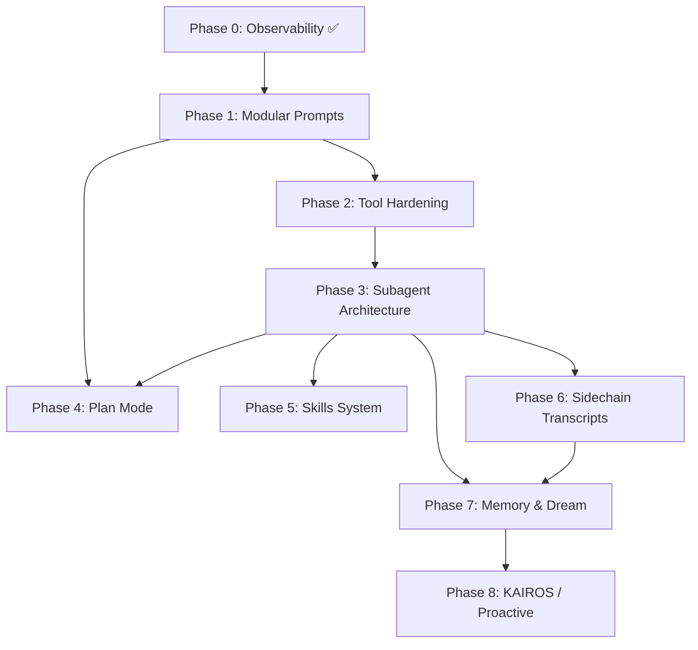

# LiteAI2 → LiteAI Migration Roadmap

> **Timeline:** 2-3 Years | **Complexity tolerance:** High — no features cut for simplicity
>
> **Source docs:** `01–06` analysis files in this directory

---

## Strategic Vision

Port the battle-tested architectural patterns from liteai_cli_mvp into liteai, transforming it from a simple agentic CLI into a production-grade orchestration platform with intelligent context management, persistent memory, and autonomous capabilities.

**Guiding principles:**
1. **Foundation first** — each phase unlocks the next; dependencies flow downward
2. **No shortcuts on complexity** — liteai_cli_mvp earned its patterns through millions of real sessions
3. **Incremental integration** — each phase delivers value independently
4. **Preserve liteai's identity** — adopt patterns, not copy-paste; adapt to liteai's existing architecture

---

## Phase 0 — Observability Foundation ✅ (DONE)

> _Completed in recent sessions — Langfuse + OTel integration_

- [x] OpenTelemetry instrumentation
- [x] Langfuse trace hierarchy (single trace per session)
- [x] Centralized configuration system (`settings.json`)
- [x] Telemetry API purge (legacy endpoints removed)

---

## Phase 1 — Modular Prompt System

> **Goal:** Replace monolithic prompt with section-based architecture
>
> **Ref:** [`05-prompt-system.md`](./05-prompt-system.md)

### 1.1 — System Prompt Section Registry
- [ ] Implement `systemPromptSection()` factory with name + compute function
- [ ] Implement `DANGEROUS_uncachedSystemPromptSection()` with mandatory reason
- [ ] Implement `resolveSystemPromptSections()` for concurrent resolution
- [ ] Implement cache boundary marker (`SYSTEM_PROMPT_DYNAMIC_BOUNDARY`)

### 1.2 — Static/Dynamic Boundary
- [ ] Refactor existing prompt templates into named sections
- [ ] Identify and classify static vs dynamic content
- [ ] Add global cache scope support for static prefix

### 1.3 — Attachment-Based System Reminders
- [ ] Implement `<system-reminder>` tag injection via user message attachments
- [ ] Add reminder infrastructure for plan text, skills, hooks
- [ ] Implement turn-based reminder cycling (sparse/full every N turns)

### 1.4 — `criticalSystemReminder_EXPERIMENTAL`
- [ ] Add per-agent critical reminder field
- [ ] Implement injection at every user turn via context (not system prompt)

---

## Phase 2 — Tool System Hardening

> **Goal:** Scale from ~15 tools to 30+ with proper gating, deny rules, and prompt awareness
> 
> **Ref:** [`03-tools-architecture.md`](./03-tools-architecture.md)

### 2.1 — Tool Registration Overhaul
- [ ] Implement feature-flag gated tool registration
- [ ] Add `isEnabled()` runtime check pattern for conditional tools
- [ ] Design dead-code elimination strategy for bundled builds

### 2.2 — Deny Rule Filtering
- [ ] Implement `filterToolsByDenyRules()` — strip tools before model sees them
- [ ] Support blanket deny (by tool name) and content-specific deny rules
- [ ] Support MCP server-prefix deny rules (`mcp__servername`)

### 2.3 — MCP Tool Merging
- [ ] Implement `assembleToolPool()` — sorted merge with dedup
- [ ] Ensure built-in tools form contiguous prefix for cache stability
- [ ] `uniqBy` dedup where built-ins win on name conflict

### 2.4 — Tool-Aware Prompt Generation
- [ ] Implement `getUsingYourToolsSection(enabledTools)` — dynamic guidance
- [ ] Generate "prefer dedicated tools over Bash" guidance per enabled tool
- [ ] Add session-specific guidance section based on enabled tools

---

## Phase 3 — Subagent Architecture

> **Goal:** Transform TaskTool from empty-slate sessions to context-forked agents
>
> **Ref:** [`01-subagent-architecture.md`](./01-subagent-architecture.md)

### 3.1 — Agent Definition System
- [ ] Implement `AgentDefinition` type hierarchy (BuiltIn, Custom, Plugin)
- [ ] Add markdown frontmatter parsing for user/project agents
- [ ] Implement agent loading with priority chain (built-in < plugin < user < project)
- [ ] Add per-agent fields: tools, disallowedTools, model, effort, permissionMode, maxTurns

### 3.2 — `createSubagentContext()` — The Core Fork
- [ ] Implement isolated `ToolUseContext` creation
- [ ] Clone `readFileState` from parent (not fresh)
- [ ] Create child `AbortController` linked to parent
- [ ] Implement opt-in sharing: `shareSetAppState`, `shareSetResponseLength`
- [ ] Implement `contentReplacementState` cloning for prompt cache stability

### 3.3 — Intelligent Context Pruning
- [ ] Implement `omitClaudeMd` flag — strip CLAUDE.md for read-only agents
- [ ] Implement gitStatus stripping for Explore/Plan agents
- [ ] Add feature-flag kill switches for pruning

### 3.4 — Async Prompt Blocking
- [ ] Implement `shouldAvoidPermissionPrompts` for background agents
- [ ] Silent deny on blocked permission (no hanging)
- [ ] `awaitAutomatedChecksBeforeDialog` for background agents with UI access

### 3.5 — Permission Sandboxing
- [ ] Implement per-agent `permissionMode` override
- [ ] Parent `bypassPermissions` / `acceptEdits` always takes precedence
- [ ] Scoped tool allow-lists — session permissions replaced, not merged
- [ ] Preserve SDK-level `cliArg` permissions

### 3.6 — Built-in Agents
- [ ] Implement Explore agent (read-only, strips heavy context)
- [ ] Implement Plan agent (read-only, writes plan files)
- [ ] Implement general-purpose agent (default worker)

### 3.7 — Dynamic MCP Server Mounting
- [ ] Per-agent MCP server declarations (string reference or inline config)
- [ ] Agent-scoped lifecycle — new connections cleaned up on exit
- [ ] Policy guard: `isRestrictedToPluginOnly('mcp')` for user-defined agents

---

## Phase 4 — Plan Mode

> **Goal:** Full plan-build state machine with attachment-based reminders
>
> **Ref:** [`02-plan-mode.md`](./02-plan-mode.md)

### 4.1 — Plan Mode State Machine
- [ ] Add `PlanModeState` to `AppState` (active, planText, planFilePath, turnsSincePlanReminder)
- [ ] Implement `EnterPlanModeTool` — build → plan transition
- [ ] Implement `ExitPlanModeV2Tool` — plan → build transition with inline UI

### 4.2 — Attachment-Based Reminders (depends on Phase 1.3)
- [ ] Implement sparse reminder injection every turn
- [ ] Implement full plan text injection every 5 turns
- [ ] Zero system prompt cache impact (attachments are user-turn only)

### 4.3 — Plan-in-Context Strategy
- [ ] On approval: embed full plan text in ExitPlanModeV2Tool result
- [ ] Model enters build mode with immediate in-context plan access
- [ ] No need to re-read plan file from disk

### 4.4 — Inline Approval UI
- [ ] Render plan diff with approve/reject/edit buttons
- [ ] Block model execution until user decision
- [ ] Support plan editing before approval

---

## Phase 5 — Skills System

> **Goal:** Two-tier skill execution — registration in main context, execution in forked sub-agent
>
> **Ref:** [`04-skills-system.md`](./04-skills-system.md)

### 5.1 — Skill Registration
- [ ] Bundled skills with `BundledSkillDefinition` type
- [ ] Custom skills from markdown with frontmatter parsing
- [ ] Plugin skills via `loadPluginAgents()`
- [ ] Deduplication with priority chain

### 5.2 — Budget-Constrained Skill Listing
- [ ] 1% of context window budget for skill descriptions
- [ ] Bundled skills always get full descriptions
- [ ] Non-bundled skills truncated/names-only when over budget
- [ ] `MAX_LISTING_DESC_CHARS` per-entry cap (250 chars)

### 5.3 — Forked Skill Execution (depends on Phase 3.2)
- [ ] Implement `prepareForkedCommandContext()` — skill content + allowed tools + agent selection
- [ ] Execute via `runForkedAgent()` in isolated sub-agent
- [ ] Return dense `extractResultText()` to main conversation
- [ ] Sidechain transcript recording

### 5.4 — Lazy Reference File Extraction
- [ ] Bundled skills declare `referenceFiles` map
- [ ] On first invocation, extract to deterministic directory on disk
- [ ] Model gets base directory path for Read/Grep operations

### 5.5 — Skill Discovery
- [ ] Attachment-based turn-by-turn skill surfacing
- [ ] `DiscoverSkillsTool` for mid-task skill search
- [ ] Auto-filtering of already-visible/loaded skills

### 5.6 — Agent Skill Preloading
- [ ] Agent frontmatter `skills:` field
- [ ] On agent start: resolve, load, inject as user messages
- [ ] Skill name resolution (exact → plugin-prefixed → suffix match)

---

## Phase 6 — Sidechain Transcripts & Tracing

> **Goal:** Complete observability for sub-agent execution trees
>
> **Ref:** [`01-subagent-architecture.md`](./01-subagent-architecture.md) §6-7

### 6.1 — Sidechain Transcript Recording
- [ ] `recordSidechainTranscript()` — append-only per-agent JSONL
- [ ] Incremental recording (O(1) per message, not full replay)
- [ ] Parent chain tracking via `lastRecordedUuid`
- [ ] Transcript grouping via `setAgentTranscriptSubdir()`

### 6.2 — Hierarchical Tracing
- [ ] Perfetto-compatible parent-child span registration
- [ ] Agent metadata persistence (agentType, worktreePath, description)
- [ ] Integration with existing Langfuse/OTel infrastructure

### 6.3 — Agent Resume from Transcript
- [ ] Read sidechain transcript to reconstruct agent state
- [ ] Reconstruct `contentReplacementState` from recorded results
- [ ] Resume agent execution with prompt cache stability

---

## Phase 7 — Memory & Dream Engine

> **Goal:** Persistent agent memory with automatic background consolidation
>
> **Ref:** [`06-memory-dream-kairos.md`](./06-memory-dream-kairos.md)

### 7.1 — Session Memory Extraction
- [ ] Auto-extract facts from conversations
- [ ] Save to auto-memory directory
- [ ] Inline "Saved N memories" notification

### 7.2 — Persistent Agent Memory (depends on Phase 3.1)
- [ ] Per-agent memory scope: `user`, `project`, `local`
- [ ] Memory directory layout with `MEMORY.md` entrypoint
- [ ] `loadAgentMemoryPrompt()` injection at agent spawn
- [ ] Path traversal protection (`isAgentMemoryPath()`)

### 7.3 — Memory Snapshots
- [ ] Project-level snapshots for bootstrapping new users
- [ ] `checkAgentMemorySnapshot()` → initialize / prompt-update
- [ ] `initializeFromSnapshot()` — copy snapshot to local

### 7.4 — Dream Engine (AutoDream) (depends on Phase 3.2 + 7.2)
- [ ] Gate chain: feature → time → scan throttle → sessions → lock
- [ ] Consolidation lock with mtime-based rollback
- [ ] 4-phase consolidation prompt (Orient → Gather → Consolidate → Prune)
- [ ] Execute via `runForkedAgent()` with read-only bash, memory-only writes
- [ ] DreamTask UI with "dreaming" pill and kill support
- [ ] Background: fire from post-turn hook, fire-and-forget

### 7.5 — Remote Memory
- [ ] `CLAUDE_CODE_REMOTE_MEMORY_DIR` mount support
- [ ] Project namespacing under mount: `projects/<sanitized_root>/agent-memory-local/`
- [ ] Team memory (TeamMem) — shared remote mount

---

## Phase 8 — KAIROS / Proactive Layer

> **Goal:** Autonomous agent capabilities — briefs, sleep cycles, scheduled tasks
>
> **Ref:** [`06-memory-dream-kairos.md`](./06-memory-dream-kairos.md) §4

### 8.1 — Proactive Mode
- [ ] System prompt override for autonomous agents
- [ ] Minimal prompt with `CYBER_RISK_INSTRUCTION`
- [ ] `isProactiveActive()` gate

### 8.2 — BriefTool
- [ ] Periodic summary report generation
- [ ] `BRIEF_PROACTIVE_SECTION` system prompt injection
- [ ] Brief storage and retrieval

### 8.3 — SleepTool
- [ ] Agent sleep/idle state with configurable wake conditions
- [ ] Scheduled wake-ups

### 8.4 — Scheduled Tasks (Cron)
- [ ] `CronCreateTool`, `CronDeleteTool`, `CronListTool`
- [ ] Persistent cron task storage
- [ ] Wake-on-trigger execution

### 8.5 — Notifications & Webhooks
- [ ] `PushNotificationTool` for proactive alerts
- [ ] `SubscribePRTool` for GitHub webhook-triggered wakeups
- [ ] `SendUserFileTool` for file delivery

---

## Dependency Graph

---

## Risk Register

| Risk | Mitigation |
|---|---|
| Prompt cache regression when adding sections | Always add after DYNAMIC_BOUNDARY; measure cache hit rate |
| Subagent context leak → parent corruption | `createSubagentContext()` defaults to full isolation; explicit opt-in only |
| Dream engine blocks main loop | Fire-and-forget from post-turn hook; separate AbortController |
| Memory files grow unbounded | MEMORY.md entrypoint cap + Phase 4 prune/index step |
| MCP server lifecycle leak | Only agent-created (inline) servers are cleaned up; shared references are memoized |
| Feature flag proliferation | Keep flags as kill-switches only; graduate to config once stable |

---

## Quick Reference — Where Things Live in liteai_cli_mvp

| System | Primary Source |
|---|---|
| Agent definition types | `src/tools/AgentTool/loadAgentsDir.ts` |
| Agent execution engine | `src/tools/AgentTool/runAgent.ts` |
| Context forking | `src/utils/forkedAgent.ts` |
| System prompt composition | `src/constants/prompts.ts` |
| Prompt section registry | `src/constants/systemPromptSections.ts` |
| Tool registration | `src/tools.ts` |
| Skill registration | `src/skills/bundledSkills.ts`, `loadSkillsDir.ts` |
| SkillTool execution | `src/tools/SkillTool/SkillTool.ts` |
| Plan mode tools | `src/tools/ExitPlanModeTool/`, `EnterPlanModeTool/` |
| Memory types | `src/utils/memory/types.ts` |
| Agent memory | `src/tools/AgentTool/agentMemory.ts` |
| Dream engine | `src/services/autoDream/autoDream.ts` |
| Dream prompt | `src/services/autoDream/consolidationPrompt.ts` |
| Dream lock | `src/services/autoDream/consolidationLock.ts` |
| Memory extraction | `src/services/extractMemories/` |
| Memory directory | `src/memdir/memdir.ts` |
| KAIROS brief | `src/tools/BriefTool/` |
| KAIROS sleep | `src/tools/SleepTool/` |
| Sidechain transcripts | `src/utils/sessionStorage.ts` |
| Perfetto tracing | `src/utils/telemetry/perfettoTracing.ts` |
