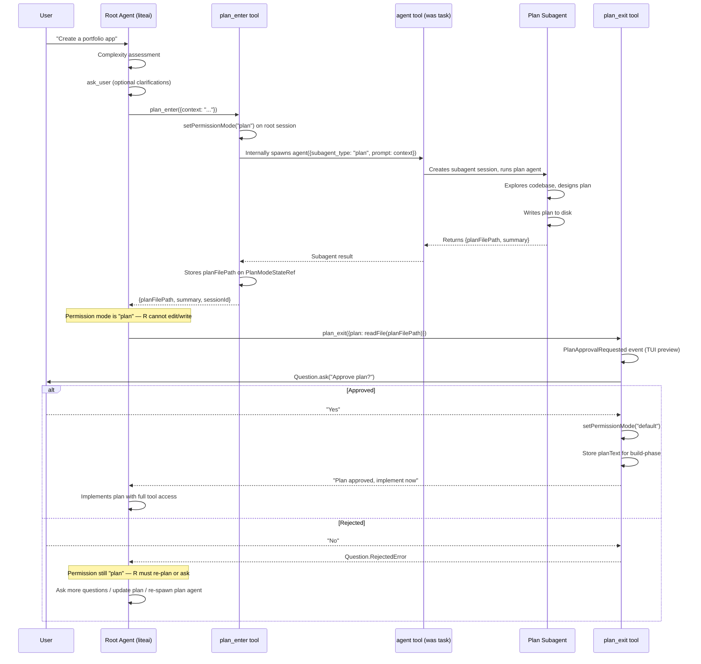
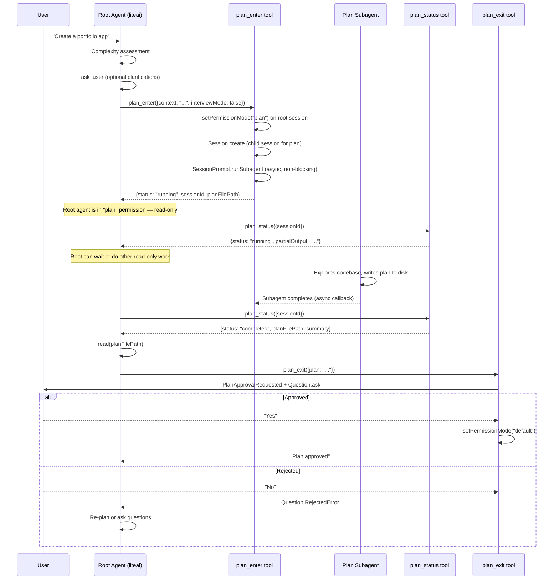
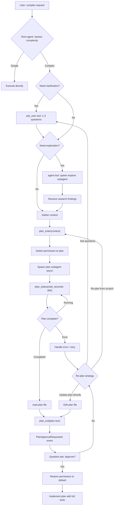

# ADR: Plan Mode Redesign — Subagent Architecture

## Status: DRAFT — Awaiting User Decision

---

## 1. Problem Statement

The current plan mode implementation suffers from:

1. **Dual dialog bug**: `plan_enter` emits `PlanApprovalRequested` AND `Question.ask()` simultaneously
2. **Approval friction on entry**: User must approve "entering plan mode" — pointless gate
3. **KV cache pollution**: Root agent's context is mutated with per-turn plan reminders
4. **No permission isolation**: When planning is active, the main agent can still call write tools
5. **`task` → `agent` naming confusion**: The tool is called `task` but it spawns agents
6. **Agent taxonomy**: The root agent is called `build` but should be `liteai`; the `general` agent is ambiguous

### User Requirements (This Session)

- **Keep `plan_exit`** — the main agent calls it to present the plan for approval
- **`plan_enter` spawns plan subagent + switches permission to plan mode** (read-only for main agent while plan runs)
- **Main agent has a status/wait tool** to check on plan subagent completion (like `command_status` for `run_command`)
- **Plan subagent returns plan disk path** — not the full plan text in the tool result
- **Plan subagent doesn't have bubble permission** → `PlanApprovalRequested` won't appear to user in subagent context
- **Main agent calls `plan_exit`** after subagent completes → user sees approval dialog
- **If user rejects**: main agent handles (asks more questions, updates plan directly, or spawns plan agent again)
- **Rename `task` tool to `agent`** across codebase
- **Clean agent taxonomy**: root = `liteai`, keep `explore` agent, keep `plan` agent

---

## 2. Design Alternatives

### Alternative A: Plan-as-TaskTool Extension ("Thin Orchestration")

> **Pattern**: Proxy / Adapter — `plan_enter` is a thin wrapper that calls the existing `TaskTool` infrastructure (renamed to `agent`), then switches permission mode.



**How it works:**
- `plan_enter` is a tool that:
  1. Calls `setPermissionMode("plan")` on the root session
  2. Internally delegates to the `agent` tool (renamed from `task`) to spawn the plan subagent
  3. The subagent runs, writes plan to disk, returns the path
  4. Returns the plan path + summary to the root agent
- `plan_exit` is kept as-is (with minor cleanup)
- The root agent reads the plan file, passes it to `plan_exit`
- `plan_exit` handles approval, restores permissions on success

**Pros:**
- Reuses existing `TaskTool` (→ `AgentTool`) infrastructure — no new control flow
- Plan subagent lifecycle is identical to any other subagent (same monitoring, same events)
- Permission mode switch is a single `setPermissionMode()` call — already exists in `loop.ts`
- Minimal new code surface

**Cons:**
- `plan_enter` calling `agent` tool internally creates a nested tool invocation (tool calling a tool) — potentially fragile, violates SRP
- The root agent must manually read the plan file, then call `plan_exit` — two steps that could be forgotten or mis-ordered
- No built-in "wait/poll" mechanism — the plan_enter tool blocks until the subagent completes (synchronous from root agent's perspective)

---

### Alternative B: Dedicated Plan Orchestrator ("First-Class Plan Lifecycle")

> **Pattern**: State Machine + Mediator — `plan_enter` is a full lifecycle orchestrator: spawns subagent, monitors completion, stores state. `plan_exit` is the approval gate. A new `plan_status` tool lets the root agent poll.



**How it works:**
- `plan_enter` is a **non-blocking** tool:
  1. Switches permission to "plan"
  2. Creates a child session and spawns the plan subagent via `SessionPrompt.runSubagent()` — but fires-and-forgets (runs in background)
  3. Returns immediately with `{status: "running", sessionId}`
- New `plan_status` tool (analogous to `command_status`):
  - Takes `sessionId`, returns `{status: "running" | "completed" | "error", planFilePath?, summary?}`
  - Can optionally block/wait for completion (like `command_status` with `WaitDurationSeconds`)
- `plan_exit` unchanged — approval gate
- Root agent flow: `plan_enter` → poll `plan_status` → read plan → `plan_exit`

**Pros:**
- Non-blocking: root agent can do other read-only work while plan subagent runs (rare but possible)
- Clean separation: each tool has a single responsibility
- Mirrors the `run_command` / `command_status` pattern the user explicitly requested
- More tools = more explicit control points = better observability
- Natural retry: if plan_status returns error, root agent can re-enter plan mode

**Cons:**
- More tools (3 instead of 2) — more surface for the model to learn
- Requires background task tracking for the plan subagent (fire-and-forget async pattern)
- The "non-blocking" advantage is theoretical — in practice, the agent will immediately call `plan_status` with a wait, making it effectively synchronous
- More complex state management (tracking running plan session IDs)

---

## 3. Evaluation Matrix

| Criterion | Alt A (Thin Orchestration) | Alt B (Dedicated Lifecycle) |
|-----------|---------------------------|---------------------------|
| **Complexity** | Low — reuses agent tool | Medium — new plan_status tool |
| **SRP adherence** | ⚠️ plan_enter calls agent internally | ✅ Each tool has one job |
| **User's `run_command` analogy** | ❌ No polling pattern | ✅ Matches `run_command/command_status` |
| **Permission isolation** | ✅ Same mechanism | ✅ Same mechanism |
| **Observability** | ⚠️ Opaque — plan_enter blocks | ✅ plan_status gives intermediate state |
| **Error recovery** | ⚠️ Single failure point | ✅ Granular status reporting |
| **Token cost** | ✅ Fewer tools in context | ⚠️ One more tool description |
| **Implementation effort** | Low (2-3 files) | Medium (4-5 files) |
| **Model learning curve** | ✅ Fewer concepts | ⚠️ Must learn 3-tool workflow |

---

## 4. Recommendation

> [!IMPORTANT]
> **I recommend Alternative B (Dedicated Plan Lifecycle)** based on:
>
> 1. It directly matches the user's stated requirement ("like `run_command` / `command_status`")
> 2. Better SRP — no tool-calling-tool anti-pattern
> 3. Superior observability and error recovery
> 4. The token cost difference is negligible (one more tool description)

However, there is a **meaningful tradeoff**: Alternative A is simpler and faster to implement. If the "non-blocking" and "polling" aspects are not valued, Alternative A is the pragmatic choice.

---

## 5. Detailed Design (Alternative B)

### 5.1 Agent Taxonomy Cleanup

| Current Name | New Name | Role | Mode |
|-------------|----------|------|------|
| `build` | `liteai` | Root/primary agent | `primary` |
| `general` | _(keep or remove)_ | General subagent | `subagent` |
| `explore` | `explore` | Codebase exploration | `subagent` |
| `plan` | `plan` | Planning specialist | `subagent` |

> [!IMPORTANT]
> **Decision needed**: Should `general` be kept alongside `explore`, or is `explore` sufficient for non-plan subagent tasks? The `general` agent has `*` tools and seems to overlap with the renamed `agent` tool's default behavior.

### 5.2 Tool Rename: `task` → `agent`

This is a mechanical rename across:

| File | Change |
|------|--------|
| `tool/task.ts` → `tool/agent.ts` | Rename file, `TaskTool` → `AgentTool`, tool id `"task"` → `"agent"` |
| `tool/task_stop.ts` → `tool/agent_stop.ts` | Same pattern |
| `tool/index.ts` | Update exports |
| `tool/registry.ts` | Update imports and array entries |
| `agent/filter.ts` | Update `ALL_LITEAI_TOOLS`, `filterToolsForAgent` references |
| `bundled/prompts/tools/task.txt` → `agent.txt` | Rename + update description text |
| `bundled/prompts/tools/task_stop.txt` → `agent_stop.txt` | Same |
| `agent/filter.ts` | `resolveAgentTools` regex: `agent(...)` pattern already supported |
| All test files | Update references |
| `coordinator/*` | Update references |
| `acp/events.ts` | Update task event names if applicable |

### 5.3 Plan Tool Lifecycle (3-Tool Design)

#### `plan_enter` Tool

```typescript
// tool/plan.ts — PlanEnterTool

parameters: z.object({
  context: z.string().describe("The planning context: user requirements, research findings, constraints"),
  interviewMode: z.boolean().optional().default(false),
})

execute(params, ctx):
  // 1. Guard: root agent only
  if (!isRootAgent()) throw Error("plan_enter: root agent only")

  // 2. Guard: already planning
  const state = PlanModeStateRef.for(ctx.sessionID).get()
  if (state.planSessionID) throw Error("Plan already in progress")

  // 3. Switch root session to "plan" permission mode (read-only)
  setPermissionMode(ctx.sessionID, "plan")

  // 4. Create child session for plan subagent
  const planSession = await Session.create({ parentID: ctx.sessionID, title: "Plan subagent" })

  // 5. Store plan session ID in PlanModeStateRef
  PlanModeStateRef.for(ctx.sessionID).update(s => ({
    ...s,
    planSessionID: planSession.id,
    planFilePath: state.planFilePath,
  }))

  // 6. Spawn plan subagent (async — fire-and-forget into BackgroundTaskRegistry)
  const agentDef = await Agent.get("plan")
  const model = resolveModel(ctx, agentDef)
  
  BackgroundTaskRegistry.register(planSession.id, async () => {
    const result = await SessionPrompt.runSubagent({
      messageID: MessageID.ascending(),
      sessionID: planSession.id,
      model,
      agent: "plan",
      parts: [{ type: "text", text: params.context }],
    })
    // Store result in PlanModeStateRef for plan_status to read
    PlanModeStateRef.for(ctx.sessionID).update(s => ({
      ...s,
      planResult: result,
    }))
  })

  // 7. Return immediately (non-blocking)
  return {
    title: "Planning started",
    output: `Plan subagent spawned. Session: ${planSession.id}\nPlan file: ${state.planFilePath}\n\nUse plan_status to check progress. When complete, read the plan file and call plan_exit to present for approval.`,
    metadata: { sessionId: planSession.id, planFilePath: state.planFilePath },
  }
```

#### `plan_status` Tool (NEW)

```typescript
// tool/plan_status.ts

parameters: z.object({
  wait_seconds: z.number().optional().default(0)
    .describe("Seconds to wait for completion before returning status. 0 = immediate check."),
})

execute(params, ctx):
  const state = PlanModeStateRef.for(ctx.sessionID).get()
  if (!state.planSessionID) throw Error("No plan in progress")

  // Wait if requested (like command_status)
  if (params.wait_seconds > 0) {
    await waitForCompletion(state.planSessionID, params.wait_seconds * 1000)
  }

  // Check status
  if (state.planResult) {
    if (state.planResult.status === "error") {
      return { title: "Plan failed", output: `Error: ${state.planResult.error}`, metadata: { status: "error" } }
    }
    // Extract text from completed message
    const summary = extractText(state.planResult.message)
    return {
      title: "Plan complete",
      output: `Plan subagent has completed.\nPlan file: ${state.planFilePath}\n\nRead the plan file and call plan_exit to present for approval.\n\nSummary:\n${summary}`,
      metadata: { status: "completed", planFilePath: state.planFilePath },
    }
  }

  return {
    title: "Planning in progress",
    output: "Plan subagent is still working...",
    metadata: { status: "running", sessionId: state.planSessionID },
  }
```

#### `plan_exit` Tool (KEPT — Minor Modifications)

Changes from current:
1. On approval: also `setPermissionMode(ctx.sessionID, "default")` — restore write access
2. On rejection: keep permission as "plan", clear `planResult` so agent can re-enter or update
3. Remove `workflowType` references (no longer relevant)
4. Add: clear `planSessionID` and `planResult` on approval

```diff
 // On approval:
+SessionPrompt.setPermissionMode(ctx.sessionID, "default")
+
 PlanModeStateRef.for(ctx.sessionID).update((s) => ({
   ...s,
   planSessionID: undefined,
   turnsSincePlanReminder: 0,
   planText: params.plan,
 }))
```

### 5.4 PlanModeState Interface Update

```typescript
export interface PlanModeState {
  // REMOVED: active: boolean — no longer a state machine
  // REMOVED: workflowType: "interview" | "5phase" | undefined

  /** Plan text stored after approval for build-phase reminders */
  planText: string | undefined
  /** Deterministic plan file path */
  planFilePath: string
  /** Turns since last full plan reminder (build-phase) */
  turnsSincePlanReminder: number

  // NEW:
  /** Session ID of the running plan subagent (if any) */
  planSessionID: SessionID | undefined
  /** Result of the plan subagent (set when subagent completes) */
  planResult: SessionResult | undefined
}
```

### 5.5 Permission Mode: "plan"

The `"plan"` permission mode already exists in [schema.ts](file:///d:/liteai/packages/core/src/session/schema.ts#L40-L41) (`PermissionModeAll`, `PermissionModeCyclable`). The `setPermissionMode` function in [loop.ts](file:///d:/liteai/packages/core/src/session/engine/loop.ts#L257-L275) already supports it.

When `permissionMode === "plan"`:
- The permission service treats write operations (edit, write, multiedit, apply_patch, run_command) as requiring explicit approval or denial
- This effectively makes the root agent read-only during planning

> [!NOTE]
> Need to verify the exact behavior of `"plan"` mode in `permission/service.ts` — it may need tightening to actually deny writes rather than just asking.

### 5.6 Build Agent Rename: `build` → `liteai`

| File | Change |
|------|--------|
| `bundled/agents/build.md` → `bundled/agents/liteai.md` | Rename, update `name: liteai` |
| `agent/agent.ts` | Update `BUILTIN_AGENT_NAMES`: replace `"build"` with `"liteai"` |
| `agent/agent.ts` | Update foundational agent guard: `key === "liteai"` |
| `agent/agent.ts` | Update `defaultAgent()` fallback: `return "liteai"` |
| `bundled/agents/plan.md` | Update system prompt references if any |
| All references to `"build"` as agent name | Global search and replace |

### 5.7 yield_turn Removal

Per the existing roadmap (unchanged):
- Delete `tool/yield_turn.ts`
- Delete `bundled/prompts/tools/yield_turn.txt`
- Remove from `registry.ts`, `filter.ts`, `coordinator-mode.ts`, `coordinator-prompt.ts`, `teammate-runner.ts`
- Remove yield_turn parsing from `tool/task.ts` (→ `tool/agent.ts`)

### 5.8 Event Cleanup

| Event | Action |
|-------|--------|
| `PlanStateChanged` | Remove — no more active/inactive transitions |
| `PlanApprovalRequested` | Keep — used by `plan_exit` for TUI preview |
| `PermissionModeChanged` | Keep — already exists, used for plan permission switch |

---

## 6. Flow Diagram (Complete)



---

## 7. Implementation Order

### Phase 1: Rename `task` → `agent` (Mechanical)
- File renames, import updates, tool ID changes
- Update all references in coordinator, filter, registry
- Update bundled prompts

### Phase 2: Rename `build` → `liteai` (Mechanical)
- Agent config rename
- Update BUILTIN_AGENT_NAMES and fallback guards
- Update all references

### Phase 3: Plan Mode Lifecycle Tools
- Rewrite `plan_enter` (non-blocking, permission switch)
- Create `plan_status` (new tool)
- Modify `plan_exit` (permission restore)
- Update `PlanModeState` interface

### Phase 4: yield_turn Removal
- Delete tool, prompts, all references

### Phase 5: State/Event Cleanup
- Remove `PlanStateChanged` event
- Simplify `plan-mode-state.ts`
- Remove plan reminder injection for active mode
- Remove stop-drift plan detection

### Phase 6: System Prompt Updates
- Update Section 5 in `system.md`
- Update plan agent prompt
- Update tool descriptions

---

## 8. Open Questions for User

> [!IMPORTANT]
> **Q1: Alternative A vs B?** I recommend B (Dedicated Lifecycle with `plan_status`). It matches your `run_command`/`command_status` analogy. Do you agree, or prefer A (simpler, synchronous)?

> [!IMPORTANT]
> **Q2: `general` agent fate?** Should we keep the `general` subagent alongside `explore`? It has `*` tools (full access) while `explore` is read-only. Use cases for `general`: "run this build script", "fix these 3 files in parallel". If we keep it, should it be renamed?

> [!IMPORTANT]
> **Q3: Plan permission mode behavior** — should `"plan"` mode **deny** all writes outright (hard block), or **ask** for each write (soft gate)? Currently "plan" mode in the permission service might just map to "ask". A hard deny is safer for the planning phase.

> [!IMPORTANT]
> **Q4: Plan subagent non-blocking vs blocking** — should `plan_enter` truly be non-blocking (fire-and-forget, poll via `plan_status`), or should it block until the subagent completes (simpler, but the root agent can't do anything during planning anyway since it's in read-only mode)?

Shall I proceed with implementation after you confirm the design choices?
