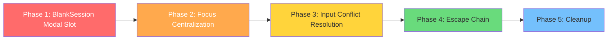

# Implementation Plan — Hybrid Approach

> Pending user selection. This plan is written for the **Hybrid** approach (keep modal pane + centralize focus).
> If Option A or B is selected instead, this document will be rewritten.

---

## Phase 1: Critical Fix — BlankSession Modal Slot

**Goal**: Make modals render in BlankSession immediately. Unblocks all 18 slash commands.

### [MODIFY] [app.tsx](file:///d:/liteai/packages/cli/src/tui/app.tsx)

**Change**: Refactor `BlankSession` to use `SessionLayout` (or a minimal variant) so that `modalPane.content` has a rendering slot.

```diff
 function BlankSession() {
   const modalPane = useModalPane()
+  const modalScrollRef = useRef<ScrollBoxHandle | null>(null)
   
   return (
-    <Box flexDirection="column" flexGrow={1}>
-      <Box flexGrow={1} justifyContent="center" alignItems="center">
-        <Logo />
-      </Box>
-      <PromptInput ... />
-      <Tips />
-    </Box>
+    <SessionLayout
+      scrollable={
+        <Box flexGrow={1} justifyContent="center" alignItems="center">
+          <Logo />
+        </Box>
+      }
+      bottom={
+        <>
+          <PromptInput ... />
+          <Tips />
+        </>
+      }
+      modal={modalPane.content}
+      modalScrollRef={modalScrollRef}
+    />
   )
 }
```

**Why SessionLayout**: It already has the absolute-positioned modal pane with proper sizing, divider, and padding. Reusing it avoids duplicating the modal rendering logic.

**Risk**: SessionLayout expects `scrollRef`, `dividerYRef` etc. We pass `undefined` for optional props — no functional impact since those features (sticky header, new message pill) are session-specific.

---

## Phase 2: Focus Centralization

**Goal**: Eliminate the `useInput` conflict by making focus management explicit.

### [MODIFY] [modal-pane.tsx](file:///d:/liteai/packages/cli/src/tui/context/modal-pane.tsx)

**Change**: Upgrade from single-slot to a stack for proper sub-navigation:

```diff
 type ModalPaneCtx = {
-  content: ReactNode | null
+  stack: ReactNode[]
+  content: ReactNode | null  // derived: stack[stack.length - 1] ?? null
   isOpen: boolean
   openModal: (content: ReactNode) => void
+  pushModal: (content: ReactNode) => void
+  popModal: () => void
   closeModal: () => void
 }
```

**Implementation**:
- `openModal()` → clears stack, pushes new content (replaces current modal)
- `pushModal()` → pushes onto stack (sub-navigation)
- `popModal()` → pops top of stack (Escape in sub-dialog)
- `closeModal()` → clears entire stack
- `content` → getter returning `stack.at(-1) ?? null`
- `isOpen` → getter returning `stack.length > 0`

### [MODIFY] [use-navigation.ts](file:///d:/liteai/packages/cli/src/tui/hooks/use-navigation.ts)

**Change**: Wire to stack semantics:

```diff
 return useMemo(() => ({
-  open: (content: ReactNode) => modalPane.openModal(content),
-  close: () => modalPane.closeModal(),
-  replace: (content: ReactNode) => {
-    modalPane.closeModal()
-    modalPane.openModal(content)
-  },
+  open: (content: ReactNode) => modalPane.pushModal(content),
+  close: () => modalPane.popModal(),
+  replace: (content: ReactNode) => {
+    modalPane.popModal()
+    modalPane.pushModal(content)
+  },
 }), [modalPane])
```

**Effect**: `navigation.open()` from within a dialog pushes a sub-view. `navigation.close()` (Escape) pops back to the parent dialog. This is the correct semantic.

---

## Phase 3: Input Conflict Resolution

**Goal**: Ensure at most one `useInput` handler is active at any time.

### [MODIFY] [dialog-select.tsx](file:///d:/liteai/packages/cli/src/tui/ui/dialog-select.tsx)

**Change**: Replace embedded `<TextInput>` with a **filter-only input** that does not fight with the keybinding system.

The core problem: `DialogSelect` has both `TextInput` (which calls `useInput`) AND `useKeybindings` (which also calls `useInput` under the hood). Both register for the same keystrokes.

**Solution**: Use `TextInput` with an `inputFilter` that blocks navigation keys, letting the keybinding system handle them exclusively:

```diff
 <TextInput
   value={query}
   onChange={setQuery}
   placeholder={props.placeholder ?? "Search"}
   disableCursorMovementForUpDownKeys={true}
   disableEscapeDoublePress={true}
   focus={true}
+  inputFilter={(input, key) => {
+    // Let keybinding system handle navigation
+    if (key.upArrow || key.downArrow || key.pageUp || key.pageDown
+        || key.home || key.end || key.return || key.escape) {
+      return ""
+    }
+    return input
+  }}
 />
```

### [MODIFY] [default-bindings.ts](file:///d:/liteai/packages/cli/src/tui/keybindings/default-bindings.ts)

**Change**: Remove `j`/`k`/`space` from Select context. These conflict with typing in the filter input. Keep only unambiguous navigation keys:

```diff
 Select: {
   up: "select:previous",
   down: "select:next",
-  k: "select:previous",
-  j: "select:next",
   "ctrl+p": "select:previous",
   "ctrl+n": "select:next",
-  space: "select:accept",
+  enter: "select:accept",
+  escape: "select:cancel",
+  pageUp: "select:pageUp",
+  pageDown: "select:pageDown",
+  home: "select:home",
+  end: "select:end",
 }
```

**Rationale**: `j`/`k` are vim navigation but they're also the most common letters people type when searching for models (e.g., "json", "jack"). Space is needed for search phrases. These bindings are hostile to a filter-enabled select.

> [!NOTE]
> The second Select context block (lines 243-251) appears to be a more correct version that already has `enter`/`escape`. Verify whether there are two contexts or if one overrides the other.

---

## Phase 4: Dialog Escape Chain

**Goal**: Make Escape correctly pop through nested dialog stacks.

### [MODIFY] All dialog components that use `onClose`

Currently dialogs receive `onClose` and call `modalPane.closeModal()` (clears everything). With the stack, they should call `modalPane.popModal()` (pops to parent).

Since `useNavigation().close()` now maps to `popModal()`, all existing `onClose={() => navigation.close()}` patterns automatically fix themselves.

For dialogs opened directly via `tuiInterceptors`:
```diff
 // In PromptInput tuiInterceptors
 models: () => {
-  modalPane.openModal(<DialogModel onClose={() => modalPane.closeModal()} />)
+  modalPane.openModal(<DialogModel onClose={() => modalPane.closeModal()} />)
   // openModal still clears stack — correct for top-level open
 }
```

For sub-dialogs (e.g., Config → Models):
```diff
 // In DialogConfig
 const handleModelNav = () => {
-  navigation.open(<DialogModel onClose={() => navigation.close()} />)
+  navigation.open(<DialogModel onClose={() => navigation.close()} />)
   // navigation.open() = pushModal — correct for sub-navigation
   // navigation.close() = popModal — pops back to Config, not all the way out
 }
```

No change needed in call sites — the fix is in `use-navigation.ts` mapping.

---

## Phase 5: Cleanup & Hardening

### [MODIFY] [prompt-input.tsx](file:///d:/liteai/packages/cli/src/tui/components/prompt/prompt-input.tsx)

**Change**: Add guard to prevent `modalPane.openModal` when already open (prevents double-fire):

```diff
 const handleInterceptor = (cmd: string) => {
+  if (modalPane.isOpen) return  // prevent double-open
   const interceptor = tuiInterceptors[cmd]
   if (interceptor) {
     interceptor()
   }
 }
```

### [MODIFY] [session-layout.tsx](file:///d:/liteai/packages/cli/src/tui/components/session-layout.tsx)

**Change**: Ensure modal pane handles empty stack gracefully (already does via `modal != null` check, but verify).

---

## Dependency Order



Each phase is independently testable. Phase 1 alone unblocks slash commands in BlankSession.

---

## Files Modified Summary

| File | Phase | Type |
|------|-------|------|
| `app.tsx` | 1 | MODIFY — BlankSession uses SessionLayout |
| `modal-pane.tsx` | 2 | MODIFY — Stack-based modal system |
| `use-navigation.ts` | 2 | MODIFY — Wire to push/pop |
| `dialog-select.tsx` | 3 | MODIFY — inputFilter for navigation keys |
| `default-bindings.ts` | 3 | MODIFY — Remove j/k/space from Select |
| `prompt-input.tsx` | 5 | MODIFY — Guard against double-open |
| `session-layout.tsx` | 5 | VERIFY — No change expected |
