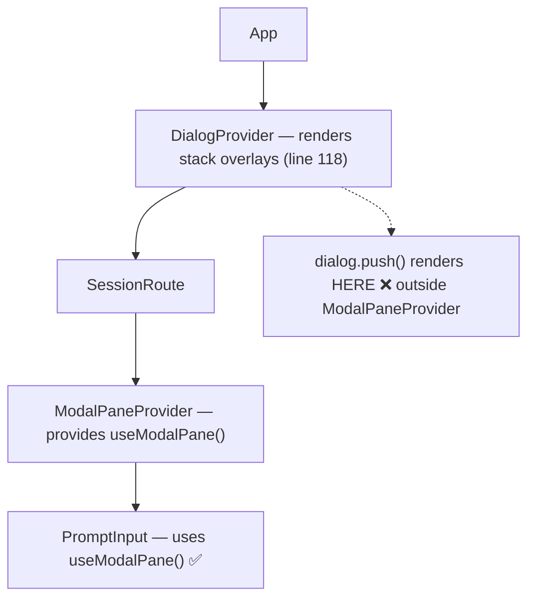

# Fix ModalPane Crash + Claude Code-Style /config + Settings Consolidation

## Problem

After the modal pane migration, `DialogModel` crashes on render:
```
[useModalPane] Must be used within a <ModalPaneProvider>
```

### Root Cause



Components migrated to `useModalPane()` crash when rendered via the old `dialog.push()` system, which renders **above** `ModalPaneProvider` in the tree.

---

## Scope: Three Changes

1. **Fix the crash** — context-aware navigation hook (Strategy pattern)
2. **Claude Code-style `/config`** — tabbed settings pane with `Tabs` UI component
3. **Consolidate settings** — move TUI settings into core `settings.json`, drop scroll physics

---

## 1. Context-Aware Navigation Hook

### [NEW] `packages/cli/src/tui/context/modal-pane.tsx` — add `useOptionalModalPane()`

Export a non-throwing variant alongside `useModalPane()`:

```typescript
/** Returns ModalPaneAPI if inside ModalPaneProvider, null otherwise. */
export function useOptionalModalPane(): ModalPaneAPI | null {
  return useContext(ModalPaneCtx)
}
```

### [NEW] `packages/cli/src/tui/hooks/use-navigation.ts`

Strategy hook that detects rendering context and dispatches navigation:

```typescript
type NavigationAPI = {
  open: (content: ReactNode) => void
  close: () => void
  replace: (content: ReactNode) => void
}

export function useNavigation(): NavigationAPI {
  const modalPane = useOptionalModalPane()
  const dialog = useDialog()

  return useMemo(() => {
    if (modalPane) {
      return {
        open: (content) => modalPane.openModal(content),
        close: () => modalPane.closeModal(),
        replace: (content) => {
          modalPane.closeModal()
          modalPane.openModal(content)
        },
      }
    }
    // Fallback: dialog stack (provider-setup-banner, legacy paths)
    return {
      open: (content) => dialog.push(() => content),
      close: () => dialog.clear(),
      replace: (content) => dialog.replace(() => content),
    }
  }, [modalPane, dialog])
}
```

Not a silent fallback (mandate §5) — it's an explicit Strategy pattern. Both paths are intentional rendering contexts.

### [MODIFY] `packages/cli/src/tui/components/dialog-model.tsx`

Replace `useModalPane()` → `useNavigation()`. Lines 28, 134, 166.

### [MODIFY] `packages/cli/src/tui/components/dialog-mcp.tsx`

Replace `useModalPane()` → `useNavigation()`. Lines 38, 110, 289.

### [MODIFY] `packages/cli/src/tui/components/dialog-provider.tsx`

Replace `dialog.replace(() => <DialogModel .../>)` → `navigation.replace(...)` in `AutoMethod` (line 298), `CodeMethod` (line 353), `ApiMethod` (line 405).

---

## 2. Claude Code-Style `/config` Command

### [NEW] `packages/cli/src/tui/ui/tabs.tsx` — Tabs Design System Component

A reusable `Tabs` component modeled on [Claude Code's Tabs.tsx](file:///d:/claude-code/src/components/design-system/Tabs.tsx):

```typescript
type TabProps = {
  title: string
  children: ReactNode
}

type TabsProps = {
  selectedTab: string
  onTabChange: (tab: string) => void
  children: ReactElement<TabProps>[]
  color?: string
}
```

Features:
- Left/right arrow navigation on tab header row
- Active tab underline indicator
- Content area renders only the selected tab's children
- Keyboard: ESC propagates to parent, arrows switch tabs

### [NEW] `packages/cli/src/tui/components/dialog-config.tsx` — Settings Pane

Tabbed pane with two tabs:

**Status tab:**
- Provider connection status (from `provider_next`)
- MCP server status
- Session info (ID, message count)
- Version info

**Config tab:**
- Searchable settings list with boolean toggles and managed pickers
- **Model** → opens `DialogModel` via `navigation.open()`
- **Provider** → opens `DialogProvider` via `navigation.open()`
- **Theme** → opens `DialogTheme` via `navigation.open()`
- **Effort** → opens `DialogEffort` via `navigation.open()`
- **Output Style** → opens `DialogOutputStyle` via `navigation.open()`
- **MCP Servers** → opens `DialogMcp` via `navigation.open()`
- **Plugins** → opens `DialogPlugin` via `navigation.open()`
- **Error Verbosity** → toggle (`low` / `full`)
- **Diff Style** → enum (`auto` / `stacked`)
- **Auto-compact** → toggle (maps to `compaction.auto`)

### [MODIFY] `packages/cli/src/tui/components/prompt/prompt-input.tsx`

Add to `TUI_COMMANDS`:
```typescript
{ name: "config", description: "Open config panel", template: "", hints: [] },
{ name: "settings", description: "Open config panel (alias)", template: "", hints: [] },
```

Add to `tuiInterceptors`:
```typescript
config: () => modalPane.openModal(<DialogConfig onClose={modalPane.closeModal} />),
settings: () => modalPane.openModal(<DialogConfig onClose={modalPane.closeModal} />),
```

### [DELETE] `packages/cli/src/tui/components/dialog-settings.tsx`

Redundant — all functionality moves into `DialogConfig`.

---

## 3. Settings Consolidation — Core Config `tui` Namespace

### Design Decision

Move all portable TUI settings into the core `settings.json` under a `tui` namespace. This gives cross-machine sync for free (settings.json is the authoritative source of truth for all LiteAI config).

**Drop entirely:** `scroll_speed`, `scroll_acceleration` — OS/terminal concerns, not app settings.

**Move to core `tui` namespace:** `theme`, `keybinds`, `errorVerbosity`, `diff_style`, `output_file_threshold`

### [MODIFY] `packages/core/src/config/schema.ts`

Add `tui` field to `Info`:
```typescript
tui: z.object({
  theme: z.string().optional(),
  keybinds: KeybindingOverrides.optional(),
  errorVerbosity: z.enum(["low", "full"]).optional(),
  diff_style: z.enum(["auto", "stacked"]).optional(),
  output_file_threshold: z.number().min(100).optional(),
}).optional(),
```

### [MODIFY] `packages/core/src/config/loader.ts`

Remove the deprecation warning that strips `tui` keys (lines 312-318). Instead, merge `tui` normally.

### [MODIFY] `packages/cli/src/cli/config/tui.ts`

Update `TuiConfig.get()` to read from core config first, then overlay any local `tui.json` overrides. Priority: `tui.json` (local) > `settings.json.tui` (portable) > defaults.

### [MODIFY] `packages/cli/src/tui/context/tui-config.tsx`

Update `TuiConfigProvider.update()` to write to core config via SDK (`sdk.client.config.update()`) instead of local `tui.json`.

### [MODIFY] `packages/cli/src/cli/config/tui-schema.ts`

Remove `scroll_speed` and `scroll_acceleration` from `TuiOptions`. Keep only settings that don't already live in core.

---

## Verification Plan

### Automated
- `bun typecheck` passes
- `bun lint:fix` passes

### Manual
- `bun dev` starts without crash
- `/config` opens tabbed settings pane
- `/settings` opens same pane (alias)
- Tab switching works (arrow keys)
- ESC closes pane
- `/models` still works from prompt
- Provider auth → model picker works (via `useNavigation()`)
- Home page provider setup banner still works
- Theme change via Config tab persists to `settings.json`
- Settings sync across sessions (restart confirms persistence)
