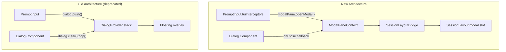

# TUI Modal Pane Migration — Walkthrough

## Summary

Migrated the LiteAI TUI from a stack-based `DialogProvider` overlay architecture to a state-driven, single-slot modal pane system. This aligns with industry-standard agentic CLI patterns (modeled after Claude Code's `centeredModal`) and eliminates the focus/UI instability caused by the previous stacked overlay approach.

## Architecture

## Changes Made

### Infrastructure (Phase 2a)

#### [NEW] [modal-pane.tsx](file:///d:/liteai/packages/cli/src/tui/context/modal-pane.tsx)
- `ModalPaneProvider` — single-slot modal state manager
- `useModalPane()` — hook providing `openModal`/`closeModal`/`isOpen`/`content`/`scrollRef`
- Fail-fast error if used outside provider (mandate §5)

#### [MODIFY] [index.tsx](file:///d:/liteai/packages/cli/src/tui/routes/session/index.tsx)
- Wrapped session tree in `<ModalPaneProvider>`
- Added `SessionLayoutBridge` — reads modal state from context and injects `modal`/`modalScrollRef` props into `SessionLayout` via `React.cloneElement`

---

### Simple Dialog Migrations (Phase 2c) — 18 components

All simple dialogs were converted from `useDialog().push/pop/clear` to an `onClose` callback prop pattern:

| Component | Old Pattern | New Pattern |
|-----------|-------------|-------------|
| `DialogEffort` | `dialog.pop()` | `onClose()` |
| `DialogTheme` | `dialog.clear()` | `onClose()` |
| `DialogDoctor` | implicit `dialog.clear()` | `onEscape={onClose}` |
| `DialogHelpV2` | `dialog.clear()` | `onClose()` |
| `DialogDiff` | `dialog.pop()` | `onClose()` |
| `DialogSearch` | `dialog.pop()` | `onClose()` |
| `DialogMemory` | `dialog.clear()` + `dialog.setSize()` | `onClose()` |
| `DialogContext` | `dialog.pop()` | `Dialog.onCancel={onClose}` |
| `DialogPermissions` | `dialog.pop()` | `onEscape={onClose}` |
| `DialogStats` | `_dialog` (unused) | `onClose: _onClose` |
| `DialogTag` | `dialog.clear()` | `props.onClose()` |
| `DialogSessionRename` | `dialog.clear()` | `props.onClose()` |
| `DialogSkill` | `dialog.clear()` + `dialog.setSize()` | `props.onClose()` |
| `DialogManageModels` | `dialog` in deps | removed dep |
| `DialogStatus` | no dialog usage | added `onClose` prop |

---

### Complex Dialog Migrations (Phase 2d)

#### [MODIFY] [dialog-model.tsx](file:///d:/liteai/packages/cli/src/tui/components/dialog-model.tsx)
- Fully migrated to `useModalPane`
- `dialog.clear()` → `props.onClose()`
- `dialog.replace(() => <DialogProvider />)` → `modalPane.openModal(<DialogProvider onClose={...} />)`

#### [MODIFY] [dialog-mcp.tsx](file:///d:/liteai/packages/cli/src/tui/components/dialog-mcp.tsx)
- Fully migrated to `useModalPane`
- Sub-navigation (McpDetail, McpToolsList) uses `modalPane.openModal()` to replace modal content
- Back navigation reconstructs parent view via `modalPane.openModal(<DialogMcp onClose={...} />)`

---

### Command Dispatch Rewiring (Phase 3)

#### [MODIFY] [prompt-input.tsx](file:///d:/liteai/packages/cli/src/tui/components/prompt/prompt-input.tsx)
- **Core change**: Replaced `useDialog` with `useModalPane`
- Rewired all 25+ TUI interceptors from `dialog.push(() => <X />)` to `modalPane.openModal(<X onClose={modalPane.closeModal} />)`
- Focus gate changed from `dialog.stack.length > 0` to `modalPane.isOpen`
- Fixed stale `dialog.push` in `chat:agents` keybinding

## What Was Tested

- `bun typecheck` — 0 TypeScript errors
- `bun lint:fix` — 15 files auto-formatted, no remaining warnings

## Deferred Work

> [!NOTE]
> The following items are intentionally deferred to a follow-up session to keep this changeset focused and reviewable.

1. **Complex dialog internal migration** — `DialogRewind`, `DialogAgentList`, `DialogPlugin`, `DialogSessionList`, `DialogWorkspace`, and `DialogProvider` still use `useDialog()` internally for sub-navigation. They have been given `onClose` props for compatibility with the new modal pane system, but their internal stack-based navigation remains on the legacy system.

2. **Legacy cleanup** — `<DialogProvider>` in `app.tsx`, `context/dialog.tsx`, and the floating overlay rendering in `session-layout.tsx` should be removed once all internal `useDialog()` calls are eliminated.

3. **HomeRoute modal** — `ProviderSetupBanner` on the home route uses `dialog.push()`. Since `HomeRoute` lacks `SessionLayout`, a minimal modal slot needs to be introduced there.
