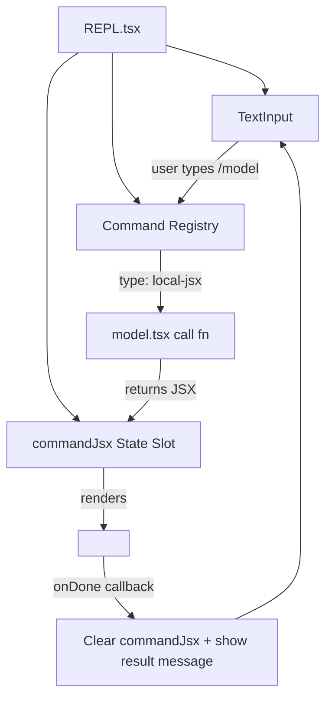
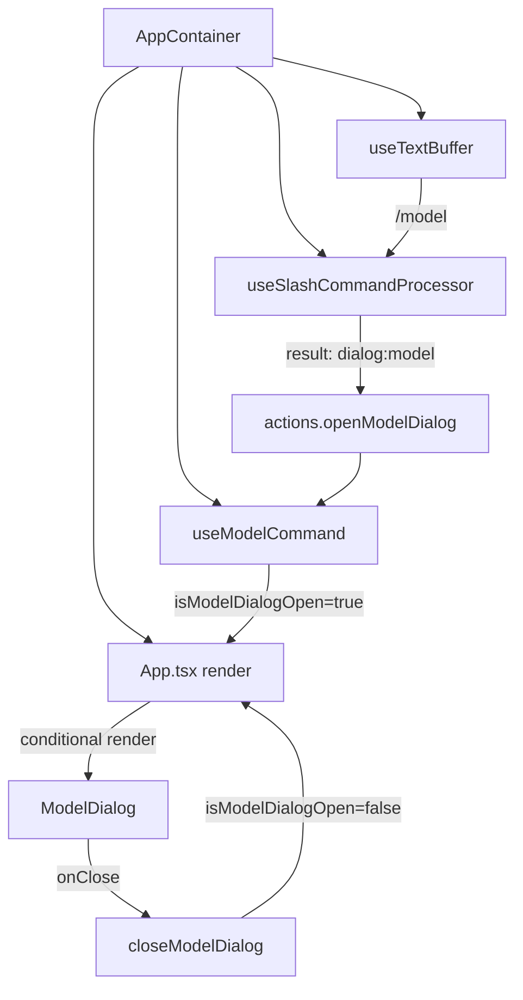
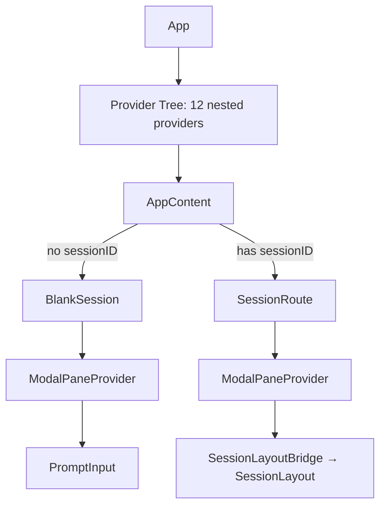

# Architecture Comparison: Claude Code vs Gemini CLI vs LiteAI

> **Consolidated from**: `settings-ui-overhaul/01-architecture-audit.md` + `tui-architecture/02-reference-comparison.md`  
> **Reference Codebases**: [Claude Code](D:\claude-code), [Gemini CLI](D:\gemini-cli)

---

## 1. Claude Code — "REPL Owns Everything"

**Source**: `D:\claude-code\src\`



### Key Decisions
- **Single Owner**: REPL owns `commandJsx: ReactNode | null`. When set, renders command JSX instead of prompt
- **Command Types**: `local` (string), `local-jsx` (React element with `onDone`), `prompt` (expands to text)
- **Focus is implicit**: Only one thing renders at a time — no `isActive` flags needed
- **`onDone` pattern**: Every `local-jsx` command receives `onDone(result, options)` — clears JSX, restores prompt

### `/model` Flow
1. User types `/model` → Enter
2. REPL matches command, calls `model.tsx` `call(onDone, context, args)`
3. `call()` returns `<ModelPickerWrapper onDone={onDone} />`
4. REPL sets `commandJsx = returned JSX`
5. ModelPickerWrapper renders a list with `useAppState` selectors
6. User selects → `handleSelect()` calls `onDone("Set model to X")`
7. REPL clears `commandJsx`, shows result as system message
8. Prompt re-renders

### Key Files
```
src/screens/REPL.tsx               — 258KB compiled monolith
src/commands.ts                    — command registry (755 lines)
src/commands/model/model.tsx       — model picker (297 lines)
src/keybindings/useKeybinding.ts   — named context keybindings
```

---

## 2. Gemini CLI — "Hook-Extracted Monolith"

**Source**: `D:\gemini-cli\packages\cli\src\`



### Key Decisions
- **One Text Buffer**: `useTextBuffer()` in AppContainer
- **Hook-per-dialog**: Each dialog gets `useState` hook in AppContainer
- **Command processor returns action descriptors**, not JSX
- **Focus is boolean-flag-driven**: Dialog booleans disable main input via conditional rendering

### Key Files
```
ui/AppContainer.tsx                          — 88KB, 2905 lines (orchestrator)
ui/hooks/slashCommandProcessor.ts            — 764 lines (command dispatch)
ui/hooks/useModelCommand.ts                  — 32 lines (dialog state hook)
ui/commands/modelCommand.ts                  — 2042 lines (model picker rendering)
ui/hooks/useKeypress.ts                      — priority-based input hook
ui/components/BaseSelectionList.tsx           — 276 lines (selection rendering)
ui/hooks/useSelectionList.ts                 — 485 lines (headless selection)
```

---

## 3. LiteAI — "Context Provider Tree" (Current)

**Source**: `d:\liteai\packages\cli\src\tui\`



### Key Decisions
- **Context-based modal system**: `ModalPaneProvider` stores `ReactNode | null`
- **Command dispatch via string map**: `tuiInterceptors` in PromptInput
- **Focus gating via `isDialogOpen`**: Fragile flag-based system
- **Keybinding system**: `useKeybindings` with context strings (exists, but bypassed by 18 files)

---

## Comparison Matrix

| Aspect | Claude Code | Gemini CLI | LiteAI |
|--------|------------|------------|--------|
| **Input instances** | 1 (REPL owns it) | 1 (useTextBuffer) | **2+ simultaneous** |
| **Focus model** | Implicit (one renders) | Boolean flags + conditional | **isActive flags on competing hooks** |
| **Modal rendering** | Replaces prompt area | Conditional in App.tsx | **Context with separate slot** |
| **Command system** | Formal registry with types | CommandService + actions | **Inline string map** |
| **Selection hook** | `use-select-navigation` (16K) | `useSelectionList` (485 LOC) | **None (monolith)** |
| **Selection component** | `Select` (30K LOC) | `BaseSelectionList` (276 LOC) | `DialogSelect` (323, monolith) |
| **Dialog wrapper** | `Pane` + `Dialog` | None (inline) | `ThemedBox` / `Pane` (inconsistent) |
| **Focus gate on prompt** | `focusedInputDialog` enum | Composer unmounts | **None** |

---

## The 3-Layer Pattern

Both codebases converge on the same architecture:

```
┌─────────────────────────────────────────────┐
│ Layer 3: Dialog Chrome                       │
│ Pane / Dialog wrapper                        │
├─────────────────────────────────────────────┤
│ Layer 2: Selection Primitives                │
│ useSelectList (hook) + SelectList (component)│
├─────────────────────────────────────────────┤
│ Layer 1: Input Ownership Protocol            │
│ useKeybindings + context registration        │
└─────────────────────────────────────────────┘
```

**LiteAI gap**: Layer 1 exists but is bypassed. Layer 2 is missing. Layer 3 is inconsistent.

---

## Verified Rendering Positions

### Gemini CLI
| Content | Where | Source |
|---------|-------|--------|
| Settings/Model dialog | DialogManager REPLACES Composer (bottom slot) | AppContainer.tsx |
| HITL (tool confirmation) | ToolConfirmationQueue IN scrollable area | MainContent.tsx |
| Plan exit confirmation | ToolConfirmationQueue (type exit_plan_mode) | ToolConfirmationQueue.tsx |
| Ask User (question) | ToolConfirmationQueue IN scrollable area | ToolConfirmationQueue.tsx |
| Model change record | DialogManager records to history | DialogManager.tsx |

### Claude Code
| Content | Where | Source |
|---------|-------|--------|
| Settings/Model dialog | Modal slot (absolute, below bottom) | FullscreenLayout.tsx |
| HITL (permissions) | Overlay (inside ScrollBox, after messages) | FullscreenLayout.tsx |
| Question tool | Below prompt, with multi-tab navigation | PreviewQuestionView.tsx |
| Task list | Inside Spinner during streaming (message area) | Spinner.tsx |
