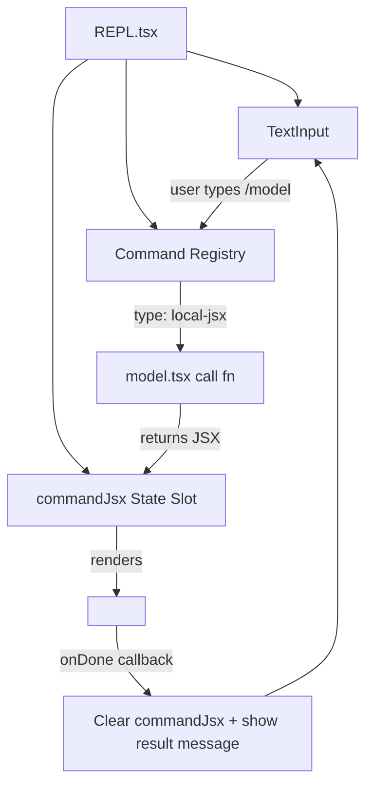
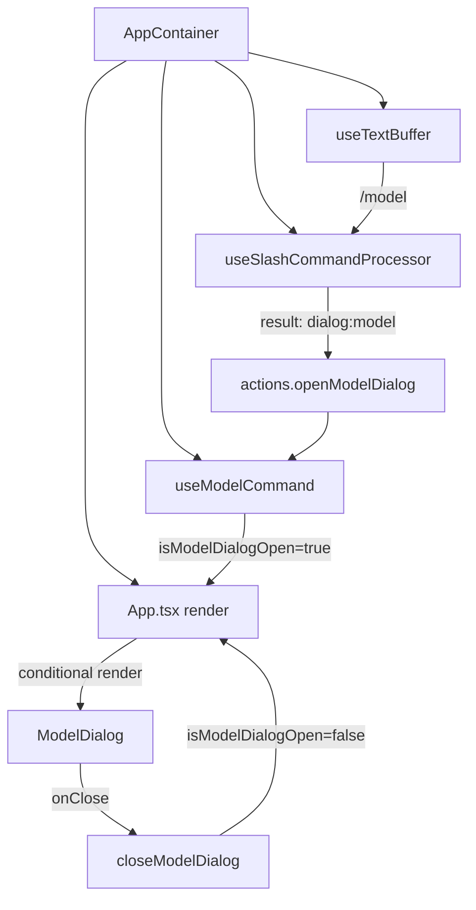
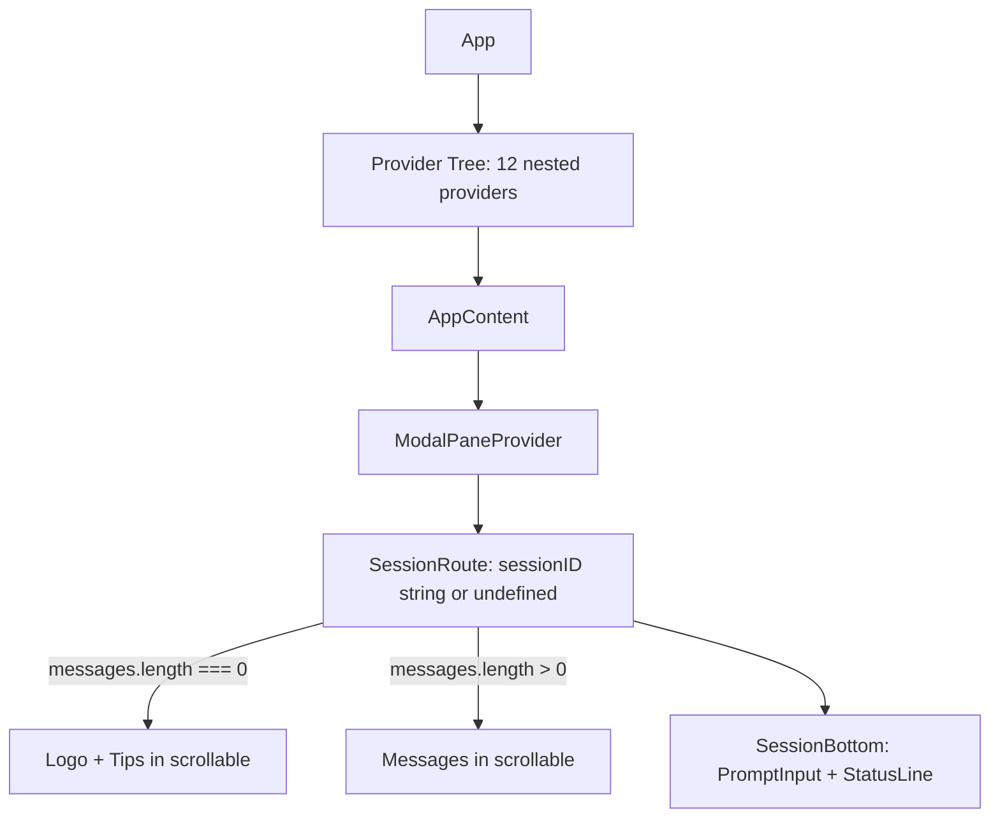

# Architecture Comparison: Claude Code vs Gemini CLI vs LiteAI

> **Consolidated from**: `settings-ui-overhaul/01-architecture-audit.md` + `tui-architecture/02-reference-comparison.md`  
> **Reference Codebases**: [Claude Code](D:\claude-code), [Gemini CLI](D:\gemini-cli)  
> **Last Updated**: 2026-05-16 (added boot flow, onboarding, exit summary, alternate screen analysis)

---

## 1. Claude Code — "REPL Owns Everything"

**Source**: `D:\claude-code\src\`



### Key Decisions
- **Single Owner**: REPL owns `commandJsx: ReactNode | null`. When set, renders command JSX instead of prompt
- **Command Types**: `local` (string), `local-jsx` (React element with `onDone`), `prompt` (expands to text)
- **Focus is implicit**: Only one thing renders at a time — no `isActive` flags needed
- **`onDone` pattern**: Every `local-jsx` command receives `onDone(result, options)` — clears JSX, restores prompt

### `/model` Flow
1. User types `/model` → Enter
2. REPL matches command, calls `model.tsx` `call(onDone, context, args)`
3. `call()` returns `<ModelPickerWrapper onDone={onDone} />`
4. REPL sets `commandJsx = returned JSX`
5. ModelPickerWrapper renders a list with `useAppState` selectors
6. User selects → `handleSelect()` calls `onDone("Set model to X")`
7. REPL clears `commandJsx`, shows result as system message
8. Prompt re-renders

### Key Files
```
src/screens/REPL.tsx               — 258KB compiled monolith
src/commands.ts                    — command registry (755 lines)
src/commands/model/model.tsx       — model picker (297 lines)
src/keybindings/useKeybinding.ts   — named context keybindings
```

---

## 2. Gemini CLI — "Hook-Extracted Monolith"

**Source**: `D:\gemini-cli\packages\cli\src\`



### Key Decisions
- **One Text Buffer**: `useTextBuffer()` in AppContainer
- **Hook-per-dialog**: Each dialog gets `useState` hook in AppContainer
- **Command processor returns action descriptors**, not JSX
- **Focus is boolean-flag-driven**: Dialog booleans disable main input via conditional rendering

### Key Files
```
ui/AppContainer.tsx                          — 88KB, 2905 lines (orchestrator)
ui/hooks/slashCommandProcessor.ts            — 764 lines (command dispatch)
ui/hooks/useModelCommand.ts                  — 32 lines (dialog state hook)
ui/commands/modelCommand.ts                  — 2042 lines (model picker rendering)
ui/hooks/useKeypress.ts                      — priority-based input hook
ui/components/BaseSelectionList.tsx           — 276 lines (selection rendering)
ui/hooks/useSelectionList.ts                 — 485 lines (headless selection)
```

---

## 3. LiteAI — "Context Provider Tree" (Target: Zero-Branching)

**Source**: `d:\liteai\packages\cli\src\tui\`

> **Decided 2026-05-16**: Eliminate BlankSession/SessionRoute split. Single `SessionRoute` handles all states.



### Key Decisions
- **Unified rendering path**: Single `SessionRoute` for boot and active states (no BlankSession)
- **Context-based modal system**: `ModalPaneProvider` stores stack of `ReactNode[]`
- **Command dispatch via string map**: `tuiInterceptors` in PromptInput
- **Focus arbiter**: `SessionRoute` derives focus, passes `focus: boolean` to PromptInput (required prop)
- **Keybinding system**: `useKeybindings` with context strings

---

## Comparison Matrix

| Aspect | Claude Code | Gemini CLI | LiteAI |
|--------|------------|------------|--------|
| **Input instances** | 1 (REPL owns it) | 1 (useTextBuffer) | 1 (SessionRoute owns focus) |
| **Focus model** | Implicit (one renders) | Boolean flags + conditional | **Centralized focus arbiter** (required `focus` prop) |
| **Modal rendering** | Replaces prompt area | Conditional in App.tsx | **Stack-based ModalPaneProvider** |
| **Command system** | Formal registry with types | CommandService + actions | **Inline string map** |
| **Selection hook** | `use-select-navigation` (16K) | `useSelectionList` (485 LOC) | `useSelectList` (Phase 1 primitive) |
| **Selection component** | `Select` (30K LOC) | `BaseSelectionList` (276 LOC) | `SelectList` + `DialogPane` (Phase 1) |
| **Dialog wrapper** | `Pane` + `Dialog` | None (inline) | `Pane` (Phase 2 standard) |
| **Focus gate on prompt** | `focusedInputDialog` enum | Composer unmounts | **`focus: boolean` required prop** |
| **Boot/active split** | Single REPL, pre-REPL setup dialogs | Single AppContainer | **Single SessionRoute** |

---

## The 3-Layer Pattern

Both codebases converge on the same architecture:

```
┌─────────────────────────────────────────────┐
│ Layer 3: Dialog Chrome                       │
│ Pane / Dialog wrapper                        │
├─────────────────────────────────────────────┤
│ Layer 2: Selection Primitives                │
│ useSelectList (hook) + SelectList (component)│
├─────────────────────────────────────────────┤
│ Layer 1: Input Ownership Protocol            │
│ useKeybindings + context registration        │
└─────────────────────────────────────────────┘
```

**LiteAI status**: Layer 1 enforced (Phase 2). Layer 2 implemented (`useSelectList` + `SelectList`). Layer 3 standardized (`Pane` primitive).

---

## Boot Flow & Onboarding Comparison

> **Added 2026-05-16** from direct source analysis of both reference CLIs.

### Claude Code — Pre-REPL Dialog Chain

**Source**: `D:\claude-code\src\interactiveHelpers.tsx` (`showSetupScreens()`)

Boot sequence executes a **sequential dialog chain** before entering the REPL:
1. `Onboarding` dialog → theme picker + welcome
2. `TrustDialog` → workspace trust boundary  
3. `ClaudeMdExternalIncludesDialog` → approval for external includes
4. `ApproveApiKey` → if `ANTHROPIC_API_KEY` env var is set
5. Then renders the main REPL (`REPL.tsx`)

Inside the REPL, `getFocusedInputDialog()` returns one of ~20 possible dialog states (including `'init-onboarding'`, `'ide-onboarding'`, model switch, etc.) — all rendered within the same single REPL layout.

**No-auth state**: Shows `Not logged in · Run /login` in the status line (right-aligned, red text). On submit, shows inline error: `"Not logged in · Please run /login"`.

### Gemini CLI — Single AppContainer with Inline Auth

**Source**: `D:\gemini-cli\packages\cli\src\ui\AppContainer.tsx`

Uses a **single `AppContainer`** for everything:
- Auth state tracked inline: `authState === AuthState.Unauthenticated` shows a blocking auth dialog inside the same layout
- No separate boot screen — the Composer + History layout always renders
- Model checked at submit time, not at boot
- Onboarding shows a mandatory `Get Started` dialog with auth method selection

### LiteAI — Adopted Approach

**Pattern**: Claude Code style (non-blocking).
- StatusLine shows `No provider · Run /provider` when `provider_next.connected.length === 0`
- Submit-time validation: existing `"No model selected. Use /models to configure a provider and model."` toast
- No blocking wizard — user can explore the TUI freely before configuring
- A dedicated onboarding wizard can be added in a later phase

---

## Alternate Screen / Terminal Buffer

> **Added 2026-05-16** — explains why the shell command line is visible in Claude Code and Gemini CLI but not in LiteAI.

| CLI | Buffer Mode | Shell Command Visible? |
|-----|------------|------------------------|
| Claude Code | Normal buffer (conditionally alternate via `shouldEnterAlternateScreen`) | Yes — `PS D:\test_ws> claude` persists above TUI |
| Gemini CLI | Normal buffer (conditionally via `config.getUseAlternateBuffer()`) | Yes — `PS D:\test_ws> gemini` persists above TUI |
| LiteAI | Always alternate screen (investigation needed) | No — original command hidden |

Both reference CLIs default to normal buffer, which keeps the original shell command visible above the TUI. This is a **Phase 5 concern** (UX Polish), not Phase 3.

---

## Exit Summary Comparison

> **Added 2026-05-16** — both CLIs render post-exit information after the TUI unmounts.

### Gemini CLI
Renders a boxed `Interaction Summary` on `/quit`:
- Session ID, Tool Calls count (success/fail), Success Rate
- Performance: Wall Time, Agent Active time, API Time, Tool Time
- Resume command: `gemini --resume '<session-id>'`

### Claude Code
Renders two lines on Ctrl+C:
- `Press Ctrl-C again to exit` (first press)
- `Resume this session with: claude --resume <session-id>` (after exit)

### LiteAI — Adopted Approach
**Pattern**: Gemini CLI style (richer summary).
- Capture stats snapshot before Ink unmounts
- Write summary to stdout in cleanup handler
- Include: Model, Messages, Tool Calls, Context %, Cost, Wall Time, Resume command

---

## Verified Rendering Positions

### Gemini CLI
| Content | Where | Source |
|---------|-------|--------|
| Settings/Model dialog | DialogManager REPLACES Composer (bottom slot) | AppContainer.tsx |
| HITL (tool confirmation) | ToolConfirmationQueue IN scrollable area | MainContent.tsx |
| Plan exit confirmation | ToolConfirmationQueue (type exit_plan_mode) | ToolConfirmationQueue.tsx |
| Ask User (question) | ToolConfirmationQueue IN scrollable area | ToolConfirmationQueue.tsx |
| Model change record | DialogManager records to history | DialogManager.tsx |

### Claude Code
| Content | Where | Source |
|---------|-------|--------|
| Settings/Model dialog | Modal slot (absolute, below bottom) | FullscreenLayout.tsx |
| HITL (permissions) | Overlay (inside ScrollBox, after messages) | FullscreenLayout.tsx |
| Question tool | Below prompt, with multi-tab navigation | PreviewQuestionView.tsx |
| Task list | Inside Spinner during streaming (message area) | Spinner.tsx |
| Onboarding (no-auth) | Status line: `Not logged in · Run /login` | REPL.tsx status bar |
| Exit | Resume command to stdout | interactiveHelpers.tsx |
