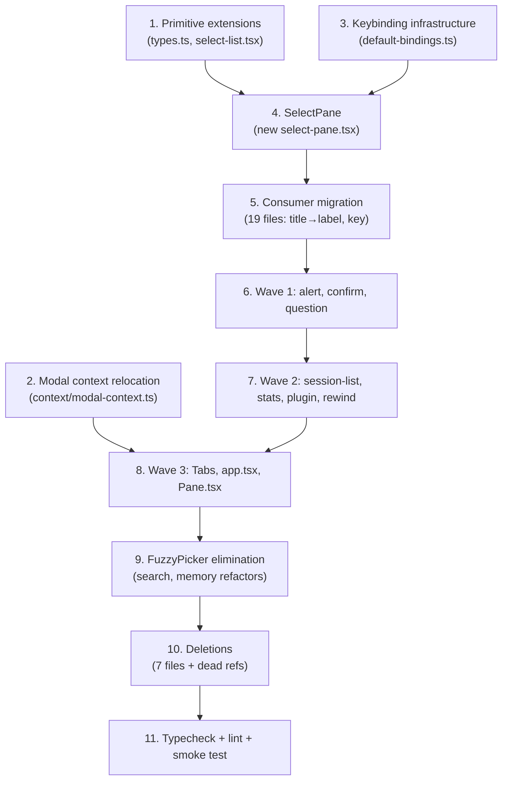

# Phase 2: Component Migration — Implementation Plan (Revised)

> **Phase**: 2 of 5 — TUI Overhaul
> **Depends On**: Phase 1 (Standard Primitives) — ✅ Complete
> **Scope**: `@liteai/cli` — 12 component migrations, 19 consumer updates, 7 deletions

---

## Locked Decisions

| # | Decision | Rationale |
|---|---|---|
| **L-1** | **No backward compatibility.** Kill `DialogSelectOption<T>`, update all 25+ consumers to `SelectItem<T>`. | Clean break per v-Next mandate. |
| **L-2** | **Delete feedback system.** Remove `dialog-feedback.tsx` and `feedback-survey.tsx`. | User directive. |
| **L-3** | **Delete FuzzyPicker (Option A).** Refactor 2 consumers (`dialog-search`, `dialog-memory`) to compose primitives directly. | 2 consumers, wrapper becomes pass-through post-migration. |
| **L-4** | **Delete legacy `Dialog` wrapper** (`ui/dialog.tsx`). Relocate modal context utilities. All consumers migrate to `DialogPane`. | Dead code after migration. |
| **L-5** | **Rename `DialogSelect` → `SelectPane`**, `DialogSelectOption<T>` → `SelectItem<T>`, `DialogSelectProps<T>` → `SelectPaneProps<T>`. | Naming clarity — "Dialog" prefix is legacy from removed `DialogProvider`. |

---

## Proposed Changes

### Part 1: Primitive Layer Extensions

#### [MODIFY] [types.ts](file:///d:/liteai/packages/cli/src/tui/primitives/types.ts)

Extend `SelectItem<T>` with optional rendering fields used by the majority of consumers:

```typescript
export interface SelectItem<T> {
  key: string
  value: T
  label: string
  description?: string
  disabled?: boolean
  category?: string
  // --- NEW: rendering extensions (ignored by useSelectList hook) ---
  /** Secondary content at end of row (status text, icons). */
  footer?: ReactNode
  /** Leading indicator before label (spinner, tab number, icon). */
  gutter?: ReactNode
}
```

**Why on `SelectItem` and not a separate type:** 19 consumers need `footer`/`gutter`. A separate `RichSelectItem<T> extends SelectItem<T>` adds ceremony for zero benefit — the hook ignores these fields.

#### [MODIFY] [select-list.tsx](file:///d:/liteai/packages/cli/src/tui/primitives/select-list.tsx)

Update default rendering to handle `footer` and `gutter` fields when no custom `renderItem` is provided.

#### [NEW] [modal-context.ts](file:///d:/liteai/packages/cli/src/tui/context/modal-context.ts)

Relocate from `ui/dialog.tsx`:
- `ModalContext` (createContext)
- `useIsInsideModal()`
- `useModalOrTerminalSize()`
- `useModalScrollRef()`

These are consumed by `Tabs.tsx` and `Pane.tsx` and must survive the `Dialog` wrapper deletion.

---

### Part 2: Keybinding Infrastructure

#### [MODIFY] [default-bindings.ts](file:///d:/liteai/packages/cli/src/tui/keybindings/default-bindings.ts)

New actions:

| Context | Action | Key | Consumer |
|---|---|---|---|
| `Global` | `global:closeTab` | `ctrl+w` | `app.tsx` |
| `Global` | `global:tab1`–`global:tab9` | `meta+1`–`meta+9` | `app.tsx` |
| `Tabs` | `tabs:next` | `→`, `tab` | `Tabs.tsx` |
| `Tabs` | `tabs:previous` | `←`, `shift+tab` | `Tabs.tsx` |
| `Plugin` | `plugin:nextTab` | `→` | `dialog-plugin.tsx` |
| `Plugin` | `plugin:previousTab` | `←` | `dialog-plugin.tsx` |
| `Select` | `select:directFork` | `f` | `dialog-rewind.tsx` |
| `Select` | `select:directRevert` | `r` | `dialog-rewind.tsx` |

---

### Part 3: Core — `SelectPane` (replaces `DialogSelect`)

#### [NEW] [select-pane.tsx](file:///d:/liteai/packages/cli/src/tui/ui/select-pane.tsx)

Complete rewrite of the 323-line `DialogSelect` monolith as a ~100-line composition:

```typescript
export interface SelectPaneProps<T> {
  title: string
  items: SelectItem<T>[]
  onSelect: (item: SelectItem<T>) => void
  onClose?: () => void
  placeholder?: string
  current?: T
  header?: ReactNode
  headerEnd?: ReactNode
  footerContent?: ReactNode
  /** When true, items are pre-filtered externally (skip internal fuzzysort). */
  skipFilter?: boolean
  /** Called when filter text changes. */
  onFilter?: (query: string) => void
  /** Called when highlighted item changes. */
  onHighlight?: (item: SelectItem<T>) => void
  /** When true, flattens categories during search. */
  flat?: boolean
  ref?: Ref<SelectPaneRef<T>>
}

export type SelectPaneRef<T> = {
  filter: string
  filtered: SelectItem<T>[]
}
```

**Internal composition:**
1. `useDialogLifecycle({ contextName: "Select", onClose })`
2. Fuzzy filter (fuzzysort, kept in-component)
3. `useSelectList({ items: filtered, onSelect, onHighlight })`
4. `<DialogPane>` chrome
5. `<TextInput>` for filter (character-level input — stays as-is)
6. `<SelectList>` for rendering
7. `useImperativeHandle` for ref consumers

#### [DELETE] [dialog-select.tsx](file:///d:/liteai/packages/cli/src/tui/ui/dialog-select.tsx)

Replaced by `select-pane.tsx`. Types `DialogSelectOption<T>`, `DialogSelectProps<T>`, `DialogSelectRef<T>` are killed.

---

### Part 4: Consumer API Migration (19 files)

Every file that imports from `dialog-select.tsx` must update:

| Change | Before | After |
|---|---|---|
| Import path | `../ui/dialog-select` | `../ui/select-pane` (component) or `../primitives` (type) |
| Component | `<DialogSelect>` | `<SelectPane>` |
| Item type | `DialogSelectOption<T>` | `SelectItem<T>` |
| Item field | `title: "..."` | `label: "..."` |
| Item field | *(implicit)* | `key: "..."` (required, add stable ID) |
| Ref type | `DialogSelectRef<T>` | `SelectPaneRef<T>` |
| Callback | `onSelect: (opt) => opt.value` | `onSelect: (item) => item.value` |

**Files (19):**

| File | Complexity | Notes |
|---|---|---|
| [dialog-doctor.tsx](file:///d:/liteai/packages/cli/src/tui/components/dialog-doctor.tsx) | Low | Simple list |
| [dialog-manage-models.tsx](file:///d:/liteai/packages/cli/src/tui/components/dialog-manage-models.tsx) | Medium | Uses type + component |
| [dialog-effort.tsx](file:///d:/liteai/packages/cli/src/tui/components/dialog-effort.tsx) | Low | Simple list |
| [dialog-mcp.tsx](file:///d:/liteai/packages/cli/src/tui/components/dialog-mcp.tsx) | Medium | Uses type + component |
| [dialog-model.tsx](file:///d:/liteai/packages/cli/src/tui/components/dialog-model.tsx) | Medium | Uses `footer`, `gutter` |
| [dialog-output-style.tsx](file:///d:/liteai/packages/cli/src/tui/components/dialog-output-style.tsx) | Low | Simple list |
| [dialog-plugin.tsx](file:///d:/liteai/packages/cli/src/tui/components/dialog-plugin.tsx) | High | Multiple sub-components |
| [dialog-provider.tsx](file:///d:/liteai/packages/cli/src/tui/components/dialog-provider.tsx) | High | Multi-step ViewState |
| [dialog-rewind-actions.tsx](file:///d:/liteai/packages/cli/src/tui/components/dialog-rewind-actions.tsx) | Low | Simple list |
| [dialog-session-list.tsx](file:///d:/liteai/packages/cli/src/tui/components/dialog-session-list.tsx) | High | Uses `footer`, `gutter`, `bg` |
| [dialog-skill.tsx](file:///d:/liteai/packages/cli/src/tui/components/dialog-skill.tsx) | Low | Simple list |
| [dialog-permissions.tsx](file:///d:/liteai/packages/cli/src/tui/components/dialog-permissions.tsx) | Low | Simple list |
| [dialog-tag.tsx](file:///d:/liteai/packages/cli/src/tui/components/dialog-tag.tsx) | Low | Simple list |
| [dialog-config.tsx](file:///d:/liteai/packages/cli/src/tui/components/dialog-config.tsx) | High | Uses type + component, tabs |
| [dialog-theme.tsx](file:///d:/liteai/packages/cli/src/tui/components/dialog-theme.tsx) | Medium | Uses ref |
| [dialog-workspace.tsx](file:///d:/liteai/packages/cli/src/tui/components/dialog-workspace.tsx) | Medium | Uses type + component |
| [dialog-agent-list.tsx](file:///d:/liteai/packages/cli/src/tui/components/dialog-agent-list.tsx) | Low | Simple list |
| [thinking-toggle.tsx](file:///d:/liteai/packages/cli/src/tui/components/thinking-toggle.tsx) | Low | Simple list |
| [dialog-export-options.tsx](file:///d:/liteai/packages/cli/src/tui/components/dialog-export-options.tsx) | Low | Simple list |

**`bg` field handling**: Only `dialog-session-list.tsx` uses `bg` (delete confirmation highlight). This will use a custom `renderItem` function on `SelectList` instead of a data field.

---

### Part 5: Wave 1 — Simple Dialogs (useInput elimination)

#### [MODIFY] [dialog-alert.tsx](file:///d:/liteai/packages/cli/src/tui/ui/dialog-alert.tsx)

- Remove `useInput` → `useDialogLifecycle({ contextName: "Select", onClose: onConfirm })`
- Add `useKeybindings` for `select:accept` (Enter confirmation)
- Replace `Dialog` wrapper → `DialogPane`
- **27 → ~20 LOC**

#### [MODIFY] [dialog-confirm.tsx](file:///d:/liteai/packages/cli/src/tui/ui/dialog-confirm.tsx)

- Remove `useInput` → `useDialogLifecycle` + `useSelectList` with 2 items
- Replace `Dialog` wrapper → `DialogPane`
- **44 → ~35 LOC**

#### [MODIFY] [question.tsx](file:///d:/liteai/packages/cli/src/tui/routes/session/question.tsx)

- Remove both `useInput` calls (tab switching, custom mode handlers)
- `useDialogLifecycle` for Esc → reject
- `useSelectList` for option navigation (options mode)
- `useKeybindings` for tab switching between modes
- Replace `ThemedBox` → `DialogPane`
- Custom text mode: Esc handling via separate `useKeybindings` call with `isActive: mode === "custom"`
- **186 → ~130 LOC**

---

### Part 6: Wave 2 — Settings & Navigation Dialogs

#### [MODIFY] [dialog-session-list.tsx](file:///d:/liteai/packages/cli/src/tui/components/dialog-session-list.tsx)

- Remove `useInput` (tab for tag cycling, ctrl+d/r/t/a/u shortcuts)
- Add `useKeybindings` with `"Select"` context for ctrl shortcuts
- Tab cycling → new keybinding action or explicit handler
- Esc delegated to `SelectPane` via `onClose` prop (no `useDialogLifecycle` here)

#### [MODIFY] [dialog-stats.tsx](file:///d:/liteai/packages/cli/src/tui/components/dialog-stats.tsx)

- Remove `useInput` (tab switching, 'r' date range)
- Add `useDialogLifecycle({ contextName: "Select", onClose })` — **fixes missing Esc bug**
- Add `useKeybindings` for tab/r actions

#### [MODIFY] [dialog-plugin.tsx](file:///d:/liteai/packages/cli/src/tui/components/dialog-plugin.tsx)

- **Parent**: Remove `useInput` → `useDialogLifecycle({ contextName: "Plugin", onClose })` + `useKeybindings` for tab cycling
- **RemoveMarketplaceDialog sub-component**: Remove `useInput` → `useDialogLifecycle` + `useKeybindings` for enter

#### [MODIFY] [dialog-rewind.tsx](file:///d:/liteai/packages/cli/src/tui/components/dialog-rewind.tsx)

- Remove `useInput` (f/r direct-action shortcuts)
- Merge into existing `useKeybindings` block as `select:directFork`, `select:directRevert`

---

### Part 7: Wave 3 — Special Cases

#### [MODIFY] [Tabs.tsx](file:///d:/liteai/packages/cli/src/tui/components/design-system/Tabs.tsx)

- Remove both `useInput` calls (header nav + navFromContent)
- Add `useKeybindings` with `"Tabs"` context: `tabs:next`, `tabs:previous`
- Focus gating via `isActive` parameter
- `onKeyDown` DOM handler for down-arrow stays (not a useInput call)
- Update import: `useIsInsideModal` from new `context/modal-context.ts`

#### [MODIFY] [app.tsx](file:///d:/liteai/packages/cli/src/tui/app.tsx)

- Remove `useInput` in `AppContent` (ctrl+w, meta+1-9)
- Add `useKeybindings` with `"Global"` context: `global:closeTab`, `global:tab1`–`global:tab9`

#### [MODIFY] [Pane.tsx](file:///d:/liteai/packages/cli/src/tui/components/design-system/Pane.tsx)

- Update import: `useIsInsideModal` from new `context/modal-context.ts` (instead of `ui/dialog.tsx`)

---

### Part 8: FuzzyPicker Elimination

#### [DELETE] [fuzzy-picker.tsx](file:///d:/liteai/packages/cli/src/tui/ui/fuzzy-picker.tsx)

232 LOC deleted. Replaced by direct primitive composition in consumers.

#### [MODIFY] [dialog-search.tsx](file:///d:/liteai/packages/cli/src/tui/components/dialog-search.tsx)

Refactor from `<FuzzyPicker>` wrapper to direct composition:
- `useDialogLifecycle` for Esc
- `useSelectList` for navigation
- `DialogPane` for chrome
- `SelectList` with custom `renderItem` for search results
- Inline `fuzzysort` (or in this case, server-side search — no client-side fuzzy)
- `TextInput` for search query (character-level exception)
- Preview pane rendering inline

#### [MODIFY] [dialog-memory.tsx](file:///d:/liteai/packages/cli/src/tui/components/dialog-memory.tsx)

Same pattern as `dialog-search.tsx` — compose primitives directly.

---

### Part 9: Deletions

| File | Reason |
|---|---|
| [dialog-feedback.tsx](file:///d:/liteai/packages/cli/src/tui/components/dialog-feedback.tsx) | L-2: Feedback system removed |
| [feedback-survey.tsx](file:///d:/liteai/packages/cli/src/tui/components/feedback-survey.tsx) | L-2: Feedback system removed |
| [fuzzy-picker.tsx](file:///d:/liteai/packages/cli/src/tui/ui/fuzzy-picker.tsx) | L-3: Replaced by direct composition |
| [dialog-select.tsx](file:///d:/liteai/packages/cli/src/tui/ui/dialog-select.tsx) | L-5: Replaced by `select-pane.tsx` |
| [dialog.tsx](file:///d:/liteai/packages/cli/src/tui/ui/dialog.tsx) | L-4: Legacy wrapper, modal context relocated |
| [dialog-export-options.tsx](file:///d:/liteai/packages/cli/src/tui/ui/dialog-export-options.tsx) | Superseded by `components/dialog-export-options.tsx` |

**Additional cleanup required:**
- Remove `/feedback` slash command registration
- Remove feedback survey trigger logic (wherever `FeedbackSurvey` is rendered)
- Remove `/feedback` route in server if it exists (out of scope — note for follow-up)
- Remove any imports referencing deleted files

---

### Part 10: Dead Code Audit

After all migrations, verify zero references remain to:
- `DialogSelectOption<T>` (killed)
- `DialogSelectProps<T>` (killed)
- `DialogSelectRef<T>` (killed)
- `DialogSelect` component (killed)
- `Dialog` component from `ui/dialog.tsx` (killed)
- `FuzzyPicker` component (killed)
- `FeedbackSurvey` component (killed)
- `DialogFeedback` component (killed)
- Raw `useInput` in any dialog component (14→0, 4 exceptions documented)

---

## Execution Order



---

## Verification Plan

### Automated

```powershell
# After each step:
bun typecheck 2>&1 | Out-String
bun lint:fix

# After all steps:
bun test test/tui/
```

### Smoke Test Matrix

| Component | Trigger | Verify |
|---|---|---|
| `SelectPane` | Any `/` command with list | ↑↓ nav, Enter, Esc, filter, scroll |
| `dialog-alert` | Error conditions | Enter/Esc dismiss |
| `dialog-confirm` | `/clear` | Left/right, Enter, Esc |
| `question.tsx` | AI question | Options, Tab→custom, Esc reject |
| `dialog-session-list` | `/sessions` | Search, ctrl shortcuts, tags |
| `dialog-stats` | `/stats` | Tab switch, range cycle, **Esc close (bug fix)** |
| `dialog-plugin` | `/plugin` | Tab switching, sub-dialogs |
| `dialog-rewind` | `/rewind` | ↑↓, f fork, r revert, Enter menu |
| `Tabs` | `/config`, `/stats` | ←→ tabs, ↓ content focus |
| `app.tsx` | ctrl+w, meta+1-9 | Tab close, tab switch |
| `dialog-search` | `/search` | Search, preview, Enter open, Esc |
| `dialog-memory` | `/memory` | Search, Enter open, Esc |

### Acceptance Criteria

- [ ] Zero raw `useInput` in dialog components (12 migrated, 4 documented exceptions)
- [ ] `DialogSelectOption<T>` has zero references in codebase
- [ ] `DialogSelect` has zero references in codebase
- [ ] `Dialog` wrapper (`ui/dialog.tsx`) deleted
- [ ] `FuzzyPicker` deleted, 2 consumers refactored
- [ ] Feedback system fully removed (2 files + slash command + trigger)
- [ ] `SelectItem<T>` extended with `footer`, `gutter`
- [ ] All 19 consumers compile with new `SelectPane` + `SelectItem<T>` API
- [ ] `bun typecheck` passes
- [ ] `bun lint:fix` passes
- [ ] Manual smoke test: all slash commands functional
