# TUI Overhaul — Multi-Phase Roadmap

> **Status**: Active  
> **Scope**: `@liteai/cli` — Terminal User Interface layer  
> **References**: [Gemini CLI](D:\gemini-cli), [Claude Code](D:\claude-code)  
> **Supersedes**: `roadmap/tui-overhaul/tui-architecture/`, `roadmap/tui-overhaul/settings-ui-overhaul/`
> *(Historical source docs — preserved for traceability, archived to `roadmap/done/` after Phase 5)*

---

## Executive Summary

The LiteAI TUI has 92 features at functional parity but suffers from **structural fragility** in its dialog/settings/input layer. This roadmap consolidates two prior design efforts into a single, phased execution plan that transforms the TUI from a feature-complete-but-fragile system into a production-grade, composable component architecture.

### Core Thesis

> **Composition over inheritance. Protocol over framework. Primitives over frameworks.**

Both Gemini CLI and Claude Code converged independently on the same 3-layer architecture: a focus/input ownership hook, a headless selection primitive, and minimal dialog chrome. LiteAI already has the keybinding context system (Layer 1) but lacks the headless selection primitive (Layer 2) and has inconsistent dialog chrome (Layer 3). 18 files bypass the keybinding system with raw `useInput` calls, causing systemic input conflicts.

---

## What's Already Done

These items were completed in prior sessions and are **not part of this roadmap**:

| Item | Conversation | Status |
|------|-------------|--------|
| `DialogProvider` → `ModalPaneProvider` migration | `812f9e7f` | ✅ Done |
| HomeRoute removal (boot-to-prompt) | `3c7f0cae` | ✅ Done |
| BlankSession modal rendering slot | `3c7f0cae` | ✅ Done |
| `j`/`k` removal from Select keybindings | `5d1cd26f` | ✅ Done |
| `inputFilter` for navigation keys in DialogSelect | `5d1cd26f` | ✅ Done |
| Complex dialog ViewState refactor | `1ad2d654` | ✅ Done |
| `useKeybindings` migration in SessionRoute | `a92db01d` | ✅ Done |

---

## Phase Overview

```mermaid
gantt
    title TUI Overhaul Phases
    dateFormat X
    axisFormat %s
    
    section Foundation
    Phase 1 - Standard Primitives    :p1, 0, 5
    
    section Migration
    Phase 2 - Component Migration    :p2, after p1, 5
    
    section Architecture
    Phase 3 - Focus & Navigation     :p3, after p2, 3
    
    section Features
    Phase 4 - Visual Design & UX     :p4, after p3, 7
    
    section Hardening
    Phase 5 - Polish & Verification  :p5, after p4, 3
```



| Phase | Name | Goal | Est. Effort | Status |
|-------|------|------|-------------|--------|
| **1** | [Standard Primitives](./phase-1-primitives.md) | Build the 3 hooks + 2 components every dialog composes from | Medium | ✅ Done |
| **2** | [Component Migration](./phase-2-migration.md) | Migrate 12+ dialog components to standard primitives, eliminate raw `useInput` | Medium-High | ✅ Done |
| **3** | [Focus & Navigation](./phase-3-focus.md) | Centralize focus management, modal stack semantics, nested escape chains, eliminate BlankSession split | Medium | ✅ Done |
| **4** | [Visual Design & UX](./phase-4-visual.md) | Message Trail pattern, Plan Mode, Command Palette, Shell rendering, Todo tray | High | ✅ Done |
| **5** | [Polish & Verification](./phase-5-polish.md) | Full verification pass, edge cases, performance, lint enforcement, provider tree collapse, alternate screen (keep as default — required for sidebar/session-list layout) | Low-Medium | ✅ Done |

---

## Architecture: The 3-Layer Model

Both reference codebases converged on this independently:

```
┌─────────────────────────────────────────────┐
│ Layer 3: Dialog Chrome                       │
│ DialogPane wrapper                           │
│ - Title, footer hints, border               │
│ - Detects modal context                      │
├─────────────────────────────────────────────┤
│ Layer 2: Selection Primitives                │
│ useSelectList (hook) + SelectList (component)│
│ - Up/down/enter/number navigation            │
│ - Scroll windowing, disabled item skipping   │
├─────────────────────────────────────────────┤
│ Layer 1: Input Ownership Protocol            │
│ useKeybindings + context registration        │
│ - Focus gating (isFocused)                   │
│ - Priority resolution                        │
│ - No raw useInput in dialog components       │
└─────────────────────────────────────────────┘
```

**Current gaps:**
- Layer 2 is **missing** — navigation is baked into each UI component (`DialogSelect` monolith)
- Layer 1 is **bypassed** by 18 files using raw `useInput`
- Layer 3 is **inconsistent** — `ThemedBox`, `Pane`, inline `<Box>` all used interchangeably

---

## Layout: The 4-Slot System

```
┌─────────────────────────────────────────────┐
│              SCROLLABLE SLOT                 │ ← Messages, tool output, HITL prompts,
│              (inside ScrollBox)              │   plan confirmations, shell output
│                                              │
├──────────────────────────────────────────────┤
│              BOTTOM SLOT                     │ ← TodoTray (persistent)
│              (flexShrink=0)                  │   {Dialog OR Prompt} (mutual exclusive)
│                                              │   StatusLine (always visible)
└──────────────────────────────────────────────┘
```

**Key design rule:** User-initiated dialogs (slash commands) render in the BOTTOM slot, **replacing** the prompt. System-initiated prompts (HITL permissions, AI questions) render in the SCROLLABLE slot so the user can see conversation context.

---

## Key Design Decisions (Locked)

These decisions are settled from prior analysis and should not be revisited:

| Decision | Rationale |
|----------|-----------|
| **Hooks over classes** | React's composition model actively fights class hierarchies. Evidence from both reference codebases. |
| **Protocol over framework** | No `ScreenManager` or `DialogBase`. Shared hooks + lint enforcement. |
| **ViewState for multi-step flows** | Local discriminated-union state machine inside each dialog. Not a navigation stack. |
| **Modal stack for top-level dialogs** | `ModalPaneProvider` with push/pop for dialog switching, not for sub-navigation within a dialog. |
| **Message Trail pattern** | User-initiated actions (model change, provider connect) are recorded as messages in the scrollable area after dialog closes. |
| **Structural exclusion for focus** | Dialog replaces prompt in bottom slot. Only one `useInput` active at a time. |

---

## Reference Architecture Comparison

| Capability | Gemini CLI | Claude Code | LiteAI Current | Target |
|-----------|-----------|-------------|----------------|--------|
| Focus hook | `useKeypress({priority})` | `useKeybinding({context})` | `useKeybindings({context})` ✅ | Enforce usage |
| Headless selection | `useSelectionList` (485 LOC) | `use-select-navigation` (16K) | **None** ❌ | `useSelectList` |
| Selection UI | `BaseSelectionList` (276 LOC) | `Select` (30K LOC) | `DialogSelect` (monolith) | `SelectList` |
| Dialog wrapper | None (inline) | `Pane` + `Dialog` | Inconsistent | `DialogPane` |
| Focus gate on prompt | Composer unmounts | `focusedInputDialog` | **None** ❌ | Structural exclusion |

---

## Sub-Documents

| Document | Purpose |
|----------|---------|
| [Phase 1: Standard Primitives](./phase-1-primitives.md) | `useSelectList`, `SelectList`, `useDialogLifecycle`, `DialogPane` — API design, test cases, implementation order |
| [Phase 2: Component Migration](./phase-2-migration.md) | File-by-file migration plan for 12+ dialog components from raw `useInput` to standard primitives |
| [Phase 3: Focus & Navigation](./phase-3-focus.md) | Focus arbiter, modal stack push/pop semantics, nested escape chains, BlankSession elimination |
| [Phase 4: Visual Design & UX](./phase-4-visual.md) | Screen-by-screen visual blueprints: Message Trail, Plan Mode, Command Palette, Shell, Todo, Question Tool |
| [Phase 5: Polish & Verification](./phase-5-polish.md) | Verification test matrix, lint rule enforcement, performance, documentation, provider tree collapse |
| [Design Reference](./design/) | Consolidated design artifacts (architecture audit, reference comparison, visual blueprints) |

---

## Success Criteria

| Metric | Current | Target |
|--------|---------|--------|
| Raw `useInput` in dialog components | 18 files | 0 (3 exceptions allowed) |
| Shared selection implementations | 5+ copies | 1 (`useSelectList`) |
| Dialog boilerplate | ~150 lines | ~30 lines |
| Input conflicts (simultaneous handlers) | Systemic | Zero by construction |
| Escape-to-close coverage | Inconsistent | 100% via `useDialogLifecycle` |
| Visual consistency | 3+ wrapper patterns | 1 (`DialogPane`) |
| Rendering code paths (boot vs session) | 2 divergent | 1 unified (`SessionRoute`) | ✅ Done |
| Context provider nesting | 15 wrappers | ~10 wrappers | 14 (PromptRef eliminated, D6 partial) |
