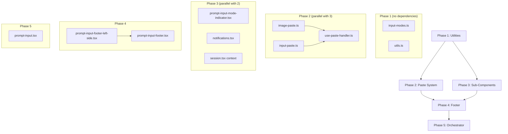

# Sub-batch 3.4: PromptInput Orchestrator — Complete Migration Plan

Port the PromptInput orchestrator and all supporting sub-components from the MVP, with full paste handling and full MVP footer. No feature flags. Basic core features only.

---

## Q1: Core Package Gap Analysis

### What Already Exists

The SDK client (`@liteai/sdk`) already exposes **all** the session APIs needed for PromptInput submission:

| SDK Method | Purpose | Status |
|---|---|---|
| `sdk.client.project.session.create()` | Create a new session | ✅ Exists |
| `sdk.client.project.session.prompt()` | Send message (prompt mode) | ✅ Exists |
| `sdk.client.project.session.promptAsync()` | Send message async | ✅ Exists |
| `sdk.client.project.session.command()` | Send slash command | ✅ Exists |
| `sdk.client.project.session.shell()` | Execute shell command (bash mode) | ✅ Exists |
| `sdk.client.project.session.abort()` | Abort active session | ✅ Exists |

The [Route context](file:///c:/Users/aghassan/Documents/workspace/liteai/packages/cli/src/tui/context/route.tsx) already has `SessionRoute.sessionID`.

The SDK [TextPartInput](file:///c:/Users/aghassan/Documents/workspace/liteai/packages/sdk/src/gen/types.gen.ts#L1824-L1837) and [FilePartInput](file:///c:/Users/aghassan/Documents/workspace/liteai/packages/sdk/src/gen/types.gen.ts#L1839-L1846) types support text + image attachments natively.

### What's Missing: `useSession()` Context

> [!IMPORTANT]
> **One core change is needed** — adding a `permissionMode` field to the session prompt/update API. See Q3 below for details. All other gaps are in the CLI TUI layer (`packages/cli`).

A new `useSession()` context is needed to manage the active session lifecycle. This is a **pure CLI-layer concern** — it orchestrates SDK calls, not core logic.

#### [NEW] [session.tsx](file:///c:/Users/aghassan/Documents/workspace/liteai/packages/cli/src/tui/context/session.tsx) (~150-200 lines)

**Responsibilities:**
1. **Active session tracking** — Tracks the current `sessionID` (from `useRoute()` for existing sessions, or auto-created on first prompt)
2. **Session creation** — Auto-creates a session via `sdk.client.project.session.create()` on first submit if no session exists
3. **Submit orchestration** — Routes submissions to the correct SDK endpoint:
   - Prompt mode → `session.prompt()` with `TextPartInput` + optional `FilePartInput` for images
   - Bash mode → `session.shell()` with the command string
   - Slash command → `session.command()` with command name + arguments
4. **Abort flow** — `session.abort()` when user presses Escape during loading
5. **Loading state** — Tracks whether a message is in-flight (derived from `useSync().session.status(sessionID)`)
6. **Message history** — Provides a history loader for `useArrowKeyHistory` from `useSync().message[sessionID]`

**Context shape:**
```typescript
type PermissionMode = 'default' | 'plan' | 'acceptEdits' | 'dontAsk' | 'bypassPermissions'

type SessionContextValue = {
  sessionID: string | undefined
  isLoading: boolean
  permissionMode: PermissionMode
  setPermissionMode: (mode: PermissionMode) => void
  submit(input: string, mode: PromptInputMode, attachments?: FilePartInput[]): Promise<void>
  abort(): Promise<void>
  loadHistory(): AsyncIterable<HistoryEntry>
}
```

**Dependencies:**
- `useSDK()` — for `sdk.client` and `sdk.projectID`
- `useRoute()` — for initial `sessionID` (if resuming)
- `useSync()` — for `session.status()` and `message[sessionID]`
- `useLocal()` — for `model.current()`, `agent.current()`, `model.variant.current()`
- `useToast()` — for error notifications

---

## Q2: Full Paste System

### Components to Port

The MVP paste system consists of two files:

#### [usePasteHandler.ts](file:///C:/Users/aghassan/Documents/workspace/liteai_cli_mvp/hooks/usePasteHandler.ts) (286 lines)
Core paste detection and routing hook.

#### [imagePaste.ts](file:///C:/Users/aghassan/Documents/workspace/liteai_cli_mvp/utils/imagePaste.ts) (417 lines)
Platform-specific clipboard image reading and image file path detection.

#### [inputPaste.ts](file:///C:/Users/aghassan/Documents/workspace/liteai_cli_mvp/components/PromptInput/inputPaste.ts) (91 lines)
Large text truncation with placeholder references.

### Migration Plan

#### [NEW] [use-paste-handler.ts](file:///c:/Users/aghassan/Documents/workspace/liteai/packages/cli/src/tui/hooks/use-paste-handler.ts) (~250 lines)

Port from MVP `usePasteHandler.ts`. This hook wraps the raw `onInput` handler and intercepts paste events.

**Core logic to preserve:**
1. **Bracketed paste detection** — Uses `InputEvent.keypress.isPasted` flag (set by `@liteai/ink`'s keypress parser)
2. **Chunk accumulation** — Collects paste chunks over `PASTE_COMPLETION_TIMEOUT_MS` (100ms) since Node buffers split long pastes
3. **Image file path detection** — Splits pasted text on path separators, checks each segment with `isImageFilePath()`
4. **Clipboard image reading** — On macOS, empty paste (Cmd+V with image) triggers `getImageFromClipboard()`
5. **pastePendingRef** — Synchronous ref to prevent Enter from submitting during a paste sequence

**Adaptations:**
- `useDebounceCallback` → Replace with manual `setTimeout`/`clearTimeout` (avoid `usehooks-ts` dependency)
- `InputEvent` type → Use `@liteai/ink` `ParsedKey` event type (verify `isPasted` field exists or adapt)
- `Key` type → Import from `@liteai/ink`
- `logError` → Use `Log.Default.error` from `@liteai/core/util/log`
- `getPlatform()` → Use `process.platform` directly (or port lightweight helper)

**Return type:**
```typescript
{
  wrappedOnInput: (input: string, key: Key, event: InputEvent) => void
  pasteState: { chunks: string[]; timeoutId: ReturnType<typeof setTimeout> | null }
  isPasting: boolean
}
```

> [!NOTE]
> **✅ `isPasted` field confirmed**: `@liteai/ink`'s `ParsedKey` type (line 538 of [parse-keypress.ts](file:///c:/Users/aghassan/Documents/workspace/liteai/packages/ink/src/parse-keypress.ts#L526-L539)) already has `isPasted: boolean`. Bracketed paste mode (`\x1b[200~...\x1b[201~`) is fully handled at lines 66-80 and 243-251. **No ink changes needed.**

---

#### [NEW] [image-paste.ts](file:///c:/Users/aghassan/Documents/workspace/liteai/packages/cli/src/tui/util/image-paste.ts) (~200 lines)

Port from MVP `imagePaste.ts`. Provides platform-specific clipboard image reading.

**Core functions to preserve:**
1. `getImageFromClipboard(): Promise<ImageWithDimensions | null>` — Platform-specific clipboard read:
   - **macOS**: `osascript -e 'the clipboard as «class PNGf»'` → save to temp → read + resize
   - **Linux**: `xclip` or `wl-paste` → save to temp → read + resize
   - **Windows**: PowerShell `Get-Clipboard -Format Image` → save to temp → read + resize
2. `isImageFilePath(text: string): boolean` — Regex check for `.png|.jpg|.jpeg|.gif|.webp`
3. `tryReadImageFromPath(text: string): Promise<ImageWithDimensions & { path: string } | null>` — Read image from absolute path, resize if needed

**Exclusions (feature-flagged):**
- `NATIVE_CLIPBOARD_IMAGE` feature gate → removed, use osascript path only
- `getFeatureValue_CACHED_MAY_BE_STALE` (GrowthBook) → removed entirely
- `image-processor-napi` native module → removed (fallback to osascript)

**Adaptations:**
- `execa` → Use `Bun.spawn` or `node:child_process.execFile`
- `getFsImplementation().readFileBytesSync` → Use `Bun.file().bytes()` or `node:fs.readFileSync`
- `maybeResizeAndDownsampleImageBuffer` / `getImageProcessor` → Use `sharp` (will be added as a dependency to `packages/cli`)
- `logError` → `Log.Default.error`

**Types:**
```typescript
export type ImageDimensions = {
  originalWidth: number
  originalHeight: number
  displayWidth: number
  displayHeight: number
}

export type ImageWithDimensions = {
  base64: string
  mediaType: string
  dimensions?: ImageDimensions
}
```

---

#### [NEW] [input-paste.ts](file:///c:/Users/aghassan/Documents/workspace/liteai/packages/cli/src/tui/components/prompt/input-paste.ts) (~80 lines)

Direct port from MVP [inputPaste.ts](file:///C:/Users/aghassan/Documents/workspace/liteai_cli_mvp/components/PromptInput/inputPaste.ts).

**Core functions:**
1. `maybeTruncateMessageForInput(text, nextPasteId)` — Truncates text > 10,000 chars with `[...Truncated text #N +M lines...]` placeholder
2. `maybeTruncateInput(input, pastedContents)` — Wraps truncation with pasted content tracking

**Adaptations:**
- `getPastedTextRefNumLines` → Port inline (simple `text.split('\n').length` count)
- `PastedContent` type → Define locally:
  ```typescript
  type PastedContent = { id: number; type: 'text' | 'image'; content: string }
  ```

---

## Q3: Full MVP Footer

### MVP Footer Architecture Analysis

The MVP footer is a 3-layer system:

```
PromptInputFooter (wrapper)
├── StatusLine (custom status message from config)
├── PromptInputFooterLeftSide (primary indicators)
│   ├── Exit message ("Press X again to exit")
│   ├── Pasting indicator ("Pasting text…")
│   ├── Vim mode ("-- INSERT --")
│   ├── History search input
│   └── ModeIndicator
│       ├── Permission mode symbol + label
│       ├── Keybinding hints (esc to interrupt, show tasks, etc.)
│       └── "? for shortcuts" fallback
├── Notifications (right side)
│   ├── Model name + provider
│   ├── Debug indicator
│   ├── Configurable shortcut hints
│   └── [EXCLUDED: auto-updater, API key status, IDE selection, MCP status]
└── [EXCLUDED: BridgeStatusIndicator, CoordinatorTaskPanel, undercover]
```

### What We Port (Non-Feature-Flagged)

| Component | MVP Lines | Port LOC | Notes |
|---|---|---|---|
| PromptInputFooter wrapper | 191 | ~100 | Remove bridge, coordinator, undercover |
| PromptInputFooterLeftSide | 517 | ~200 | Remove teams, tmux, voice, proactive, PR, coordinator, fullscreen |
| ModeIndicator (nested) | (in above) | ~80 | Permission mode + hints |
| StatusLine integration | used inline | ~10 | Direct import from existing [status-line.tsx](file:///c:/Users/aghassan/Documents/workspace/liteai/packages/cli/src/tui/components/status-line.tsx) |
| Notifications | 332 | ~100 | Model name, debug, shortcut hints |
| PromptInputModeIndicator | 93 | ~40 | ❯ or ! character |

### What We Exclude

Everything behind `feature()` gates or MVP-specific infrastructure:

| Excluded | Reason |
|---|---|
| `CoordinatorTaskPanel` | `feature('COORDINATOR_MODE')` |
| `BridgeStatusIndicator` | `feature('BRIDGE_MODE')` |
| `TeamStatus` / `TeamsDialog` | `isAgentSwarmsEnabled()` |
| `TungstenPill` (tmux) | `"external" === 'ant'` build-time constant |
| `VoiceWarmupHint` | `feature('VOICE_MODE')` |
| `ProactiveCountdown` | `feature('PROACTIVE')` / `feature('KAIROS')` |
| `PrBadge` | `isPrStatusEnabled()` |
| `BackgroundTaskStatus` | Coordinator/teammate-specific |
| `isUndercover()` | Ant-internal |
| `AutoUpdaterResult` | MVP auto-updater |
| `IdeStatusIndicator` | IDE integration |
| `ApiKeyStatus` display | MVP-specific verification |
| `MCPServerConnection` display | MVP-specific MCP status |
| `isFullscreenEnvEnabled()` branches | Fullscreen overlay system |
| `useHasSelection` / selection hints | Fullscreen xterm.js selection |
| History search dialog/input | Deferred to future sub-batch |
| Suggestions panel (`PromptInputFooterSuggestions`) | Deferred to autocomplete sub-batch |
| Help menu (`PromptInputHelpMenu`) | Deferred to future sub-batch |

### Detailed File Plan

#### [NEW] [prompt-input-mode-indicator.tsx](file:///c:/Users/aghassan/Documents/workspace/liteai/packages/cli/src/tui/components/prompt/prompt-input-mode-indicator.tsx) (~40 lines)

Port from MVP [PromptInputModeIndicator.tsx](file:///C:/Users/aghassan/Documents/workspace/liteai_cli_mvp/components/PromptInput/PromptInputModeIndicator.tsx).

**Renders:** `❯ ` (prompt mode) or `! ` (bash mode) using `figures.pointer`.
**Props:** `mode: PromptInputMode`, `isLoading: boolean`, `agentColor?: string`
**Context:** `useTheme()` for colors
**Exclusions:** No agent swarm teammate colors (uses `agentColor` prop instead)

---

#### [NEW] [notifications.tsx](file:///c:/Users/aghassan/Documents/workspace/liteai/packages/cli/src/tui/components/prompt/notifications.tsx) (~100 lines)

Port from MVP [Notifications.tsx](file:///C:/Users/aghassan/Documents/workspace/liteai_cli_mvp/components/PromptInput/Notifications.tsx).

**Displays (right side of footer):**
1. **Model name** — From `useLocal().model.parsed()` (provider + model name)
2. **Debug indicator** — When verbose/debug mode active
3. **Configurable shortcut hint** — `\\⏎ for newline` or similar
4. **Toast message** — From `useToast().currentToast` with variant-based colors

**Props:**
```typescript
type NotificationsProps = {
  debug: boolean
  verbose: boolean
  isInputWrapped: boolean
  isNarrow: boolean
}
```

**Exclusions:** No auto-updater, no API key status, no IDE selection, no MCP status, no memory usage, no token warning, no sentry boundary.

---

#### [NEW] [prompt-input-footer-left-side.tsx](file:///c:/Users/aghassan/Documents/workspace/liteai/packages/cli/src/tui/components/prompt/prompt-input-footer-left-side.tsx) (~200 lines)

Port from MVP [PromptInputFooterLeftSide.tsx](file:///C:/Users/aghassan/Documents/workspace/liteai_cli_mvp/components/PromptInput/PromptInputFooterLeftSide.tsx).

**Displays (left side of footer):**
1. **Exit message** — "Press X again to exit" (from `exitMessage` prop)
2. **Pasting indicator** — "Pasting text…" (from `isPasting` prop)
3. **Vim mode** — "-- INSERT --" when vim mode enabled and in insert mode
4. **Permission mode** — Symbol + label (e.g., "⚡ accept edits on") from config
5. **Keybinding hints** — Dynamic based on state:
   - Loading: "esc to interrupt"
   - Idle with task items: "ctrl+t show tasks"
   - Default: "? for shortcuts"

**Props:**
```typescript
type PromptInputFooterLeftSideProps = {
  exitMessage: { show: boolean; key?: string }
  vimMode: VimMode | undefined
  mode: PromptInputMode
  isLoading: boolean
  isPasting: boolean
}
```

**Context dependencies:** `useKeybind()`, `useSync().config`

**Exclusions:** No coordinator tasks, no teams, no tmux, no voice warmup, no proactive countdown, no PR badge, no history search input, no selection hints, no remote session URL, no fullscreen branches.

---

#### [NEW] [prompt-input-footer.tsx](file:///c:/Users/aghassan/Documents/workspace/liteai/packages/cli/src/tui/components/prompt/prompt-input-footer.tsx) (~100 lines)

Port from MVP [PromptInputFooter.tsx](file:///C:/Users/aghassan/Documents/workspace/liteai_cli_mvp/components/PromptInput/PromptInputFooter.tsx).

**Layout:** Flexbox row, `space-between`:
- **Left:** `<PromptInputFooterLeftSide />` with optional `<StatusLine />` above it
- **Right:** `<Notifications />`

**Props:**
```typescript
type PromptInputFooterProps = {
  exitMessage: { show: boolean; key?: string }
  vimMode: VimMode | undefined
  mode: PromptInputMode
  isLoading: boolean
  isPasting: boolean
  debug: boolean
  verbose: boolean
  isInputWrapped: boolean
}
```

**Exclusions:** No suggestions panel, no help menu, no bridge status indicator, no coordinator task panel, no fullscreen overlay portal.

---

#### [NEW] [input-modes.ts](file:///c:/Users/aghassan/Documents/workspace/liteai/packages/cli/src/tui/components/prompt/input-modes.ts) (~35 lines)

Direct port from MVP [inputModes.ts](file:///C:/Users/aghassan/Documents/workspace/liteai_cli_mvp/components/PromptInput/inputModes.ts).

Functions: `prependModeCharacterToInput`, `getModeFromInput`, `getValueFromInput`, `isInputModeCharacter`.

---

#### [NEW] [utils.ts](file:///c:/Users/aghassan/Documents/workspace/liteai/packages/cli/src/tui/components/prompt/utils.ts) (~45 lines)

Adapted port from MVP [utils.ts](file:///C:/Users/aghassan/Documents/workspace/liteai_cli_mvp/components/PromptInput/utils.ts).

Functions:
- `isVimModeEnabled(config: Config): boolean` — reads `config.editorMode === 'vim'`
- `getNewlineInstructions(): string` — returns `'\\⏎ for newline'`
- `isNonSpacePrintable(input: string, key: Key): boolean` — direct port

---

## Proposed Changes: PromptInput Orchestrator

#### [NEW] [prompt-input.tsx](file:///c:/Users/aghassan/Documents/workspace/liteai/packages/cli/src/tui/components/prompt/prompt-input.tsx) (~400-500 lines)

The main orchestrator. Composes all sub-components.

**State management:**
- `input` / `onInputChange` — controlled from parent or local useState
- `cursorOffset` / `setCursorOffset` — local state with external change detection (`lastInternalInputRef` pattern from MVP)
- `mode` — `PromptInputMode` derived from `getModeFromInput(input)` 
- `vimMode` / `setVimMode` — from config, togglable via keybind
- `exitMessage` — `{ show: boolean; key?: string }` for double-press exit
- `pastedContents` — `Record<number, PastedContent>` for truncated paste tracking
- `isPasting` — from `usePasteHandler()`

**Composition:**
```
<Box flexDirection="column">
  <Box flexDirection="row">
    <PromptInputModeIndicator mode={mode} isLoading={isLoading} />
    {isVimModeEnabled(config) 
      ? <VimTextInput ... />
      : <TextInput ... />
    }
  </Box>
  <PromptInputFooter ... />
</Box>
```

**Input handling chain:**
1. Raw input → `usePasteHandler.wrappedOnInput` (paste interception)
2. → `useTextInput.onInput` or `useVimInput.onInput` (cursor + value management)
3. On submit → strip mode chars → check slash commands → route to `useSession().submit()`

**Highlight system:**
- Slash command positions from `useSync().command` via `findSlashCommandPositions()`
- Image ref positions from `pastedContents`
- Cursor-at-chip detection (deferred — no chips in basic port)

**Keybindings (via `useKeybind()`):**
- `chat:submit` — Enter (submit input)
- `chat:cancel` — Escape (abort if loading, or clear input)
- `chat:cycleMode` — Shift+Tab (cycle permission mode, deferred)
- Model cycle — from keybind config
- Help toggle — `?` keybind

**Props interface:**
```typescript
type PromptInputProps = {
  debug?: boolean
  verbose?: boolean
  columns: number
}
```

**Context dependencies:**
- `useSession()` — submit, abort, isLoading, sessionID
- `useSync()` — commands, config, permission
- `useLocal()` — model, agent
- `useKeybind()` — keybinding matching
- `useToast()` — error/info notifications
- `usePromptRef()` — registers itself as the active prompt

---

## File Inventory Summary

| File | Location | Est. LOC | Approach |
|---|---|---|---|
| `session.tsx` | `context/` | ~150-200 | New context |
| `use-paste-handler.ts` | `hooks/` | ~250 | Adapted port |
| `image-paste.ts` | `util/` | ~200 | Adapted port |
| `input-paste.ts` | `components/prompt/` | ~80 | Direct port |
| `input-modes.ts` | `components/prompt/` | ~35 | Direct port |
| `utils.ts` | `components/prompt/` | ~45 | Adapted port |
| `prompt-input-mode-indicator.tsx` | `components/prompt/` | ~40 | Clean redesign |
| `notifications.tsx` | `components/prompt/` | ~100 | Adapted port |
| `prompt-input-footer-left-side.tsx` | `components/prompt/` | ~200 | Adapted port |
| `prompt-input-footer.tsx` | `components/prompt/` | ~100 | Adapted port |
| `prompt-input.tsx` | `components/prompt/` | ~400-500 | Hybrid extraction |
| **Total** | | **~1,200-1,550** | |

---

## Implementation Order



Each phase passes `bun typecheck` and `bun lint:fix` before proceeding.

---

## Resolved Questions

### Q1: Image Processing — ✅ Add `sharp`
**Decision:** Add `sharp` as a dependency to `packages/cli`.

### Q2: `isPasted` Flag — ✅ Already Supported
**Finding:** `@liteai/ink`'s [ParsedKey](file:///c:/Users/aghassan/Documents/workspace/liteai/packages/ink/src/parse-keypress.ts#L526-L539) already has `isPasted: boolean`. Bracketed paste detection works out of the box. **No ink changes needed.**

### Q3: Permission Mode — Requires Core API Extension

> [!WARNING]
> **This is a genuine architecture gap.** The core server has no API for the CLI to get/set the active permission mode per session.

**Analysis:**
- The MVP manages permission modes entirely **client-side** in `AppState.toolPermissionContext` (zustand store at [AppStateStore.ts](file:///C:/Users/aghassan/Documents/workspace/liteai_cli_mvp/state/AppStateStore.ts) line 109, 500)
- The core's [AppState](file:///c:/Users/aghassan/Documents/workspace/liteai/packages/core/src/agent/context.ts#L33-L43) has `permissionMode?: Agent.Info["permissionMode"]` — but this is an in-process field read by [sandbox.ts](file:///c:/Users/aghassan/Documents/workspace/liteai/packages/core/src/permission/sandbox.ts) and [runner.ts](file:///c:/Users/aghassan/Documents/workspace/liteai/packages/core/src/agent/runner.ts)
- The agent definition schema ([agent.ts](file:///c:/Users/aghassan/Documents/workspace/liteai/packages/core/src/agent/agent.ts#L72)) supports: `"default" | "acceptEdits" | "dontAsk" | "bypassPermissions" | "plan" | "bubble"`
- **Neither** `session.prompt()` **nor** `session.update()` in the SDK accept a `permissionMode` parameter

**Required Core Change:**
Add `permissionMode` field to the session prompt API (or session update API) so the CLI can instruct the core what permission mode to enforce for that session.

**Proposed approach:**
1. Add `permissionMode?: PermissionMode` to the `session.prompt()` body params in the core server route
2. The server stores it in the session's `AppState.permissionMode` before running the agent
3. Regenerate SDK types (`types.gen.ts` / `sdk.gen.ts`) to expose the new field
4. `useSession()` context sends `permissionMode` with every `submit()` call

**MVP Permission Mode Config Reference:**
- [PermissionMode.ts](file:///C:/Users/aghassan/Documents/workspace/liteai_cli_mvp/utils/permissions/PermissionMode.ts) — mode definitions, symbols, colors, titles
- [permissions.ts](file:///C:/Users/aghassan/Documents/workspace/liteai_cli_mvp/types/permissions.ts) — full type hierarchy
- [getNextPermissionMode.ts](file:///C:/Users/aghassan/Documents/workspace/liteai_cli_mvp/utils/permissions/getNextPermissionMode.ts) — cycling logic (deferred)
- [AppStateStore.ts](file:///C:/Users/aghassan/Documents/workspace/liteai_cli_mvp/state/AppStateStore.ts) line 500 — default `toolPermissionContext` shape

## MVP ↔ TUI Architecture Mapping

> [!NOTE]
> **What is `useSync`?** It is the TUI's central SSE-driven state synchronization context ([sync.tsx](file:///c:/Users/aghassan/Documents/workspace/liteai/packages/cli/src/tui/context/sync.tsx)). It subscribes to the core server's SSE event stream and materializes server state into a zustand store.
>
> **MVP equivalent:** `useAppState` ([AppState.tsx](file:///C:/Users/aghassan/Documents/workspace/liteai_cli_mvp/state/AppState.tsx)) — a monolithic zustand store mixing server state with local UI state.
>
> **Key difference:** `useSync` = pure server-derived state. Local UI state → `useLocal`. UI-only concerns → individual contexts (`useToast`, `useKeybind`, etc.).

See [deferred_features.md](file:///C:/Users/aghassan/.gemini/antigravity/brain/5c463400-ed8a-4618-a8f6-994c578a181a/deferred_features.md) for the full context mapping table.

## Verification Plan

### Automated Tests
- `bun typecheck` — zero tolerance for type errors in `packages/cli`
- `bun lint:fix` — Biome compliance
- Confirm zero React Compiler artifacts (`$[n]`, `_c()` patterns)
- Confirm zero `as any` casts
- Confirm zero legacy MVP imports (`src/state/AppState`, `../../ink.js`, `bun:bundle`)

### Manual Verification
- Verify all `@liteai/ink` prop types match (`Box`, `Text`, `useInput`)
- Verify context dependencies are available in provider tree
- Verify `useSession().submit()` correctly routes to SDK endpoints
- Verify paste handler detects and accumulates paste chunks
- Verify footer layout matches MVP structure (left/right split, StatusLine above)
