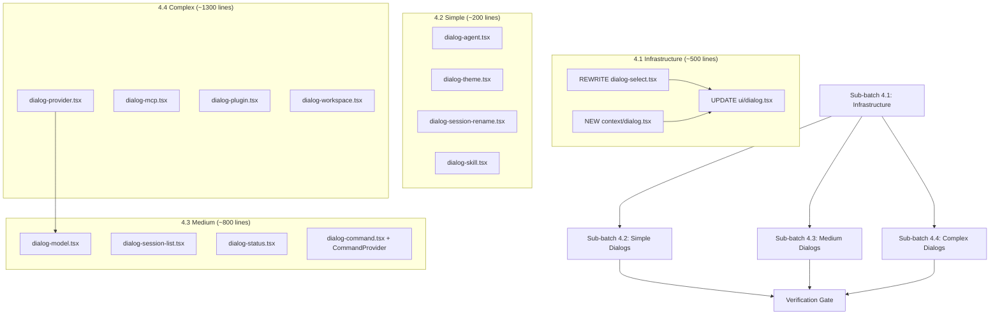

# Phase 2.5 Batch 4: App-Specific Dialogs — Implementation Plan

Port all 13 app-specific dialogs from the **SolidJS source** (`cli/cmd/tui/component/dialog-*.tsx`) to the React-based TUI (`src/tui/components/dialog-*.tsx`).

## User Review Required

> [!IMPORTANT]
> **Critical Prerequisite: `DialogSelect` and `useDialog` must be rewritten.** The current React `DialogSelect` is a 37-line skeleton wrapping `FuzzyPicker`. The SolidJS `DialogSelect` is a **418-line production component** with fuzzy search, categories, keybinds, scroll, mouse support, headers/footers, and `current` selection markers. **Every single dialog in Batch 4 depends on this rich API.** I propose rewriting `DialogSelect` and adding a `useDialog` context as Sub-batch 4.1 before porting any dialogs.

> [!WARNING]
> **SolidJS → React translation patterns are non-trivial.** Key mappings:
> - `createSignal(x)` → `useState(x)`
> - `createMemo(() => ...)` → `useMemo(() => ..., [deps])`
> - `createEffect(on(...))` → `useEffect(() => ..., [deps])`
> - `createResource(fn)` → `useState` + `useEffect` (async fetch pattern)
> - `createStore({...})` → `useState` or `useReducer`
> - `For each={...}` → `{items.map(...)}`
> - `Show when={...}` → `{condition && ...}` or ternary
> - `useKeyboard(handler)` → `useInput(handler)` from `@liteai/ink`
> - `@opentui/core` `TextAttributes.BOLD` → `bold` prop on `<Text>`
> - `@opentui/core` `RGBA` → hex string via theme

## Resolved Questions

> [!NOTE]
> **`dialog-command.tsx` architecture:** Proceeding with **(A)**. We will port `CommandProvider` fully now as infrastructure for Batch 4 + Phase 2.6.
>
> **`dialog-stash.tsx` dependency:** Proceeding with **(B)**. We will defer `dialog-stash.tsx` entirely since stashing is a deferred feature (see deferred_features.md #4).
>
> **`dialog-workspace-list.tsx` scope:** Proceeding with **(A)**. It will be ported in Batch 4 as-is.

---

## Proposed Execution Batches

### Sub-batch 4.1: DialogSelect + useDialog Infrastructure

**Prerequisite for all dialogs.** Port the SolidJS dialog primitives to React.

#### [REWRITE] `src/tui/ui/dialog-select.tsx` (~350 lines)
Replace the 37-line skeleton with a full port of the SolidJS [dialog-select.tsx](file:///c:/Users/aghassan/Documents/workspace/liteai/packages/cli/src/cli/cmd/tui/ui/dialog-select.tsx) (418 lines).

**Full API surface to port:**

```typescript
interface DialogSelectProps<T> {
  title: string
  placeholder?: string
  options: DialogSelectOption<T>[]
  flat?: boolean
  ref?: (ref: DialogSelectRef<T>) => void
  onMove?: (option: DialogSelectOption<T>) => void
  onFilter?: (query: string) => void
  onSelect?: (option: DialogSelectOption<T>) => void
  skipFilter?: boolean
  keybind?: {
    keybind?: KeybindInfo
    title: string
    disabled?: boolean
    onTrigger: (option: DialogSelectOption<T>) => void
  }[]
  current?: T
  header?: React.ReactNode
  footerContent?: React.ReactNode
}

interface DialogSelectOption<T = unknown> {
  title: string
  value: T
  description?: string
  footer?: React.ReactNode | string
  category?: string
  disabled?: boolean
  bg?: string  // hex color (was RGBA)
  gutter?: React.ReactNode
  onSelect?: (ctx: DialogContext) => void
}

type DialogSelectRef<T> = {
  filter: string
  filtered: DialogSelectOption<T>[]
}
```

**Key features to implement:**
1. **Fuzzy search** — `fuzzysort` (already depended on by SolidJS code, confirm in `packages/cli` deps)
2. **Category grouping** — group by `option.category`, display category headers
3. **Keybind actions** — render keybind hints in footer, trigger on matching keypress
4. **Current selection marker** — `●` gutter indicator when `isDeepEqual(option.value, props.current)`
5. **Scroll management** — ScrollBox via `@liteai/ink` with arrow key + pageup/pagedown navigation
6. **Search input** — filter text input at top
7. **Mouse support** — click to select, hover to highlight (if ink supports it)
8. **Theme integration** — use `useTheme()` for all colors

**Adaptations from SolidJS:**
- `createStore({selected, filter, input})` → `useState` or `useReducer`
- `createMemo` for `filtered`, `grouped`, `flat`, `rows` → `useMemo`
- `useKeyboard` → `useInput` from `@liteai/ink`
- `useTerminalDimensions()` → `useStdout()` from `@liteai/ink`
- `RGBA.fromInts()` → hex string or transparent
- `TextAttributes.BOLD` → `<Text bold>`
- `isDeepEqual` from `remeda` — keep as-is
- `Keybind.match/format/parse` → import from `../../cli/util/keybind` or port
- `ScrollBoxRenderable` scrolling → `@liteai/ink` ScrollBox + `useRef`
- `<input>` element → custom text input using `useInput` + controlled state

**Dependencies to add:**
- `fuzzysort` — check if already in `packages/cli/package.json`

---

#### [NEW] `src/tui/context/dialog.tsx` (~150 lines)
Port the SolidJS dialog context ([dialog.tsx](file:///c:/Users/aghassan/Documents/workspace/liteai/packages/cli/src/cli/cmd/tui/ui/dialog.tsx) init/provider/useDialog) as a proper React context.

**Context shape:**
```typescript
type DialogContext = {
  push(element: () => React.ReactNode, onClose?: () => void): void
  pop(): void
  replace(element: () => React.ReactNode, onClose?: () => void): void
  clear(): void
  stack: { element: () => React.ReactNode; onClose?: () => void }[]
  size: 'medium' | 'large'
  setSize(size: 'medium' | 'large'): void
}
```

**Includes:**
- `DialogProvider` component with overlay rendering (absolute positioned dark backdrop + centered panel)
- Escape key handling to pop/clear
- `useDialog()` hook

**Adaptations:**
- `createStore` → `useState` or `useReducer`
- `useKeyboard` → `useInput`
- `useRenderer()` → not needed (no focus management in ink, or use refs)
- `Renderable` focus/blur → not applicable in React/Ink

**Note:** The existing React `Dialog` component (`src/tui/ui/dialog.tsx`) is a visual primitive (Pane + title + input guide). It stays. The new `context/dialog.tsx` is the **stack manager** that wraps `Dialog` in an overlay.

---

#### [UPDATE] `src/tui/ui/dialog.tsx` — Minor updates
- Ensure `Dialog` component works with the new `DialogContext`
- May need to refactor the overlay rendering to be driven by `DialogProvider`

---

### Sub-batch 4.2: Simple Dialogs (4 files, ~200 lines total)

Dialogs with minimal logic — straight conversions from SolidJS to React.

#### [NEW] `src/tui/components/dialog-agent.tsx` (~30 lines)
Direct port of [dialog-agent.tsx](file:///c:/Users/aghassan/Documents/workspace/liteai/packages/cli/src/cli/cmd/tui/component/dialog-agent.tsx) (32 lines).
- `createMemo` → `useMemo`
- `createSignal` → not used
- Context: `useLocal()`, `useDialog()`

#### [NEW] `src/tui/components/dialog-theme.tsx` (~50 lines)
Port of [dialog-theme-list.tsx](file:///c:/Users/aghassan/Documents/workspace/liteai/packages/cli/src/cli/cmd/tui/component/dialog-theme-list.tsx) (51 lines).
- `onCleanup` → `useEffect` return cleanup
- `createMemo` → not used (static computation)
- **Key behavior:** live preview on `onMove` (theme changes as you scroll), reverts `onCleanup` if not confirmed
- Context: `useTheme()`, `useDialog()`

#### [NEW] `src/tui/components/dialog-session-rename.tsx` (~30 lines)
Direct port of [dialog-session-rename.tsx](file:///c:/Users/aghassan/Documents/workspace/liteai/packages/cli/src/cli/cmd/tui/component/dialog-session-rename.tsx) (33 lines).
- Uses `DialogPrompt` primitive (already exists in React)
- Context: `useDialog()`, `useSync()`, `useSDK()`

#### [NEW] `src/tui/components/dialog-skill.tsx` (~35 lines)
Port of [dialog-skill.tsx](file:///c:/Users/aghassan/Documents/workspace/liteai/packages/cli/src/cli/cmd/tui/component/dialog-skill.tsx) (37 lines).
- `createResource` → `useState` + `useEffect` for async fetch
- Context: `useDialog()`, `useSDK()`

---

### Sub-batch 4.3: Medium Dialogs (5 files, ~800 lines total)

Dialogs with moderate state management, keybinds, or async operations.

#### [NEW] `src/tui/components/dialog-model.tsx` (~170 lines)
Port of [dialog-model.tsx](file:///c:/Users/aghassan/Documents/workspace/liteai/packages/cli/src/cli/cmd/tui/component/dialog-model.tsx) (168 lines).
- `createSignal` → `useState`
- `createMemo` × 5 → `useMemo` × 5
- `fuzzysort.go()` — requires `fuzzysort` dependency
- `useConnected()` helper → export as custom hook
- Uses `createDialogProviderOptions()` from `dialog-provider.tsx` — **dependency on Sub-batch 4.4**
- Context: `useLocal()`, `useSync()`, `useDialog()`, `useKeybind()`

> [!WARNING]
> `dialog-model.tsx` imports `createDialogProviderOptions` from `dialog-provider.tsx`. Since dialog-provider is a complex dialog (Sub-batch 4.4), we have a dependency. Two options: (1) port `createDialogProviderOptions` early as a shared util, or (2) temporarily stub it. I recommend (1).

#### [NEW] `src/tui/components/dialog-session-list.tsx` (~110 lines)
Port of [dialog-session-list.tsx](file:///c:/Users/aghassan/Documents/workspace/liteai/packages/cli/src/cli/cmd/tui/component/dialog-session-list.tsx) (110 lines).
- `createResource(search, fn)` → `useState` + `useEffect` with debounce
- `createDebouncedSignal` → custom `useDebouncedState` or inline `setTimeout`
- Delete confirmation pattern (double-press keybind)
- Context: `useDialog()`, `useRoute()`, `useSync()`, `useKeybind()`, `useTheme()`, `useSDK()`, `useKV()`

#### [NEW] `src/tui/components/dialog-status.tsx` (~120 lines)
Port of [dialog-status.tsx](file:///c:/Users/aghassan/Documents/workspace/liteai/packages/cli/src/cli/cmd/tui/component/dialog-status.tsx) (118 lines).
- **Not a DialogSelect** — this is a custom layout (box-based, not a list picker)
- `For each` → `.map()`
- `Show when` → conditional rendering
- `Switch/Match` → ternary or switch expression
- `TextAttributes.BOLD` → `<Text bold>`
- `@opentui/core` `RGBA` color refs → theme hex strings
- Context: `useSync()`, `useTheme()`, `useDialog()`

#### [NEW] `src/tui/components/dialog-command.tsx` (~150 lines)
Port of [dialog-command.tsx](file:///c:/Users/aghassan/Documents/workspace/liteai/packages/cli/src/cli/cmd/tui/component/dialog-command.tsx) (148 lines).
- **Includes `CommandProvider` context** — React context with `register()`, `trigger()`, `slashes()`, `keybinds()`, `show()`, `suspended()`
- `useKeyboard` → `useInput` for global keybind matching
- `createSignal<Accessor<CommandOption[]>[]>` → `useState<(() => CommandOption[])[]>`
- `onCleanup` → `useEffect` cleanup for deregistration
- Context: `useDialog()`, `useKeybind()`

#### [NEW] `src/tui/components/dialog-stash.tsx` — **DEFERRED**
Depends on `usePromptStash()` which is a deferred feature. See deferred_features.md #4.

---

### Sub-batch 4.4: Complex Dialogs (3 files, ~1,300 lines total)

Large dialogs with multi-screen flows, async operations, and nested dialog navigation.

#### [NEW] `src/tui/components/dialog-mcp.tsx` (~300 lines)
Port of [dialog-mcp.tsx](file:///c:/Users/aghassan/Documents/workspace/liteai/packages/cli/src/cli/cmd/tui/component/dialog-mcp.tsx) (298 lines).
- **3 sub-components:** `DialogMcp` (list), `McpDetail` (detail view), `McpToolsList` (tool list)
- `createResource` → `useState` + `useEffect`
- `Keybind.parse("space")` → import keybind parsing
- Nested dialog navigation: `dialog.push(() => <McpDetail .../>)` → uses `useDialog().push()`
- Custom `<Status>` sub-component with conditional theme colors
- Context: `useLocal()`, `useSync()`, `useSDK()`, `useDialog()`, `useTheme()`

#### [NEW] `src/tui/components/dialog-provider.tsx` (~365 lines)
Port of [dialog-provider.tsx](file:///c:/Users/aghassan/Documents/workspace/liteai/packages/cli/src/cli/cmd/tui/component/dialog-provider.tsx) (363 lines).
- **5 sub-components:** `DialogProvider`, `AutoMethod`, `CodeMethod`, `ApiMethod`, + `createDialogProviderOptions` shared helper
- Multi-step OAuth flow: provider selection → auth method selection → code/auto/api input → callback → model selection
- `Clipboard.copy()` → port or use `navigator.clipboard` equivalent
- `Link` component import → check if exists, otherwise port
- Deeply nested `dialog.replace()` chains for wizard-like flow
- Context: `useSync()`, `useSDK()`, `useDialog()`, `useTheme()`, `useToast()`

#### [NEW] `src/tui/components/dialog-plugin.tsx` (~630 lines)
Port of [dialog-plugin.tsx](file:///c:/Users/aghassan/Documents/workspace/liteai/packages/cli/src/cli/cmd/tui/component/dialog-plugin.tsx) (632 lines).
- **Largest dialog. 7 sub-components** across 4 tabs: Discover, Installed, Marketplaces, Errors
- Tab cycling via arrow keys
- `createResource` × 4 for async data fetching
- `Keybind.parse()` for custom keybinds (space, delete, u)
- Nested confirm dialogs (RemoveMarketplaceDialog, AddMarketplaceDialog)
- Context: `useSDK()`, `useDialog()`, `useTheme()`

#### [NEW] `src/tui/components/dialog-workspace.tsx` (~340 lines)
Port of [dialog-workspace-list.tsx](file:///c:/Users/aghassan/Documents/workspace/liteai/packages/cli/src/cli/cmd/tui/component/dialog-workspace-list.tsx) (336 lines).
- **2 sub-components:** `DialogWorkspaceList`, `DialogWorkspaceCreate`
- `openWorkspace()` helper with retry loop and `Bun.sleep`
- Direct `createLiteaiClient()` instantiation for cross-workspace SDK calls
- Session count loading via parallel `Promise.all`
- `createEffect` with run counter for stale data prevention → `useEffect` with `useRef` counter
- Nested delegation to `DialogSessionList` (from workspace-specific subdirectory)
- Context: `useDialog()`, `useRoute()`, `useSync()`, `useSDK()`, `useToast()`, `useKeybind()`

---

## Shared Dependencies to Check/Add

| Dependency | Used By | Status |
|---|---|---|
| `fuzzysort` | `dialog-model.tsx`, `DialogSelect` | Check `packages/cli/package.json` |
| `remeda` | Multiple dialogs (pipe, entries, map, etc.) | Already in monorepo |
| `@liteai/core/util/locale` | `dialog-session-list.tsx`, `dialog-stash.tsx` | Already available |
| `@liteai/sdk` (`createLiteaiClient`) | `dialog-workspace.tsx` | Already available |
| `../../../util/keybind` (`Keybind` class) | `dialog-command.tsx`, `dialog-mcp.tsx`, `dialog-plugin.tsx` | Already exists at `cli/util/keybind.ts` |

---

## SolidJS → React Translation Reference

| SolidJS | React | Notes |
|---|---|---|
| `createSignal(x)` | `useState(x)` | |
| `createMemo(() => ...)` | `useMemo(() => ..., [deps])` | Must specify deps |
| `createEffect(() => ...)` | `useEffect(() => ..., [deps])` | Must specify deps |
| `createEffect(on(source, fn))` | `useEffect(() => fn(source), [source])` | |
| `createResource(fn)` | `useState + useEffect` | Or `useSWR`/`useQuery` if available |
| `createStore({...})` | `useState({...})` or `useReducer` | |
| `batch(() => {...})` | Not needed (React batches by default in React 18+) | |
| `onCleanup(() => ...)` | `useEffect(() => () => cleanup, [])` | Return from useEffect |
| `onMount(() => ...)` | `useEffect(() => ..., [])` | Empty deps |
| `For each={items}` | `{items.map(item => ...)}` | Add `key` prop |
| `Show when={x}` | `{x && ...}` or `{x ? a : b}` | |
| `Switch/Match` | Ternary chain or helper | |
| `useKeyboard(handler)` | `useInput(handler)` | Different signature |
| `TextAttributes.BOLD` | `<Text bold>` | |
| `RGBA.fromInts(r,g,b,a)` | `"transparent"` or hex string | |
| `useTerminalDimensions()` | `useStdout()` → `{columns, rows}` | |

---

## Implementation Order



Each sub-batch passes `bun typecheck` and `bun lint:fix` before proceeding.

---

## File Inventory Summary

| Sub-batch | Files | Est. LOC | Complexity |
|---|---|---|---|
| 4.1 Infrastructure | 3 (rewrite + new + update) | ~500 | High (core primitive) |
| 4.2 Simple Dialogs | 4 | ~200 | Low |
| 4.3 Medium Dialogs | 4 | ~800 | Medium |
| 4.4 Complex Dialogs | 4 | ~1,300 | High |
| **Total** | **15** | **~2,800** | |

**Deferred:** `dialog-stash.tsx` (blocked on `usePromptStash()` — see deferred_features.md #4)

---

## Verification Plan

### Automated Tests
- `bun typecheck` after each sub-batch — zero tolerance for type errors
- `bun lint:fix` after each sub-batch — Biome compliance
- Confirm zero `as any` casts
- Confirm zero SolidJS remnants (`createSignal`, `createMemo`, `createEffect`, `@opentui/core`, `@opentui/solid`)
- Confirm zero React Compiler `$[n]` artifacts

### Manual Verification
- Verify all dialog components import from `@liteai/ink` (not `@opentui/core`)
- Verify `useDialog()` context provides `push`/`pop`/`replace`/`clear`/`setSize`
- Verify `DialogSelect` supports all SolidJS API features (fuzzy search, categories, keybinds, scroll)
- Verify dialog-model → dialog-provider flow compiles (cross-dialog dependency)
- Verify dialog-workspace → dialog-session-list delegation works
- Verify dialog-mcp nested navigation (list → detail → tools) compiles

**Shall I proceed with implementation starting at Sub-batch 4.1?**
