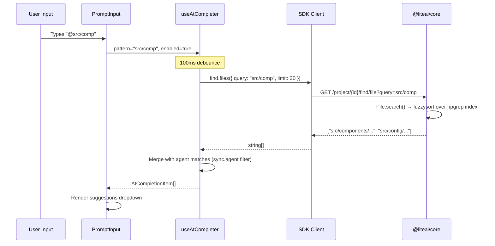
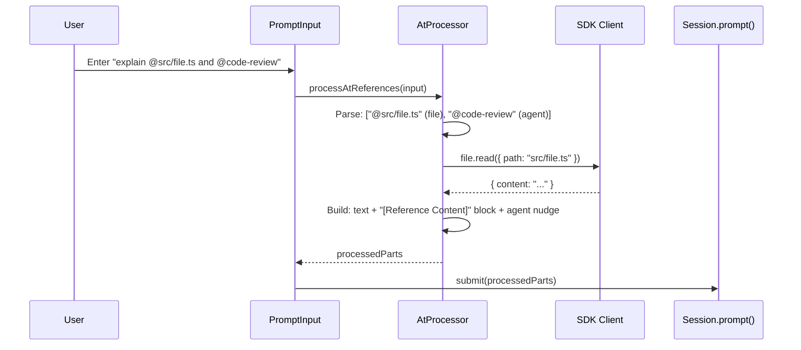
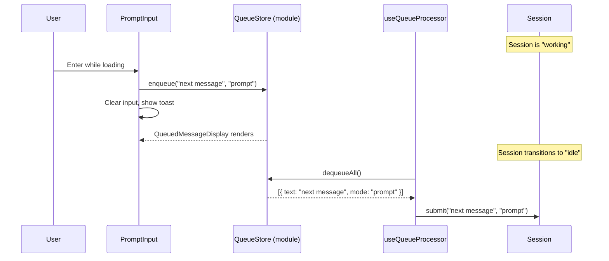

# Phase 3.3: Input Productivity — Analysis & Design Decisions

**Status**: Approved  
**Date**: 2026-05-01  
**Scope**: `@` file/agent/MCP completion, submit-time `@` content injection, message queuing  

---

## 1. Competitive Feature Matrix

### 1.1 @ File/Agent Completion

| Capability | Claude Code | Gemini CLI | LiteAI Decision |
|---|---|---|---|
| **@ file path fuzzy search** | `fileSuggestions.ts` (812 LOC). Background index via `git ls-files` + ripgrep. 50ms debounce. Nucleo-based fuzzy. | `useAtCompletion.ts` (480 LOC). `AsyncFzf` fuzzy. useReducer state machine. 100ms debounce. | **SDK-routed**. File index lives in `@liteai/core` (`File.search()` → fuzzysort + ripgrep). SDK endpoint `GET /project/{projectID}/find/file` already exists. No client-side index duplication. 100ms debounce. |
| **@ agent mentions** | Inline in `useTypeahead.tsx`. Reads `agentNameRegistry` + `teamContext.teammates`. | `buildAgentCandidates()` reads `agentRegistry.getAllDefinitions()`. | **Client-side filter**. `sync.agent` is already in-memory from bootstrap. Local fuzzysort match — no HTTP round-trip. |
| **@ MCP resource mentions** | Merged via `mcpResources` from app state. | `buildResourceCandidates()` reads `resourceRegistry.getAllResources()`. `serverName:uri` format. | **Client-side filter**. `sync.mcp_resource` already in-memory. Keyed by `serverName:uri`. |
| **Grouped/categorized suggestions** | Unified list with type badges. No section headers. | Section titles with `-- Section --` headers. `commandKind` badges. | **Sectioned with badges**. Three sections: Files, Agents, Resources. Category tag in `SuggestionItem.tag`. |
| **Directory drill-down** | `applyDirectorySuggestion()` appends `/` and re-triggers. | Not implemented. | **Implement**. On Tab for directory item, append `/` and re-search. |
| **Quoted paths with spaces** | `@"my file with spaces.txt"` via `isQuoted` flag. | Escaped paths via `escapePath()`. | **Implement**. Detect `@"partial` pattern. Strip quotes before search, re-wrap on apply. |
| **Inline ghost text** | Sync memo for `/commands` + async bash history. | Dropdown only for `@`. | **Dropdown only for `@`**. Existing ghost text remains for `/commands` only. |
| **Index pre-warming** | `startBackgroundCacheRefresh()` on mount. Git mtime tracking. | `INITIALIZING` state on first `@`. | **Already done**. `File.init()` in `@liteai/core` pre-warms the ripgrep index on instance boot. |

### 1.2 Submit-Time @ Content Injection

| Capability | Claude Code | Gemini CLI | LiteAI Decision |
|---|---|---|---|
| **@ processing on submit** | `atCommandProcessor.ts` (785 LOC). Parses `@path`, reads files via `ReadManyFilesTool`, injects content inline. | `handleAtCommand()` (785 LOC). Same pattern. Categories: file, agent, resource. | **Implement client-side preprocessor**. Before submit, parse all `@path` references, read files via `sdk.client.project.file.read()`, inject content as `[Reference Content]` blocks in the prompt text. |
| **Agent @ routing** | `@agent` detected → nudge inserted for tool delegation. | Same: agent nudge inserted. | **Implement**. Detect `@agentName`, insert system nudge. |
| **MCP @ reading** | MCP resources read via server's `resources/read`. | Same via `mcpClientManager.getClient()`. | **Defer to Phase 4**. MCP resource reading requires server-side orchestration; file and agent @ are sufficient for parity. |
| **Ignored file reporting** | Checks `.gitignore`, `.claudeignore`. Reports skipped files. | Checks `.gitignore`, `.geminiignore`. Reports skipped. | **Not needed**. `File.read()` already handles access control. |

### 1.3 Message Queuing

| Capability | Claude Code | Gemini CLI | LiteAI Decision |
|---|---|---|---|
| **Store architecture** | `messageQueueManager.ts` — module-level store. `useSyncExternalStore`. Priority levels (`now`, `next`, `later`). | `useMessageQueue.ts` — React state. Simple array. | **Module-level store** (Claude pattern). `useSyncExternalStore` avoids React batching delays. Single FIFO (no priority tiers — LiteAI doesn't need agent task routing). |
| **Queue trigger** | Enter while busy queues. Tab for agent tasks. | Enter while busy queues. | **Enter while busy + Tab** (Claude pattern). Enter for text prompts, Tab for quick-queue with visual indicator. |
| **Queue display** | `PromptInputQueuedCommands.tsx`. Full `<Message>` rendering with markdown. Caps at 3 + overflow. | `QueuedMessageDisplay.tsx`. Dim text preview, max 3 visible, `(+N more)` overflow. | **Gemini-style lightweight**. Dim single-line previews. Max 3 visible. `(+N more)` overflow. No full markdown rendering (queue items are ephemeral). |
| **Queue processing** | `queueProcessor.ts`. Priority-ordered. Slash/bash individual. Same-mode batched. | `useEffect` on idle. Joins all with `\n\n`. | **Batch on idle**. When session transitions to `idle`, dequeue all, join with `\n\n`, submit. |
| **Queue clearing** | `Ctrl+C` clears queue. | `clearQueue()` available. | **Ctrl+C clears queue** (when queue is non-empty and not loading). Toast feedback. |

---

## 2. Architectural Decision Records

### ADR-1: @ Completion Hook — Separate Modular Hook (Gemini Pattern)

**Context**: Both Claude and Gemini implement `@` completion. Claude uses a monolithic 1400-line `useTypeahead.tsx` that handles both `/` commands and `@` completions in one hook. Gemini keeps `useAtCompletion.ts` as a separate hook with a clean reducer state machine.

**Considered Alternatives**:

| # | Alternative | Pros | Cons |
|---|---|---|---|
| A | **Separate hook** (`use-at-completer.ts`) | Clean separation from existing `/command` system. Testable state machine. Matches codebase modular style. | Two suggestion sources need coordination in `PromptInput`. |
| B | **Extend `use-command-suggestions.ts`** | Single suggestion source. No coordination needed. | Monolithic growth. Command suggestions use `Fuse.js`; file search uses SDK HTTP. Mixing sync/async in one hook. Harder to test. |
| C | **Monolithic typeahead** (Claude pattern) | Single render path. | 1400+ lines. Violates codebase norms. Anti-pattern for maintenance. |

**Decision**: **Alternative A — Separate hook**.

**Rationale**: LiteAI already has a clean split: `use-command-suggestions.ts` for `/commands` and `use-slash-suggestion.ts` for ghost text. Adding `use-at-completer.ts` as a third modular hook follows the established pattern. The coordination in `PromptInput` is trivial: `@` completer takes priority when active, otherwise `/command` suggestions apply.

---

### ADR-2: File Search — SDK-Routed (No Client-Side Index)

**Context**: Claude builds a client-side file index using `git ls-files` + ripgrep + nucleo. Gemini uses `FileSearchFactory` with a local watcher. LiteAI's architecture is client-server: the CLI communicates with `@liteai/core` over local HTTP.

**Considered Alternatives**:

| # | Alternative | Pros | Cons |
|---|---|---|---|
| A | **Client-side index** (spawn ripgrep from CLI process) | Zero network latency. Full control over indexing. | Duplicates `@liteai/core`'s `File.search()` which already uses fuzzysort + ripgrep. Two competing index processes. |
| B | **SDK HTTP call** to existing `File.search()` | Zero duplication. Index already pre-warmed on server boot. Single source of truth. | ~1-5ms local HTTP round-trip (imperceptible with 100ms debounce). |

**Decision**: **Alternative B — SDK HTTP call**.

**Rationale**: The endpoint `GET /project/{projectID}/find/file` already exists. The SDK method `sdk.client.project.find.files()` is already generated. `File.search()` in `@liteai/core` already handles fuzzysort matching over a ripgrep-populated cache with 100K file cap. Pre-warming happens on instance boot (`File.init()`). Building a second client-side index is pure waste.

---

### ADR-3: Message Queue — Module-Level Store (Claude Pattern, Simplified)

**Context**: Two patterns observed. Claude uses a module-level store with `useSyncExternalStore` for zero-latency updates across components. Gemini uses React state (`useState`) inside a hook.

**Considered Alternatives**:

| # | Alternative | Pros | Cons |
|---|---|---|---|
| A | **React state** (Gemini pattern) | Simple. No external store. | React batching can delay queue visibility. Stale closures in keyboard handlers. Multiple consumers need prop-drilling or context. |
| B | **Module-level store** + `useSyncExternalStore` (Claude pattern) | Immediate mutation visibility. Shared across all consumers without context. No stale closures. | Slightly more code. Module-level state is a singleton (fine for CLI — single instance). |
| C | **Zustand store** | Familiar API. Built-in `subscribe`. | Over-engineering for a simple FIFO queue. Adds dependency for 50 lines of state. |

**Decision**: **Alternative B — Module-level store** (simplified from Claude).

**Rationale**: Queue mutations happen from keyboard event handlers that execute outside React's render cycle. `useSyncExternalStore` guarantees tear-free reads. The queue is consumed by three components: `PromptInput` (enqueue on Enter), `QueuedMessageDisplay` (render), and `useQueueProcessor` (dequeue on idle). A module-level store cleanly serves all three without prop-drilling.

**Simplifications over Claude**: No priority tiers. No agent routing (`agentId`). No batch vs. individual processing modes. Single FIFO with `enqueue()`, `dequeueAll()`, `clear()`.

---

### ADR-4: Submit-Time @ Processing — Client-Side Preprocessor

**Context**: Both Claude and Gemini process `@path` references at submit time. They parse the input, read file contents, and inject them into the prompt. This happens before the prompt reaches the LLM.

**Considered Alternatives**:

| # | Alternative | Pros | Cons |
|---|---|---|---|
| A | **Client-side preprocessor** in `session.submit()` | Files are read via existing `sdk.client.project.file.read()`. User sees processing status. No core changes. | Adds ~100ms latency on submit for file reading. |
| B | **Server-side preprocessor** in `@liteai/core` session prompt handler | Single processing point. Works for all clients (CLI, web, VSCode). | Requires core changes. More complex — core needs to understand `@` syntax. Breaks separation of concerns (@ is a UI convention). |

**Decision**: **Alternative A — Client-side preprocessor**.

**Rationale**: `@` is a UI/input convention, not a protocol concept. Processing it client-side keeps core clean. The file read calls use existing SDK methods. The ~100ms latency is imperceptible since the user just hit Enter. Both Claude and Gemini do this client-side.

---

## 3. Data Flow Diagrams

### 3.1 @ Completion Flow

### 3.2 Submit-Time @ Processing Flow

### 3.3 Message Queue Flow

---

## 4. Source References

| Component | Reference Source | Key File(s) |
|---|---|---|
| @ completion state machine | Gemini CLI | `useAtCompletion.ts` (480 LOC) |
| @ token extraction regex | Claude Code | `useTypeahead.tsx:extractCompletionToken` |
| Submit-time @ processing | Claude Code + Gemini CLI | `atCommandProcessor.ts` (785 LOC), `handleAtCommand()` |
| Message queue store | Claude Code | `messageQueueManager.ts`, `useSyncExternalStore` pattern |
| Queue display | Gemini CLI | `QueuedMessageDisplay.tsx` (51 LOC) |
| Queue processing | Gemini CLI | `useMessageQueue.ts:useEffect` on idle transition |
| File search backend | LiteAI (existing) | `@liteai/core/file/index.ts:File.search()` |
| SDK file search | LiteAI (existing) | `sdk.gen.ts:Find2.files()` → `GET /project/{id}/find/file` |
