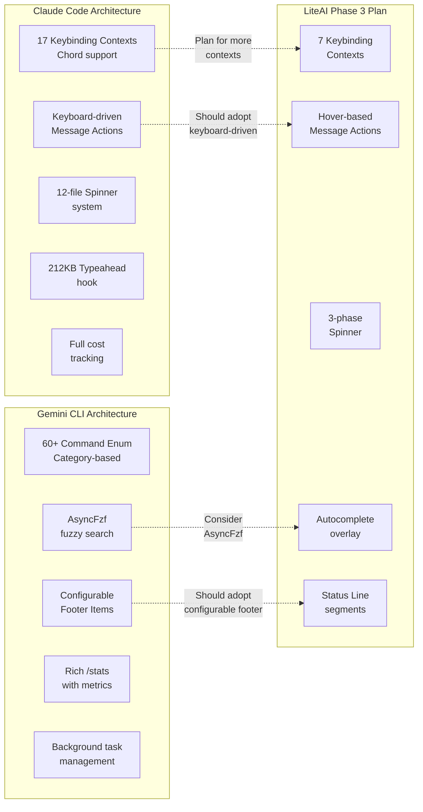

# Phase 3 Critical UX — Feature Comparison: Claude Code vs Gemini CLI

> Cross-reference analysis of the Phase 3 plan against actual implementations in `D:\claude-code` (source of the plan) and `D:\gemini-cli\packages\cli` (additional comparison).

---

## Legend

| Symbol | Meaning |
|--------|---------|
| ✅ | Feature exists in the codebase |
| ⚠️ | Partially implemented / simpler approach |
| ❌ | Not present |
| 🔷 | Feature present but architecturally different from our plan |

---

## Phase 3.0: Session Information Layer

| Feature | Claude Code | Gemini CLI | LiteAI Plan |
|---------|-------------|------------|--------------|
| **Cost Tracking** | ✅ Full cost tracker ([cost-tracker.ts](file:///D:/claude-code/src/cost-tracker.ts)) with per-model USD cost breakdown, session persistence, total cost formatting, and model usage aggregation. `useCostSummary` hook prints cost on exit. | ❌ No cost tracking (Google's API is free-tier/subscription-based, not per-token billing) | Planned `useSessionStats.totalCost` |
| **Token Tracking** | ✅ Detailed: input, output, cache read, cache write, web search tokens — all tracked per-model in `ModelUsage`. Accumulated via `addToTotalSessionCost()`. | ✅ Rich: [StatsDisplay.tsx](file:///D:/gemini-cli/packages/cli/src/ui/components/StatsDisplay.tsx) shows per-model breakdown table with requests, input/output/cached tokens. `useSessionStats` hook. Per-role sub-breakdown (main, agent, etc.) | Planned `useSessionStats.totalTokens` |
| **Context Utilization %** | ✅ `getContextWindowForModel()` returns model limit. `TokenWarning` computes `percentLeft` via `calculateTokenWarningState()`. Reactive mode shows `"X% context used"`. | ✅ [ContextUsageDisplay.tsx](file:///D:/gemini-cli/packages/cli/src/ui/components/ContextUsageDisplay.tsx) — `getContextUsagePercentage(promptTokenCount, model)` displayed in footer as `"X% used"` with color thresholds (warning at compression threshold, error at 100%). | Planned `contextUtilization` field |
| **StatusLine Segments** | ✅ [StatusLine.tsx](file:///D:/claude-code/src/components/StatusLine.tsx) (49KB!) — Model, context %, cost, mode, vim mode, status. Full implementation of all segments in our plan. | ✅ [Footer.tsx](file:///D:/gemini-cli/packages/cli/src/ui/components/Footer.tsx) (14KB) — **Configurable footer items**: workspace, git-branch, sandbox, model-name, context-used, quota, memory-usage, session-id, auth, code-changes, token-count. Items are **user-configurable** via `settings.ui.footer.items` array. Width-fitting logic drops lower-priority items when terminal is narrow. | Planned `status-line.tsx` segments |
| **Token Warning** | ✅ [TokenWarning.tsx](file:///D:/claude-code/src/components/TokenWarning.tsx) — Warning at threshold, error at critical. Supports auto-compact label, reactive mode, collapse mode (live progress via `useSyncExternalStore`). Upgrade message for model context window. | ⚠️ Color change only in footer `ContextUsageDisplay` (yellow at threshold, red at 100%). No explicit warning banner or recovery hints. | Planned `token-warning.tsx` with threshold-based warnings |
| **Compact/Compaction Summary** | ✅ [CompactSummary.tsx](file:///D:/claude-code/src/components/CompactSummary.tsx) — Shows "Summarized conversation" with metadata (messages summarized, direction, user context). Toggle to expand history (Ctrl+O). Transcript mode shows full text. | ❌ Gemini uses "compress" command ([compressCommand.ts](file:///D:/gemini-cli/packages/cli/src/ui/commands/compressCommand.ts)) but no inline compaction summary renderer. | Planned `compact-summary.tsx` |
| **`/cost` Command** | ✅ Implicit — `formatTotalCost()` in cost-tracker.ts, shown via `Stats.tsx` component (152KB). Per-model cost table. | ✅ `/stats` command → [StatsDisplay.tsx](file:///D:/gemini-cli/packages/cli/src/ui/components/StatsDisplay.tsx) shows full session stats: tool calls, success rate, user agreement, code changes, API/tool time breakdown, per-model usage table. **Much richer than our plan**. | Planned `/cost` modal |
| **`/compact` Command** | ✅ Built-in — triggers `summarize` command with auto-compact logic. | ✅ `/compress` command triggers context compression. | Planned `/compact` |

### Key Findings — Phase 3.0

> [!IMPORTANT]
> **Gemini's Footer is user-configurable** — users can pick which items show in the footer via `settings.ui.footer.items`. This is a pattern we should consider adopting. Our StatusLine is currently hardcoded.

> [!TIP]
> **Gemini's `/stats` is significantly richer** than our planned `/cost` — it includes tool call success rates, user agreement rates, code change diffs (+/-), and wall time vs API time vs tool time breakdown. Consider expanding our `/cost` scope.

---

## Phase 3.1: Message Interaction Layer

| Feature | Claude Code | Gemini CLI | LiteAI Plan |
|---------|-------------|------------|--------------|
| **Thinking Toggle** | ✅ [ThinkingToggle.tsx](file:///D:/claude-code/src/components/ThinkingToggle.tsx) — Full toggle dialog (Enabled/Disabled select, mid-conversation warning, configurable keybinding `alt+t`). **Not per-message collapse** — it's a session-level toggle dialog. | ❌ No thinking toggle (Gemini models don't expose thinking/reasoning tokens the same way) | Planned per-message collapsible thinking blocks + global toggle |
| **Message Actions (hover bar)** | ✅ [messageActions.tsx](file:///D:/claude-code/src/components/messageActions.tsx) — Full message action system with keyboard navigation (`shift+↑` to enter, `j`/`k` to navigate, `c` to copy, `p` to copy primary input, `enter` to expand/edit). **Not hover-based** — uses keyboard cursor mode. `MessageActionsBar` footer shows applicable actions. `MessageActionsSelectedContext` for background highlighting. | ❌ No message-level actions. Gemini has `/copy` command ([copyCommand.ts](file:///D:/gemini-cli/packages/cli/src/ui/commands/copyCommand.ts)) that copies the last response to clipboard. | Planned hover-based action bar (📋 copy, ↻ retry) |
| **Clipboard Copy** | ✅ OSC-52 clipboard via `useClipboardImageHint`, `useCopyOnSelect` hooks, plus platform fallbacks. Copy integrated into message actions. | ✅ `/copy` slash command copies last response. Also has `F9` toggle copy mode with text selection. | Planned `use-clipboard.ts` with OSC-52 |
| **Error Recovery Actions** | ✅ Contextual in `Message.tsx` — error messages show recovery hints. Auto-compact suggests `/compact`. | ❌ No specific error recovery actions on messages. | Planned context-specific recovery hints |
| **Message Retry** | ✅ Via message actions — `enter` on user messages triggers "edit" (re-sends). | ❌ No message retry. | Planned retry on failed messages |

### Key Findings — Phase 3.1

> [!IMPORTANT]
> **Claude Code uses keyboard-driven message navigation, NOT hover-based.** This is architecturally different from our plan. In a terminal TUI, hover is not a natural interaction — Claude's `shift+↑` to enter cursor mode, `j/k` navigation, `c/p/enter` actions is the correct TUI pattern. **We should adopt keyboard navigation instead of hover for message actions.**

> [!TIP]
> Claude's message action system has a `stays` flag on actions — enter on grouped_tool_use/collapsed items toggles expand/collapse without leaving cursor mode. This is elegant for tool output inspection.

---

## Phase 3.2: Active Operation UX

| Feature | Claude Code | Gemini CLI | LiteAI Plan |
|---------|-------------|------------|--------------|
| **Rich Spinner** | ✅ [Spinner/](file:///D:/claude-code/src/components/Spinner) (entire directory, 12 files): `SpinnerAnimationRow.tsx` (42KB), `SpinnerGlyph.tsx`, `ShimmerChar.tsx`, `FlashingChar.tsx`, `GlimmerMessage.tsx` (26KB), `TeammateSpinnerLine.tsx` (38KB), `TeammateSpinnerTree.tsx` (28KB). Plus `useStalledAnimation.ts` and `useShimmerAnimation.ts`. **Massively more complex** than our plan. | ✅ [LoadingIndicator.tsx](file:///D:/gemini-cli/packages/cli/src/ui/components/LoadingIndicator.tsx) + [GeminiRespondingSpinner.tsx](file:///D:/gemini-cli/packages/cli/src/ui/components/GeminiRespondingSpinner.tsx). Shows elapsed time, cancel hint, thought subject, witty phrases. Supports inline and block modes. Responsive layout (narrow terminals). | Planned dots → shimmer → "still working" phases |
| **Stalled Detection** | ✅ [useStalledAnimation.ts](file:///D:/claude-code/src/components/Spinner/useStalledAnimation.ts) — Stall detection after 3s of no new tokens. Smooth intensity fade over 2s. Driven by animation clock (slows when terminal blurred). Active tool detection suppresses stall indicator. Reduced motion support. | ❌ No explicit stall detection. Timer shows seconds but no "stalled" warning. | Planned 30s configurable stall timeout |
| **Elapsed Time** | ✅ [useElapsedTime.ts](file:///D:/claude-code/src/hooks/useElapsedTime.ts) — `useSyncExternalStore`-based hook. Supports `endTime` for completed tasks (prevents showing "32m" for a 2m task viewed later). Configurable interval. Pause duration subtraction. | ✅ `LoadingIndicator` shows `elapsedTime` prop formatted as seconds or `formatDuration`. [useTimer.ts](file:///D:/gemini-cli/packages/cli/src/ui/hooks/useTimer.ts) hook tracks elapsed time. | Planned `use-elapsed-time.ts` |
| **Tool Progress Timing** | ✅ Shown via `ToolUseLoader.tsx` and `AgentProgressLine.tsx` (14KB). | ⚠️ [ToolStatsDisplay.tsx](file:///D:/gemini-cli/packages/cli/src/ui/components/ToolStatsDisplay.tsx) shows tool stats after the fact, not live timing during execution. | Planned elapsed/completion time per tool |
| **Subagent Tree** | ✅ `TeammateSpinnerTree.tsx` (28KB) + `TeammateSpinnerLine.tsx` (38KB) — Full tree rendering for agent/teammate progress. `CoordinatorAgentStatus.tsx` (36KB) for coordinator view. | ❌ No subagent tree (Gemini CLI uses a simpler agent architecture). Has `BackgroundTaskDisplay.tsx` for background tasks. | Planned `subagent-tree.tsx` |

### Key Findings — Phase 3.2

> [!WARNING]
> **Claude's Spinner system is an order of magnitude more complex** than our plan suggests. The full directory is 12 files totaling ~170KB of compiled code. We should start simpler but plan for extensibility.

> [!TIP]
> Claude's `useStalledAnimation` uses animation-clock-driven timing rather than `setInterval` — this means stall detection automatically slows when the terminal is blurred/backgrounded. This is a superior pattern we should adopt.

---

## Phase 3.3: Input Productivity

| Feature | Claude Code | Gemini CLI | LiteAI Plan |
|---------|-------------|------------|--------------|
| **Autocomplete Overlay** | ✅ [useTypeahead.tsx](file:///D:/claude-code/src/hooks/useTypeahead.tsx) (212KB!) — Massive typeahead system. Slash command suggestions, `@mention` (files, resources, agents, teammates, sessions), directory completion, `#channel` Slack MCP suggestions, shell history ghost text. Fuzzy matching via `fuzzysort`. Debounced file scanning. Mid-input slash command ghost text. Shell mode shell completions. | ✅ [useSlashCompletion.ts](file:///D:/gemini-cli/packages/cli/src/ui/hooks/useSlashCompletion.ts) (19KB) — Slash command fuzzy completion via `AsyncFzf`. Hierarchical sub-command navigation. Argument completion with async provider. [useAtCompletion.ts](file:///D:/gemini-cli/packages/cli/src/ui/hooks/useAtCompletion.ts) (13KB) for `@` file completion. [useCommandCompletion.tsx](file:///D:/gemini-cli/packages/cli/src/ui/hooks/useCommandCompletion.tsx) (14KB) unifies completions. [SuggestionsDisplay.tsx](file:///D:/gemini-cli/packages/cli/src/ui/components/SuggestionsDisplay.tsx) renders the overlay. | Planned `autocomplete-overlay.tsx` |
| **File Path Completion** | ✅ `fileSuggestions.ts` (27KB) — Background index build on mount, `onIndexBuildComplete` subscriber, longest common prefix, directory/path completion. Respects `.gitignore`. `unifiedSuggestions.ts` merges file + MCP resources + agents. | ✅ `useAtCompletion.ts` — File completion triggered by `@`, debounced. | Planned `use-file-completer.ts` |
| **@ Mentions** | ✅ Files, MCP resources, agents (subagents), teammates (swarm), sessions. Quoted paths for spaces (`@"my file.ts"`). | ✅ `@` files only. | Planned @ mentions for sessions, files, agents |
| **Slash Command Suggestions** | ✅ Inline ghost text + dropdown overlay. Command argument hints. Progressive argument display. | ✅ Fuzzy search with `AsyncFzf`. Sub-command hierarchy navigation. Argument completion via async providers. Section grouping in suggestions. | Planned via existing `use-command-suggestions.ts` |
| **Shell Completions** | ✅ `getShellCompletions()` for bash mode — variable completion, command completion, path completion. Shell history ghost text via `getShellHistoryCompletion()`. | ✅ [useShellCompletion.ts](file:///D:/gemini-cli/packages/cli/src/ui/hooks/useShellCompletion.ts) (17KB) — Shell completions in `!` mode. Separate hook for shell history. | Not planned (we don't have shell mode) |
| **Input History** | ✅ `useArrowKeyHistory.tsx` (34KB) — Arrow key history navigation, history search via `useHistorySearch`. | ✅ `useInputHistory.ts` (4KB) + `useInputHistoryStore.ts` (3KB) — Persistent history storage, arrow key navigation, reverse search. | Existing (partial) |
| **Reverse History Search** | ✅ `HistorySearchDialog.tsx` (19KB) — Ctrl+R reverse search. | ✅ `useReverseSearchCompletion.tsx` — Ctrl+R search with inline display. | Not planned |
| **Queued Messages** | ✅ `PromptInputQueuedCommands.tsx` (19KB) — Queue messages while agent is busy (Tab to queue). | ✅ `QueuedMessageDisplay.tsx` — Tab to queue while busy. `useMessageQueue.ts` hook. | Deferred in our plan |

### Key Findings — Phase 3.3

> [!IMPORTANT]
> **Both Claude and Gemini have reverse history search (`Ctrl+R`)** — this is a must-have feature we haven't planned for. Terminal users expect this from shell muscle memory.

> [!TIP]
> **Gemini's `AsyncFzf` approach** for slash command fuzzy search is cleaner than Claude's synchronous `fuzzysort` — it won't block the event loop on large command sets. Our plan mentions `fuzzysort` but we should evaluate `fzf` as well.

> [!WARNING]
> **Gemini has message queuing** (Tab to queue a message while agent is busy) — listed as deferred in our plan but present in both competitors. This is a significant UX gap.

---

## Phase 3.4: Keybinding & Help System

| Feature | Claude Code | Gemini CLI | LiteAI Plan |
|---------|-------------|------------|--------------|
| **Keybinding Contexts** | ✅ [defaultBindings.ts](file:///D:/claude-code/src/keybindings/defaultBindings.ts) — **17 contexts**: Global, Chat, Autocomplete, Settings, Confirmation, Tabs, Transcript, HistorySearch, Task, ThemePicker, Scroll, Help, Attachments, Footer, MessageSelector, MessageActions, DiffDialog, ModelPicker, Select, Plugin. Context-scoped resolution via `KeybindingContext.tsx` (26KB). | ✅ [keyBindings.ts](file:///D:/gemini-cli/packages/cli/src/ui/key/keyBindings.ts) — **Command enum** with 60+ commands organized by category. `KeyBindingConfig` is a `Map<Command, KeyBinding[]>`. Default bindings cover basic controls, cursor, editing, scrolling, history, navigation, suggestions, app controls, background shell, extensions. | Planned 7 contexts (existing 4 + Autocomplete, Help, MessageActions) |
| **User-Customizable Bindings** | ✅ `loadUserBindings.ts` (14KB) — User `keybindings.json` overrides defaults. `validate.ts` (13KB) for validation. `reservedShortcuts.ts` for non-overridable bindings. Chord support (`ctrl+x ctrl+k`). Platform-specific defaults (Windows vs macOS). | ✅ `loadCustomKeybindings()` in `keyBindings.ts` — JSON file with `[{command, key}]` format. Supports negation (`-command` to remove a binding). Validation via zod schema. Comment-JSON parser. | Planned via `useTuiConfig().keybinds` |
| **Help Dialog** | ✅ [HelpV2/](file:///D:/claude-code/src/components/HelpV2) — Multi-tab help: `Commands.tsx` (slash commands), `General.tsx` (tips). `PromptInputHelpMenu.tsx` (32KB) for context-sensitive help in prompt input. `ConfigurableShortcutHint.tsx` for dynamic key labels. | ✅ [Help.tsx](file:///D:/gemini-cli/packages/cli/src/ui/components/Help.tsx) — Basics section (@ context, shell mode), Commands list (with MCP/sub-command support), Keyboard Shortcuts (formatted from `keyBindings`). Links to full shortcuts URL. Also has [ShortcutsHelp.tsx](file:///D:/gemini-cli/packages/cli/src/ui/components/ShortcutsHelp.tsx). | Planned `/keybindings` dialog + enhanced help |
| **Keybinding Reference** | ✅ Via help system + `useShortcutDisplay.ts` for dynamic shortcut labels in UI. | ✅ `commandDescriptions` record maps every command to a human-readable description. `commandCategories` groups them for display. `formatCommand()` renders key combo string. | Planned `/keybindings` searchable dialog |

### Key Findings — Phase 3.4

> [!IMPORTANT]
> **Claude has 17 keybinding contexts** vs our planned 7. Key missing contexts: Settings, Tabs, Transcript, HistorySearch, Task, ThemePicker, DiffDialog, Footer, MessageSelector, Select, Plugin. We should plan for extensibility.

> [!TIP]
> **Claude supports chord sequences** (`ctrl+x ctrl+k` for kill agents) — our keybinding system should support multi-key chords from the start.

> [!TIP]
> **Gemini's negation syntax** (`-command` to unbind a default key) is a clean UX for user customization. Consider adopting.

---

## Features Present in Competitors But MISSING from Phase 3 Plan

| Feature | Claude Code | Gemini CLI | Gap Severity |
|---------|-------------|------------|--------------|
| **Reverse History Search (Ctrl+R)** | ✅ Full implementation | ✅ Full implementation | 🔴 High — Terminal users expect this |
| **Message Queuing (Tab while busy)** | ✅ Queue + display | ✅ Queue + display | 🟡 Medium — Listed as deferred |
| **Vim Mode** | ✅ `VimTextInput.tsx` (16KB), `useVimInput.ts` (9KB) | ✅ Full vim mode with mode indicator in footer | ⚪ Already in LiteAI |
| **Global Search / Quick Open** | ✅ `GlobalSearchDialog.tsx` (43KB), `QuickOpenDialog.tsx` (28KB) — Ctrl+Shift+F / Ctrl+Shift+P | ❌ | 🟡 Medium — Power user feature |
| **Export/Transcript** | ✅ `ExportDialog.tsx` (19KB) — Export conversation. Transcript mode (Ctrl+O). | ❌ | 🟡 Medium |
| **Session Rewind** | ✅ `RewindViewer.tsx` + `RewindConfirmation.tsx` — Navigate back to any message and rewind | ❌ | 🟡 Medium |
| **Diff Viewer** | ✅ `StructuredDiff.tsx` (25KB) + `FileEditToolDiff.tsx` (21KB) | ❌ | 🟡 Medium — Important for code edits |
| **Theme Picker** | ✅ `ThemePicker.tsx` (35KB) | ✅ `ThemeDialog.tsx` (13KB) | ⚪ Low — Nice to have |
| **Configurable Footer Items** | ❌ (StatusLine is hardcoded) | ✅ User-configurable `ui.footer.items` array | 🟡 Medium — UX flexibility |
| **Memory/Process Usage Display** | ✅ `MemoryUsageIndicator.tsx` | ✅ `MemoryUsageDisplay.tsx` in footer | ⚪ Low |
| **Background Task Display** | ✅ Teammate spinner tree, agent progress | ✅ `BackgroundTaskDisplay.tsx`, `useBackgroundTaskManager.ts` | 🟡 Medium |
| **Model Picker Dialog** | ✅ `ModelPicker.tsx` (54KB) | ✅ `ModelDialog.tsx` (11KB) with quota display | ⚪ Exists via `/model` command |
| **Code Changes in Footer** | ❌ (Stats show on exit) | ✅ `+N -N` in footer, live update | 🟡 Medium — Nice live feedback |
| **Session Browser** | ✅ `HistorySearchDialog.tsx` (19KB), `SessionPreview.tsx` | ✅ `SessionBrowser.tsx` (21KB) with search | ⚪ Exists via `/chat` |
| **Shell Mode** | ✅ Bash mode with history, completions | ✅ `!` prefix shell mode | ❌ Not planned |

---

## Architectural Differences Summary

---

## Recommended Plan Amendments

Based on this analysis, the following amendments to Phase 3 are recommended:

### Must-Have Additions
1. **Switch message actions from hover to keyboard navigation** — `shift+↑` to enter cursor mode, `j/k` to navigate, action keys to act. Hover doesn't work well in TUI.
2. **Add `Ctrl+R` reverse history search** — Both competitors have it. Terminal users expect it.
3. **Consider `AsyncFzf` over `fuzzysort`** — Non-blocking fuzzy search, used successfully by Gemini.

### Should-Have Additions  
4. **Configurable footer/status-line items** — Gemini's `ui.footer.items` pattern allows user customization without code changes.
5. **Richer `/stats` command** — Expand beyond cost to include tool success rates, timing breakdown, code changes.
6. **Live code change tracking in status line** — Both competitors show `+N -N` live.
7. **Message queuing** — Tab to queue while agent is busy.

### Architecture Considerations
8. **Plan for 15+ keybinding contexts** — Start with 7 but architect for extensibility.
9. **Use animation-clock-driven stall detection** — Claude's approach is superior to `setInterval`.
10. **Support chord sequences in keybinding system** — `ctrl+x ctrl+k` pattern.
11. **Add negation syntax for user keybinding overrides** — Gemini's `-command` pattern.
