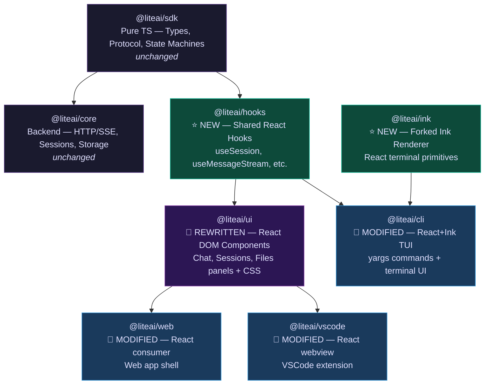

# UI Framework Migration: Full Architecture Decision

## Part 1 — Cross-Platform Approaches (5 Evaluated)

### ❌ Approach 1: Universal Primitives (React Native-style)
Share `<Box>`/`<Text>` that render to DOM or Ink. **Rejected** — forces web UI into lowest-common-denominator of terminal capabilities. No gradients, shadows, hover, Grid, animations.

### ✅ Approach 2: Headless Components (Shared Hooks Only)
Extract logic into hooks, build two visual libraries. **Strong candidate.**

### ❌ Approach 3: Render Props / Slot-Based Components
Share component skeletons with platform-specific slots. **Rejected** — TypeScript generics explosion, marginal gain over Approach 2, MVP requires full redesign.

### ❌ Approach 4: Protocol / Interface-Driven (Adapter Pattern)
Define `UIAdapter` interface per platform. **Rejected** — loses declarative React model, zero component reuse.

### ✅✅ Approach 5: Layered Architecture (RECOMMENDED)
Three explicit layers with clean ownership boundaries. **Selected.**

---

## Part 2 — Follow-Up Decisions

### Q1: ✅ `packages/hooks` — Confirmed

Separate package for shared React hooks. Clean dependency boundary — CLI can import `@liteai/hooks` without pulling in DOM component code.

### Q2: ✅ `packages/ink` — Confirmed

Port the MVP's forked Ink renderer. The fork has critical features not in upstream Ink:
- Click events (`ClickEvent`)
- Terminal focus events (`TerminalFocusEvent`)
- Keyboard events with full modifier support
- Custom `ThemedBox` / `ThemedText` with theme resolution
- React Compiler integration (`react/compiler-runtime`)

### Q3: CLI Port is Faster

| Factor | Phase 2: Port CLI | Phase 3: Build Web UI |
|---|---|---|
| Source code | ✅ MVP exists (113 components, 83 hooks) | ❌ Must design from scratch |
| Design | ✅ CLI UX already validated | ❌ New design (screenshots) |
| Risk | 🟢 Low — porting known code | 🟡 Medium — new design iteration |
| Effort type | Copy → clean → rewire | Design → build → test |
| Dependencies | `packages/ink` + `packages/hooks` | `packages/hooks` + new CSS system |
| Estimated scope | ~2-3 weeks | ~4-6 weeks |

> [!TIP]
> **Recommended order**: CLI first → it forces you to build `packages/hooks` and `packages/ink` which are prerequisites for the web UI anyway. You validate the shared hooks layer with working CLI code before the web UI depends on it.

### Q4: Modify Current CLI In-Place

**Do NOT create a new package.** Rationale:

| Aspect | Stays the Same | Changes |
|---|---|---|
| `src/index.ts` (yargs) | ✅ All commands, middleware, error handling | — |
| `src/cli/cmd/*` | ✅ All command implementations | — |
| `src/cli/ui.ts` | ✅ Logo, formatting utilities | — |
| `package.json` | — | Swap `@opentui/solid` → `@liteai/ink` |
| `src/cli/cmd/tui/*` | — | Rewrite TUI commands to use React+Ink |
| Dependencies | — | Remove `solid-js`, `@opentui/solid`; add `react`, `@liteai/ink`, `@liteai/hooks` |

The yargs command structure, error handling, and non-TUI code is framework-agnostic. Only the `tui/` directory changes. Creating a new package would:
- Lose git history on 90% of unchanged code
- Require rewiring all monorepo references
- Create unnecessary `cli_old` clutter

> [!IMPORTANT]
> Create `packages/ink` as a NEW package (it doesn't exist yet). Modify `packages/cli` in-place.

### Q5: `packages/ui` IS the Shared Block Library

VSCode webview renders in a **DOM** environment — it's structurally identical to the web app. Both use `<div>`, `<span>`, CSS, and HTML Canvas. The current architecture already shares `@liteai/ui` between web and vscode:

```
packages/web/package.json   → "@liteai/ui": "workspace:*"
packages/vscode/package.json → "@liteai/ui": "workspace:*"
```

The "blocks" you mentioned — chat input, chat panel, sessions panel, files panel — are exactly what `packages/ui/src/panes/` and `packages/ui/src/components/` already provide. This pattern continues with React.

**Strategy for the migration:**

Don't rename to `ui_old`. Instead:
1. Create a git branch `feat/react-migration`
2. Rewrite `packages/ui` components from SolidJS → React on that branch
3. The old SolidJS code lives in `main` until the migration is complete
4. Merge when the React version is validated

This avoids monorepo noise from renamed packages.

### Q6: Move to React — Decisive Recommendation

#### The Performance Question (Honest Assessment)

| Benchmark | SolidJS | React 19 + Compiler | Winner |
|---|---|---|---|
| Raw rendering throughput | ⚡ Direct DOM mutation | 🔄 VDOM diff + patch | SolidJS |
| Bundle size | ~7 KB | ~40 KB | SolidJS |
| Fine-grained updates | ⚡ Signal → exact DOM node | 🔄 Component re-render | SolidJS |
| Memory footprint | Lower (no VDOM tree) | Higher | SolidJS |

**But none of this matters for THIS application.** Here's why:

```
What your app actually does during a chat session:

1. User types message     → 1 text input update/keystroke    → Imperceptible on both
2. SSE streams response   → ~50-100 tokens/sec appended      → Batched on both  
3. Tool call renders      → Occasional new DOM node           → Imperceptible on both
4. Diff viewer opens      → One-time render                   → Same on both
5. Tab/panel switches     → Instant                           → Same on both
6. Session list updates   → Infrequent, small lists           → Same on both
```

The actual bottlenecks are:
- **Network latency** (SSE stream from LLM) — framework-irrelevant
- **Markdown/syntax parsing** (shiki, marked) — CPU-bound in the parser, same on both
- **Diff computation** — algorithm-bound, same on both

> [!IMPORTANT]
> The React Compiler (already used in the MVP — see `react/compiler-runtime` imports) auto-memoizes components and eliminates most unnecessary re-renders. This closes the practical gap with SolidJS for applications that aren't doing 60fps real-time rendering of thousands of nodes.

#### The Decisive Factor: Framework Lock-In

If you stay with SolidJS:

```
Web/VSCode → SolidJS (createSignal, createEffect, createMemo)
CLI        → React   (useState, useEffect, useMemo) ← Ink REQUIRES React
Shared     → ❌ IMPOSSIBLE — two incompatible reactivity models
```

You would maintain **two reactive frameworks**, **two mental models**, **two testing patterns**, and share **zero hooks** between CLI and web. Every feature would be implemented twice in incompatible paradigms.

If you move to React:

```
Web/VSCode → React hooks
CLI        → React hooks (same framework, Ink renderer)  
Shared     → ✅ packages/hooks works EVERYWHERE
```

**One framework. One mental model. ~55-60% code sharing.**

#### The Migration Cost is Zero Incremental

Per your core mandates (v-Next, zero backward compatibility), you are **redesigning the UI from scratch** anyway (the new screenshots are a new design). You're rewriting every component regardless. The question is:

- Rewrite 180 components in SolidJS (same framework, no new benefits)
- Rewrite 180 components in React (CLI sharing + MVP reuse + ecosystem)

The component rewrite cost is the same either way. React gives you free benefits on top.

#### Verdict

| Factor | SolidJS | React | Weight |
|---|---|---|---|
| Raw performance | 🟢 Faster | 🟡 Close enough | **Low** (chat UI isn't perf-sensitive) |
| Bundle size | 🟢 ~7KB | 🟡 ~40KB | **Low** (trivial for a desktop/web app) |
| CLI code sharing | ❌ Impossible | 🟢 ~55-60% | **Critical** |
| MVP reuse | ❌ None | 🟢 113 components + 83 hooks | **High** |
| Ecosystem | 🟡 Small | 🟢 Massive | **High** |
| Ink (terminal UI) | ❌ No equivalent | 🟢 Native | **Critical** |
| AI tooling quality | 🟡 Limited | 🟢 Extensive | **Medium** |
| Hiring/contributors | 🟡 Niche | 🟢 Abundant | **Medium** |
| Migration cost | 🟢 Zero (staying) | 🟡 Same (rewriting either way) | **Neutral** |

**React wins on every axis that matters for this project.** SolidJS only wins on raw performance, which is imperceptible for a chat UI.

---

## Final Package Architecture



## Migration Phases (Recommended Order)

```
Phase 1: Foundation (prerequisites)
├── Create packages/ink     → Port forked Ink from MVP
├── Create packages/hooks   → Extract shareable hooks from MVP
└── Validate with unit tests

Phase 2: CLI Port (faster, validates shared layer)
├── Modify packages/cli     → Swap @opentui/solid → @liteai/ink
├── Port MVP TUI components → packages/cli/src/tui/
├── Wire to @liteai/hooks + @liteai/core
└── Validate CLI works end-to-end

Phase 3: Web UI Redesign (higher impact, uses validated hooks)
├── Rewrite packages/ui     → SolidJS → React DOM (new design)
├── Build new CSS design system
├── Consume @liteai/hooks (already validated from Phase 2)
└── Validate with Storybook + e2e tests

Phase 4: Consumer Migration
├── Modify packages/web     → SolidJS → React
├── Modify packages/vscode  → SolidJS → React webview
└── Remove SolidJS dependencies from monorepo
```

> [!TIP]
> Phase 1 + 2 can be done on a feature branch while the SolidJS web UI stays live on `main`. No disruption to the web/vscode users until Phase 4.
