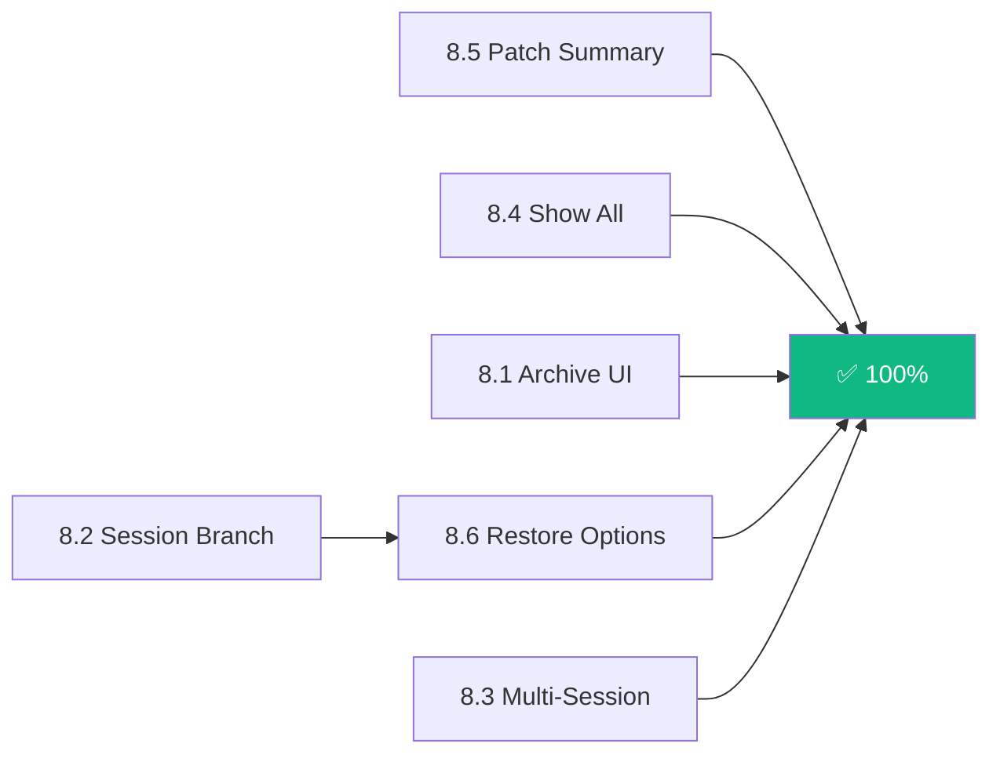

# Phase 8 — Final Completion (93% → 100%)

> The last 6 features from `ui_feature_status.md` that stand between 93% and full coverage.
> All core APIs already exist. This phase is **CLI-only** except for one minor addition.

---

## Infrastructure Audit

Before planning each feature, we verified the existing backend surface:

| Feature | Core API | SDK Method | CLI Wiring |
|---|---|---|---|
| Session Archive | `Session.setArchived()` ✅ | `session.update({ time: { archived } })` ✅ | **Missing** — `ctrl+a` handler exists but no visual feedback, no archive tab/filter |
| Session Branch (Fork) | `Session.fork()`, `Session.forkAtCheckpoint()` ✅ | `session.fork()` ✅ | **Missing** — no UI to trigger fork from rewind dialog |
| Multi-Session | N/A (CLI architectural limitation) | N/A | **Missing** — requires tab/split model |
| Show All (Compaction) | Messages already stored pre-compaction ✅ | `session.messages()` returns full history ✅ | **Missing** — keybinding is a no-op TODO |
| Multi-File Patch Summary | `session.diff` event stream ✅ | Diff data available via SSE ✅ | **Partial** — list/detail exists, no aggregate header |
| Restore Options (Rewind) | `Session.fork()` ✅, snapshot system ✅ | `session.revert()`, `session.fork()` ✅ | **Partial** — `select:accept` is a no-op |

---

## 8.1 — Session Archive UI

**Scope:** Wire archive toggle in `dialog-session-list.tsx` with visual distinction for archived sessions.

**Current state:** `ctrl+a` in session list already calls `sdk.client.project.session.update({ time: { archived } })` (line 177), but:
- No visual indication that a session is archived
- No way to view archived-only sessions
- No confirmation or toast on archive/unarchive

### Changes

#### [MODIFY] `dialog-session-list.tsx`
1. **Archive visual indicator**: Add `📦` gutter icon for archived sessions
2. **Archive tab filter**: Add a "Show Archived" toggle via `ctrl+shift+a` or a tab alongside the tag filter
   - Default: hide archived (current behavior via `session.list({ archived: false })`)
   - Toggle: show only archived sessions
3. **Toast feedback**: After archive/unarchive, show toast: `"Session archived"` / `"Session restored from archive"`
4. **Dimmed styling**: Archived sessions render with `dim` text

#### [MODIFY] `default-bindings.ts`
- Add `"ctrl+shift+a": "select:toggleArchived"` in Select context

**Estimated effort:** 0.5 day

---

## 8.2 — Session Branch (Fork from Rewind)

**Scope:** Enable the rewind dialog to fork a session at any selected turn.

**Current state:** `dialog-rewind.tsx` shows user messages with turn diffs, but `select:accept` (Enter on a turn) is a no-op that just pops the dialog.

### Changes

#### [MODIFY] `dialog-rewind.tsx`
1. **Action menu on Enter**: When user presses Enter on a selected turn, show a sub-menu with:
   - **Fork here** — Creates a new session branched from this turn via `sdk.client.project.session.fork({ sessionID, messageID })`
   - **Cancel** — Returns to rewind list
2. **Fork confirmation**: After fork completes, toast `"Session forked from turn N"` and navigate to the new session
3. **Fork indicator**: In the turn list, show `⑂` icon next to turns that already have child forks (query `sdk.client.project.session.children({ sessionID })` once on mount)

#### [MODIFY] `default-bindings.ts`
- `"f"` in rewind context → `"rewind:fork"` action (alternative to Enter for explicit fork intent)

**Dependencies:** None — core `Session.fork()` and SDK `session.fork()` fully exist.

**Estimated effort:** 1 day

---

## 8.3 — Multi-Session (Parallel Sessions)

**Scope:** Allow switching between multiple active sessions without navigating through the session list. This is NOT split-pane (which requires fundamental Ink layout changes), but a **tab-bar model** — multiple sessions loaded, one visible at a time, fast switching.

### Design

**Pattern: Session Tab Ring** — Maintain an ordered array of open session IDs. `ctrl+tab` cycles forward, `ctrl+shift+tab` cycles backward. Status line shows tab indicators.

#### [NEW] `hooks/use-session-tabs.ts`
Session tab state management:
```ts
interface SessionTabs {
  tabs: SessionID[]           // ordered open sessions
  activeIndex: number         // currently visible
  open: (id: SessionID) => void
  close: (id: SessionID) => void
  next: () => void
  prev: () => void
}
```
- Backed by `useSyncExternalStore` for immediate state (same pattern as message queue)
- Max tabs: configurable in `tui.json` as `max_session_tabs` (default: 5)
- Persisted to `tui.json` on unmount so tabs survive restart

#### [NEW] `context/session-tabs.tsx`
React context provider wrapping the tab state. Mounted at `app.tsx` level.

#### [MODIFY] `routes/session/index.tsx`
- When navigating to a session, `open(sessionID)` into the tab ring instead of replacing
- Session cleanup only fires when a tab is explicitly closed, not on navigation

#### [MODIFY] `components/status-line.tsx`
- New segment (priority 7): Tab indicators — e.g., `[1] [2] •3• [4]` where `•N•` is active
- Only renders when >1 tab is open

#### [MODIFY] `default-bindings.ts`
- `"ctrl+tab"` → `"app:nextTab"` (Global context)
- `"ctrl+shift+tab"` → `"app:prevTab"` (Global context)
- `"ctrl+w"` → `"app:closeTab"` (Global context)

#### [MODIFY] `dialog-session-list.tsx`
- On session select, open in new tab (unless already open — then switch to it)
- Show tab indicator `[N]` next to sessions that are already open in a tab

> [!WARNING]
> **Terminal keybinding constraint**: `ctrl+tab` may not be capturable in all terminal emulators. Fallback: `alt+1`-`alt+5` for direct tab access (like VS Code). Must test in Windows Terminal, iTerm2, and Alacritty.

> [!IMPORTANT]
> **Memory consideration**: Each open session maintains its SSE subscription and message state in the app store. The `max_session_tabs` cap prevents unbounded memory growth. When closing a tab, call `cleanupSession(id)` to release the subscription.

**Estimated effort:** 2.5 days

---

## 8.4 — Show All (Post-Compaction History Toggle)

**Scope:** Implement `ctrl+e` to toggle showing pre-compaction messages when in transcript mode.

**Current state:** Keybinding exists (`ctrl+e` → `transcript:toggleShowAll`), handler is `() => {}` with a TODO comment. The `CompactionPartView` renders a divider saying "Press ctrl+o to expand history" but this doesn't work.

### Design

Messages before a compaction point are already stored in the database — they're just not rendered. The `messages` array from `selectMessages()` contains all messages. The compaction part itself is a `compaction` type part on an assistant message. Everything before that compaction message was the "pre-compaction" context.

#### [MODIFY] `routes/session/ctx.tsx`
Add to `SessionContext`:
```ts
showPreCompaction: boolean   // whether to render messages before the compaction divider
```

#### [MODIFY] `routes/session/index.tsx`
1. Replace the no-op TODO with state toggle:
```ts
const [showPreCompaction, setShowPreCompaction] = useState(false)
// ...
"transcript:toggleShowAll": () => setShowPreCompaction((v) => !v),
```
2. Pass `showPreCompaction` into `SessionProvider` value

#### [MODIFY] `routes/session/messages.tsx`
When rendering messages, if `showPreCompaction` is `false` (default), skip all messages that appear before the last compaction-type part. Specifically:
1. Find the index of the last message containing a `compaction` part
2. If `!showPreCompaction`, only render messages from that index onward
3. If `showPreCompaction`, render all messages with a visual divider at the compaction boundary

#### [MODIFY] `components/compact-summary.tsx`
Update hint text:
- When `showPreCompaction` is false: `"(Press ctrl+e to show full history)"`
- When `showPreCompaction` is true: `"(Press ctrl+e to collapse)"`

**Estimated effort:** 0.5 day

---

## 8.5 — Multi-File Patch Batch Summary

**Scope:** Add an aggregate summary header to the diff dialog showing total stats across all changed files.

**Current state:** `dialog-diff.tsx` shows a file list with per-file `+N -N` stats and a detail view with the actual diff. Missing: an aggregate summary header.

### Changes

#### [MODIFY] `dialog-diff.tsx`
1. **Summary header** above the file list:
```tsx
<Box flexDirection="row" gap={2} marginBottom={1}>
  <Text bold>{diffs.length} files changed</Text>
  <Text color={theme.success}>+{totalAdditions}</Text>
  <Text color={theme.error}>-{totalDeletions}</Text>
</Box>
```
2. **Grouped by status**: Sort the file list: Added (A) first, then Modified (M), then Deleted (D)
3. **File type breakdown** (optional): `"3 .ts · 1 .tsx · 1 .css"` in muted text below the summary

This is a pure rendering change — all diff data already exists in `session_diff` from the SSE event stream.

**Estimated effort:** 0.25 day

---

## 8.6 — Restore Options (Rewind Actions)

**Scope:** Wire the rewind dialog's `select:accept` to offer meaningful restore actions.

**Current state:** `dialog-rewind.tsx` Enter key handler just calls `dialog.pop()` — no actual revert action.

### Design

The core has `Session.revert()` (via `step-back.ts`) which:
1. Truncates the conversation at the selected message
2. Takes a snapshot of code changes made after that point
3. Allows undoing code changes via `Session.unrevert()`

The SDK exposes `session.revert({ sessionID, messageID })`.

### Changes

#### [MODIFY] `dialog-rewind.tsx`
Replace the no-op `select:accept` with an action sub-dialog. On Enter:

1. **Show action menu** via `dialog.push()` with options:
   - **Revert conversation** — Calls `sdk.client.project.session.revert({ sessionID, messageID })`. Truncates history to this turn. Shows toast: `"Reverted to turn N (code changes preserved, use /unrevert to undo)"`
   - **Fork from here** — Same as 8.2 fork (calls `session.fork({ sessionID, messageID })`). Preserves original session intact.
   - **Cancel** — Returns to turn list

2. **Add keybindings**:
   - `Enter` → Show action menu (current behavior, now functional)
   - `r` → Direct revert (skip menu for power users)
   - `f` → Direct fork (skip menu)

3. **Post-revert navigation**: After a successful revert, pop the rewind dialog and let the session re-render with the truncated messages. After a fork, navigate to the new session.

#### [NEW] `dialog-rewind-actions.tsx`
Small action menu component:
```tsx
function RewindActions({ sessionID, messageID, turnLabel }: Props) {
  // DialogSelect with 2-3 options: Revert, Fork, Cancel
}
```

**Estimated effort:** 1 day

---

## Effort Summary

| # | Feature | Estimate | Complexity | Backend Changes |
|---|---|---|---|---|
| 8.1 | Session Archive UI | 0.5 day | Low | None |
| 8.2 | Session Branch (Fork) | 1 day | Medium | None |
| 8.3 | Multi-Session Tabs | 2.5 days | High | None |
| 8.4 | Show All (Compaction) | 0.5 day | Low | None |
| 8.5 | Multi-File Patch Summary | 0.25 day | Low | None |
| 8.6 | Restore Options (Rewind) | 1 day | Medium | None |
| **Total** | | **5.75 days** | | **0 core changes** |

---

## Dependency Order



No hard dependencies between features. Recommended execution order (simplest first):
1. **8.5** — Patch Summary (0.25 day, pure rendering)
2. **8.4** — Show All (0.5 day, state toggle + message filtering)
3. **8.1** — Archive UI (0.5 day, wiring existing infra)
4. **8.6** — Restore Options (1 day, rewind action menu + SDK calls)
5. **8.2** — Session Branch (1 day, fork UI in rewind dialog — shares work with 8.6)
6. **8.3** — Multi-Session (2.5 days, largest scope)

> [!NOTE]
> 8.2 and 8.6 overlap in the rewind dialog and should be implemented together.

---

## Verification Plan

### Automated
- `bun typecheck` in `packages/cli`
- `bun lint:fix` in `packages/cli`

### Manual
1. **Archive**: Archive a session → verify dimmed + icon → toggle archived view → unarchive → verify restored
2. **Fork**: Open rewind → select a turn → fork → verify new session created with correct history
3. **Multi-Session**: Open 3 sessions → `ctrl+tab` through them → close middle tab → verify order
4. **Show All**: Compact a session → `ctrl+e` → verify pre-compaction messages appear → toggle off
5. **Patch Summary**: Run a session with multiple file edits → open diff dialog → verify summary header
6. **Rewind Restore**: Open rewind → revert → verify truncated history → test unrevert flow

### Post-completion
- Update `ui_feature_status.md` to mark all 6 items as ✅
- Update summary table to 100%
- Move `roadmap/ui_refactoring/` to `roadmap/done/ui_refactoring/`
