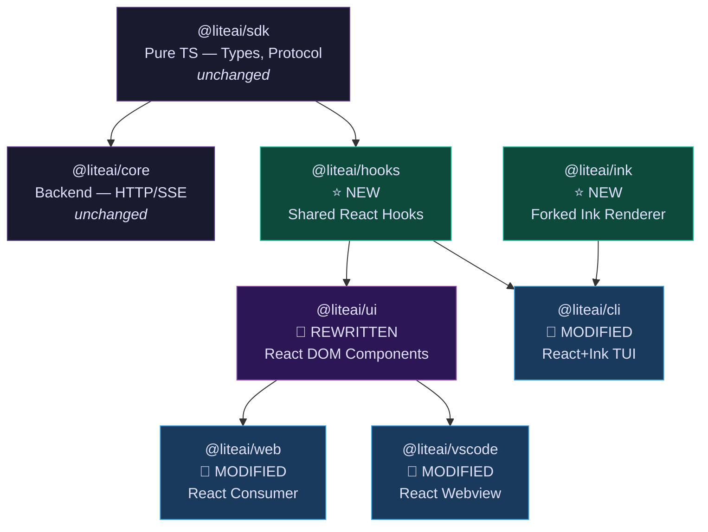

# RFC: UI Framework Migration — SolidJS → React (Layered Architecture)

> **Status**: Proposed
> **Author**: @aghassan
> **Date**: 2026-04-24
> **Scope**: `packages/ink` (NEW), `packages/hooks` (NEW), `packages/cli`, `packages/ui`, `packages/web`, `packages/vscode`
> **Prerequisite**: [ui_framework_analysis.md](./ui_framework_analysis.md) — 5 approaches evaluated, Approach 5 (Layered Architecture) selected.

---

## 1. Context & Problem Statement

The liteai frontend currently uses **SolidJS** across all UI packages (`ui`, `web`, `vscode`, `cli`). A v-Next redesign is required (new design language, new screenshots). Simultaneously, a working **React + Ink** MVP CLI exists at `liteai_cli_mvp` with 113 components and 83 hooks.

### 1.1 Current Pain Points

| Problem | Impact |
|---------|--------|
| SolidJS has **no terminal renderer** equivalent to Ink | CLI cannot share hooks with web/vscode — two incompatible reactive models |
| MVP CLI (`liteai_cli_mvp`) is React | Cannot reuse any MVP code in SolidJS packages |
| SolidJS ecosystem is niche | Smaller component library pool, less AI tooling coverage, fewer contributors |
| `packages/cli` uses `@opentui/solid` (v0.1.87) | Immature terminal rendering vs the battle-tested Ink fork in the MVP |
| v-Next requires a full UI redesign | All 180 SolidJS components will be rewritten regardless of framework choice |

### 1.2 Strategic Decision

**Move to React.** The performance difference is imperceptible for a chat UI (see analysis doc). The UI rewrite cost is identical for either framework since all components are being redesigned. React provides free benefits: CLI code sharing (~55-60%), MVP reuse, and ecosystem depth.

---

## 2. Decision Drivers

1. **Code Sharing**: Maximize shared logic between CLI (terminal) and web/vscode (DOM)
2. **MVP Leverage**: Reuse the 113 components and 83 hooks from `liteai_cli_mvp`
3. **Architectural Cleanliness**: Explicit layer boundaries with enforced import rules
4. **Zero Disruption**: SolidJS production code stays live until React replacement is validated
5. **v-Next Purity**: No backward compatibility shims. Clean React codebase from day one.

---

## 3. Target Architecture

### 3.1 Package Dependency Graph



### 3.2 Layer Rules (Enforced)

| Layer | Package | May Import | Must NOT Import |
|-------|---------|-----------|----------------|
| 0 — Pure TS | `@liteai/sdk`, `@liteai/core` | Nothing framework-specific | React, SolidJS, DOM, Ink |
| 1 — Shared Hooks | `@liteai/hooks` | React core (`useState`, `useEffect`, `useRef`), `@liteai/sdk` | `div`, `span`, `Box`, `Text`, any visual primitive |
| 2a — DOM Visuals | `@liteai/ui` | `@liteai/hooks`, React DOM, CSS | `@liteai/ink`, Ink primitives |
| 2b — Terminal Visuals | `@liteai/cli` (tui/) | `@liteai/hooks`, `@liteai/ink` | React DOM, CSS, `div`, `span` |

> **Enforcement**: A biome lint rule or `package.json` `exports` restriction will prevent cross-layer imports.

---

## 4. New Packages

### 4.1 `packages/ink` — Forked Ink Renderer

**Source**: Port from `liteai_cli_mvp/ink/`

This is a heavily customized fork of Ink with features not available in upstream:

| Feature | Files | Why Forked |
|---------|-------|-----------|
| Click events | `events/click-event.ts`, `hit-test.ts` | Upstream Ink has no mouse click support |
| Terminal focus events | `events/terminal-focus-event.ts`, `terminal-focus-state.ts` | Tab focus tracking for backgrounding |
| Keyboard events with modifiers | `events/keyboard-event.ts`, `parse-keypress.ts` | Richer than upstream's `useInput` |
| React Compiler integration | `ink.tsx` uses `react/compiler-runtime` | Auto-memoization for all Ink components |
| Search highlighting | `searchHighlight.ts`, `hooks/use-search-highlight.ts` | Built-in find-in-terminal |
| Selection engine | `selection.ts`, `hooks/use-selection.ts` | Text selection in terminal |
| ScrollBox | `components/ScrollBox.tsx` | Virtual scrolling component |
| Advanced screen management | `screen.ts` (49KB) | Multi-region rendering, cursor management |

**File Inventory (from MVP)**:

| Category | Files | Total Size |
|----------|-------|-----------|
| Core renderer | `ink.tsx`, `reconciler.ts`, `renderer.ts`, `root.ts`, `dom.ts` | ~294KB |
| Components | `Box.tsx`, `Text.tsx`, `Button.tsx`, `ScrollBox.tsx`, +14 more | ~232KB |
| Hooks | `use-input.ts`, `use-selection.ts`, `use-terminal-viewport.ts`, +9 more | ~24KB |
| Events | `click-event.ts`, `keyboard-event.ts`, `dispatcher.ts`, +7 more | ~24KB |
| Layout (Yoga) | `engine.ts`, `geometry.ts`, `node.ts`, `yoga.ts` | ~14KB |
| Output pipeline | `output.ts`, `render-node-to-output.ts`, `render-border.ts`, `render-to-screen.ts`, `log-update.ts` | ~132KB |
| Utilities | `styles.ts`, `colorize.ts`, `stringWidth.ts`, `screen.ts`, +12 more | ~140KB |

**Total**: ~48 source files, ~860KB

**Package structure**:
```
packages/ink/
  package.json          — name: "@liteai/ink"
  tsconfig.json
  src/
    index.ts            — public API (re-exports Box, Text, render, hooks)
    components/         — Box, Text, Button, ScrollBox, etc.
    hooks/              — use-input, use-selection, etc.
    events/             — ClickEvent, KeyboardEvent, etc.
    layout/             — Yoga integration
    renderer/           — reconciler, output pipeline
    design-system/      — ThemedBox, ThemedText, ThemeProvider (from MVP)
```

**Dependencies**: `react`, `react-reconciler`, `yoga-wasm-web` (or `yoga-layout`), `strip-ansi`, `widest-line`

### 4.2 `packages/hooks` — Shared React Hooks

**Source**: Extracted from `liteai_cli_mvp/hooks/` + new hooks wrapping `@liteai/sdk`

**Shareability audit of MVP's 83 hooks**:

| Category | Hooks | Shareable | Action |
|----------|-------|-----------|--------|
| **Session/State** | `useAssistantHistory`, `useLogMessages`, `useDeferredHookMessages` | ✅ Yes | Port to `packages/hooks` |
| **Data/Transform** | `useTurnDiffs`, `useDiffData`, `usePrStatus`, `useTasksV2` | ✅ Yes | Port to `packages/hooks` |
| **Permissions** | `useCanUseTool` (40KB!) | ✅ Yes | Port + refactor (too large) |
| **Cost/Tracking** | `useElapsedTime`, `useMinDisplayTime` | ✅ Yes | Port to `packages/hooks` |
| **Model/Config** | `useMainLoopModel`, `useDynamicConfig`, `useSettings` | ✅ Yes | Port to `packages/hooks` |
| **Plugin/MCP** | `useManagePlugins`, `useMergedClients`, `useMergedTools` | ✅ Yes | Port to `packages/hooks` |
| **Scheduling** | `useScheduledTasks`, `useTaskListWatcher` | ✅ Yes | Port to `packages/hooks` |
| **Cancel/Control** | `useCancelRequest`, `useQueueProcessor`, `useCommandQueue` | ✅ Yes | Port to `packages/hooks` |
| **Terminal-Specific** | `useTerminalSize`, `useVirtualScroll`, `useVimInput`, `useInput` | ❌ No | Stay in `packages/cli` |
| **Ink-Specific** | `useExitOnCtrlCD`, `usePasteHandler`, `useCopyOnSelect` | ❌ No | Stay in `packages/cli` |
| **DOM-Specific** | — (none in MVP, new for web) | ❌ No | Build in `packages/ui` |
| **Hybrid** | `useTypeahead` (212KB!), `useSearchInput`, `useArrowKeyHistory` | ⚠️ Partial | Extract search/filter logic; keep input handling platform-specific |
| **Bridge/REPL** | `useReplBridge` (115KB!) | ⚠️ Partial | Extract SSE/state logic; stdin-specific parts stay in CLI |

**Estimated split**: ~35-40 hooks shared, ~15-20 CLI-only, ~25-30 need logic extraction

**Package structure**:
```
packages/hooks/
  package.json          — name: "@liteai/hooks"
  tsconfig.json
  src/
    index.ts            — public API
    session/            — useSession, useMessageStream, useAssistantHistory
    data/               — useTurnDiffs, useDiffData, usePrStatus
    permissions/        — useCanUseTool, useToolApproval
    config/             — useSettings, useDynamicConfig, useMainLoopModel
    plugins/            — useManagePlugins, useMergedTools
    scheduling/         — useScheduledTasks, useTaskListWatcher
    control/            — useCancelRequest, useQueueProcessor
  test/
```

**Dependencies**: `react`, `@liteai/sdk` — **nothing else**. No DOM. No Ink.

---

## 5. Modified Packages

### 5.1 `packages/cli` — In-Place Modification

**What stays unchanged** (~90% of codebase):
- `src/index.ts` — yargs CLI setup, middleware, error handling
- `src/cli/cmd/*` — all 20+ command implementations (serve, run, agent, session, etc.)
- `src/cli/ui.ts` — logo, formatting utilities
- `src/cli/error.ts` — error formatting
- `src/cli/config/` — configuration management
- `test/` — existing command tests

**What changes**:

| File/Dir | Action | Details |
|----------|--------|---------|
| `package.json` | MODIFY | Remove `solid-js`, `@opentui/solid`, `@opentui/core`. Add `react`, `@liteai/ink`, `@liteai/hooks` |
| `src/cli/cmd/tui/attach.ts` | REWRITE | Replace OpenTUI rendering with React+Ink |
| `src/cli/cmd/tui/thread.ts` | REWRITE | Replace OpenTUI rendering with React+Ink |
| `src/tui/` | NEW dir | Port MVP TUI components (design-system, messages, prompts) |

**TUI components to port from MVP** (into `src/tui/`):

| Category | MVP Source | Est. Components |
|----------|-----------|----------------|
| Design system | `components/design-system/` | ThemeProvider, Divider, ListItem, Pane, ProgressBar, StatusIcon, Tabs |
| Messages | `components/Messages.tsx`, `MessageRow.tsx`, `Message.tsx` | MessageList, MessageRow, MessageContent |
| Input | `components/PromptInput/`, `components/TextInput.tsx` | PromptInput, TextInput, VimTextInput |
| Tools | `components/ToolUseLoader.tsx`, `components/FileEditToolDiff.tsx` | ToolProgress, DiffViewer |
| Status | `components/StatusLine.tsx`, `components/Spinner.tsx` | StatusBar, Spinner |
| Dialogs | `components/design-system/Dialog.tsx`, `components/design-system/FuzzyPicker.tsx` | Dialog, FuzzyPicker |

### 5.2 `packages/ui` — Full Rewrite (React DOM)

Current: 180 SolidJS component files + Kobalte + Vanilla CSS.
Target: React DOM components + new design system.

**This is NOT a port of old SolidJS components.** The UI is being redesigned per new screenshots. However, the component *categories* remain the same:

| Category | Current Files | Action |
|----------|--------------|--------|
| Primitives | button, card, checkbox, dialog, select, tabs, tooltip, etc. (~40 files) | Redesign in React |
| Message rendering | message-part, message-nav, markdown, etc. (~20 files) | Redesign in React |
| Panes | chat-pane, session-title-bar, prompt-input, etc. (~25 files) | Redesign in React |
| Tools | basic-tool, tool-status-title, tool-error-card, etc. (~10 files) | Redesign in React |
| Context providers | data, dialog, file, i18n, marked, etc. (~8 files) | Rewrite as React Context |
| Hooks | auto-scroll, filtered-list (~3 files) | Merge into `@liteai/hooks` or keep UI-specific |
| CSS files | ~60 CSS files | New design system CSS |
| Storybook | ~50 .stories.tsx files | Rewrite for React Storybook |
| Agent panel | agent-panel/ | Redesign in React |

**Dependencies change**:
```diff
- "@kobalte/core"
- "solid-js"
- "@solid-primitives/*"
- "@solidjs/meta"
- "@solidjs/router"
- "vite-plugin-solid"
+ "react"
+ "react-dom"
+ "@liteai/hooks"
+ "@vitejs/plugin-react" (or "@vitejs/plugin-react-swc")
```

### 5.3 `packages/web` — Consumer Migration

| File | Action | Details |
|------|--------|---------|
| `package.json` | MODIFY | Swap SolidJS deps → React deps |
| `vite.config.ts` | MODIFY | Replace `vite-plugin-solid` → `@vitejs/plugin-react` |
| `src/**/*.tsx` | REWRITE | SolidJS → React (signals → hooks, `createEffect` → `useEffect`) |
| `index.html` | MINIMAL | Root mount point stays, React mounts similarly |

### 5.4 `packages/vscode` — Webview Migration

| File | Action | Details |
|------|--------|---------|
| `package.json` | MODIFY | Swap SolidJS deps → React deps |
| `vite.config.mts` | MODIFY | Replace `vite-plugin-solid` → `@vitejs/plugin-react` |
| `src/webview/**/*.tsx` | REWRITE | SolidJS → React |
| `src/extension/` | UNCHANGED | Extension host code is pure TS, no framework dependency |
| `esbuild.js` | UNCHANGED | Extension bundling is framework-agnostic |

---

## 6. Implementation Phases

Each phase ships on its own branch. Phases 1-2 can run in parallel with production SolidJS.

```
Phase 1         Phase 2         Phase 3           Phase 4
Foundation  →   CLI Port    →   Web UI Redesign → Consumer Swap
(ink+hooks)     (validate)      (new design)      (go-live)

Branch:         Branch:         Branch:            Branch:
feat/ink        feat/cli-react  feat/ui-react      feat/react-migration
feat/hooks                                         (merges all)
```

### Phase 1: Foundation — `packages/ink` + `packages/hooks`

**Branch**: `feat/ink` and `feat/hooks` (can be parallel)

#### 1a: Create `packages/ink`

| Action | File | Est. Lines |
|--------|------|-----------|
| NEW | `packages/ink/package.json` | ~30 |
| NEW | `packages/ink/tsconfig.json` | ~20 |
| PORT | `packages/ink/src/` — all 48 files from MVP | ~14,000 (existing code) |
| NEW | `packages/ink/src/index.ts` — public API surface | ~80 |

Steps:
1. Create package scaffold with `bun init`
2. Copy `liteai_cli_mvp/ink/` → `packages/ink/src/`
3. Copy `liteai_cli_mvp/components/design-system/` → `packages/ink/src/design-system/`
4. Update all internal imports (resolve path changes)
5. Add `react` and `react-reconciler` as dependencies
6. Strip the React Compiler transform output (revert to source — the MVP files are compiler output with `_c()` memoization caches; we want the clean source)
7. `bun typecheck` — resolve all type errors
8. Basic render test: mount a `<Box><Text>Hello</Text></Box>`, verify terminal output

#### 1b: Create `packages/hooks`

| Action | File | Est. Lines |
|--------|------|-----------|
| NEW | `packages/hooks/package.json` | ~25 |
| NEW | `packages/hooks/tsconfig.json` | ~20 |
| PORT | `packages/hooks/src/` — ~35-40 hooks from MVP | ~3,000 (extracted + cleaned) |
| NEW | `packages/hooks/src/index.ts` — public API | ~40 |

Steps:
1. Create package scaffold
2. Identify and extract shareable hooks from MVP (per the audit in §4.2)
3. For hybrid hooks (e.g., `useReplBridge`), extract the SSE/state logic into `packages/hooks`; leave stdin-specific parts as CLI-specific wrappers
4. Remove all Ink/terminal imports — hooks must compile with zero DOM and zero Ink
5. Wire to `@liteai/sdk` types
6. `bun typecheck`
7. Unit tests for core hooks (`useSession`, `useMessageStream`)

**Validation**: `bun typecheck` for both packages. Unit tests. No behavioral changes to production code.

### Phase 2: CLI Port

**Branch**: `feat/cli-react`

| Action | File | Details |
|--------|------|---------|
| MODIFY | `packages/cli/package.json` | Remove SolidJS deps, add React + `@liteai/ink` + `@liteai/hooks` |
| REWRITE | `packages/cli/src/cli/cmd/tui/attach.ts` | React+Ink rendering |
| REWRITE | `packages/cli/src/cli/cmd/tui/thread.ts` | React+Ink rendering |
| NEW | `packages/cli/src/tui/` | Port MVP TUI components |
| VERIFY | `packages/cli/src/index.ts` | Must still work — yargs is framework-agnostic |
| VERIFY | All non-TUI commands | Must still work unchanged |

Steps:
1. Update `package.json` dependencies
2. Port MVP design-system components → `src/tui/design-system/`
3. Port MVP message components → `src/tui/messages/`
4. Port MVP input components → `src/tui/input/`
5. Rewrite `attach.ts` and `thread.ts` to use React+Ink
6. Wire TUI components to `@liteai/hooks`
7. `bun typecheck`
8. `bun lint:fix`
9. Test: `liteai thread` starts interactive TUI, `liteai serve` + non-TUI commands still work

**Validation**: `bun typecheck`, `bun test test/`, manual TUI testing.

### Phase 3: Web UI Redesign

**Branch**: `feat/ui-react`

This is the largest phase — a complete UI redesign in React DOM.

| Action | Package | Details |
|--------|---------|---------|
| REWRITE | `packages/ui/` | All components: SolidJS → React DOM with new design |
| MODIFY | `packages/ui/package.json` | Replace SolidJS + Kobalte deps with React deps |
| NEW | `packages/ui/src/components/` | New React component library |
| NEW | `packages/ui/src/styles/` | New CSS design system |
| REWRITE | `packages/ui/src/panes/` | Chat pane, session panels in React |
| REWRITE | `packages/ui/src/context/` | React Context providers |
| REWRITE | `packages/ui/src/hooks/` | DOM-specific hooks (auto-scroll, resize observer) |
| REWRITE | Storybook configs | React Storybook setup |

Steps:
1. Update `package.json` — swap SolidJS → React
2. Update `vite.config.ts` — swap `vite-plugin-solid` → `@vitejs/plugin-react`
3. Design and implement new CSS design system (tokens, variables, utilities)
4. Build primitive components: Button, Card, Dialog, Tabs, Select, etc.
5. Build message rendering: MessagePart, Markdown, DiffViewer
6. Build panes: ChatPane, PromptInput, SessionTitleBar, SessionList
7. Build context providers: DataProvider, ThemeProvider, I18nProvider
8. Wire all components to `@liteai/hooks`
9. Set up React Storybook, port story files
10. `bun typecheck`, `bun lint:fix`

**Validation**: `bun typecheck`, Storybook visual review, component unit tests.

### Phase 4: Consumer Swap

**Branch**: `feat/react-migration` (merges Phase 1-3 branches)

| Action | Package | Details |
|--------|---------|---------|
| MODIFY | `packages/web/package.json` | SolidJS → React |
| MODIFY | `packages/web/vite.config.ts` | Solid plugin → React plugin |
| REWRITE | `packages/web/src/` | Mount React app, use `@liteai/ui` components |
| MODIFY | `packages/vscode/package.json` | SolidJS → React |
| MODIFY | `packages/vscode/vite.config.mts` | Solid plugin → React plugin |
| REWRITE | `packages/vscode/src/webview/` | React webview, use `@liteai/ui` |
| CLEANUP | Workspace `package.json` / catalogs | Remove SolidJS from shared catalogs |

**Validation**: 
- Web: `bun run dev` — full app functional in browser
- VSCode: package extension, open webview — chat functional
- CLI: `liteai thread` — TUI functional
- E2E: `bun test:e2e` (if applicable)

---

## 7. Risk Assessment

| Risk | Severity | Mitigation |
|------|----------|------------|
| Ink fork diverges from upstream | Low | This is intentional — the fork has features upstream doesn't. Pin to the forked version. |
| React Compiler output in MVP is not clean source | Medium | Phase 1a step 6: manually revert compiler output to original source (source maps are embedded as base64 in the files). |
| `useReplBridge` (115KB) is deeply coupled to Ink stdin | Medium | Extract SSE/state logic into `@liteai/hooks`; keep stdin bridge in CLI. Accept some duplication. |
| `useTypeahead` (212KB) is monolithic | Medium | Refactor into composable hooks during Phase 1b. Split: search logic (shared) + input handling (CLI-specific) + DOM autocomplete (UI-specific). |
| Phase 3 scope creep (UI redesign) | High | Timebox. Define MVP component set upfront. Use existing `@liteai/hooks` as the anchor — if the hook exists, build the visual component; otherwise, defer. |
| SolidJS and React running in parallel during migration | Low | Different branches. No cross-contamination. Phase 4 is the atomic swap. |
| Storybook migration | Low | React Storybook is mature. Story format is nearly identical. |

---

## 8. Verification Plan

### Per-Phase Automated Tests

| Phase | Command | Scope |
|-------|---------|-------|
| 1a | `cd packages/ink && bun typecheck && bun test` | Ink renderer |
| 1b | `cd packages/hooks && bun typecheck && bun test` | Shared hooks |
| 2 | `cd packages/cli && bun typecheck && bun test` | CLI commands + TUI |
| 3 | `cd packages/ui && bun typecheck && bun test` | React DOM components |
| 4 | Full workspace `bun typecheck` | All packages compile together |

### Manual Verification Matrix

| Scenario | Phase | Expected |
|----------|-------|----------|
| `liteai serve` | 2 | Server starts, no TUI — works unchanged |
| `liteai thread` | 2 | Interactive TUI renders in terminal with React+Ink |
| `liteai thread` → type message → stream response | 2 | SSE streaming, message rendering, tool calls visible |
| `liteai thread` → Ctrl+C abort | 2 | Clean exit, no orphan processes |
| Storybook: all components render | 3 | Visual review of component library |
| Web app: full chat session | 4 | Send message, stream response, view diffs, switch sessions |
| VSCode: webview chat | 4 | Same as web but in VSCode sidebar |

---

## 9. Dependency Changes Summary

### New Dependencies (workspace-wide)

| Package | Version | Used By |
|---------|---------|---------|
| `react` | ^19.x | hooks, ui, cli, web, vscode |
| `react-dom` | ^19.x | ui, web, vscode |
| `react-reconciler` | ^0.31.x | ink |
| `@vitejs/plugin-react` (or `-swc`) | latest | ui, web, vscode |
| `yoga-wasm-web` (or `yoga-layout`) | latest | ink |

### Removed Dependencies

| Package | Removed From |
|---------|-------------|
| `solid-js` | cli, ui, web, vscode |
| `@kobalte/core` | ui |
| `@solid-primitives/*` (6 packages) | ui, web, cli |
| `@solidjs/meta` | ui, web |
| `@solidjs/router` | ui, web |
| `@opentui/core` | cli |
| `@opentui/solid` | cli |
| `vite-plugin-solid` | ui, web, vscode |
| `solid-list` | ui |
| `virtua` | ui (replaced by Ink ScrollBox for CLI, React virtualization for web) |

---

## 10. References

- [ui_framework_analysis.md](./ui_framework_analysis.md) — 5 approaches evaluated, decision rationale
- `liteai_cli_mvp/` — Source codebase for Ink fork and React hooks/components
- `liteai_cli_mvp/ink/` — Forked Ink renderer (48 files, ~860KB)
- `liteai_cli_mvp/hooks/` — 83 React hooks
- `liteai_cli_mvp/components/` — 113 React components + design system
