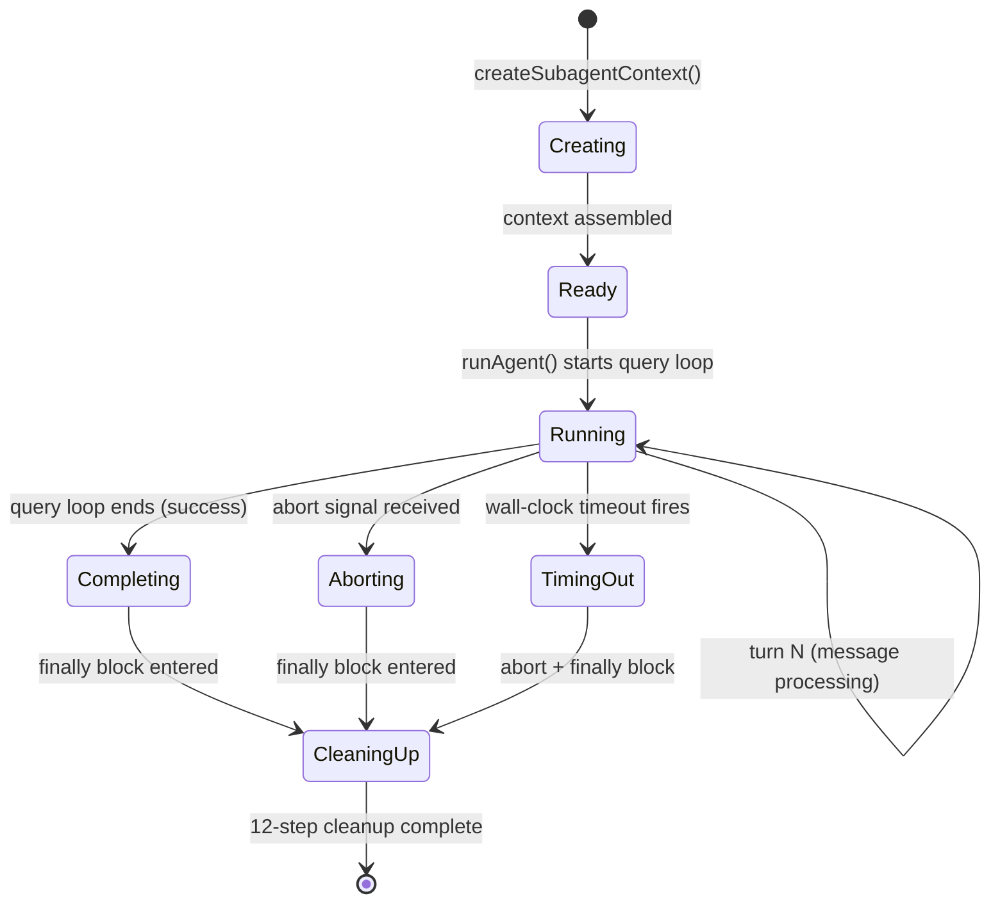

# Data Model: Sub-Agent Architecture

**Feature**: 002-subagent-architecture  
**Date**: 2026-04-11

## Entity: AgentDefinition

The core discriminated union representing an agent's identity, source provenance, and configuration.

### Type Hierarchy

```typescript
// Base configuration shared by all agent sources
interface BaseAgentDefinition {
  agentType: string                    // Unique identifier (e.g., "explore", "plan", "my-agent")
  name: string                        // Display name
  description?: string                // When-to-use description
  mode: "subagent" | "primary" | "all"
  hidden?: boolean                    // Protected from user override (built-in only)
  enabled?: boolean                   // Can be disabled

  // Execution config
  prompt?: string                     // System prompt / instructions
  model?: { providerID: string; modelID: string } | "inherit"
  variant?: string
  temperature?: number
  topP?: number
  effort?: "low" | "medium" | "high" | "max"
  maxTurns?: number                   // Max agentic turns (frontmatter alias: `steps`)
  timeout?: number                    // Wall-clock timeout in ms (default: 1800000 = 30min)
  thinking?: boolean                  // Enable extended thinking (default: false)
  thinkingBudget?: number             // Max thinking tokens (optional)
  background?: boolean                // Run as background task

  // Permission
  permission: PermissionNext.Ruleset          // Pre-existing field, not new to this feature
  permissionMode?: "default" | "acceptEdits" | "dontAsk" | "bypassPermissions" | "plan" | "bubble"
  tools?: string[] | Record<string, boolean>  // Allowed tools
  disallowedTools?: string[]                   // Denied tools

  // Extensions
  skills?: string[]                   // Preloaded skills
  mcpServers?: AgentMcpServerSpec[]   // Agent-scoped MCP servers
  requiredMcpServers?: string[]       // MCP servers that must be connected
  hooks?: Record<string, unknown>     // Per-agent hooks
  memory?: "user" | "project" | "local"  // Agent memory scope

  // Context control
  omitLiteaiMd?: boolean              // Strip project config from context
  initialPrompt?: string              // Injected before first turn
  criticalSystemReminder?: string     // Re-injected every turn

  // Isolation
  isolation?: "worktree" | "remote"   // Execution isolation mode
  containerImage?: string             // Docker image for remote isolation (default: platform-defined)
  color?: string                      // UI display color

  // Extensible options
  options: Record<string, unknown>
}

// Source-specific variants
interface BuiltInAgentDefinition extends BaseAgentDefinition {
  source: "builtIn"
  native: true
  getSystemPrompt?: () => Promise<string>  // Dynamic prompt for built-in agents
}

interface CustomAgentDefinition extends BaseAgentDefinition {
  source: "custom"
  native: false
  filePath: string                    // Source .md file path
}

interface PluginAgentDefinition extends BaseAgentDefinition {
  source: "plugin"
  native: false
  pluginId: string                    // Originating plugin identifier
}

type AgentDefinition = BuiltInAgentDefinition | CustomAgentDefinition | PluginAgentDefinition
```

### Validation Rules
- `agentType` must be unique within the merged agent list
- `requiredMcpServers` entries must match connected MCP server names at load-time AND spawn-time
- `model: "inherit"` is only valid for sub-agents (not primary agents)
- `thinking` defaults to `false` for all sub-agents
- `timeout` defaults to 1800000 (30 minutes)
- `steps` defaults to undefined (no limit)
- Hidden built-in agents cannot be overridden by user config
- The "build" agent cannot be disabled
- `auto` is a **runtime session mode** (derived from CLI `--auto` flag or parent session state), NOT an agent config value. It appears in spec acceptance scenarios (US3 AS2) as a *parent's* mode, not as an `agentDefinition.permissionMode` value. The `permissionMode` enum above covers agent definition config values only

### Priority Ordering (merge)
```
builtIn < plugin < userSettings < projectSettings
```

Later sources override earlier ones field-by-field for matching `agentType` identifiers.

---

## Entity: SubagentContext

A forked execution context encapsulating the isolation model for a spawned sub-agent.

> **Naming note**: `SubagentContext` is the _tool-use execution context_ (forked state for the query loop). `SubagentSpawnContext` (in `AgentExecutionContext` below) is the _ALS-stored analytics context_ for attribution isolation. They are orthogonal types serving different layers.

```typescript
interface SubagentContext {
  // Identity
  agentId: string                     // Unique ID for this agent instance
  agentType: string                   // Agent definition type
  parentSessionId: string             // Parent session ID (tracing)
  isBuiltIn: boolean                  // Source type flag

  // Cloned state (independent copy from parent)
  readFileState: Map<string, FileStateEntry>  // Cloned file cache
  contentReplacementState: ContentReplacementState  // Cloned for cache stability
  queryTracking: QueryTracking & { depth: number }  // Incremented depth

  // Linked state (child lifecycle bound to parent)
  abortController: AbortController    // Child of parent's controller (unidirectional)

  // Wrapped state (parent access with modifications)
  getAppState: () => AppState         // Wraps parent's, sets shouldAvoidPermissionPrompts
  setAppState: () => void             // No-op by default (prevents state leaks)

  // Fresh state (isolates per agent)
  toolDecisions: undefined            // Fresh per agent — no parent leaks
  messages: ModelMessage[]            // Independent message chain

  // Lifecycle
  setAppStateForTasks: ScopedTaskOps  // Scoped: registerTask, killTask, deleteTodo only
  thinkingConfig: ThinkingConfig | undefined  // Disabled by default unless agent opts in

  // Extensions
  criticalSystemReminder?: string     // Static per-turn reminder
  invokingRequestId?: string          // For sparse-edge telemetry (single-fire)
  invocationKind: "spawn" | "resume"  // Spawn vs resume tracking ("resume" is a type-only placeholder for Phase 4)
  cwd?: string                        // Execution working directory override (e.g., for worktree isolation bounds)
}

interface SubagentContextOverrides {
  shareSetAppState?: boolean          // Opt-in: share setAppState with parent
  shareSetResponseLength?: boolean    // Opt-in: share response length tracking
  shareAbortController?: boolean      // Opt-in: share (not link) abort controller
  criticalSystemReminder?: string     // Static reminder override
}
```

### State Transitions



---

## Entity: SidechainTranscript

An isolated, append-only message recording for a sub-agent execution.

```typescript
interface SidechainTranscript {
  agentId: string                     // Agent instance identifier
  sessionId: string                   // Parent session ID
  subdir?: string                     // Optional grouping subdirectory
  filePath: string                    // Resolved: <dir>/<sessionId>/subagents/<subdir>/agent-<agentId>.jsonl

  // Operations
  recordMessage(message: TranscriptMessage): Promise<void>  // Append single JSONL line
  recordChain(messages: TranscriptMessage[], parentUuid?: string): Promise<void>  // Append batch
}

interface TranscriptMessage {
  uuid: string                        // Message unique ID
  parentUuid?: string                 // Parent chain reference
  role: "user" | "assistant" | "system"
  content: unknown                    // Message content (model-specific format)
  timestamp: number                   // Recording time
  isSidechain: true                   // Discriminator flag
}
```

### Storage Format
- **File format**: JSONL (one JSON object per line)
- **Write mode**: `fs.appendFile()` — atomic appends, O(1) per message
- **Naming**: `agent-<agentId>.jsonl`
- **Grouping**: Optional `subdir` for workflow runs
- **Retention**: Transcripts are never deleted (even on agent crash) — they serve as debugging artifacts

---

## Entity: AgentMcpSession

A lifecycle-managed MCP server connection scoped to a single agent's execution.

```typescript
interface AgentMcpSession {
  agentId: string                     // Owning agent instance
  connections: Map<string, ManagedConnection>

  // Operations
  initialize(specs: AgentMcpServerSpec[]): Promise<CleanupFunction>
  cleanup(): Promise<void>            // Only cleans up inline connections
}

interface ManagedConnection {
  name: string                        // Server name
  kind: "referenced" | "inline"       // Determines cleanup responsibility
  client: McpClient                   // Active connection
}

type AgentMcpServerSpec = string | { [name: string]: McpServerConfig }
// string = reference to existing project-wide connection
// object = inline definition creating new scoped connection

type CleanupFunction = () => Promise<void>
```

### Lifecycle Rules
- **Referenced connections**: Looked up via `getMcpConfigByName()`, reuse memoized `connectToServer()`. NOT cleaned up on agent exit.
- **Inline connections**: New connection created, tracked in `newlyCreatedClients[]`. Cleaned up on agent exit.
- **Policy guard**: `isRestrictedToPluginOnly('mcp')` blocks user-defined agents' MCP servers. Admin-trusted sources always allowed.
- **Failure mode**: If any MCP server fails to connect, agent spawn fails fast with structured error. No partial connections leaked.

---

## Entity: AgentMemory

A filesystem-backed persistent knowledge store scoped to an agent type.

```typescript
interface AgentMemory {
  agentType: string                   // Agent type key
  scope: "user" | "project" | "local" // Storage location
  memoryDir: string                   // Resolved directory path
  memoryFile: string                  // MEMORY.md path
}

// Module-level operations (aligned with contracts/agent-api.md)
function getAgentMemoryDir(agentType: string, scope: MemoryScope): string
function loadAgentMemoryPrompt(agentType: string, scope: MemoryScope): Promise<string>
function ensureMemoryDirExists(agentType: string, scope: MemoryScope): Promise<void>
function isAgentMemoryPath(path: string): boolean  // Security boundary (path traversal prevention)
function injectAgentMemoryTools(agentType: string, scope: MemoryScope, toolPool: ToolSet): ToolSet
```

### Scope Resolution

| Scope | Path | Sharing | Version Control |
|-------|------|---------|-----------------|
| `user` | `~/.liteai/agent-memory/<agentType>/MEMORY.md` | Global across all projects | No |
| `project` | `<cwd>/.liteai/agent-memory/<agentType>/MEMORY.md` | Shared via VCS | Yes |
| `local` | `<cwd>/.liteai/agent-memory-local/<agentType>/MEMORY.md` | Machine-local only | No |

### Forking Behavior
Memory is keyed by **agent type**, not session lineage. A sub-agent of type "explore" reads explore's own memory — it does NOT inherit the parent agent's memory.

---

## Entity: AgentExecutionContext

An `AsyncLocalStorage`-backed execution context for analytics isolation.

```typescript
// Discriminated union of context types
type AgentContext = SubagentSpawnContext | TeammateAgentContext

interface SubagentSpawnContext {
  kind: "subagent"
  agentId: string
  parentSessionId: string
  subagentName: string
  isBuiltIn: boolean
  invokingRequestId?: string
  invocationKind: "spawn" | "resume"
  invocationEmitted: boolean          // Single-fire flag for consumeInvokingRequestId()
}

interface TeammateAgentContext {
  kind: "teammate"
  agentId: string
  teamName: string
  agentColor?: string
  planModeRequired: boolean
  isTeamLead: boolean
}
```

### Operations
- `runWithAgentContext(context, fn)`: Wraps entire agent execution for isolated analytics attribution
- `consumeInvokingRequestId()`: Returns invocation boundary info exactly once, then clears — for sparse-edge telemetry

---

## Entity: AsyncAgentLifecycle

The complete background agent execution lifecycle.

```typescript
interface AsyncAgentLifecycle {
  agentId: string
  agentType: string
  startTime: number

  // Components
  progressTracker: ProgressTracker
  summarizer?: AgentSummarizer       // Optional, for long-running agents

  // Terminal state
  status: "running" | "completed" | "failed" | "killed"
  usageMetrics?: UsageMetrics
  partialResult?: string             // For killed agents
}

interface ProgressTracker {
  toolDescriptionResolver: Map<string, string>  // Tool name → human-readable description
  currentActivity?: string
}

interface UsageMetrics {
  totalTokens: number
  toolCalls: number
  duration: number                    // Wall-clock ms
  worktreeInfo?: WorktreeInfo
}

interface TerminalNotification {
  agentId: string
  agentType: string
  status: "completed" | "failed" | "killed"
  description: string
  usage: UsageMetrics
  error?: string                      // For status=failed
  partialResult?: string              // For status=killed
}
```

---

## Entity: IsolationArtifact

Tracks isolation runtime artifacts (worktrees, containers) for retention-based cleanup.

```typescript
interface IsolationArtifact {
  agentId: string
  kind: "worktree" | "docker"
  path: string                        // Worktree directory or container ID
  createdAt: number                   // For TTL calculation
  ttl: number                         // Retention period in ms (default: 3600000 = 1 hour)
}

// Operations
function registerArtifact(artifact: IsolationArtifact): void
function garbageCollect(): Promise<void>  // Called lazily on next session start
```

### Retention Rules
- Artifacts preserved for `ttl` ms after agent exit for post-mortem debugging
- GC runs lazily on next session start (not eagerly on agent exit)
- Sidechain transcripts are always preserved regardless of crash state
