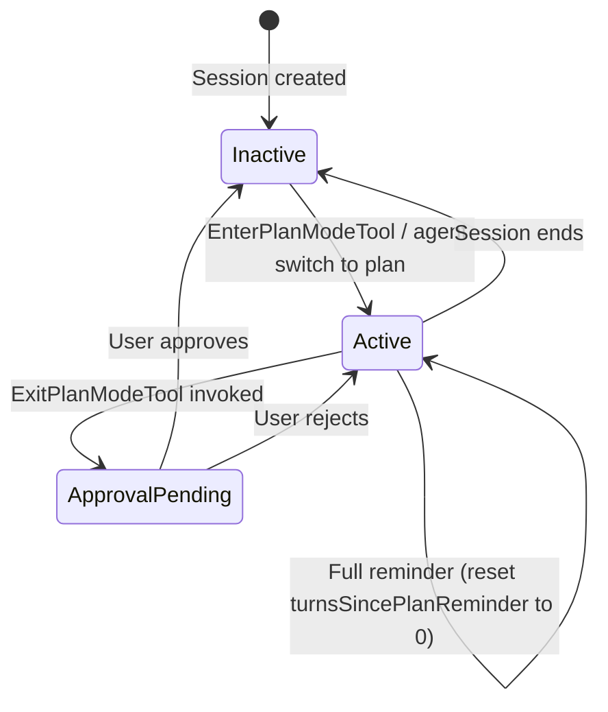
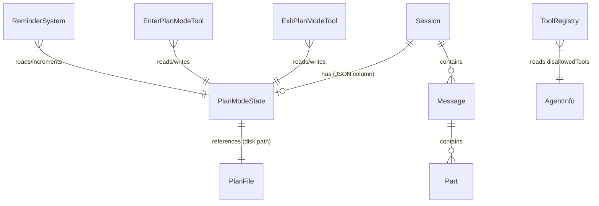

# Data Model: Plan Mode

**Feature Branch**: `004-plan-mode` | **Date**: 2026-04-15 | **Spec**: [spec.md](./spec.md) | **Research**: [research.md](./research.md)

## Entities

### PlanModeState

Session-scoped object tracking plan mode activity. Single source of truth for all plan mode logic.

| Field | Type | Default | Description |
|---|---|---|---|
| `active` | `boolean` | `false` | Whether plan mode is currently active |
| `planText` | `string \| undefined` | `undefined` | Last-known plan text (set by ExitPlanModeTool, cleared on deactivation) |
| `planFilePath` | `string` | `Session.plan(session)` | Deterministic per-session plan file path |
| `turnsSincePlanReminder` | `number` | `0` | Turns since last full plan reminder injection. Resets at 5. |

**Persistence**: JSON column (`plan_mode`) on the `session` SQLite table (`SessionTable`).

**Lifecycle**:
- **Created**: Implicitly when a session is created (default state: `{ active: false, planText: undefined, planFilePath: <computed>, turnsSincePlanReminder: 0 }`).
- **Activated**: When `EnterPlanModeTool` is invoked or a plan agent is selected.
- **Updated**: Every query loop turn increments `turnsSincePlanReminder` (when active). `planText` is set by `ExitPlanModeTool`.
- **Deactivated**: When `ExitPlanModeTool` approval is granted.
- **Restored**: On session resume, read from the `plan_mode` JSON column.

**Validation Rules**:
- `turnsSincePlanReminder` must be `>= 0` and `< 5` (resets at 5).
- `planFilePath` must be non-empty and resolve to a path within the session's project directory.
- `planText` is set only via `ExitPlanModeTool` (never directly by user input).

**State Transitions**:



### Plan Reminder Attachment

Ephemeral (non-persisted) user message part injected by the reminder system.

| Field | Type | Description |
|---|---|---|
| `type` | `"text"` | Standard text part type |
| `id` | `PartID` | Ascending part ID |
| `messageID` | `MessageID` | Parent user message ID |
| `sessionID` | `SessionID` | Session scope |
| `text` | `string` | Sparse reminder or full plan text |
| `synthetic` | `false` | Explicitly NOT synthetic — visible to model as user context |

**Two modes**:
- **Sparse** (turns 1–4): `"Plan at <relative-path>, staying on track?"`
- **Full** (turn 5): Complete plan file contents read from disk

**Not persisted to database** — appended in-memory only during the query loop turn.

### ExitPlanModeTool Result

The tool result returned to the model after plan approval.

| Field | Type | Description |
|---|---|---|
| `title` | `string` | `"Plan approved — switching to build mode"` |
| `output` | `string` | Full plan text + execution guidance |
| `metadata` | `object` | `{ planFilePath, approved: true }` |

### EnterPlanModeTool Result

The tool result returned to the model after entering plan mode.

| Field | Type | Description |
|---|---|---|
| `title` | `string` | `"Entered plan mode"` |
| `output` | `string` | Existing plan text + review instructions, OR creation guidance |
| `metadata` | `object` | `{ planFilePath, planExists: boolean }` |

## SSE Event Payloads

### plan.state_changed

Emitted when plan mode activates or deactivates.

| Field | Type | Description |
|---|---|---|
| `sessionID` | `SessionID` | Scoped to session |
| `active` | `boolean` | New plan mode state |
| `planFilePath` | `string` | Plan file path |
| `turnsSincePlanReminder` | `number` | Current turn counter |

### plan.approval_requested

Emitted when ExitPlanModeTool blocks awaiting user action.

| Field | Type | Description |
|---|---|---|
| `sessionID` | `SessionID` | Scoped to session |
| `planText` | `string` | Full plan content |
| `planFilePath` | `string` | Disk path where plan was written |

## Schema Migration

### SessionTable Addition

```typescript
// session.sql.ts — new column
plan_mode: text({ mode: "json" }).$type<PlanModeState>()
```

This is a **nullable** column. `null` indicates default state (inactive, no plan). The application layer interprets `null` as `{ active: false, planText: undefined, planFilePath: Session.plan(session), turnsSincePlanReminder: 0 }`.

## Relationships


