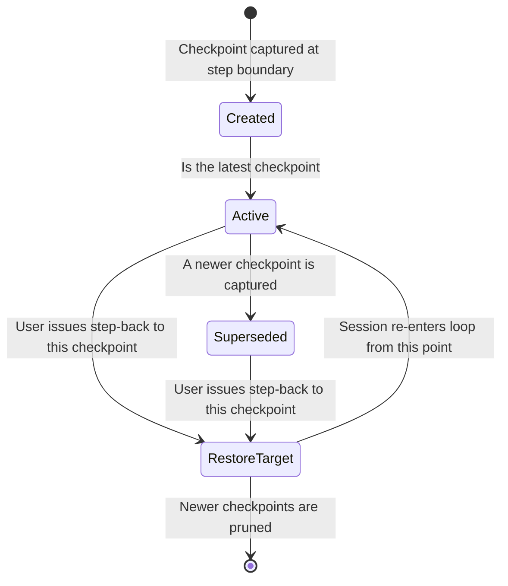
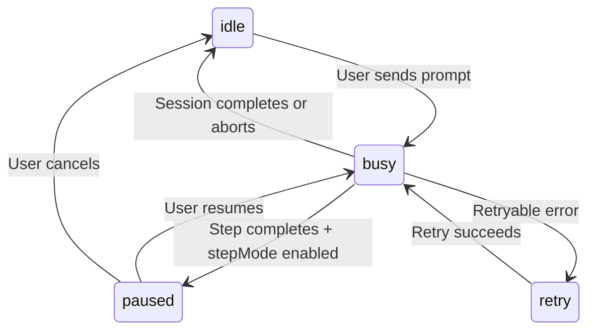
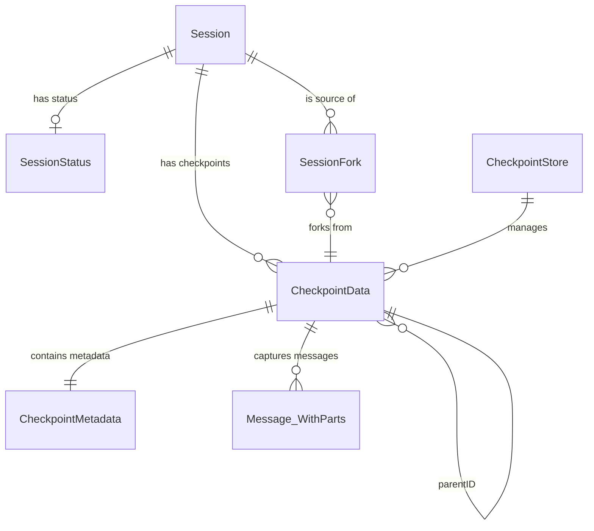

# Data Model: Backward Execution & Step-Level Control

**Date**: 2026-05-04  
**Feature**: [spec.md](file:///d:/liteai/specs/011-backward-execution/spec.md)  
**Research**: [research.md](file:///d:/liteai/specs/011-backward-execution/research.md)

---

## Entity: CheckpointData

A snapshot of the session's state captured at a step boundary.

| Field | Type | Required | Description |
|-------|------|----------|-------------|
| `id` | `string` (ULID) | ✅ | Monotonically increasing checkpoint identifier |
| `parentID` | `string \| undefined` | ❌ | Reference to the prior checkpoint (linked list) |
| `sessionID` | `SessionID` | ✅ | Session this checkpoint belongs to |
| `step` | `number` | ✅ | Step number (1-indexed) within the session |
| `messages` | `Message.WithParts[]` | ✅ | Deep copy of the in-memory message buffer at this step boundary |
| `snapshot` | `string \| undefined` | ❌ | Git tree hash from `Snapshot.track()` — references file state |
| `timestamp` | `number` | ✅ | `Date.now()` at capture time |
| `metadata` | `CheckpointMetadata` | ✅ | Per-step context snapshot |

### Validation Rules

- `step` must be > 0 and monotonically increasing within a session
- `parentID` of the first checkpoint must be `undefined`
- `parentID` of checkpoint N must equal the `id` of checkpoint N-1
- `messages` must be a non-empty array (at minimum the user message exists)
- `sessionID` must reference an existing session

### State Transitions

---

## Entity: CheckpointMetadata

Inline metadata snapshot for per-step context querying (avoids external Trace dependency).

| Field | Type | Required | Description |
|-------|------|----------|-------------|
| `agent` | `string` | ✅ | Agent name used for this step |
| `model` | `{ providerID: string; modelID: string }` | ✅ | Model used for this step |
| `trigger` | `"user" \| "subtask" \| "compaction" \| "retry"` | ✅ | What caused this step to execute |
| `timing` | `{ start: number; end: number }` | ✅ | Wall clock start/end of the step |
| `tokenUsage` | `{ input: number; output: number; reasoning: number }` | ❌ | Token counts for the step (if available) |
| `traceSpanID` | `string \| undefined` | ❌ | Reference to the OpenTelemetry span for this step |

### Validation Rules

- `trigger` must be one of the defined enum values
- `timing.end` must be >= `timing.start`

---

## Entity: SessionStatus (Extended)

Extension of the existing `SessionStatus.Info` union to include the `paused` state.

| Variant | Fields | Description |
|---------|--------|-------------|
| `idle` | — | Session is not running |
| `busy` | — | Session is actively processing |
| `retry` | `attempt`, `message`, `next` | Session is in retry backoff |
| **`paused`** | **`step: number`** | **Session is paused between steps (NEW)** |

### State Transitions

---

## Entity: StepPauseLatch

In-memory concurrency primitive that gates the loop between iterations.

| Field | Type | Required | Description |
|-------|------|----------|-------------|
| `promise` | `Promise<ResumePayload>` | ✅ | Resolves when the user resumes |
| `resolve` | `(payload: ResumePayload) => void` | ✅ | Called by the resume endpoint |

---

## Entity: ResumePayload

Data passed from the resume API to the paused loop.

| Field | Type | Required | Description |
|-------|------|----------|-------------|
| `guidance` | `string \| undefined` | ❌ | Optional user guidance text to inject before next step |
| `disableStepMode` | `boolean \| undefined` | ❌ | If true, disables step mode and continues without pausing |

---

## Entity: StepBackInput

Input for the step-back operation.

| Field | Type | Required | Description |
|-------|------|----------|-------------|
| `sessionID` | `SessionID` | ✅ | Target session |
| `checkpointID` | `string` | ✅ | Checkpoint to restore to |
| `guidance` | `string \| undefined` | ❌ | Optional new user guidance to inject after restore |

### Validation Rules

- `sessionID` must reference an existing, non-busy session
- `checkpointID` must reference an existing checkpoint for the given session
- The checkpoint must not have been pruned/evicted

---

## Entity: ForkAtCheckpointInput

Input for the checkpoint-based fork operation.

| Field | Type | Required | Description |
|-------|------|----------|-------------|
| `sessionID` | `SessionID` | ✅ | Source session |
| `checkpointID` | `string` | ✅ | Checkpoint to fork from |
| `guidance` | `string \| undefined` | ❌ | Optional guidance for the forked session |
| `model` | `{ providerID: string; modelID: string } \| undefined` | ❌ | Model override for the forked session |
| `agent` | `string \| undefined` | ❌ | Agent override for the forked session |

### Validation Rules

- Same as `StepBackInput` for session/checkpoint validation
- `model` if provided must reference a valid provider/model combination
- `agent` if provided must reference a registered agent

---

## Entity: CheckpointStore

In-memory store for checkpoints, scoped to a session's lifecycle.

| Field | Type | Required | Description |
|-------|------|----------|-------------|
| `checkpoints` | `Map<string, CheckpointData>` | ✅ | Keyed by checkpoint ID |
| `sessionID` | `SessionID` | ✅ | Owning session |
| `latestID` | `string \| undefined` | ❌ | ID of the most recent checkpoint |

### Operations

| Operation | Description |
|-----------|-------------|
| `capture(step, messages, snapshot, metadata)` | Creates a new checkpoint |
| `get(checkpointID)` | Returns a specific checkpoint |
| `getByStep(step)` | Returns the checkpoint for a given step number |
| `truncateAfter(checkpointID)` | Removes all checkpoints after the specified one |
| `list()` | Returns all checkpoints ordered by step |
| `latest()` | Returns the most recent checkpoint |

### Validation Rules

- `capture()` must reject if `step` is not greater than the latest checkpoint's step
- `truncateAfter()` must update `latestID` to point to the specified checkpoint
- All operations must be synchronous (in-memory store)

---

## Relationships

