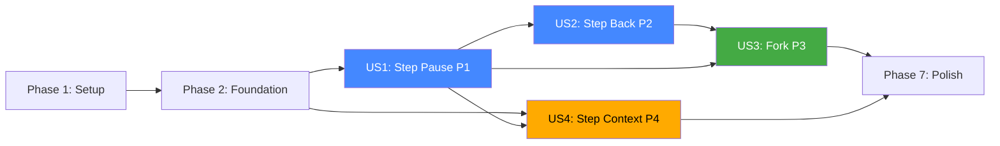

# Tasks: Backward Execution & Step-Level Control

**Input**: Design documents from `/specs/011-backward-execution/`  
**Prerequisites**: plan.md, spec.md, research.md, data-model.md, contracts/api.md

## Format: `[ID] [P?] [Story] Description`

- **[P]**: Can run in parallel (different files, no dependencies)
- **[Story]**: Which user story this task belongs to (e.g., US1, US2, US3, US4)
- Include exact file paths in descriptions

---

## Phase 1: Setup (Shared Infrastructure)

**Purpose**: Type definitions, schemas, and foundational primitives shared across all user stories

- [x] T001 Define `CheckpointData` and `CheckpointMetadata` types in `packages/core/src/session/engine/loop/checkpoint-store.ts` — export `CheckpointData` interface with fields: `id` (ULID), `parentID?`, `sessionID`, `step`, `messages` (deep-copied `Message.WithParts[]`), `snapshot?` (git tree hash), `timestamp`, `metadata` (CheckpointMetadata). Export `CheckpointMetadata` with fields: `agent`, `model` (`{ providerID, modelID }`), `trigger` (enum union), `timing` (`{ start, end }`), `tokenUsage?`, `traceSpanID?`
- [x] T002 Define `ResumePayload` type and `StepPauseLatch` class in `packages/core/src/session/engine/loop/step-latch.ts` — `ResumePayload` has `guidance?: string`, `disableStepMode?: boolean`. `StepPauseLatch` exposes `create(): { promise, resolve }`, supports single-use resolve semantics with a guard against double-resolve, and throws a typed `StepLatchAlreadyResolvedError` on misuse
- [x] T003 [P] Extend `SessionStatus.Info` union in `packages/core/src/session/status.ts` — add `z.object({ type: z.literal("paused"), step: z.number() })` variant to the existing union. Add `session.checkpoint` BusEvent to `SessionStatus.Event` with schema `{ sessionID, checkpoint: { id, step, timestamp, metadata: CheckpointMetadata } }`
- [x] T004 [P] Add `stepMode` field to `PromptInput` in `packages/core/src/session/engine/loop.ts` — add `stepMode: z.boolean().optional()` to the existing `PromptInput` Zod schema
- [x] T005 [P] Add `"step-pause"` action to `GeneratorResultEvent` in `packages/core/src/session/events.ts` — extend the `action` union in `EngineEvent.GeneratorResultEvent` to include `"step-pause"`, with payload type `{ step: number }`

---

## Phase 2: Foundational (Blocking Prerequisites)

**Purpose**: `CheckpointStore` — the in-memory checkpoint manager used by all user stories

**⚠️ CRITICAL**: No user story work can begin until this phase is complete

- [x] T006 Implement `CheckpointStore` class in `packages/core/src/session/engine/loop/checkpoint-store.ts`
- [x] T007 Extend `Checkpointer` interface in `packages/core/src/session/engine/loop/checkpointer.ts`

**Checkpoint**: Foundation ready — user story implementation can now begin

---

## Phase 3: User Story 1 — Step Pause & Inspect (Priority: P1) 🎯 MVP

**Goal**: Users can enable step mode, the loop pauses between iterations, users can inspect intermediate state, and resume (optionally with guidance). Step mode can be toggled mid-session.

**Independent Test**: Submit a prompt with `stepMode: true`, verify session enters `paused` status after each step, inspect messages via standard endpoint, resume, verify loop continues from in-memory state.

### Implementation for User Story 1

- [x] T008 [US1] Wire `stepMode` through `loop()` and `runSession()` in `packages/core/src/session/engine/loop.ts`
- [x] T009 [US1] Yield `step-pause` control event from `queryLoop` in `packages/core/src/session/engine/query.ts`
- [x] T010 [US1] Handle `step-pause` event in `runSessionInner` in `packages/core/src/session/engine/loop.ts`
- [x] T011 [US1] Implement `resume()` function in `packages/core/src/session/engine/loop.ts`
- [x] T012 [US1] Implement `POST /:sessionID/resume` HTTP endpoint in `packages/core/src/server/routes/session.ts`
- [x] T013 [US1] Implement `GET /:sessionID/checkpoints` HTTP endpoint in `packages/core/src/server/routes/session.ts`
- [x] T014 [US1] Implement `GET /:sessionID/checkpoints/:checkpointID` HTTP endpoint in `packages/core/src/server/routes/session.ts`
- [x] T015 [US1] Ensure non-step-mode path has zero overhead in `packages/core/src/session/engine/query.ts`

**Checkpoint**: Step Pause & Inspect is fully functional and independently testable

---

## Phase 4: User Story 2 — Step Back & Re-Execute (Priority: P2)

**Goal**: Users can step back to a prior checkpoint, restoring file state and truncating messages. The system detects file conflicts and communicates subagent scope.

**Independent Test**: Run a multi-step session in step mode, issue step-back to step 2, verify files restored and messages truncated, resume and verify agent proceeds from restored point.

### Implementation for User Story 2

- [x] T016 [US2] Implement `stepBack()` orchestration in `packages/core/src/session/step-back.ts` — new module exporting `stepBack(input: StepBackInput)`. Flow: (1) `SessionPrompt.assertNotBusy(sessionID)`, (2) retrieve checkpoint via `checkpointer.getCheckpoint(input.checkpointID)` — throw `CheckpointNotFoundError` if missing, (3) **conflict detection**: call `Snapshot.track()` for current state, call `Snapshot.patch(checkpoint.snapshot)` to get files changed since checkpoint, compare with current workspace to detect externally modified files — if conflicts, throw `FileConflictError` with conflict paths, (4) **restore file state**: `Snapshot.restore(checkpoint.snapshot)`, (5) **truncate messages in DB**: delete all messages with ID >= the first message NOT in the checkpoint's message list (reuse pattern from `SessionRevert.cleanup`), (6) **truncate checkpoints**: `checkpointer.truncateAfter(checkpointID)`, (7) **detect orphaned children**: query `Session.children(sessionID)` and filter those created after `checkpoint.timestamp`, (8) **inject guidance**: if `input.guidance` provided, create a synthetic user message with the guidance text and persist it, (9) **emit events**: publish `Session.Event.Updated` with the updated session info, (10) return `{ restored: true, step: checkpoint.step, orphanedChildren }`
- [x] T017 [US2] Implement `POST /:sessionID/step-back` HTTP endpoint in `packages/core/src/server/routes/session.ts` — add Hono route with `describeRoute` (operationId: `project.session.stepBack`), validators for param (sessionID) and body (checkpointID, guidance?). Handler calls `stepBack({ sessionID, ...body })`. Catches `CheckpointNotFoundError` → 404, `FileConflictError` → 409 with `{ error, conflicts }`, `Session.BusyError` → 400
- [x] T018 [US2] Wire step-back loop re-entry in `packages/core/src/session/engine/loop.ts` — verified that static `globalStores` retains the `CheckpointStore` correctly after truncation.
- [x] T019 [US2] Handle step-back to step 1 (initial state) edge case in `packages/core/src/session/step-back.ts` — verified undefined snapshot is skipped and correct truncation applies.

**Checkpoint**: Step Back & Re-Execute is fully functional and independently testable

---

## Phase 5: User Story 3 — Fork & Re-Execute with Different Parameters (Priority: P3)

**Goal**: Users can fork a session at a checkpoint with model/agent overrides. The fork creates an independent new session from the checkpoint's message state.

**Independent Test**: Run a session to step 3, fork at step 2 with a different model, verify two independent sessions exist — original at step 3, fork with messages up to step 2 and new model applied.

### Implementation for User Story 3

- [x] T020 [US3] Implement `forkAtCheckpoint()` in `packages/core/src/session/index.ts` — add a new exported function `forkAtCheckpoint(input: ForkAtCheckpointInput)`. Flow: (1) retrieve source session and checkpoint (throw typed errors on not-found), (2) create new session via `Session.createNext({ title: getForkedTitle(source.title), parentID: undefined, directory, workspaceID })` — note: parentID is intentionally not set to the source session to avoid confusing the existing child-session tree with fork-at semantics, (3) copy messages from `checkpoint.messages` into the new session (same ID-remapping pattern as existing `Session.fork`), (4) if `input.model` or `input.agent` provided, override the model/agent on the last user message in the cloned set, (5) if `input.guidance` provided, create and persist a synthetic user guidance message after the cloned messages, (6) return the new session info
- [x] T021 [US3] Implement `POST /:sessionID/fork-at` HTTP endpoint in `packages/core/src/server/routes/session.ts` — add Hono route with `describeRoute` (operationId: `project.session.forkAt`), validators for param (sessionID) and body (checkpointID, guidance?, model?, agent?, autoResume?). Handler calls `Session.forkAtCheckpoint({ sessionID, ...body })`. If `autoResume` is true, fire `SessionPrompt.loop({ sessionID: newSession.id })` as fire-and-forget after returning the response. Returns `Session.Info` of the new fork. Catches `CheckpointNotFoundError` → 404, model validation errors → 400
- [x] T022 [US3] Validate model/agent overrides in `packages/core/src/session/index.ts` — inside `forkAtCheckpoint`, if `input.model` is provided: call `Provider.getModel(input.model.providerID, input.model.modelID)` to validate it exists — throw `ProviderModelNotFoundError` if not. If `input.agent` is provided: call `Agent.get(input.agent)` to validate — throw `AgentNotFoundError` if not. These validations must happen BEFORE creating the new session to avoid orphaned empty sessions on validation failure
- [x] T023 [US3] Support multi-level forking — verify that forking a forked session works correctly. The `forkAtCheckpoint` function uses `CheckpointStore` data which is scoped to the source session's lifecycle. If the source session was itself a fork, its checkpoints were captured during its own execution and are independent. No special handling should be needed, but validate with a walkthrough of the code path

**Checkpoint**: Fork & Re-Execute is fully functional and independently testable

---

## Phase 6: User Story 4 — Step Context Inspection (Priority: P4)

**Goal**: Users can query per-step context metadata (agent, model, timing, token usage) for any checkpoint.

**Independent Test**: Run a multi-step session, query checkpoint detail for step N, verify returned metadata matches the agent/model/tools actually used at that step.

### Implementation for User Story 4

- [x] T024 [US4] Enrich `CheckpointMetadata` capture in `packages/core/src/session/engine/query.ts` — when capturing the checkpoint in the `step-pause` path (T009), extract and populate: (1) `agent` from `agent.name` (available in scope), (2) `model` from `lastUser.model`, (3) `trigger` from the step type (user prompt = `"user"`, subtask = `"subtask"`, compaction = `"compaction"`), (4) `timing.start` from the step's start timestamp and `timing.end` from `Date.now()` at checkpoint capture, (5) `tokenUsage` from `assistantMessage.tokens` (if the turn-end has already populated it), (6) `traceSpanID` from `trace.getActiveSpan()?.spanContext().spanId` if available
- [x] T025 [US4] Ensure checkpoint detail endpoint returns full metadata in `packages/core/src/server/routes/session.ts` — verify the `GET /:sessionID/checkpoints/:checkpointID` endpoint (T014) returns the enriched metadata including timing, token usage, and trace span ID. No additional code may be needed if T014 already returns the full `CheckpointData`; validate and confirm

**Checkpoint**: Step Context Inspection is fully functional

---

## Phase 7: Polish & Cross-Cutting Concerns

**Purpose**: Hardening, cleanup, and validation across all user stories

- [x] T026 [P] Verify abort-during-pause correctness in `packages/core/src/session/engine/loop.ts` — ensure that when a user calls `cancel(sessionID)` while the session is paused: (1) the abort signal causes the latch's `await` to reject with `AbortError`, (2) the `catch` in `runSessionInner` handles it and returns `{ status: "aborted" }`, (3) session status transitions from `paused` → `idle`, (4) no dangling promises or unresolved latches remain
- [x] T027 [P] Verify cleanup of `CheckpointStore` on session exit in `packages/core/src/session/engine/loop.ts` — ensure the `await using _ = defer(...)` cleanup block in `loop()` disposes the `CheckpointStore` (calls `checkpointer.dispose()` which should clear the store's entry for this session). Verify no memory leaks for long-running servers with many sessions
- [x] T028 [P] Add step-back conflict detection edge cases in `packages/core/src/session/step-back.ts` — handle: (1) step-back when snapshot is `undefined` (first step, no file changes) — skip conflict detection and restore, (2) step-back when `Snapshot.track()` fails (git not initialized) — throw descriptive error, (3) step-back when the target checkpoint's messages are empty (should never happen per validation rules — add defensive guard)
- [x] T029 Run `bun typecheck` scoped to `packages/core` — verify zero type errors in all modified and new files
- [x] T030 Run `bun lint:fix` scoped to `packages/core` — ensure all modified and new files pass linting
- [x] T031 Validate quickstart.md scenarios end-to-end — walk through each scenario in `specs/011-backward-execution/quickstart.md` against the implemented API and verify the described request/response shapes match the actual implementation

---

## Dependencies & Execution Order

### Phase Dependencies

- **Setup (Phase 1)**: No dependencies — can start immediately
- **Foundational (Phase 2)**: Depends on T001, T002 completion — BLOCKS all user stories
- **US1 (Phase 3)**: Depends on Phase 2 completion — can start immediately after
- **US2 (Phase 4)**: Depends on Phase 2 completion + US1 checkpoint capture (uses `CheckpointStore` populated by step mode)
- **US3 (Phase 5)**: Depends on Phase 2 completion + US2 (uses `CheckpointStore` + session fork pattern)
- **US4 (Phase 6)**: Depends on Phase 2 completion + US1 (enriches checkpoint metadata)
- **Polish (Phase 7)**: Depends on all desired user stories being complete

### User Story Dependencies



### Within Each User Story

- Models/types before services
- Services before endpoints
- Core loop integration before HTTP routes
- Generator changes before orchestrator changes

### Parallel Opportunities

**Phase 1** (all marked [P] can run in parallel):
- T003, T004, T005 are independent file modifications

**Phase 3 (US1)** — sequential chain, limited parallelism:
- T013, T014 (HTTP endpoints) can be parallel with each other but depend on T008-T011

**Phase 7** (all marked [P] can run in parallel):
- T026, T027, T028 are independent validation tasks

---

## Parallel Example: User Story 1

```bash
# After Phase 2 completes, US1 tasks execute sequentially:
T008 → T009 → T010 → T011 (core loop chain)
# Then HTTP endpoints can be parallel:
T012 + T013 + T014 (independent routes)
# Then validation:
T015 (performance guard)
```

---

## Implementation Strategy

### MVP First (User Story 1 Only)

1. Complete Phase 1: Setup (T001–T005)
2. Complete Phase 2: Foundation (T006–T007)
3. Complete Phase 3: User Story 1 — Step Pause & Inspect (T008–T015)
4. **STOP and VALIDATE**: Test step mode end-to-end via quickstart scenario 1
5. Deploy if ready — users can already pause, inspect, and resume

### Incremental Delivery

1. Setup + Foundation → Primitives ready
2. Add US1 → Pause/Resume works → **MVP ship point**
3. Add US2 → Step-back works → Test independently → Ship
4. Add US3 → Fork-at-checkpoint works → Test independently → Ship
5. Add US4 → Rich metadata → Ship
6. Polish → Hardening → Final ship

---

## Notes

- [P] tasks = different files, no dependencies
- [Story] label maps task to specific user story for traceability
- Each user story is independently completable and testable after Phase 2
- `CheckpointStore` is in-memory — no schema migrations required
- The existing `SessionRevert` is NOT modified — step-back is a new orchestration layer that composes existing primitives
- `Snapshot.track()` / `Snapshot.restore()` are READ-ONLY dependencies — no changes to `snapshot/index.ts`
