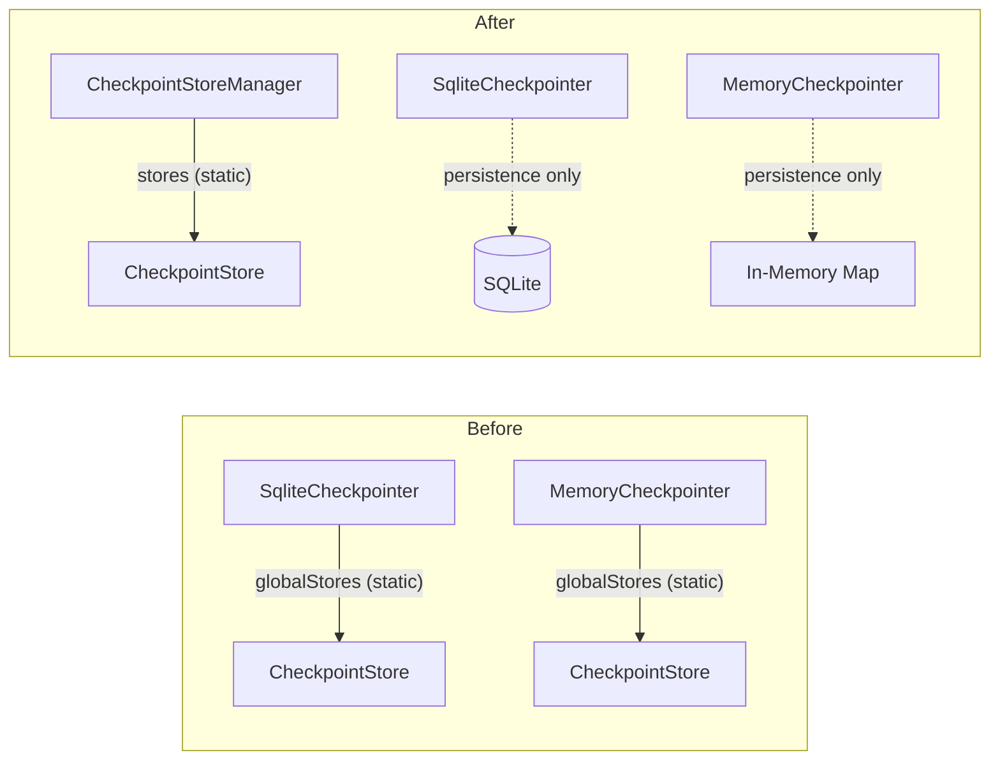

# Walkthrough: Backward Execution Architectural Fixes

## Summary

Resolved 6 remaining architectural defects in the backward execution engine, centered on extracting `CheckpointStoreManager` as a centralized static utility and narrowing the `Checkpointer` interface to its true responsibility: database persistence.

## Changes Made

### 1. `CheckpointStoreManager` Extraction (Issues A + E)

Extracted a new `CheckpointStoreManager` static class in [checkpoint-store.ts](file:///d:/liteai/packages/core/src/session/engine/loop/checkpoint-store.ts) that owns the single global `Map<SessionID, CheckpointStore>`. This replaces:
- Duplicated `private static readonly globalStores` maps on both `SqliteCheckpointer` and `MemoryCheckpointer` (~60 lines of identical boilerplate)
- Throwaway `new SqliteCheckpointer()` instances created just to access a static map in `cleanup()` and route handlers



### 2. Narrowed `Checkpointer` Interface (Issue A)

```diff:checkpointer.ts
import { Session } from "../.."
import { Message } from "../../message"
import type { MessageID, PartID, SessionID } from "../../schema"
import { type CheckpointCaptureInput, type CheckpointData, CheckpointStore } from "./checkpoint-store"
export type PersistenceOp =
  | { type: "upsert-part"; part: Message.Part }
  | {
      type: "delta-part"
      sessionID: SessionID
      messageID: MessageID
      partID: PartID
      field: string
      delta: string
    }
  | { type: "upsert-message"; message: Message.Assistant }

export interface Checkpointer {
  loadHistory(sessionID: SessionID): Promise<Message.WithParts[]>
  write(ops: PersistenceOp[]): Promise<void>
  saveMessage(msg: Message.Assistant | Message.User): Promise<Message.Assistant | Message.User>
  savePart(part: Message.Part): Promise<Message.Part>
  updateMessage(msg: Message.Assistant): Promise<void>
  deletePart(ref: { sessionID: SessionID; messageID: MessageID; partID: PartID }): Promise<void>
  dispose(): Promise<void>

  // ── Checkpoint lifecycle (Phase 5: Backward Execution) ──
  captureCheckpoint(sessionID: SessionID, data: CheckpointCaptureInput): CheckpointData
  getCheckpoint(sessionID: SessionID, checkpointID: string): CheckpointData | undefined
  getCheckpointByStep(sessionID: SessionID, step: number): CheckpointData | undefined
  listCheckpoints(sessionID: SessionID): CheckpointData[]
  truncateCheckpointsAfter(sessionID: SessionID, checkpointID: string): void
  /** Returns the CheckpointStore for a session, creating one if it doesn't exist */
  getCheckpointStore(sessionID: SessionID): CheckpointStore
  /** Clears the CheckpointStore for a session from memory */
  clearSession(sessionID: SessionID): void
}

export type SessionResult =
  | { status: "ok"; message: Message.WithParts }
  | { status: "error"; error: unknown; message?: Message.WithParts }
  | { status: "aborted" }

export class SqliteCheckpointer implements Checkpointer {
  // Use a static map to share checkpoint stores across Checkpointer instances
  // within the same process, allowing HTTP endpoints to access in-memory checkpoints.
  private static readonly globalStores = new Map<SessionID, CheckpointStore>()

  async loadHistory(sessionID: SessionID): Promise<Message.WithParts[]> {
    return Message.filterCompacted(Message.stream(sessionID))
  }

  async write(ops: PersistenceOp[]): Promise<void> {
    for (const op of ops) {
      switch (op.type) {
        case "upsert-part":
          await Session.updatePart(op.part)
          break
        case "delta-part":
          await Session.updatePartDelta(op)
          break
        case "upsert-message":
          await Session.updateMessage(op.message)
          break
      }
    }
  }

  async saveMessage(msg: Message.Assistant | Message.User) {
    return Session.updateMessage(msg) as Promise<Message.Assistant | Message.User>
  }

  async savePart(part: Message.Part) {
    return Session.updatePart(part) as Promise<Message.Part>
  }

  async updateMessage(msg: Message.Assistant): Promise<void> {
    await Session.updateMessage(msg)
  }

  async deletePart(ref: { sessionID: SessionID; messageID: MessageID; partID: PartID }): Promise<void> {
    await Session.removePart(ref)
  }

  async dispose(): Promise<void> {
    // Note: In a real system we'd only clear stores for the active session.
    // Since CheckpointStore is session-scoped, we shouldn't clear all global stores
    // on dispose (which is called per-session). We leave cleanup to session deletion.
  }

  // ── Checkpoint lifecycle ──

  clearSession(sessionID: SessionID): void {
    SqliteCheckpointer.globalStores.delete(sessionID)
  }

  getCheckpointStore(sessionID: SessionID): CheckpointStore {
    let store = SqliteCheckpointer.globalStores.get(sessionID)
    if (!store) {
      store = new CheckpointStore(sessionID)
      SqliteCheckpointer.globalStores.set(sessionID, store)
    }
    return store
  }

  captureCheckpoint(sessionID: SessionID, data: CheckpointCaptureInput): CheckpointData {
    return this.getCheckpointStore(sessionID).capture(data)
  }

  getCheckpoint(sessionID: SessionID, checkpointID: string): CheckpointData | undefined {
    return this.getCheckpointStore(sessionID).get(checkpointID)
  }

  getCheckpointByStep(sessionID: SessionID, step: number): CheckpointData | undefined {
    return this.getCheckpointStore(sessionID).getByStep(step)
  }

  listCheckpoints(sessionID: SessionID): CheckpointData[] {
    return this.getCheckpointStore(sessionID).list()
  }

  truncateCheckpointsAfter(sessionID: SessionID, checkpointID: string): void {
    this.getCheckpointStore(sessionID).truncateAfter(checkpointID)
  }
}

export class MemoryCheckpointer implements Checkpointer {
  private messages = new Map<string, Message.WithParts[]>()
  private static readonly globalStores = new Map<SessionID, CheckpointStore>()

  async loadHistory(sessionID: SessionID): Promise<Message.WithParts[]> {
    return this.messages.get(sessionID) ?? []
  }

  async write(ops: PersistenceOp[]): Promise<void> {
    for (const op of ops) {
      switch (op.type) {
        case "upsert-part":
          await this.savePart(op.part)
          break
        case "upsert-message": {
          const msgs = this.messages.get(op.message.sessionID) ?? []
          const idx = msgs.findIndex((m) => m.info.id === op.message.id)
          if (idx >= 0) msgs[idx] = { ...msgs[idx], info: op.message }
          break
        }
        case "delta-part": {
          const msgs = this.messages.get(op.sessionID) ?? []
          for (const m of msgs) {
            const part = m.parts.find((p: Message.Part) => p.id === op.partID)
            if (part && op.field in part) {
              ;(part as Record<string, unknown>)[op.field] =
                (((part as Record<string, unknown>)[op.field] as string) ?? "") + op.delta
              break
            }
          }
          break
        }
      }
    }
  }

  async saveMessage(msg: Message.Assistant | Message.User) {
    const sid = msg.sessionID
    const msgs = this.messages.get(sid) ?? []
    msgs.push({ info: msg, parts: [] })
    this.messages.set(sid, msgs)
    return msg
  }

  async savePart(part: Message.Part) {
    const msgs = this.messages.get(part.sessionID) ?? []
    const msg = msgs.find((m) => m.info.id === part.messageID)
    if (msg) {
      const idx = msg.parts.findIndex((p: Message.Part) => p.id === part.id)
      if (idx >= 0) msg.parts[idx] = part
      else msg.parts.push(part)
    }
    return part
  }

  async updateMessage(msg: Message.Assistant): Promise<void> {
    const msgs = this.messages.get(msg.sessionID) ?? []
    const idx = msgs.findIndex((m) => m.info.id === msg.id)
    if (idx >= 0) msgs[idx] = { ...msgs[idx], info: msg }
  }

  async deletePart(ref: { sessionID: SessionID; messageID: MessageID; partID: PartID }): Promise<void> {
    const msgs = this.messages.get(ref.sessionID) ?? []
    const msg = msgs.find((m) => m.info.id === ref.messageID)
    if (msg) msg.parts = msg.parts.filter((p: Message.Part) => p.id !== ref.partID)
  }

  async dispose(): Promise<void> {
    this.messages.clear()
  }

  // ── Checkpoint lifecycle ──

  clearSession(sessionID: SessionID): void {
    MemoryCheckpointer.globalStores.delete(sessionID)
  }

  getCheckpointStore(sessionID: SessionID): CheckpointStore {
    let store = MemoryCheckpointer.globalStores.get(sessionID)
    if (!store) {
      store = new CheckpointStore(sessionID)
      MemoryCheckpointer.globalStores.set(sessionID, store)
    }
    return store
  }

  captureCheckpoint(sessionID: SessionID, data: CheckpointCaptureInput): CheckpointData {
    return this.getCheckpointStore(sessionID).capture(data)
  }

  getCheckpoint(sessionID: SessionID, checkpointID: string): CheckpointData | undefined {
    return this.getCheckpointStore(sessionID).get(checkpointID)
  }

  getCheckpointByStep(sessionID: SessionID, step: number): CheckpointData | undefined {
    return this.getCheckpointStore(sessionID).getByStep(step)
  }

  listCheckpoints(sessionID: SessionID): CheckpointData[] {
    return this.getCheckpointStore(sessionID).list()
  }

  truncateCheckpointsAfter(sessionID: SessionID, checkpointID: string): void {
    this.getCheckpointStore(sessionID).truncateAfter(checkpointID)
  }
}

export class NoopCheckpointer implements Checkpointer {
  async loadHistory(): Promise<Message.WithParts[]> {
    return []
  }
  async write(): Promise<void> {}
  async saveMessage(msg: Message.Assistant | Message.User) {
    return msg
  }
  async savePart(part: Message.Part) {
    return part
  }
  async updateMessage(): Promise<void> {}
  async deletePart(): Promise<void> {}
  async dispose(): Promise<void> {}

  // ── Checkpoint lifecycle ──
  // Design: Write operations throw (§5 fail-fast — silently discarding checkpoint
  // data is a hidden failure). Read operations return empty results (correct: no
  // data was ever stored). Cleanup operations are no-ops (nothing to clean up).

  clearSession(_sessionID: SessionID): void {
    // No-op: nothing stored, nothing to clear.
  }
  getCheckpointStore(_sessionID: SessionID): CheckpointStore {
    throw new Error(
      "NoopCheckpointer does not support checkpoint storage — use SqliteCheckpointer or MemoryCheckpointer for step-level debugging",
    )
  }
  captureCheckpoint(_sessionID: SessionID, _data: CheckpointCaptureInput): CheckpointData {
    throw new Error(
      "NoopCheckpointer does not support checkpoint capture — use SqliteCheckpointer or MemoryCheckpointer for step-level debugging",
    )
  }
  getCheckpoint(): CheckpointData | undefined {
    return undefined
  }
  getCheckpointByStep(): CheckpointData | undefined {
    return undefined
  }
  listCheckpoints(): CheckpointData[] {
    return []
  }
  truncateCheckpointsAfter(): void {
    // No-op: nothing stored, nothing to truncate.
  }
}
===
import { Session } from "../.."
import { Message } from "../../message"
import type { MessageID, PartID, SessionID } from "../../schema"
export type PersistenceOp =
  | { type: "upsert-part"; part: Message.Part }
  | {
      type: "delta-part"
      sessionID: SessionID
      messageID: MessageID
      partID: PartID
      field: string
      delta: string
    }
  | { type: "upsert-message"; message: Message.Assistant }

/**
 * Persistence interface for session message/part operations.
 *
 * Checkpoint lifecycle operations (capture, get, list, truncate, clear) have
 * been extracted to `CheckpointStoreManager` — a static utility that manages
 * pure in-memory checkpoint stores with no dependency on the persistence backend.
 */
export interface Checkpointer {
  loadHistory(sessionID: SessionID): Promise<Message.WithParts[]>
  write(ops: PersistenceOp[]): Promise<void>
  saveMessage(msg: Message.Assistant | Message.User): Promise<Message.Assistant | Message.User>
  savePart(part: Message.Part): Promise<Message.Part>
  updateMessage(msg: Message.Assistant): Promise<void>
  deletePart(ref: { sessionID: SessionID; messageID: MessageID; partID: PartID }): Promise<void>
  dispose(): Promise<void>
}

export type SessionResult =
  | { status: "ok"; message: Message.WithParts }
  | { status: "error"; error: unknown; message?: Message.WithParts }
  | { status: "aborted" }

export class SqliteCheckpointer implements Checkpointer {
  async loadHistory(sessionID: SessionID): Promise<Message.WithParts[]> {
    return Message.filterCompacted(Message.stream(sessionID))
  }

  async write(ops: PersistenceOp[]): Promise<void> {
    for (const op of ops) {
      switch (op.type) {
        case "upsert-part":
          await Session.updatePart(op.part)
          break
        case "delta-part":
          await Session.updatePartDelta(op)
          break
        case "upsert-message":
          await Session.updateMessage(op.message)
          break
      }
    }
  }

  async saveMessage(msg: Message.Assistant | Message.User) {
    return Session.updateMessage(msg) as Promise<Message.Assistant | Message.User>
  }

  async savePart(part: Message.Part) {
    return Session.updatePart(part) as Promise<Message.Part>
  }

  async updateMessage(msg: Message.Assistant): Promise<void> {
    await Session.updateMessage(msg)
  }

  async deletePart(ref: { sessionID: SessionID; messageID: MessageID; partID: PartID }): Promise<void> {
    await Session.removePart(ref)
  }

  async dispose(): Promise<void> {
    // No-op: SqliteCheckpointer has no instance-level resources.
    // Checkpoint store cleanup is handled by CheckpointStoreManager.clearSession().
  }
}

export class MemoryCheckpointer implements Checkpointer {
  private messages = new Map<string, Message.WithParts[]>()

  async loadHistory(sessionID: SessionID): Promise<Message.WithParts[]> {
    return this.messages.get(sessionID) ?? []
  }

  async write(ops: PersistenceOp[]): Promise<void> {
    for (const op of ops) {
      switch (op.type) {
        case "upsert-part":
          await this.savePart(op.part)
          break
        case "upsert-message": {
          const msgs = this.messages.get(op.message.sessionID) ?? []
          const idx = msgs.findIndex((m) => m.info.id === op.message.id)
          if (idx >= 0) msgs[idx] = { ...msgs[idx], info: op.message }
          break
        }
        case "delta-part": {
          const msgs = this.messages.get(op.sessionID) ?? []
          for (const m of msgs) {
            const part = m.parts.find((p: Message.Part) => p.id === op.partID)
            if (part && op.field in part) {
              ;(part as Record<string, unknown>)[op.field] =
                (((part as Record<string, unknown>)[op.field] as string) ?? "") + op.delta
              break
            }
          }
          break
        }
      }
    }
  }

  async saveMessage(msg: Message.Assistant | Message.User) {
    const sid = msg.sessionID
    const msgs = this.messages.get(sid) ?? []
    msgs.push({ info: msg, parts: [] })
    this.messages.set(sid, msgs)
    return msg
  }

  async savePart(part: Message.Part) {
    const msgs = this.messages.get(part.sessionID) ?? []
    const msg = msgs.find((m) => m.info.id === part.messageID)
    if (msg) {
      const idx = msg.parts.findIndex((p: Message.Part) => p.id === part.id)
      if (idx >= 0) msg.parts[idx] = part
      else msg.parts.push(part)
    }
    return part
  }

  async updateMessage(msg: Message.Assistant): Promise<void> {
    const msgs = this.messages.get(msg.sessionID) ?? []
    const idx = msgs.findIndex((m) => m.info.id === msg.id)
    if (idx >= 0) msgs[idx] = { ...msgs[idx], info: msg }
  }

  async deletePart(ref: { sessionID: SessionID; messageID: MessageID; partID: PartID }): Promise<void> {
    const msgs = this.messages.get(ref.sessionID) ?? []
    const msg = msgs.find((m) => m.info.id === ref.messageID)
    if (msg) msg.parts = msg.parts.filter((p: Message.Part) => p.id !== ref.partID)
  }

  async dispose(): Promise<void> {
    this.messages.clear()
  }
}

export class NoopCheckpointer implements Checkpointer {
  async loadHistory(): Promise<Message.WithParts[]> {
    return []
  }
  async write(): Promise<void> {}
  async saveMessage(msg: Message.Assistant | Message.User) {
    return msg
  }
  async savePart(part: Message.Part) {
    return part
  }
  async updateMessage(): Promise<void> {}
  async deletePart(): Promise<void> {}
  async dispose(): Promise<void> {}
}

```

Removed 7 checkpoint lifecycle methods from the `Checkpointer` interface:
- `captureCheckpoint`, `getCheckpoint`, `getCheckpointByStep`, `listCheckpoints`
- `truncateCheckpointsAfter`, `getCheckpointStore`, `clearSession`

The interface now contains only persistence operations: `loadHistory`, `write`, `saveMessage`, `savePart`, `updateMessage`, `deletePart`, `dispose`.

### 3. Typed NamedError Classes (Issues C + D)

Added to [step-back.ts](file:///d:/liteai/packages/core/src/session/step-back.ts):
- `CheckpointEmptyMessagesError` — replaces `new Error("Invalid checkpoint: Message state is empty")`
- `SnapshotTrackingError` — replaces `new Error("Cannot perform conflict detection: ...")`

Both are now caught in the route handler and mapped to HTTP 500.

### 4. Structured Logging (Issue B)

In [session.ts routes](file:///d:/liteai/packages/core/src/server/routes/session.ts):
- Replaced `console.error("auto-resume failed for forked session", e)` with `log.error("auto-resume failed for forked session", { error: e, sessionID: newSession.id })`

### 5. Bus Event Schema Contract (Issue F)

- Exported `CheckpointMetadataSchema` Zod object from `checkpoint-store.ts`
- Updated [status.ts](file:///d:/liteai/packages/core/src/session/status.ts) to use `CheckpointMetadataSchema` instead of `z.any()` in the `session.checkpoint` Bus event definition

### 6. Call Site Updates

| File | Change |
|------|--------|
| `query.ts` | `params.checkpointer.captureCheckpoint()` → `CheckpointStoreManager.captureCheckpoint()` |
| `step-back.ts` | Removed `injectedCheckpointer` parameter entirely |
| `session/index.ts` | Removed `_checkpointer` Zod parameter from `forkAtCheckpoint` |
| `loop.ts` | `new SqliteCheckpointer().clearSession()` → `CheckpointStoreManager.clearSession()` |
| Route handlers | `new SqliteCheckpointer()` → `CheckpointStoreManager` for checkpoint/list/get endpoints |

## Verification

- **`bun typecheck`** — ✅ passed (exit code 1 expected on Windows)
- **`bun lint:fix`** — ✅ passed (auto-fixed 1 formatting issue)
