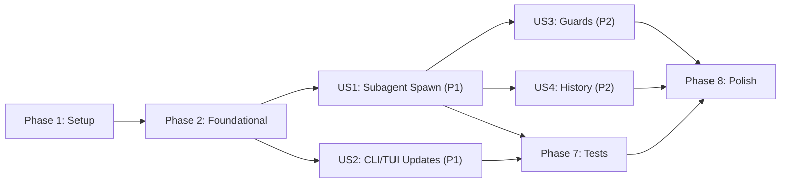

# Tasks: Plan Mode Lifecycle

**Input**: Design documents from `/specs/013-plan-mode-lifecycle/`

**Prerequisites**: plan.md ✅, spec.md ✅, research.md ✅, data-model.md ✅, contracts/ ✅, quickstart.md ✅

**Organization**: Tasks are grouped by user story to enable independent implementation and testing of each story.

## Format: `[ID] [P?] [Story] Description`

- **[P]**: Can run in parallel (different files, no dependencies)
- **[Story]**: Which user story this task belongs to (e.g., US1, US2, US3)
- Include exact file paths in descriptions

## Phase 1: Setup (Shared Infrastructure)

**Purpose**: Foundation-level data model changes that ALL user stories depend on

- [x] T001 Update `PlanModeState` interface: remove `active` and `workflowType` fields, add `planSessionID: SessionID | undefined` in `packages/core/src/session/plan-mode-state.ts`
- [x] T002 Update `createDefaultPlanModeState()` factory: remove `active: false` and `workflowType: undefined`, add `planSessionID: undefined` in `packages/core/src/session/plan-mode-state.ts`
- [x] T003 Update `PlanModeStateRef.update()` transition detection: replace `prev.active !== this._state.active` with `prev.planSessionID !== this._state.planSessionID` and update `PlanStateChanged` event emission to include `planSessionID` and derive `active` from `planSessionID !== undefined` in `packages/core/src/session/plan-mode-state.ts`
- [x] T004 Update `Session.Event.PlanStateChanged` payload schema: add `planSessionID: SessionID.zod.optional()` while keeping `active: z.boolean()` as a derived field in `packages/core/src/session/index.ts`

**Checkpoint**: PlanModeState interface is updated. All downstream consumers will see type errors pointing to required migrations.

---

## Phase 2: Foundational (Blocking Prerequisites)

**Purpose**: Migrate ALL existing consumers of `PlanModeState.active` to the new `planSessionID` pattern. MUST complete before user story implementation.

**⚠️ CRITICAL**: No user story work can begin until this phase is complete

- [x] T005 [P] Update `plan-reminder.ts`: replace `planModeState.active` check with `planModeState.planSessionID !== undefined` in `packages/core/src/session/engine/plan-reminder.ts`
- [x] T006 [P] Update `stop-drift.ts`: replace `planState.active` check with `planState.planSessionID !== undefined` in `packages/core/src/session/engine/stop-drift.ts`
- [x] T007 [P] Update `query.ts`: replace `planModeState.active` checks at L263 and L563 with `planModeState.planSessionID !== undefined` in `packages/core/src/session/engine/query.ts`
- [x] T008 Update `server/routes/session.ts` permission-mode route handler: replace `ref.get().active` with `ref.get().planSessionID` check and remove `active: true/false` mutations. Route should no longer toggle plan mode state — only toggle the permission mode enum — at L550-562 in `packages/core/src/server/routes/session.ts`
- [x] T009 Run `bun typecheck` to verify all `PlanModeState.active` and `PlanModeState.workflowType` references are resolved across the codebase

**Checkpoint**: Foundation ready — all consumers migrated to `planSessionID`. Zero type errors from PlanModeState changes.

---

## Phase 3: User Story 1 — Automated Planning via Subagent (Priority: P1) 🎯 MVP

**Goal**: Rewrite `plan_enter` to spawn a blocking plan subagent with permission gating, and update `plan_exit` for permission restoration on approval.

**Independent Test**: Send a complex task to the agent and verify: (1) plan subagent spawns, (2) root session is read-only during planning, (3) plan is written to disk, (4) full plan text returned to root agent, (5) single approval dialog in `plan_exit`.

### Implementation for User Story 1

- [x] T010 [US1] Rewrite `PlanEnterTool.execute()` in `packages/core/src/tool/plan.ts`: remove `interviewMode` parameter, remove `Question.ask` approval gate, remove `PlanApprovalRequested` event emission, remove workflow instruction loading (`Bundled.miscPrompt`), replace `state.active` guard with `state.planSessionID !== undefined` guard
- [x] T011 [US1] Implement blocking subagent spawn in `PlanEnterTool.execute()`: call `SessionPrompt.setPermissionMode(ctx.sessionID, "plan")`, create child session via `Session.create({ parentID: ctx.sessionID })`, call `SessionPrompt.runSubagent()` with agent `"plan"` and planning context, parse subagent result to extract plan text from output, update `PlanModeStateRef` with `planSessionID` and `planText`, return `{ planFilePath, planText }` in `packages/core/src/tool/plan.ts`
- [x] T012 [US1] Implement error recovery in `PlanEnterTool.execute()`: wrap `runSubagent()` call in try/catch, on failure restore permission mode to "default" via `SessionPrompt.setPermissionMode()`, clear `planSessionID` from `PlanModeStateRef`, throw structured error with failure details in `packages/core/src/tool/plan.ts`
- [x] T013 [US1] Update `PlanExitTool.execute()` in `packages/core/src/tool/plan.ts`: replace `state.active` guard with `state.planSessionID` or `planText` guard, on approval call `SessionPrompt.setPermissionMode(ctx.sessionID, "default")` to restore write access, update state to clear `planSessionID` and set `planText`, remove `workflowType: undefined` mutation (field deleted)
- [x] T014 [US1] Update plan agent config in `packages/core/src/bundled/agents/plan.md`: remove `write` from disallowedTools list (plan agent needs write for plan file), update prompt to instruct subagent to write plan to disk and return full plan text as final response including the plan file path
- [x] T015 [P] [US1] Update `plan-enter.txt` tool description in `packages/core/src/bundled/prompts/tools/plan-enter.txt`: remove mention of user approval gate, describe subagent spawn behavior, remove `interviewMode` parameter documentation
- [x] T016 [P] [US1] Update `plan-exit.txt` tool description in `packages/core/src/bundled/prompts/tools/plan-exit.txt`: clarify this is the ONLY approval point in the lifecycle, update references to reflect new behavior
- [x] T017 [US1] Run `bun typecheck` and `bun lint:fix` to verify zero type errors and formatting compliance after US1 implementation

**Checkpoint**: End-to-end `plan_enter` → subagent → `plan_exit` → approve flow works. Root session is read-only during planning, single approval dialog, permission restored on approval.

---

## Phase 4: User Story 2 — Plan Approval and Permission Restoration (Priority: P1)

**Goal**: Verify the approval/rejection flow handles all transitions correctly — approval restores permissions, rejection preserves read-only state.

**Independent Test**: Mock a completed plan and invoke `plan_exit` — verify approval dialog appears once (no dual dialogs), approval restores permissions, rejection preserves read-only state.

> **Note**: The core implementation of `plan_exit` approval/rejection is covered in T013 (US1). This phase covers the CLI/TUI event handling that responds to those state changes, and verification.

### Implementation for User Story 2

- [x] T018 [US2] Update `PlanState` interface in `packages/cli/src/tui/state/app-state.ts`: add optional `planSessionID?: string` field, consider deriving `enabled` from `planSessionID !== undefined` for consumers
- [x] T019 [US2] Update `plan.state_changed` event handler in `packages/cli/src/tui/state/app-state-events.ts` (L402-442): read `planSessionID` from event properties, derive `isActivating` from `event.properties.planSessionID !== undefined` instead of `event.properties.active`, store `planSessionID` in the `PlanState` per-session entry, keep permission mode save/restore logic (`prePlanPermissionMode`)
- [x] T020 [US2] Verify `plan.approval_requested` handler in `packages/cli/src/tui/state/app-state-events.ts` (L445-456): confirm no changes needed — event payload is unchanged, handler reads `planText` and `planFilePath` correctly
- [x] T021 [US2] Run `bun typecheck` against `packages/cli` to verify TUI state types compile cleanly

**Checkpoint**: CLI correctly handles plan state transitions. Plan mode indicator shows/hides correctly. Approval dialog renders correctly on plan submission.

---

## Phase 5: User Story 3 — Guard Against Invalid Plan Mode Transitions (Priority: P2)

**Goal**: Ensure the system prevents re-entry into plan mode and restricts `plan_enter` to root agent only.

**Independent Test**: Attempt `plan_enter` while `planSessionID` is set, and from a subagent context — both should fail with clear error messages.

### Implementation for User Story 3

- [x] T022 [US3] Verify `isRootAgent()` guard in `PlanEnterTool.execute()` prevents subagent invocation — confirm this guard was preserved during the T010-T012 rewrite in `packages/core/src/tool/plan.ts`
- [x] T023 [US3] Verify `planSessionID !== undefined` guard in `PlanEnterTool.execute()` prevents re-entry — confirm the guard returns a clear error message when plan mode is already active in `packages/core/src/tool/plan.ts`

**Checkpoint**: Both guards work correctly. Subagents cannot invoke `plan_enter`. Double-entry returns a clear error.

---

## Phase 6: User Story 4 — Plan Subagent History Preservation (Priority: P2)

**Goal**: Ensure the plan subagent preserves session history for KV cache reuse across multi-turn exploration.

**Independent Test**: Verify `SessionPrompt.runSubagent()` creates a session with history persistence enabled by default.

### Implementation for User Story 4

- [x] T024 [US4] Verify `SessionPrompt.runSubagent()` call in `PlanEnterTool.execute()` uses the default `keepHistory: true` behavior — confirm the child session created in T011 persists messages via `SqliteCheckpointer.loadHistory()` in `packages/core/src/tool/plan.ts` and `packages/core/src/session/engine/loop.ts`

**Checkpoint**: Plan subagent session history is persisted, enabling KV cache reuse on multi-turn exploration.

---

## Phase 7: Test Updates

**Purpose**: Update all existing plan mode tests to match the new interface and behavior.

- [x] T025 [P] Rewrite `enter-plan-tool.test.ts` in `packages/core/test/plan-mode/enter-plan-tool.test.ts`: test subagent spawn with permission gating, test re-entry guard (`planSessionID` check), test root-agent-only guard, test error recovery (subagent failure → permission restoration), remove tests for `interviewMode` parameter and `Question.ask` approval gate
- [x] T026 [P] Update `exit-plan-tool.test.ts` in `packages/core/test/plan-mode/exit-plan-tool.test.ts`: replace `active: true/false` assertions with `planSessionID` assertions, test `setPermissionMode("default")` is called on approval, test rejection preserves `planSessionID`, remove `workflowType` assertions
- [x] T027 [P] Update `plan-mode-state.test.ts` in `packages/core/test/plan-mode/plan-mode-state.test.ts`: remove `active`/`workflowType` field tests, add `planSessionID` transition tests, update `PlanStateChanged` event emission tests to verify `planSessionID` is included and `active` is derived
- [x] T028 [P] Update `plan-reminder.test.ts` in `packages/core/test/plan-mode/plan-reminder.test.ts`: replace `active: true` with `planSessionID: "test-session-id"` in test fixtures, verify reminders fire correctly based on `planSessionID !== undefined`
- [x] T029 Run scoped tests: `bun test test/plan-mode` — all 4 test files must pass

**Checkpoint**: All plan mode tests pass with the new interface. Zero test failures in `test/plan-mode/`.

---

## Phase 8: Polish & Cross-Cutting Concerns

**Purpose**: Final validation and cleanup

- [x] T030 Run full `bun typecheck` to verify zero type errors across the monorepo
- [x] T031 Run `bun lint:fix` to ensure formatting compliance
- [x] T032 [P] Verify ACP event passthrough in `packages/core/src/acp/events.ts` — confirm `PlanStateChanged` subscriber at L40-48 forwards the updated event payload (including `planSessionID`) without code changes
- [x] T033 [P] Verify unused prompt files: determine if `packages/core/src/bundled/prompts/misc/plan-workflow.md` and `plan-interview.md` can be removed since they are no longer loaded by `plan_enter` — **REMOVED**
- [ ] T034 Run quickstart.md verification steps: manual E2E test per `specs/013-plan-mode-lifecycle/quickstart.md`
- [ ] T035 *(DEFERRED)* [FR-013] Implement `run_command` read-only whitelist for "plan" permission mode: define `isReadOnlyCommand()` helper, enforce in `permission/service.ts`, add tests. Currently all operations are hard-denied in plan mode. The plan subagent runs with independent permissions so this only affects the root session (which is blocked during planning). Low priority.

---

## Dependencies & Execution Order

### Phase Dependencies

- **Setup (Phase 1)**: No dependencies — can start immediately
- **Foundational (Phase 2)**: Depends on Phase 1 completion — BLOCKS all user stories
- **US1 (Phase 3)**: Depends on Phase 2 completion — core plan_enter/exit rewrite
- **US2 (Phase 4)**: Depends on Phase 1 completion (PlanStateChanged event schema) — can proceed in parallel with US1
- **US3 (Phase 5)**: Depends on US1 completion (guards are part of the rewrite) — verification phase
- **US4 (Phase 6)**: Depends on US1 completion (subagent spawn in plan_enter) — verification phase
- **Test Updates (Phase 7)**: Depends on US1 + US2 completion
- **Polish (Phase 8)**: Depends on all user stories and tests being complete

### User Story Dependencies



### Parallel Opportunities

- **Phase 1**: T001-T004 are sequential (same file for T001-T003)
- **Phase 2**: T005, T006, T007 can run in parallel (different files)
- **Phase 3 + Phase 4**: US1 and US2 can run in parallel (core vs cli packages)
- **Phase 3 internal**: T015, T016 can run in parallel with T010-T014 (different files)
- **Phase 7**: T025, T026, T027, T028 can all run in parallel (different test files)
- **Phase 8**: T032, T033 can run in parallel

---

## Parallel Example: Phase 2 (Foundational)

```text
# Launch all downstream consumer migrations together (different files):
Task: "Update plan-reminder.ts in packages/core/src/session/engine/plan-reminder.ts"
Task: "Update stop-drift.ts in packages/core/src/session/engine/stop-drift.ts"
Task: "Update query.ts in packages/core/src/session/engine/query.ts"
```

## Parallel Example: Phase 3 + Phase 4

```text
# US1 (core) and US2 (cli) can proceed simultaneously:
Task: "Rewrite PlanEnterTool in packages/core/src/tool/plan.ts"  # US1
Task: "Update app-state-events.ts in packages/cli/src/tui/state/app-state-events.ts"  # US2
```

---

## Implementation Strategy

### MVP First (User Story 1 Only)

1. Complete Phase 1: Setup (PlanModeState interface)
2. Complete Phase 2: Foundational (consumer migrations)
3. Complete Phase 3: User Story 1 (plan_enter/exit rewrite)
4. **STOP and VALIDATE**: Typecheck + scoped tests + manual E2E
5. Core plan mode lifecycle works end-to-end

### Incremental Delivery

1. Complete Setup + Foundational → Interface migrated, zero type errors
2. Add User Story 1 → Core lifecycle works → Test independently (MVP!)
3. Add User Story 2 → CLI renders correctly → Test independently
4. Add User Story 3+4 → Guards + history verified → Polish
5. Each story adds confidence without breaking previous stories

---

## Notes

- [P] tasks = different files, no dependencies
- [Story] label maps task to specific user story for traceability
- Each user story should be independently completable and testable
- Commit after each phase checkpoint
- Stop at any checkpoint to validate story independently
- Core mandates: `bun typecheck` after every phase, `bun lint:fix` after modifications, scoped tests only (`bun test test/plan-mode`)
