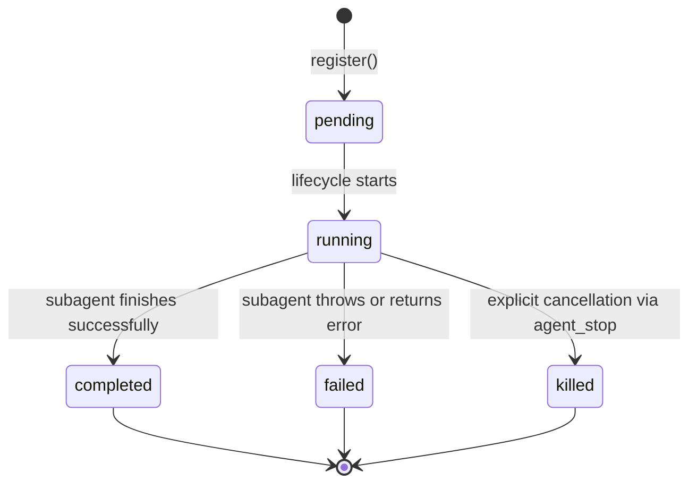
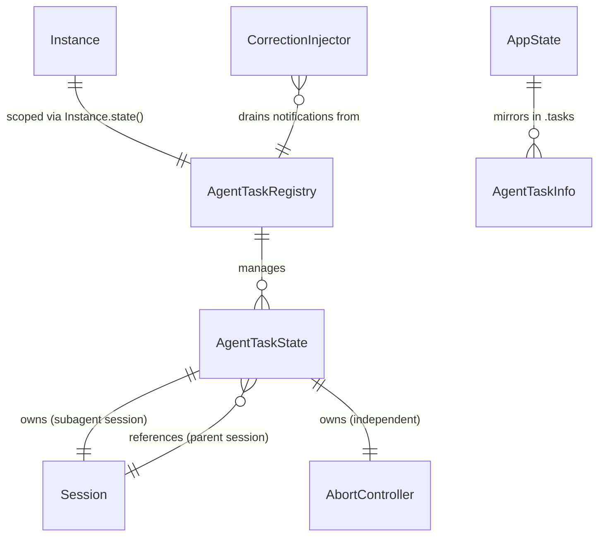

# Data Model: Async Subagent Dispatch

**Branch**: `015-subagent-async-dispatch` | **Date**: 2026-05-20

## Entities

### TaskID (branded string)

A branded identifier for agent tasks, following the same pattern as `SessionID`, `MessageID`, and `PartID`.

**Format**: `task_<ULID>` (ascending, globally unique, sortable)

**Module**: `packages/core/src/task/task.ts`

```
TaskID = Schema.String.pipe(Schema.brand("TaskID"))
  - make(id: string) → TaskID
  - ascending(id?: string) → TaskID
  - zod → z.ZodType<TaskID>
```

---

### TaskStatus (string literal union)

Lifecycle states for an agent task.

```
TaskStatus = "pending" | "running" | "completed" | "failed" | "killed"
```

**State Machine**:



**Terminal States**: `completed`, `failed`, `killed`

**Guard**: `isTerminalStatus(status: TaskStatus): boolean` — returns true for terminal states. Used to prevent double-transitions.

---

### TaskProgress

Progress tracking for a running agent task.

| Field | Type | Description |
|-------|------|-------------|
| toolUseCount | `number` | Number of tool calls made by the subagent |
| tokenCount | `number` | Total tokens consumed |
| lastActivity | `number` | Timestamp of last progress update (ms since epoch) |

---

### AgentTaskState

Full state record for a background agent task. Stored in `AgentTaskRegistry` and mirrored to `AppState.tasks`.

| Field | Type | Description |
|-------|------|-------------|
| type | `"agent_task"` | Discriminator for `AppState.tasks` union |
| taskId | `TaskID` | Unique task identifier |
| sessionId | `SessionID` | Session created for the subagent |
| parentSessionId | `SessionID` | Session of the parent that spawned this task |
| agentName | `string` | Agent type name (e.g., "explore", "liteai") |
| description | `string` | Short task description from AgentTool params |
| status | `TaskStatus` | Current lifecycle state |
| progress | `TaskProgress` | Mutable progress tracking |
| abortController | `AbortController` | Independent abort controller (not linked to parent) |
| result | `string \| undefined` | Final result text (set on completion) |
| error | `string \| undefined` | Error message (set on failure) |
| createdAt | `number` | Registration timestamp (ms since epoch) |
| completedAt | `number \| undefined` | Terminal state timestamp |

**Serialization Note**: `abortController` is not serializable. The `toInfo()` method returns a snapshot without it for API responses and `AppState` mirroring.

---

### AgentTaskInfo

Serializable snapshot of `AgentTaskState` for API responses and AppState mirroring. Same fields as `AgentTaskState` minus `abortController`.

---

### AgentTaskRegistry

Per-instance in-memory registry. Scoped via `Instance.state()` (same pattern as `SessionState` in loop.ts).

| Method | Signature | Description |
|--------|-----------|-------------|
| register | `(opts: RegisterOpts) → AgentTaskState` | Create and register a new task (status: "pending") |
| start | `(taskId: TaskID) → void` | Transition to "running" |
| complete | `(taskId: TaskID, result: string) → void` | Transition to "completed" with result |
| fail | `(taskId: TaskID, error: string) → void` | Transition to "failed" with error |
| kill | `(taskId: TaskID) → void` | Abort and transition to "killed" |
| get | `(taskId: TaskID) → AgentTaskState \| undefined` | Look up task by ID |
| getBySession | `(sessionId: SessionID) → AgentTaskState \| undefined` | Look up by session ID |
| list | `(filter?: { parentSessionId?: SessionID }) → AgentTaskInfo[]` | List tasks, optionally filtered by parent |
| getUnnotifiedCompletedTasks | `(parentSessionId: SessionID) → AgentTaskInfo[]` | Get completed tasks not yet notified for a specific parent |
| markNotified | `(taskId: TaskID) → void` | Mark task as notification-delivered |
| runningCount | `() → number` | Count of currently running tasks |
| killAll | `() → void` | Abort all running tasks (used on instance shutdown) |

**Concurrency Limit**: `register()` throws `TaskLimitExceededError` if the count of **active** tasks (pending + running) `>= maxConcurrentTasks` (default: 10). This prevents both excess pending registrations and excess running tasks. `runningCount()` returns only running tasks; the internal `_activeCount()` method is used for the concurrency check.

**Parent Scoping**: Unlike `BackgroundTaskRegistry` (session-scoped), `AgentTaskRegistry` is instance-scoped because background agents outlive their parent session's current loop iteration. The `parentSessionId` field enables filtering notifications per parent.

---

## Relationships



---

## Validation Rules

1. **TaskID format**: Must match `task_<ULID>` pattern via branded type
2. **Status transitions**: Only valid forward transitions per state machine; invalid transitions throw `InvalidTaskTransitionError`
3. **Terminal guard**: Operations on tasks in terminal status (complete, fail, kill on already-terminal) are rejected with structured error
4. **Concurrency limit**: `register()` rejects when running count exceeds configurable maximum
5. **Parent session**: Must be a valid `SessionID` — the parent session must exist at registration time
